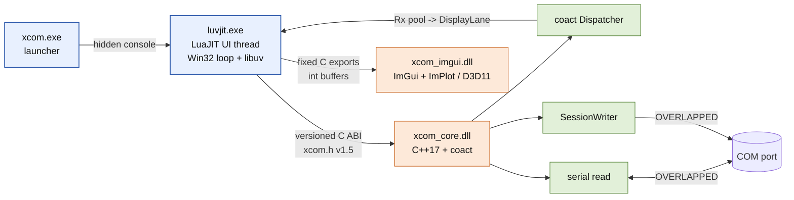
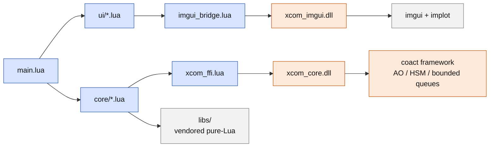

# XCOM Serial Tool

[简体中文](README_zh.md)

XCOM is a Windows serial debugging tool: a native C++17 core (`xcom_core`) plus a
LuaJIT + Dear ImGui client (`xcom_lua`) with async text/HEX I/O, timestamps,
auto-send, a Lua script system, a scope plot, and a D3D11/WARP renderer.

## Topology



## Dependencies



- `xcom_core/` — versioned C ABI DLL and Win32 OVERLAPPED serial backend;
  coact is the sole business event runtime (AO / HSM / bounded queues / fixed pools).
- `xcom_lua/` — production client: pure-Lua `ui/` + `core/`, the `xcom_imgui`
  bridge DLL and the `xcom_ffi` ABI binding.
- `xcom_lua/native/launcher/` — Win32 `xcom.exe` with a hidden console.
- `docs/` — architecture, design summary, performance and coding conventions.

## Prerequisites

- Windows x64; to build: MSVC x64 Developer PowerShell, CMake 3.21+, Ninja.
- Runtime in `xcom_lua/runtime/`: `luvjit.exe` + `lua51.dll`/`luv.dll`
  (provenance in `xcom_lua/runtime/README.md`).

## Build

```powershell
cd xcom_lua\native\xcom_imgui && build_imgui.cmd   # xcom_imgui.dll -> runtime/
cd ..\..                                          # repo root
cmake --preset native-release && cmake --build --preset build-native-release
```

The root build produces `xcom_core.dll` (into `build/native-release/bin`) and the
`xcom.exe` launcher (into `xcom_lua/runtime`). The ImGui bridge has its own
CMakeLists and is not referenced by the root project.

## Run

```powershell
cd xcom_lua
runtime\luvjit.exe main.lua    # source checkout
runtime\xcom.exe               # packaged launcher (main.ljbc, no console)
```

`xcom.exe` prefers `main.ljbc` and falls back to `main.lua`; set `XCOM_CORE_DLL`
to point at a specific `xcom_core.dll`.

Design docs: `docs/architecture.md` (architecture) and
`docs/design-summary.md` (design summary). For a narrative overview of the
LuaJIT + C++ split and the plugin model, see `docs/technical-overview.md`.
