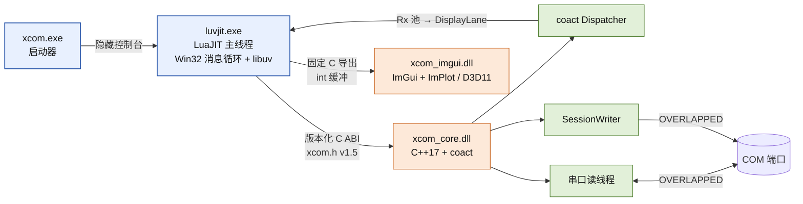
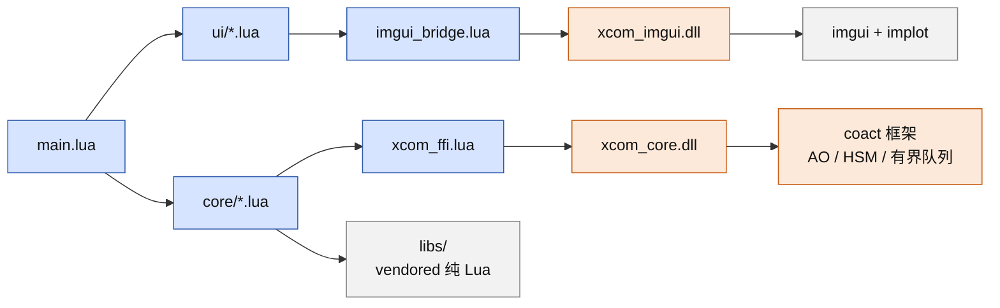

# XCOM 串口工具

[English](README.md)

XCOM 是 Windows 串口调试工具：核心为原生 C++17 DLL（`xcom_core`），界面为
LuaJIT + Dear ImGui 客户端（`xcom_lua`），支持异步文本/十六进制收发、时间戳、
自动发送、Lua 脚本系统、波形面板，以及 DirectX 11（WARP 软件兜底）渲染。

## 进程与线程拓扑



## 模块依赖



- `xcom_core/`：版本化 C ABI DLL 与 Win32 OVERLAPPED 串口后端；coact 是唯一
  业务事件运行时（AO / HSM / 有界队列 / 固定池）。
- `xcom_lua/`：生产客户端，纯 Lua 的 `ui/` + `core/`、`xcom_imgui` 桥接 DLL
  与 `xcom_ffi` ABI 绑定。
- `xcom_lua/native/launcher/`：Win32 `xcom.exe`（隐藏控制台）。
- `docs/`：架构、概要设计、性能与编码规约。

## 环境

- Windows x64；构建需 MSVC x64 Developer PowerShell、CMake 3.21+、Ninja。
- `xcom_lua/runtime/` 运行时：`luvjit.exe` + `lua51.dll`/`luv.dll`
  （来源见 `xcom_lua/runtime/README.md`）。

## 构建

```powershell
cd xcom_lua\native\xcom_imgui && build_imgui.cmd   # xcom_imgui.dll -> runtime/
cd ..\..                                          # 仓库根目录
cmake --preset native-release && cmake --build --preset build-native-release
```

根工程产出 `xcom_core.dll`（`build/native-release/bin`）与 `xcom.exe`
（`xcom_lua/runtime`）。ImGui 桥有独立 CMakeLists，根工程不引用。

## 运行

```powershell
cd xcom_lua
runtime\luvjit.exe main.lua    # 源码检出运行
runtime\xcom.exe               # 打包启动器（main.ljbc，无控制台）
```

`xcom.exe` 优先 `main.ljbc`，回退 `main.lua`；设 `XCOM_CORE_DLL` 可指定核心 DLL。

设计文档见 `docs/architecture.md`（架构）与 `docs/design-summary.md`（概要设计）。
想了解 LuaJIT + C++ 的分工、插件模型与「接收不丢数据」的实现，见
`docs/technical-overview.md`（技术白皮书）。
