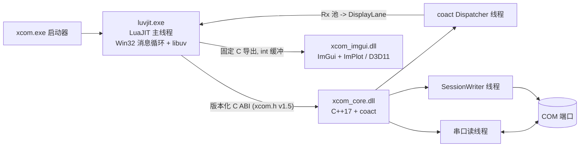
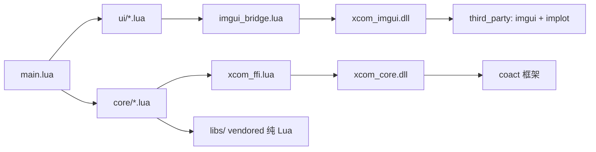

# XCOM 串口工具

[English](README.md)

XCOM 是 Windows 串口调试工具：核心为原生 C++17 DLL（`xcom_core`），界面为
LuaJIT + Dear ImGui 客户端（`xcom_lua`），支持异步文本/十六进制收发、时间戳、
自动发送、Lua 脚本系统、波形面板，以及 DirectX 11（WARP 软件兜底）渲染。

## 进程与线程拓扑



## 模块依赖



- `xcom_core/`：版本化 C ABI DLL 与 Win32 OVERLAPPED 串口后端；
  `framework/coact/` 是唯一业务事件运行时（AO/HSM/有界队列）。
- `xcom_lua/`：生产客户端，纯 Lua 的 `ui/` + `core/`、`xcom_imgui` 桥接 DLL
  与 `xcom_ffi` ABI 绑定。
- `xcom_lua/native/launcher/`：Win32 `xcom.exe`（隐藏控制台）。
- `xcom_client/`：旧 PySide6 客户端，仅作参考；`docs/` 为设计文档。

## 环境

- Windows x64；构建需 MSVC x64 Developer PowerShell、CMake 3.21+、Ninja。
- `xcom_lua/runtime/` 运行时：`luvjit.exe` + `lua51.dll`/`luv.dll`
  （来源见 `xcom_lua/runtime/README.md`）。

## 构建

```powershell
cd xcom_lua\native\xcom_imgui && build_imgui.cmd   # xcom_imgui.dll -> runtime/
cd ..\..                                          # 仓库根目录
cmake --preset native-release && cmake --build --preset build-native-release
```

根工程产出 `xcom_core.dll`（`build/native-release/bin`）与 `xcom.exe`
（`xcom_lua/runtime`）。ImGui 桥有独立 CMakeLists，根工程不引用。

## 字节码

应用模块以 `.ljbc` 发布，`require` 优先字节码。修改 `main.lua`、`core/*.lua`、
`ui/*.lua` 后重编（`scripts/`、`libs/` 保持源码）：

```powershell
cd xcom_lua
powershell -ExecutionPolicy Bypass -File build_bytecode.ps1 -Incremental
```

## 运行

```powershell
cd xcom_lua
runtime\luvjit.exe main.lua    # 源码检出运行
runtime\xcom.exe               # 打包启动器（main.ljbc，无控制台）
```

`xcom.exe` 优先 `main.ljbc`，回退 `main.lua`；设 `XCOM_CORE_DLL` 可指定核心 DLL。

## 发布包

```powershell
powershell -ExecutionPolicy Bypass -File build_release.ps1 -Version 1.4.0
```

生成 `dist/xcom-release-v1.4.0.zip`：应用模块仅 `.ljbc`，`libs/` 与 `scripts/`
原样，`runtime/` 含 exe、DLL 与 `assets/`。

## 测试

```powershell
runtime\luvjit.exe tests\test_script_engine.lua
runtime\luvjit.exe tests\stress_warp_ui.lua 30 90   # 30 秒 @ ~90 KiB/s
```

CI 四个 job：Linux 可移植 Lua 套件、ABI 布局钉扎、C++ 语法门禁；Windows MSVC
构建 + `ctest`。完整套件见 `xcom_lua/tests/`。
