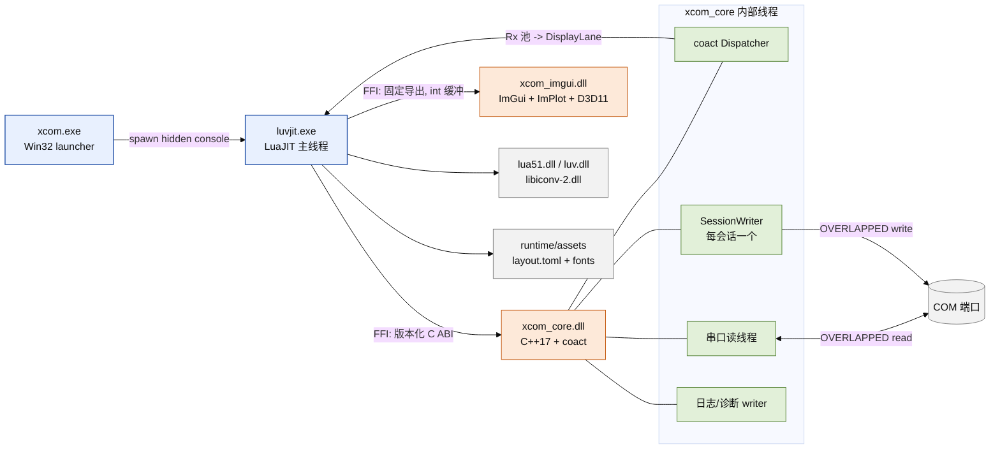
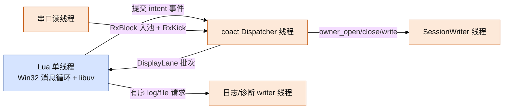
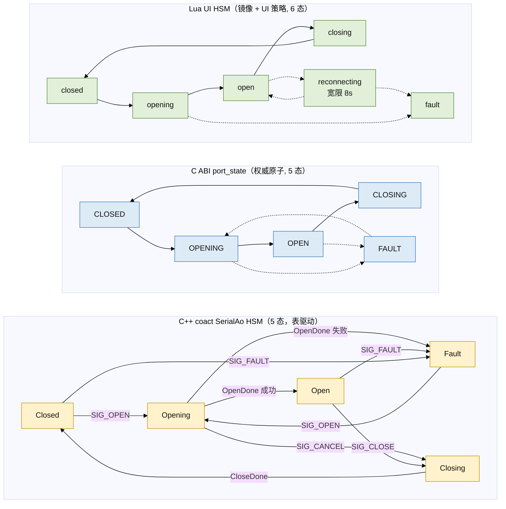
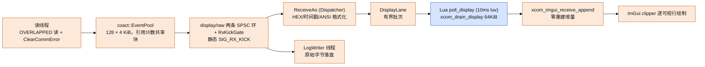
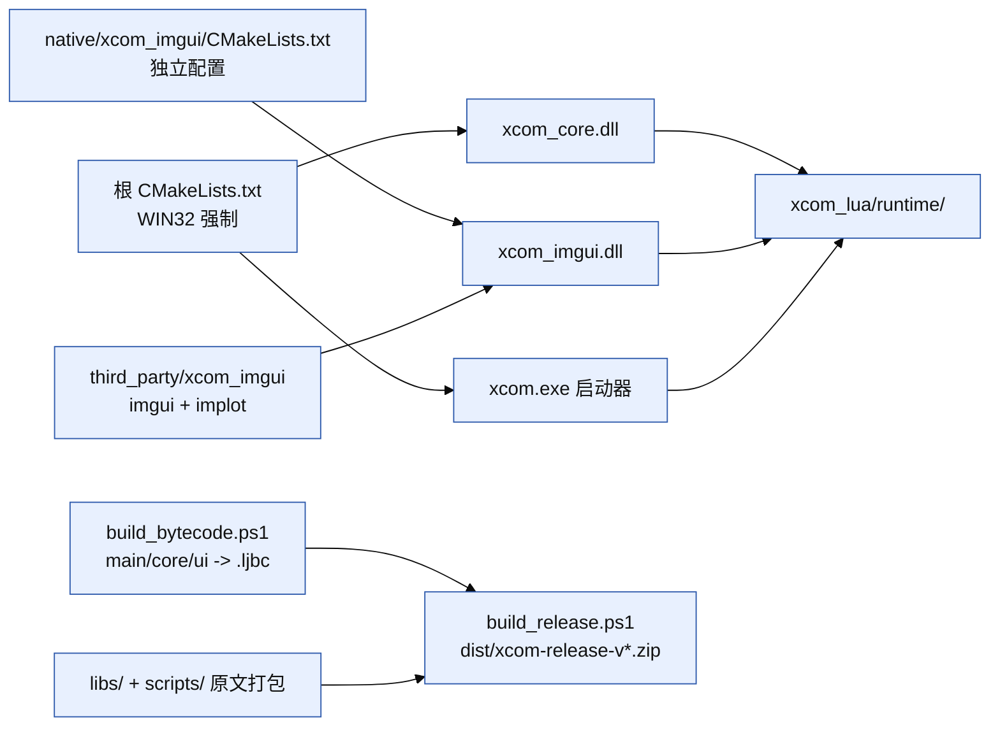

# XCOM 架构设计

| 项 | 值 |
| --- | --- |
| 适用版本 | 客户端 `xcom_lua` + 核心 `xcom_core` C ABI v1.5 |
| 平台 | Windows 10/11 x64、MSVC、C++17、LuaJIT 2.1 |
| 前端技术栈 | LuaJIT + Dear ImGui（DirectX 11，WARP 软件兜底） |
| 后端技术栈 | C++17 + coact（AO/HSM/有界队列/固定池）+ Win32 OVERLAPPED 串口 |

## 概述

本工具是一个 Windows 串口调试客户端，由三层组成：LuaJIT 前端负责全部 UI
与业务逻辑，两个原生 DLL 分别承担串口核心与渲染，一个 Win32 启动器负责
打包入口。核心事实：

- UI、业务逻辑、脚本引擎**全部由 Lua 编写**，通过 LuaJIT FFI 调用两个 DLL。
- 串口与事件运行时**全部在 `xcom_core.dll`**（C++17 + coact），Lua 不直接
  触碰 Win32 串口 API。
- 渲染**全部在 `xcom_imgui.dll`**（Dear ImGui + ImPlot + D3D11）。Lua 不持有
  任何 ImGui API；Lua 拥有数据缓冲区，DLL 用固定签名的 C 导出读取并绘制。
- 只有 `xcom_core.dll` 的 ABI 是**版本化**的（`xcom.h`）；`xcom_imgui.dll` 是
  **固定签名 + 符号探测**的扩展式契约。

## 分层与职责边界

| 层 | 位置 | 职责 | 明确不做 |
| --- | --- | --- | --- |
| 启动器 | `xcom_lua/native/launcher/xcom_launcher.cpp` | Win32 子系统 `xcom.exe`，以隐藏控制台启动 `luvjit.exe`，客户端退出后自行结束；内嵌图标 `IDI_APP` | 不承载任何业务逻辑 |
| 应用（Lua） | `xcom_lua/main.lua`、`xcom_lua/ui/*.lua`、`xcom_lua/core/*.lua` | 窗口与消息循环、状态镜像、控件驱动、配置持久化、脚本引擎、波形数据、FFI 绑定 | 不直接做阻塞串口 I/O、不直接调 ImGui API |
| 渲染桥 | `xcom_lua/native/xcom_imgui/xcom_imgui_bridge.cpp` | ImGui/ImPlot 控件绘制、D3D11 设备与交换链、Win32 消息转发、控件状态经 `int*` 缓冲读写 | 不做串口业务、不持有权威应用状态 |
| 核心 | `xcom_core/` | 版本化 C ABI、coact AO/HSM、固定块池、Win32 OVERLAPPED 串口后端、日志与诊断 writer | 不做 UI、不做策略决策 |
| 框架 | 外部 coact checkout `../coact`（`windows` 分支） | Dispatcher、Active Object、HSM、有界队列、SPSC 环、事件池 | 不引入 Qt/Boost 等第二事件框架 |

Lua 侧模块约定：`require` 优先加载 `.ljbc` 字节码，回退 `.lua`；`ui/` 存放
窗口与桥接，`core/` 存放可单测的纯逻辑（`view_model`、`charset`、`config`、
`waveform`、`script_engine`、`ansi`、`xcom_ffi`）。

## 进程与运行时拓扑

运行时目录 `xcom_lua/runtime/` 汇总 exe、两个 DLL、LuaJIT/luv/iconv 运行库与
`assets/`。`xcom.exe` 优先加载 `main.ljbc`，回退 `main.lua`；`XCOM_CORE_DLL`
可覆盖核心 DLL 路径。

## 两个 DLL 的接口契约

### `xcom_core.dll`：版本化 C ABI（`xcom.h`）

- **单一权威契约**。`xcom_core/include/xcom/xcom.h` 定义全部结构体、结果码与
  导出函数；当前 `XCOM_VERSION_MINOR 5`。
- **结构体布局固定**：显式 `_pad`、MSVC x64 自然对齐；LuaJIT FFI 用相同字段
  顺序可精确复现。`core/xcom_ffi.lua` 在模块加载时用 `ffi.sizeof` 对所有结构
  做**尺寸钉扎断言**（`CreateOptions=8 / PortConfig=32 / DisplayOptions=16 /
  Snapshot=80 / Error=268 / PortInfo=324`），布局漂移在 require 期即失败。
- **向后兼容靠追加**：新字段一律**追加**在结构体尾部，由 `struct_size` 驱动
  兼容；v1.5 的行错误计数、`rx_sequence/rx_loss_offset/rx_backpressure_events`
  都追加在旧字段之后，旧偏移不变。
- **结果码**：`xcom_ok=0`，参数/未打开/已打开/忙/满/I/O/超时/drain 未完成/
  不支持 = `-1..-9`，跨边界不抛异常。
- **所有权**：`xcom_send` 为同步复制语义，返回即不再引用调用方缓冲；
  `xcom_drain_display` 由调用方提供并复用缓冲。

### `xcom_imgui.dll`：固定签名控件导出 + 符号探测

- 每个 C 导出是**固定参数列表**（`xcom_imgui_draw_console(char* port, ...,
  int* baud, ...)`），Lua 传入自己持有的 `ffi.new(int[1])` 缓冲，DLL 读写后
  Lua 直接读取控件状态。**不把 ImGui API 暴露给 Lua**。
- 新增能力（Phase 4 脚本控制台、Scope、Plugin 页、高亮规则等）以**独立导出**
  追加；Lua 侧 `optional_export(name)` 用 `pcall` 探测符号，旧 DLL 缺符号即
  **隐藏该特性**而非崩溃。
- 接收文本两条路径：`xcom_imgui_set_receive_text`（整窗替换）与
  `xcom_imgui_receive_append`（零重建增量追加，DLL 内部维护滑动窗口与行偏移
  缓存）；`xcom_imgui_get_receive_text` 供"保存可见内容"回读。
- 选择高亮存**绝对字节坐标**（`xcom_imgui_set_receive_base`），随文本尾部
  滑动一起平移，避免窗口相对坐标在换血后错位。

### 两种 FFI 模式对比

| 维度 | Lua↔`xcom_core`（版本化 ABI） | Lua↔`xcom_imgui`（固定导出） |
| --- | --- | --- |
| 契约 | `xcom.h`，结构体 + 结果码 | 固定参数 C 函数，`int*`/`char*` 缓冲 |
| 版本策略 | 版本号 + `struct_size` + 尾部追加 | 符号探测，缺失即降级隐藏 |
| 兼容破坏 | 禁止（须追加） | 允许新增导出；旧导出不改签名 |
| 状态归属 | C++ 权威；Lua 镜像快照 | Lua 拥有缓冲；DLL 只读写当帧 |
| 典型调用 | `xcom_open_async`、`xcom_drain_display` | `xcom_imgui_receive_append`、`xcom_imgui_scope_push` |
| 加载 | `ffi.load` + 环境变量 `XCOM_CORE_DLL` | `ffi.load("xcom_imgui")` |

## 线程模型与并发边界

- **Lua 只有一个真实线程**：Win32 消息泵与 libuv 定时器都在主线程，所有
  ABI 调用在此串行发生。主循环按优先级分层：P0 Win32 输入、P1 luv 定时器
  （显示 drain、状态轮询、多发循环）、P2 延迟任务队列、P3 有界 GC 步进，
  最后按需渲染，并用 `MsgWaitForMultipleObjectsEx` 睡到下一事件。
- **ABI 调用线程约束**：同一时刻只有一个调用线程可进入 ABI；core 内部所有
  工作串行化到 coact Dispatcher。
- **C++ 内部线程**：Dispatcher（`_beginthreadex`）；每会话一个 SessionWriter
  （唯一调用可能阻塞的原生写）；串口读线程（OVERLAPPED）；日志/诊断 writer
  线程；自动发送用低优先级 PeriodicTimer，位于 Dispatcher 与串口 I/O 之下。
- **数据面引用计数、无数据锁**：RX 块来自唯一 `coact::EventPool`（128 × 4 KiB），
  同一块以两份引用扇出显示与原始/文件通道（`event_ref_inc` / `event_gc`），最后释放
  者归还池；热路径不堆分配、不持互斥（仅池的空闲表用短自旋），控制面才使用 OS
  等待原语。

## 端口状态机

三层状态是**同一事实的不同视角**，权威是 core 的 `port_state` 原子：

关系与语义：

- **C++ HSM 现为 5 态**（`S_CLOSED/S_OPENING/S_OPEN/S_CLOSING/S_FAULT`，
  `xcom_ao.hpp:152`），由表驱动 `serial_transition()` 唯一迁移（`xcom_ao.cpp:530`），
  取值与 ABI 的 `XCOM_PORT_*` 逐一对齐；`CoreCtx::port_state` 是它的发布视图。
  ABI 已不再直接写该原子，但故障兜底仍有直接 store（`xcom_core.cpp:707/760/769/891`），
  单写者不变量尚未完全达成。
- **ABI 5 态**（`XCOM_PORT_CLOSED/OPENING/OPEN/CLOSING/FAULT`）是跨语言可观测
  的权威状态，`xcom_get_snapshot` 每次读取。
- **Lua UI HSM 6 态**在镜像 5 态之外增加 `reconnecting`：这是**纯 UI 策略**，
  设备掉线/ROM 模式重枚举后先在 8s 宽限窗内保持并尝试重开，窗口内恢复则继续
  收发，超时转 `fault` 交用户手动重连。`reconnecting` 对 ABI 仍映射为
  `FAULT`，状态栏与快照比较保持诚实。
- **代际（generation）防串扰**：每次成功 open 递增；Lua 丢弃旧代际的迟到通知，
  避免上一次会话的 OPEN 被误判为恢复。
- **看门狗**：Lua 侧对 `opening`/`closing` 设超时锚点，超时进入 fault；异步
  open 由 `xcom_take_open_result` 在状态轮询中驱动完成。

## 数据路径

### 接收（串口线程 → core 池 → Lua drain → ImGui）

背压与可观测：块池与 DisplayLane 均有界。文件通道取不到块时读线程阻塞反压并计
`rx_backpressure_events`（`save_rejected_bytes` 对 RX 恒 0）；显示通道取不到块时计
`rx_pool_exhausted_bytes`，其语义在**已打开日志**时是显示积压而非丢失（文件持有完整
流），未打开日志时不成立。真正的接收丢失用 `rx_loss_offset` 标出在已接受流中的位置。
显示按需分级帧率（交互 16ms / 数据到达 100ms / 空闲 500ms）避免满带宽刷屏烧帧。

### 发送（Lua → ABI → writer 线程）

1. Lua 在 `build_send_payload` 中完成编码：HEX 预解码为原始字节，可选追加
   CRLF；core **不再解析 HEX**。
2. `xcom_send` **同步复制**进 `TxBlockPool` 并立即返回（queue-and-return）；
   每个已接受的 Tx 携带**独立** `TxDescriptor{block,length,generation}` 事件，
   杜绝共享单槽被后续发送覆盖。
3. Dispatcher 将描述符交给 `enqueue_write`，SessionWriter 调用 OVERLAPPED 写；
   写的成败经快照/错误环异步回报。
4. 自动发送：`xcom_set_auto_template` 在 Dispatcher 上原子替换模板并驱动低
   优先级周期定时器；合并的 tick 计 `auto_tick_coalesced`。

### 文件写入

接收日志走专用 writer 线程的有序 append（`xcom_log_open/append/flush/close`），
不阻塞接收；配置等原子替换走临时同级文件 + flush + `MoveFileEx(REPLACE_EXISTING
| WRITE_THROUGH)`，完成状态由 `request_id` 轮询。所有输入在返回前被复制。

## 错误处理与故障语义

- 每个 ABI 调用检查 `XcomStatus`；失败细节进 128 项错误环，Lua 用
  `xcom_take_error` 弹出并显示到状态栏（端口占用/不存在/已拔出等映射为中文
  原因）。原生 Win32 码保留在 `XcomError.code`。
- `xcom_open` 超时只请求取消，`xcom_close` 可能短暂返回 BUSY/TIMEOUT 直到取消
  排空；`xcom_destroy` 仅在 CLOSED 后合法，否则做有界后台清理。
- 故障（拔线、I/O 中止、访问被拒）由读线程/后端上报为 FAULT；Lua 进入
  `reconnecting` 宽限窗（默认 8000ms，可配）尝试重开，窗口内恢复即续传，超时
  转 FAULT 交用户手动处理。看门狗保证 opening/closing 不永久卡死。
- 显示暂停时 Rx 块在 ReceiveAo 的 deferred 槽中保留（`display_paused_bytes`），
  显示就绪环填满后显示通道计 `rx_pool_exhausted_bytes` 并继续读，文件通道不受影响；
  暂停不再向上游施加背压（只有文件通道池空才反压读线程）。

## 脚本引擎：故障隔离与热重载

`core/script_engine.lua` 驱动 `scripts/` 下的用户 Lua 插件（源码不全，
`.lua` 只读发布）。**必须澄清：它不是安全沙箱**——应用本身就是 Lua，脚本与
宿主同进程同权限；它提供的是**故障隔离**：

- 每次钩子分发都在 `pcall` 中；连续失败 3 次的钩子自动禁用并写可见日志。
- 每个脚本拥有独立 `setfenv` 环境；钩子/过滤器不跨重载残留，重载时关闭旧
  环境持有的文件句柄（防止文件被锁）。
- 用 `debug.sethook` 计数钩子施加指令预算；因 JIT 编译的循环不经过 VM 计数
  器，钩子闭包必须 `jit.off(fn, true)`（递归关闭嵌套原型）才能生效。
- 热重载：文件系统事件经 200ms 去抖合并为一次重载，另有 mtime 轮询兜底；
  启用时按最新文件内容重载，失败保留旧状态并记录。
- 脚本能力经受控扩展注入：`uart.send`、`on.receive`/`on.send`（可变换或丢弃）、
  `filter.keep/drop`、高亮规则、`wave`、`log`、定时器，并兼容 LLCOM 的全局
  接收钩子（如 `uartReceive`）。

## 构建、测试与打包

- **构建**：根 `CMakeLists.txt` 构建 `xcom_core.dll` 与 launcher `xcom.exe`
  （CMake `WIN32` target，内嵌 `xcom_launcher.rc` 图标），强制 WIN32 平台。
  `xcom_imgui.dll` 有**自己的 CMakeLists，根工程不引用**，由
  `native/xcom_imgui/build_imgui.cmd` 或 CI 单独配置构建，并 vendored 编译
  `third_party/xcom_imgui` 下的 ImGui 与 ImPlot。
- **打包**：应用模块 `main/core/ui` 编译为 `.ljbc` 字节码发布，`require` 优先
  字节码；`scripts/`（用户可编辑）与 `libs/`（vendored 第三方纯 Lua）不字节化，
  原样进包；`runtime/` 含 exe、DLL 与 `assets/`（`layout.toml` + 字体）。
- **测试与 CI**（`.github/workflows/ci.yml`，4 个 job）：
  - Linux `lua-tests`：12 个可移植纯 Lua 套件（无需 DLL/串口）；
  - Linux `abi-layout`：require `xcom_ffi` 触发结构体尺寸钉扎断言；
  - Linux `cpp-syntax`：用 `tools/win32-stub` 对串口/ABI 翻译单元做语法门禁；
  - Windows `native`：MSVC 构建根工程与 ImGui 前端，并跑 8 个 C++ ctest。
- C++ 权威构建始终是 Windows/MSVC；Linux 的语法门禁是补充而非替代。

## 关键约束与已知不一致

- **禁止反向依赖**：Lua 不直接调用 Win32 串口；core 不依赖 UI；渲染桥不持有
  权威业务状态。
- **单一 ABI 调用线程**：任何新增后台线程不得直接进入 ABI。
- **ABI 兼容**：只追加不插队；结构体尺寸钉扎是 CI 门禁。
- 已发现并保留（以代码为准，供后续修正）：
  1. 根 `CMakeLists.txt` 的 `project(XCOM VERSION 1.2.0)` 与 launcher 版本
     `1.2.0`，同 `xcom.h` 的 ABI `1.5.0` 属不同版本命名空间，未对齐。
- 已清理：Python 时代前端（PySide6 / QThread / CoreWorker / `config.toml`）的
  陈旧组件引用已从 `xcom_core/` 全量移除，ABI 与线程注释现表述为 Lua UI
  线程（`Window:poll_display` 的 10 ms drain）；`xcom_lua/` 侧的同类清理单独
  处理。
