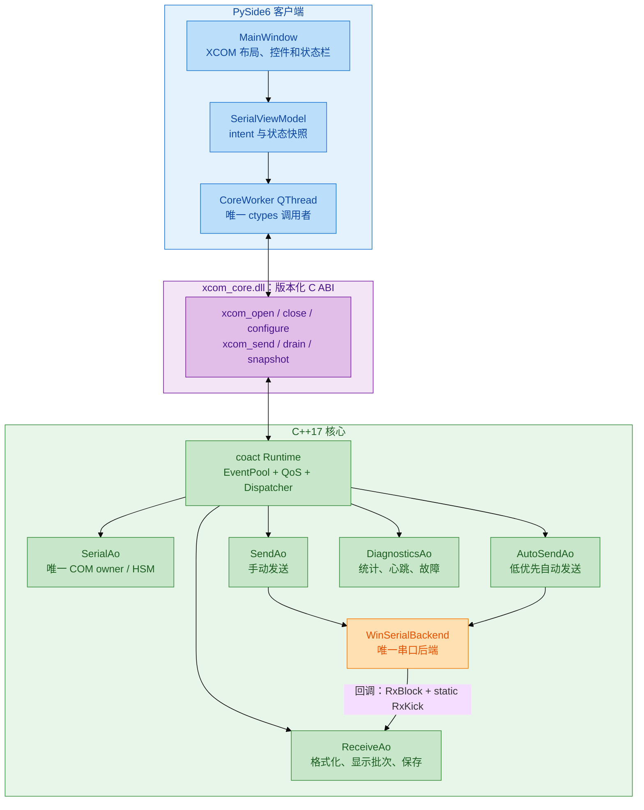
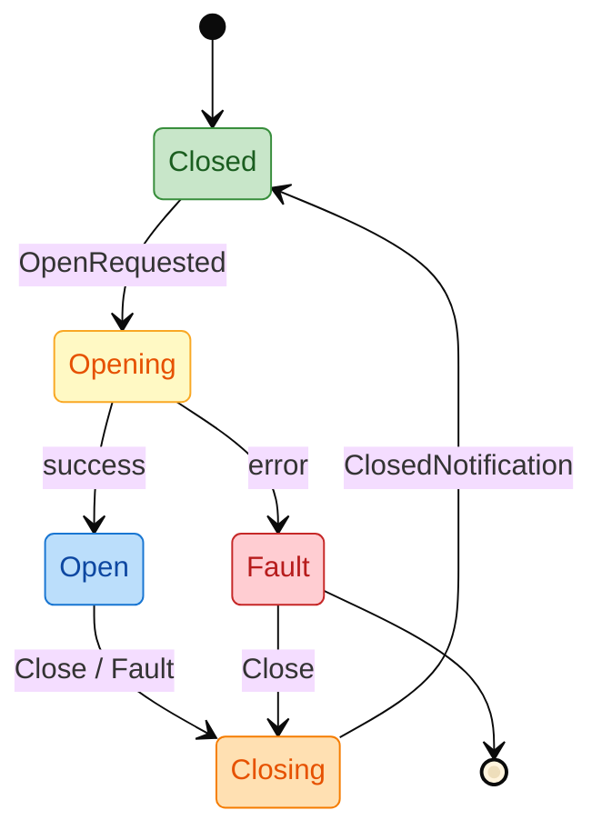

# XCOM 串口工具架构与实施方案

> **原生后端修订（2026-09-01）**：CSerialPort 已从产品源码、构建图和
> 仓库依赖中移除。本文早期阶段描述保留其名称仅供追溯；当前唯一串口
> 适配层是 `xcom_core/src/io/serial_backend_win.*`，以
> 核心源码和版本化 C ABI 为准。

| 项 | 决策 |
| --- | --- |
| 版本 | v1.2（按 coact 源码与 SCOMM 行为复核） |
| 日期 | 2026-08-31 |
| 平台 | Windows 10/11 x64、MSVC Build Tools、C++17 Release |
| UI | PySide6（纯 Python） |
| C++ 核心 | C++17 DLL + `xcom_core/framework/coact` |
| 串口后端 | 只使用项目自研 `WinSerialBackend`（Win32 OVERLAPPED） |
| Python/C++ 边界 | `ctypes` 调用版本化 C ABI |
| 禁止依赖 | Win32++、pyserial、libserial、Qt C++、Boost、第二事件框架 |

## 1. 目标和范围

实现 XCOM 风格的串口调试工具。界面操作流、串口参数、断线语义、C++/Python 分层、性能门禁、资源所有权和关闭协议均由本文档明确规定，不依赖未随仓库发布的参考工程。

首版功能：真实 COM 端口枚举和打开/关闭；波特率、数据位、校验位、停止位、DTR/RTS；文本/HEX 收发、CRLF、时间戳、接收 HEX 显示；单条和十条快捷发送、自动循环发送；接收显示暂停/恢复、可配置自动清屏；清空、保存、自动保存；状态栏收发/丢弃统计；TOML 配置持久化。

不实现 TCP/UDP、SSH、脚本插件、虚拟串口、多设备同时打开或协议开发平台。本方案不为这些范围外功能增加依赖。

参考映射（保留的设计要点）：

| 参考 | 保留的设计 | 不迁移 |
| --- | --- | --- |
| 已固化的产品行为 | 单窗口操作流、多条发送、定时发送、DTR/RTS、状态栏 | MFC、VC6、全局状态、UI 线程串口。 |
| `ref/WIN_HCS_CLEAN` | C ABI、单 owner、有界 QoS、性能指标、关闭 drain；可复制最小 Windows HANDLE/QPC 兼容片段 | 视频帧、OpenGL、NumPy、设备协议和整套 newosp 运行时。 |
| `xcom_core/framework/coact` | EventPool、AO、HSM、Dispatcher、背压；将新增 Windows PAL 并由 coact 测试维护 | RT-Thread PAL 和 Linux 测试二进制。 |

HCS 的 `FramePool`/lease 是为采集、显示、分析、录制等多消费者 4 MiB 图像帧准备；XCOM 的 Rx 与 Display 主通路均为单消费者 SPSC，采用固定槽唯一 owner 可少一次引用计数与引用锁。HCS 的 Python dirty/latest-batch、bounded command worker、关闭先停 producer 后 drain 的原则保留；其 UVC/OpenGL/NumPy 帧路径、native serial/newosp runtime 不迁移。

## 2. 强制依赖和职责

| 依赖 | 位置/来源 | 责任 |
| --- | --- | --- |
| PySide6 | Python 运行环境 | 窗口、控件、信号、定时器、设置、打包入口。 |
| `coact` | `xcom_core/framework/coact/include` | **必须使用**：EventPool、有界 QoS 队列、Dispatcher、Active Object、HSM、背压和停止 drain。 |
| `WinSerialBackend` | `xcom_core/src/io/serial_backend_win.*` | **唯一串口适配层**：端口枚举、配置、异步读回调、发送与关闭。 |
| C++17/MSVC | 工具链 | C ABI、块池、日志、线程和 Windows PAL。 |
| `ctypes` / `tomllib` | Python 标准库 | DLL 调用和 TOML 读取。 |

`coact` 是本项目业务核心的唯一事件运行时，不能退化为参考代码。C++ **控制面**直接使用 `HostSmpProfile` tagged-CAS `EventPool`、`BoundedMpscQueue`、AO/HSM 与 wake latch；C++ **连续数据面**只使用 `SpscRing`、固定块池和静态 event，不让每个 Rx/Display 块进入 EventPool 引用计数。它们是 XCOM 的首选并发基础设施，不能被 `std::queue`、`std::mutex`、Qt 队列或自行实现的环替换。Python 侧允许一个类似 `WIN_HCS_CLEAN/CommandWorker` 的**有界、非阻塞优先命令入口**，它只排入小型 C ABI intent，不能承载 Rx 数据或取代 coact。`WinSerialBackend` 是唯一 OS COM 适配层（直接 Win32 OVERLAPPED、单端口高吞吐、单读线程 + 有界 `read_loop`、零第三方依赖、项目自研无 LGPL），禁止再加入 `libserial`、pyserial 或手写第二套串口读写通道。Win32++ 不进入构建，所有 UI 均由 PySide6 实现。

## 3. 总体架构



UI 绝不直接访问 WinSerialBackend 或 COM 句柄。所有 C ABI 调用都在 `CoreWorker` 中串行发生；`SerialAo` 拥有端口生命周期/configuration，`SessionWriter` 是唯一执行可能阻塞 `writeData` 的线程。读取回调只取得字节并写入 `coact::SpscRing<RxDescriptor>`，不能碰 Qt/Python/磁盘。由于当前 coact Dispatcher 只观察 staging 三分区，ready ring 空→非空时由 `RxKickGate` 向 ReceiveAo 的 High/critical staging 提交唯一静态 `coact::Event{SIG_RX_KICK, 0, 0}`：`WinSerialBackend callback → SpscRing → static RxKick → ReceiveAo`。静态 event 的 `pool_id=0`，故 `event_gc()` 不回收它；Coordinator 现有 wake latch 负责唤醒；gate 已置位时不重复提交。它不经过互斥锁、条件变量、OS 队列或回调内动态分配。

## 4. 线程与对象所有权

| 上下文 | 责任 | 禁止 |
| --- | --- | --- |
| PySide6 GUI 线程 | 控件、绘制、用户 intent、短状态刷新 | C ABI、串口 I/O、文件写入、`wait/join`。 |
| `CoreWorker` QThread | 唯一 Python C ABI 调用者；有界优先命令入口、轻量 drain/snapshot | 更新控件、长文本格式化、接收字节循环。 |
| coact Dispatcher | AO 调度、状态机、队列背压 | 调 Python 或 Qt。 |
| WinSerialBackend 读线程回调 | 将借用数据复制进预分配 `RxBlockPool`、发布 SPSC descriptor、空→非空时 gate 提交静态 `RxKick`；耗尽时在异常背压路径等待容量 | 编码、HEX、日志、保存、动态分配 coact event、忙等。 |
| LogWriter（可选） | 批量自动保存 | COM/Qt 访问。 |

线程数固定，运行期不为单次点击、发送或接收创建新线程。WinSerialBackend 使用内部读线程，其线程仍只作为回调生产者，不拥有端口状态。

## 5. coact 设计

### 5.1 队列分工（强制）

| 数据/事件类型 | 必用 coact 原语 | 原因 |
| --- | --- | --- |
| 回调接收描述符和空闲块归还 | 双向 `SpscRing` + 静态 `RxKick` | 生产者/消费者角色固定；release/acquire 发布；唯一 kick 经现有 High/critical staging 把 ring ready 纳入 Dispatcher wake。 |
| GUI、CoreWorker、端口回调提交控制事件 | `BoundedMpscQueue` | 多生产者到单 Dispatcher；固定容量、CAS 发布和可观测拒绝。 |
| 低频控制 event 生命周期 | `EventPool<..., HostSmpProfile>` + 每池 `SpinCriticalSection` | Open/Close/Configure/手工 Tx 等定长 control event 的 tagged-CAS 生命周期；SMP 上 spin critical section 防 alloc/reclaim 的 `next` 字段竞争。RxKick/Display 不分配、不引用计数。 |
| 自动发送/高频选项 | `AutoTickGate` + Low staging | coact v1 的 `mergeable` 尚无 MergeCell 实现；AutoSendAo 的 pending gate 才是唯一 last-value-wins 实现。 |
| 休眠 Dispatcher 唤醒 | coact staging wake latch | 只在需要时唤醒，避免消息风暴与丢唤醒窗口。 |

任何新增模块先映射到上述五类；接收唤醒复用现有 Coordinator/staging 的静态 event，不新增 `ExternalWorkSource` 或第四 Dispatcher 工作源，不能在 XCOM 业务层引入临时锁队列。`ExternalWorkSource` 曾被考虑后明确否决：Dispatcher 的睡眠判定只查看 staging，若 ring 不经 Coordinator publish/wake 连通，就会在有数据时永久睡眠。可从 `ref/WIN_HCS_CLEAN` 复制已验证的 Windows HANDLE/QPC/事件等待实现片段到 coact 的 `pal_windows`，但移除 HCS/newosp 业务耦合并由 coact 自己的测试覆盖。

#### `RxKickGate` 精确协议

`RxKick` 是每个 XCOM session 一个、地址稳定的静态 `coact::Event`，同一时刻只能在 staging 中出现一次。其 `gate` 是 `std::atomic<bool>`，callback 是唯一生产者、ReceiveAo 是唯一消费者；这个 SPSC 前提由 `WinSerialBackend` 的单读线程模型直接保证，无需在 callback 热路径加锁。

1. callback 将完整块 descriptor 以 release 语义写进 ready ring；仅在 `gate.exchange(true, acq_rel)` 返回 `false` 时，以 High + `critical=true` 调用 `coordinator.submit_from_task(ReceiveAo, &rx_kick, critical_qos)`。WinSerialBackend 读线程 callback 是平台 worker thread，不得冒充硬件 ISR；只有真实 ISR 才能调用 `try_submit_from_isr`。
2. `ReceiveAo` 处理一个 kick 时最多消费四块。若仍有 ready descriptor，保持 gate 为 true 并重新提交同一静态 event；该 event 此时已被 `Staging::dequeue_one` 取出，故旧 slot 不再在 staging。`pool_id=0` 使 handler 返回后的 `ReclaimBatcher::release()` 为 no-op。
3. 若本次 drain 后为空，ReceiveAo 先 release 写 `gate=false`，再 acquire 检查 ready ring；若仍非空，CAS 抢回 gate 并提交。producer 在"清 gate 前看到 true"的数据由这次 recheck 发现；producer 在"清 gate 后看到 false"时自行提交，CAS 失败者不再提交。因此不丢 wake、不重复 kick。
4. `SIG_RX_KICK` 正常运行提交为 `Queued`；关闭期间可得到 `RejectedState`。High reservation ledger 限制 non-critical claim 至 16、critical 可用其余 16；claim 在 `try_push` 前取得、失败回滚，在成功 `dequeue_one` 时释放。它不标记 MPSC 的物理 cell，deferred slot 也不能再次释放。若正常运行时仍出现 `RejectedFull`，这是 reservation/配置不变量破坏：记录 fatal、停止 admission 并执行受控关闭，绝不"清 gate 后等待下一次无关事件"。
5. shutdown 先关 `RxIngress.admission`，再等待 callback in-flight 为零；此后要么由尚存的 kick drain ready ring，要么在 Dispatcher owner 中显式 flush 并归还其块。仅当 ready/free ring、gate 和 staging 均处于可销毁状态时，才销毁静态 event 所属 session。

### 5.2 Windows PAL

在 `xcom_core/framework/coact` 新增 `pal_windows.hpp/.cpp`，实现完整 `PalT` 契约：`irq_save/irq_restore`（host no-op，仅供非共享单核路径）、`current_context`、QPC `monotonic_ns`、`clock_resolution_ns`、`wait_dispatcher`、`signal_dispatcher_from_task/isr`、`start_dispatcher`、`join_dispatcher`、`watchdog_progress`、`set_dispatcher_stack_bytes`、TLS `in_dispatcher_thread` 与 `enter_direct/leave_direct`。Dispatcher 用 auto-reset `CreateEventW`、`SetEvent`、`WaitForSingleObject`；空闲前先 arm wake latch，再检查现有 `staging.any_ready()`，为空才等待。静态 `RxKick` 的 staging publish 走 Coordinator 已有的 arm/recheck/wake 逻辑。实现可参考并复制 `ref/WIN_HCS_CLEAN` 的 Windows 兼容片段，但必须作为 coact 自己的最小实现、以 MSVC 测试验证。

`HostSmpProfile` 要求 MSVC 的 lock-free 32/64-bit atomics，编译期 `static_assert` 验证。只有跨线程共享的**低频控制 EventPool**使用独立 `coact::SpinCriticalSection` 加 `make_spin_critical_section()` 初始化；严禁用 Windows PAL 的 no-op `make_critical_section(pal)` 初始化这些池。原因是 `HostSmpProfile` 的批量回收会在 head CAS 外改写 block 的 `next`，与并发 alloc 的读取竞争；spin critical section 必须覆盖 alloc、reclaim 与 batch splice。RxKick、RxBlock、DisplayBlock 和 AutoTick 都不引用 EventPool。spinlock 不进入 Rx SPSC、Display SPSC、Qt 或 COM 热路径。

### 5.3 AO 与事件

| AO | 输入 | 输出 | 责任 |
| --- | --- | --- | --- |
| `SerialAo` | Open、Close、Configure、PortFault | PortState、Fault | 端口生命周期、配置和会话 generation 的唯一 owner。 |
| `SendAo` | UserSend、QuickSend | Write、SendRejected | Normal 分区的 typed `TxDescriptor` 路由；不复制 payload。 |
| `AutoSendAo` | AutoTick | Write | Low 分区的自动 Tx；`AutoTickGate` 保证最多一个 queued/in-flight 自动包。 |
| `ReceiveAo` | RxBytes、DisplayOptions、SaveOptions | DisplayDirty、SaveBatch | HEX/文本格式化、时间戳、批量显示、保存批次。 |
| `DiagnosticsAo` | PeriodicTick、Fault、资源采样 | Snapshot | 队列水位、延迟、丢弃、错误与心跳。 |

`SerialAo` HSM：



打开、关闭、配置和写入都经过同一 coact Dispatcher owner，防止 `close` 与 `writeData`、读回调产生并发句柄竞争。重复关闭事件合并且幂等。

### 5.4 消息优先级契约

消息优先级适用于**控制 intent 和 coact 事件**；它不改变串口字节流的到达顺序。优先级从高到低为 `CRITICAL`、`HIGH`、`NORMAL`、`LOW`：

| 级别 | C++/coact 映射 | 消息 | 过载处理 |
| --- | --- | --- | --- |
| `CRITICAL` | `PriorityClass::High` + `EventQos.critical=true` | Close、PortFault、关闭完成 | 预留资源；重复幂等事件合并；不可静默丢失。 |
| `HIGH` | `PriorityClass::High` | Open、恢复、Configure、取消自动发送 | 先调度尚未开始的普通工作；满时立即拒绝并计数。 |
| `NORMAL` | `PriorityClass::Normal` | 用户/快捷发送 | 同一 producer FIFO；并发 producer 以已发布 ticket 排序；发送满时拒绝。 |
| `LOW` | `PriorityClass::Low` | AutoTick、端口/状态刷新、诊断、延迟保存 | AutoTickGate/具体 AO 实现合并；coact 的有界 LOW aging 防饥饿。 |

coact 原生只有 `High/Normal/Low` 三个 staging 分区；`CRITICAL` 通过 `EventQos.critical` 表示"不能被通用过载策略静默丢弃"，不是新增一个私有队列。`XcomCoactConfig` 固定 `High=32 / Normal=64 / Low=32 / BatchSizeMax=8 / LowMaxWaitMs=100`。coact 基线没有保留容量，因此在 `xcom_core/framework/coact` 增加最小的 reservation ledger，而不是在 XCOM 业务层另造队列或 permit：High non-critical claim 最多 16，critical 可使用余下 16；Normal 完整 64 槽供手工发送。`StagingSlot` 只携带 claim class，不能也不尝试绑定某个 `BoundedMpscQueue` cell；原子 claim 在 `try_push` 前 CAS 取得、失败回滚、成功 `dequeue_one` 时立即释放。deferred 已离开 staging；stop-drain 通过相同 dequeue 路径释放。所有 XCOM AO 都设为 `direct_eligible=false`，使 reservation 不会被 direct dispatch 绕过。CRITICAL 的 16 槽并非无限：真正有 16 项在途时 `RejectedFull` 是可见的过载结果，重复 Close/Fault 必须在提交前合并；唯有 RxKick 的 `RejectedFull` 是 fatal 不变量破坏。`batched` 是显示 dirty/poll 协议，不是 coact priority。同一 producer 保持 FIFO；并发 producer 只按已发布的最小 ticket 取出，不能承诺跨线程全局提交顺序。跨级只重排未执行消息，不能抢占已经开始的物理串口写入。

coact 必须补四类独立测试：ordinary Normal 63 + ReservedNormal 1 的并发 admission；queue `try_push` failure 的 claim rollback；dequeue 后 deferred/stop-drain 不二次释放；真实 Dispatcher 中 RxKick handler 重投同一 `pool_id=0` 地址。另将 Coordinator 生命周期注释修正为：动态 event 的引用所有权转移给 submit；静态 event 由调用者保持对象生命周期，但调用者必须保证不可变且不重复入队。XCOM 的 gate 正是后一个条件的唯一执行者。

coact v1 的 `EventQos.mergeable` 只有 policy hint，Coordinator 尚未实现 MergeCell registry，`SubmitDisposition::Merged` 也不会返回。因此 `LOW` 的 AutoTick 由独立 `AutoSendAo` 内 `AutoTickGate`（CoreWorker 是唯一 producer 的 atomic pending bit）实现：gate 从 0→1 时投递一个 Low event；gate 已置位时不再投递、只计 `auto_tick_coalesced`；仅当 `SessionWriter` 消费该自动包后才清 gate。tick 不携带可变 payload，而是使用 Dispatcher owner 下稳定的预验证自动发送模板，避免"latest payload slot"与 Dispatcher 并发读写。Rx 原始字节专用双向 `SpscRing` + 静态 `RxKick`，保持回调到达顺序，绝不放入优先控制队列。

## 6. C ABI 和 Python 客户端

Python 仅依赖无异常的 C ABI；句柄是不透明的 generation handle，错误码和固定大小结构跨边界传递：

```cpp
extern "C" {
  XcomHandle xcom_create(const XcomCreateOptions* options);
  XcomStatus xcom_open(XcomHandle, const XcomPortConfig* config);
  XcomStatus xcom_close(XcomHandle, uint32_t timeout_ms);
  XcomStatus xcom_send(XcomHandle, const uint8_t* data, uint32_t size, XcomSendFlags flags);
  XcomStatus xcom_set_auto_template(XcomHandle, const uint8_t* data, uint32_t size,
                                    uint32_t interval_ms, XcomSendFlags flags);
  XcomStatus xcom_set_options(XcomHandle, const XcomDisplayOptions* options);
  XcomStatus xcom_drain_display(XcomHandle, char* output, uint32_t capacity, uint32_t* written);
  XcomStatus xcom_get_snapshot(XcomHandle, XcomSnapshot* output);
  XcomStatus xcom_take_error(XcomHandle, XcomError* output);
  void xcom_destroy(XcomHandle);
}
```

`CoreWorker` 把文本编码、HEX 校验和可选 CRLF 在 Python 一次性生成规范不可变 `bytes`（HEX 用 `bytes.fromhex`）；`xcom_send` 不再解析/重编码。`xcom_send` 是同步复制 ABI：成功返回或已排队返回前，DLL 已将 `data[0:size]` 一次性复制进唯一的 `TxBlockPool` 槽；任何 rejected/error 都不保留调用者指针。每个 accepted Tx 必须以 `EventPool::alloc_typed` 的 control event 自带 `TxDescriptor{block_id,length,generation}`；禁止把 descriptor 写入诸如 `pending_write_word` 的共享单槽再投递，因为 queue-and-return 时第二次 send 会覆写第一次的内容。该 metadata event 不复制 payload，Dispatcher 的 SendAo 只传 descriptor。TxBlock 的释放点以 `WinSerialBackend::write` 的实测语义决定：若 `write` 返回即完成复制/消费则立即归还；否则保留到写入完成或关闭回调。接入阶段必须以"调用后覆写源 TxBlock、loopback 字节仍正确"的测试确认，不能凭 API 名称假设其 lifetime。Python 在函数返回后可立即释放/复用 `bytes`/ctypes 缓冲。该规则由 overwrite-after-return 测试锁定。

`CoreWorker` 通过 queued Qt signal 接收小型 UI intent，在其 QThread 的有界优先命令入口中调用 C ABI，再以 queued signal 发回 `XcomSnapshot` 与显示批次。Python 入口使用 `CRITICAL/HIGH/NORMAL/LOW` 四级语义：短临界区内维护固定容量的三级 `deque`（CRITICAL 与 HIGH 共用高分区但 critical 预留槽），以 `request_id` 保持同级 FIFO；重复 Close/Fault 合并，HIGH 可驱逐未执行 LOW，LOW 按 key last-value-wins 并在 500 ms 后一次 aging。提交接口为 `try_submit`/`put_nowait` 语义，满时立即返回 rejected/overloaded，GUI 永不等待。C++→Python 显示无隐藏 callback：CoreWorker 用 10 ms `Qt::PreciseTimer` 调 `xcom_drain_display`，每 tick 最多 64 KiB/5 ms；DLL 以 Dispatcher producer→CoreWorker consumer 的有界 display SPSC ring 保存格式化文本。GUI 以 2 MiB byte-credit 限制 Qt queued `bytes`，只在文本真正追加后归还 credit；耗尽时 worker 停止 drain，数据留在 DLL。`MainWindow` 不携带 C ABI 函数、串口状态机或阻塞逻辑。

手动保存优先使用可选流式扩展 `xcom_file_stream_begin` / `xcom_file_stream_append_borrowed` / `xcom_file_stream_commit` / `xcom_file_stream_abort`。Qt 文档快照保留分片 `str`；CoreWorker 仅在前一块 completion 已到达后编码下一块 UTF-8 `bytes`，并将该块按递增 `request_id` 放入 `_borrowed_atomic` 引用表。C++ `LogWriter` 的 append job 只保存指针，写完、失败或 shutdown 取消时向既有 completion ring 发布 id；Python 只有轮询到同一 id 后才能释放该块引用。旧 DLL 缺少整组 stream 符号时 wrapper 自动回退为 `xcom_file_submit_atomic_borrowed` 或同步复制 `xcom_file_submit_atomic`。

Python 还实现一个无第三方依赖的 `SerialUiStateMachine`（`Enum` + 显式转移表），镜像 C++ `SerialAo` 的 `Closed/Opening/Open/Closing/Fault` 状态。它只控制控件可用性、提示和过期通知过滤，不能替代 C++ owner 或自行宣告端口已打开。

## 7. 收发与保存路径

### 7.1 接收


回调是 ready-ring 的唯一生产者，Dispatcher 是唯一消费者；Dispatcher 同时是 free-id ring 的唯一生产者，回调是唯一消费者。两条 `coact::SpscRing` 都使用 release 发布、acquire 观察，并以 `std::atomic<uint16_t>::is_always_lock_free` 编译期门禁拒绝会落入锁实现的目标。callback 长度即使因驱动配置而超过 4096 B，也必须拆为多个块；pool/ring 耗尽时 WinSerialBackend 读线程在异常背压路径等待 ReceiveAo 归还块，关闭会显式唤醒，RTS/CTS 可用时同步降 RTS。跨线程字节需要独立所有权，因此每个块一次 copy 是正确性要求，不应宣传"零拷贝"。文本解码、HEX、时间戳和 UI 字符串是明确的受控复制，均计入指标。显示控件只在用户明确清除时删除内容；容量压力由 C++ 固定池、GUI credit 和串口背压处理，不以文本淘汰伪造成功。

锁定 `WinSerialBackend` 后端契约前，以下不是假设而是阻断性验证：同一 port session callback 的最大并发数必须为 1；回调 buffer 只在调用期借用；`close()` 返回后不再开始 callback；单回调的最大 byte count；以及 `write` 对输入缓冲的消费点。用 loopback、callback barrier、发送后覆写 TxBlock 和 20 次开关端口测试把结果固化。

### 7.2 发送

```mermaid
%%{init: {'theme': 'base'}}%%
flowchart LR
    UI[UI 输入快照]
    CW[CoreWorker]
    ABI[xcom_send ABI<br/>Python 一次形成规范 binary bytes<br/>一次复制进 TxBlockPool]
    TP[TxBlockPool]
    SA[SendAo 仅传 TxDescriptor]
    AS[AutoSendAo<br/>AutoTickGate]
    SW[SessionWriter]
    WB[WinSerialBackend::write]
    WR[WriteResult]
    DA[DiagnosticsAo]
    SN[Snapshot / UI]
    UI --> CW
    CW --> ABI
    ABI --> TP
    TP --> SA
    TP --> AS
    SA --> SW
    AS --> SW
    SW --> WB
    WB --> WR
    WR --> DA
    DA --> SN
    style UI fill:#bbdefb,stroke:#1976d2,color:#0d47a1
    style CW fill:#f8bbd0,stroke:#c2185b,color:#880e4f
    style ABI fill:#e1bee7,stroke:#7b1fa2,color:#4a148c
    style TP fill:#b2ebf2,stroke:#0097a7,color:#006064
    style SA fill:#c8e6c9,stroke:#388e3c,color:#1b5e20
    style AS fill:#c8e6c9,stroke:#388e3c,color:#1b5e20
    style SW fill:#ffe0b2,stroke:#f57c00,color:#e65100
    style WB fill:#ffe0b2,stroke:#f57c00,color:#e65100
    style WR fill:#fff9c4,stroke:#f9a825,color:#e65100
    style DA fill:#fff9c4,stroke:#f9a825,color:#e65100
    style SN fill:#bbdefb,stroke:#1976d2,color:#0d47a1
```



自动发送 tick 不依赖 coact v1 尚未实现的 merge hint。`xcom_set_auto_template` 同样在返回前将规范二进制一次复制进专用 template TxBlock，并以带 descriptor 的 config event 交给 Dispatcher owner 替换；活跃 template 与尚未消费的候选 template 必须是不同有界槽位，不能用一个共享数组让后一次设置覆写前一次。`AutoSendAo::AutoTickGate` 以 CoreWorker 单 producer 的 atomic pending bit 保证在途/待处理 tick 最多一项。用户手工发送优先；已经开始的物理写入不抢占。

### 7.3 自动保存和配置

自动保存走有界 `LogWriter` 批次，慢盘时报警/拒绝且不阻塞回调；手动保存优先使用 completion-token 的 borrowed immutable buffer lease，旧 DLL 回退为同步复制原子写入。TOML 保存窗口几何、端口参数、显示选项和十条快捷发送项；Python `tomllib` 读，C++17 使用最小专用写入器写，不添加配置库。配置放在可执行文件旁；启动时校验值域并回退安全默认值。

## 8. 实施阶段与验收

### 实施阶段

1. CMake、WinSerialBackend、C ABI smoke DLL、PySide6 最小加载页。
2. `xcom_core/framework/coact` Windows PAL、静态 `RxKick` wake 协议、SMP EventPool spin critical section、MSVC 单测、Runtime 与 `SerialAo` HSM。
3. WinSerialBackend 枚举/配置、拆块异步接收、`RxIngress` drain barrier、受控关闭与虚拟串口 loopback E2E。
4. `SendAo`、`ReceiveAo`、块池、HEX、CRLF、自动发送与背压统计。
5. PySide6 完整 XCOM 布局、十条快捷项、状态栏、保存和 TOML。
6. 执行高性能、关闭、泄漏和打包门禁。

### SSCOM/SCOMM 风险对照

传统串口工具的产品行为应保留：暂停显示但仍累计计数、自动清屏、打开/关闭与自动发送互锁、HEX 输入、手动/定时发送和状态栏。必须禁止：逐字节同步 UI 消息、单一可覆写写缓冲、写前清空驱动队列、同一 `OVERLAPPED` 同时收发、不可取消的同步等待。所有最终实现仍以 coact 的 AO、HSM、有界队列、无锁热路径和关闭契约为准。

| SSCOM/SCOMM 观察点 | XCOM 处理 |
| --- | --- |
| 接收字节计数与停止显示分离 | `display_paused` 保留当前 RxBlock 直到恢复；暂停期间字节单独计数；有界容量满时经 RTS/读回调背压传播。 |
| GUI 抖动不影响接收 | 2 MiB GUI byte-credit 耗尽即停止 C++→Python drain；Qt 文档仅由用户明确清除。 |
| 端口参数和打开结果可见 | `SerialAo` 将规范化端口配置、系统错误和 session generation 写入 snapshot/error ring；UI 只据此更新图标、状态栏和控件。 |
| 文本/HEX 双视图 | 原始 RxBlock 与显示格式分离；模式切换只影响后续块，不回扫重格式化历史。 |
| 手动发送 + 定时器自动发送 | UI timer 只产生 `AutoTick` intent；`AutoTickGate` 合并在途 tick，手工 Tx 独立 descriptor 且优先。 |
| 打开状态保护自动发送 | `SerialAo` HSM 处理互锁：Closed 不接受 Tx；Closing/Fault 原子撤销 AutoTick admission；UI 仅镜像状态。 |
| 写缓冲与收发并发 | TxBlockPool 一请求一槽、typed event 自带 descriptor；禁止 `PurgeComm` 用作正常写前准备。 |

串口是字节流而非消息队列。XCOM 的终端默认按到达顺序显示原始字节；"按行""固定长度""帧头/长度/CRC"仅作为后续 `ProtocolViewAo` 的可选解析视图，不能改变原始收发、计数和保存的语义。

### 验收

- 依赖扫描只检查 `xcom_core/`、`xcom_client/`、根 `CMakeLists.txt` 和构建依赖清单；明确排除 `ref/`、`archive/`、压缩包及二进制。扫描发现产品源/构建图出现 Win32++、libserial 或 pyserial 即失败。
- GUI 线程不存在 C ABI、串口 I/O、文件保存或无界等待。
- 打开、关闭、拔线、占用端口和重复关闭都经 HSM 反馈，无崩溃/死锁/句柄泄漏。
- 文本/HEX/CRLF/时间戳、十条快捷发送和自动发送正确，自动 tick 不堆积；显示暂停不影响收取计数，任何背压和拒绝均可见且不会静默淘汰文本。
- 过载、截断、块池满、保存拒绝和发送拒绝全部显示指标并记日志。
- RxKick reservation：High non-critical claim 已达 16 时，CRITICAL 仍可使用剩余 16 槽。断言 claim 在 enqueue 失败回滚、在成功 dequeue 时释放，deferred 不会二次释放，stop-drain 后计数归零。只有 RxKick 的正常运行 `RejectedFull` 必须转为 fatal/受控关闭；critical 容量耗尽为可观测过载。另验证 WinSerialBackend 每 session 回调单生产者、close/callback barrier 和 callback 最大长度。
- 性能、内存和关闭门禁满足 [高性能设计](performance.md)。