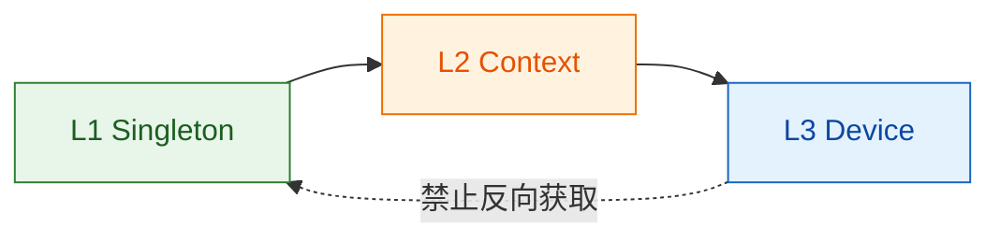

# 编码规约

本文档按主题组织：同一主题下 C++ 与 Lua 条目相邻，一次评审即可同时覆盖两侧。适用对象为 `xcom_lua` 仓库的 C++17 核心与 LuaJIT 前端代码。

## 适用范围与阅读约定

- C++：coact 框架头位于 `xcom_core/framework/coact/include/coact/`（`ao.hpp`、`hsm.hpp`、`pool.hpp`、`queue.hpp`、`spsc_ring.hpp`、`expected.hpp`、`coordinator.hpp`、`config.hpp`、`static_ao.hpp`、`policy.hpp`、`pal*.hpp`），应用层 C++ 在 `xcom_core/src/`；规约约束全部 C++17 代码。
- Lua：`xcom_lua/` 下运行于单共享 `lua_State` 的 LuaJIT 5.1 代码；`xcom_lua/libs/` 为第三方库，不强制本规约。
- 条目以 `C++：` / `Lua：` 前缀标注适用侧；无前缀为通用。
- 代码落点标注到文件与类名/函数名，不标行号（行号随重构漂移）。
- 红线速查：禁异常；禁业务代码运行期堆分配；禁裸 `int/long/char`；禁裸 `enum` 与 `#define` 常量；禁裸指针代替引用/值句柄；禁动态分配池/工厂/过度抽象；禁跨 AO 共享可变状态；禁非平凡类型 placement new 进复用内存；禁固定 sleep 排空；禁全局 `jit.off()`；禁 `..` 循环拼接；禁污染全局环境。

## 通用总则

- 语言与标准：C++ 用 **C++17**，禁 C++20 特性；Lua 用 **LuaJIT 5.1**（Lua 5.1 语义）。
- 双平台（C++）：C++ 代码必须同时可在 RT-Thread 目标机与 Linux host 编译运行；平台差异只经 `pal.hpp`/`pal_posix.hpp`/`pal_rtthread.hpp` 的 PAL 接口隔离，禁业务代码出现 `#ifdef` 平台分支。共享结构用 Profile 模板参数区分单核/SMP（`RttSingleCoreProfile`/`HostSmpProfile`，pool.hpp），不用 if/else。
- 命名：C++ 类型/函数 `PascalCase`、变量/字段 `snake_case`、常量与枚举值 `k` 前缀（`kMaxAo`）；guard 函数名回答是/否（`is_...`/`can_...`），action 用 `onXxx` 前缀。Lua 变量/函数 `snake_case`、模块/类 `PascalCase`、常量 `UPPER_CASE`。
- 格式：缩进 **4 空格**，每行 ≤ **120 列**；C++ 用 **Allman** 大括号。
- 注释：代码/注释/commit 用英文，面向人的文档用中文。注释解释**为什么**而非做什么：C++ 用 `/* */`（行尾短注释 `//`）；Lua 用 `-- `，公共 API 建议 EmmyLua。反直觉决策（不加锁、丢弃语义、单槽深度、entry 而非 action 发硬件命令、`jit.off` 作用域）必须就地写明理由。
- 模块化：Lua 每个文件 `local M = {}` … `return M`，`require` 置顶部并 `local mod = require("mod")`，杜绝全局暴露。
- 文件头：C++ 模块一句话定位 + `SPDX-License-Identifier: MIT`。
- 静态检查：C++ 提交前跑 clang-format / clang-tidy / cpplint（coact `.ai/` 全套）；Lua 集成 `LuaCheck` 并修复全部警告（尤其全局变量与未使用变量），`LuaFormatter` 统一风格，提交前自动执行。
- 自验证：C++ 示例程序结尾断言全部不变量并以退出码给结论（如 `RESULT: ALL PASS (fails=0)`，ctest 可门控）。

## 类型与内存安全

C++：

- 固定宽度整型优先 `<cstdint>`（`uint8_t`/`uint16_t`/`uint32_t`/`int8_t`/`int32_t`），禁裸 `int/long/char/unsigned`；宽度即契约交给类型萃取（`sizeof`/`is_standard_layout` 断言）把关。
- 强类型代替弱转换：领域枚举用 `enum class X : 底层类型`，禁 `#define` 常量与裸 `enum`；可判空语义用 `explicit operator bool()`；错误用 `Expected`/错误码枚举，不用裸 int 返回。落点：`TransitionKind : uint8_t`（hsm.hpp）、`PriorityClass : uint8_t`/`InitError : uint8_t`（config.hpp）。
- 隐式转换显式标注 `static_cast<目标类型>(...)`；比较常量在左（Yoda）：`0 == x`、`nullptr == p`。
- 复合语句纪律：`if`/`for`/`while`/`do-while` 分支体一律 `{}`，即使单语句；禁 `goto`、禁递归。
- `switch` 必须带 `default`（或 `enum class` 穷举 + 兜底）；`Hsm` 对 `TransitionKind` 的分派 switch 带 `default`（hsm.hpp）。
- RAII 取代手工配对：成对操作包成 guard 对象、拷贝/赋值 `= delete`，任意退出自动配对。落点：`CriticalSectionGuard`（pal.hpp）。
- 零堆：业务代码禁 `new`/`malloc`；静态/栈/编译期容量容器优先；多形态行为用模板（Policy）或 `constexpr` 数据表，禁动态分配池/工厂模式。落点：`EventPool` 只管理调用方提供的存储（pool.hpp），`BoundedMpscQueue<T, Capacity>`/`SpscRing<T, Capacity>` 容量为模板参数。
- 侵入式链表代替堆容器：排队结构内嵌 `next` 索引，不额外分配节点（`EventPool` 空闲链，pool.hpp）。
- placement new 只用于平凡可析构类型，定义处以 `static_assert(std::is_trivially_destructible/... )` 护住，读侧经 `std::launder`。落点：`detail::SlotStorage<T>` + `slot_ptr`（queue.hpp）、`EventPool::alloc_typed`（pool.hpp）。
- 原始未构造存储用 `std::byte` 数组 + `alignas(alignof(T))`，禁 `char`/`uint8_t` 双关。落点：`SlotStorage<T>`（queue.hpp）、`EventBlockLayout<Meta, PayloadBytes, PayloadAlign>` 的 `alignas(PayloadAlign) std::byte payload[]`（pool.hpp）。
- 跨模块边界结构体在定义处 `static_assert` ABI/布局契约（`is_standard_layout` + `is_trivially_copyable` + `is_nothrow_move_constructible`），违约编译失败。
- 减少裸指针：传参用 `const T&`，跨线程可空句柄用值语义 id（`TargetId`，config.hpp）；`reinterpret_cast` 只允许出现在原始内存槽位 ↔ 对象的 launder 桥两侧。
- 栈是零堆下唯一的运行期伸缩空间：定容线程栈是硬预算（`kDispatcherStackBytes = 4096U`，config.hpp；RT-Thread 侧 `RtThreadResources<StackBytes, ContextSlots>` 的静态 `stack[]` 数组，pal_rtthread.hpp）；MB 级池存储/帧缓冲/查找表放静态或调用方存储，不入栈帧；大结构按引用、小 POD 按值；事件只带描述符不带数据；新增路径须可核验“最深帧 × 单帧上限 ≤ 栈预算”。
- move 语义即所有权：跨线程/跨槽位交接用 `T&&` + `std::move`，对象须 `is_nothrow_move_constructible`；失败路径不得消费调用者的值（先查容量再 move）。落点：`BoundedMpscQueue::try_push_observed(T&&)`（queue.hpp）；`std::exchange` 仅用于“取旧 + 置新”一体语义，弃返回值处写 `static_cast<void>(std::exchange(...))` 并注释。
- 内联类型擦除：`FixedFunction<Sig, Capacity = 2U * sizeof(void*)>`（`xcom_core/src/foundation/fixed_function.hpp`）超出容量即 `static_assert` 编译失败而非静默回落堆；`FixedVector` 同族（`xcom_core/src/foundation/fixed_vector.hpp`）。注意：本仓库**不存在** `vocabulary.hpp` 与 `FixedString`。

Lua：

- 强制 `local`：所有变量、函数必须用 `local` 声明，禁止污染全局环境。
- 牢记 1-based 索引：`string.sub`、`table.insert` 等标准库均遵循此约定。
- 显式类型转换与真值判断：用 `tonumber`/`tostring` 显式转换，不依赖自动转换；条件中仅 `false`/`nil` 为假，`0` 与 `""` 均为真。
- FFI 缓存类型：用 `ffi.cdef` 定义的结构体，缓存其 `ctype` 与字段访问，减少解析成本。
- FFI 回调与字符串边界：`const char*` 参数只在回调期内借用，跨期必须 `ffi.string`/`ffi.copy` 复制；`ffi.cast` 结果生命周期须明确，禁止缓存指向临时缓冲的指针。
- 弱表管理缓存：给元表设 `__mode = "k"` 或 `"v"`，避免缓存成为内存泄漏源。
- 预分配表大小：已知长度直接下标赋值（`t[i] = val`）；循环内避免新建表，复用固定表并清空（`for i = 1, n do t[i] = nil end`）。
- 可变参数用 `select`：避免 `{...}` 创建表；频繁调用时用 `select('#', ...)` 取数量，`select(n, ...)` 取第 n 个后的参数。

## 字节、文本与 I/O

- Lua 二进制 I/O 显式模式：Windows 文本模式会把 `\n` 译为 `\r\n` 并在读侧反向翻译；串口原始字节、HEX 载荷、文件发送与落盘日志一律 `io.open(path, "rb"/"wb")`，禁止依赖默认文本模式，防止字节流被静默污染。
- Lua 换行与断帧显式化：行结束符只允许显式 `\r\n`/`\n` 常量（`string.gsub` 拼接时注意 `%` 转义）；断帧按长度/空闲超时判定，禁止依赖平台默认换行行为或文本模式翻译。
- Lua 字符集纪律：项目内部字符串统一 UTF-8；GBK/ANSI 等 Windows 代码页转换只在 C 桥层（cp936 等）完成，Lua 侧禁止对 latin1 字节流做码点级处理（`utf8.len`、`#s` 混用），禁止用 `print` 直出非 ASCII 到控制台（受 `chcp` 影响产生乱码）。
- Lua 路径与文件锁：目录分隔符统一正斜杠（Lua `io`/OS API 均接受）；Windows 文件系统大小写不敏感，路径去重需用小写键；共享冲突与只读属性是常规失败，必须检查返回值。
- C++ PAL 边界收口（仅 `pal_rtthread.hpp`/`diag/log_rtthread.hpp` 等直接对接 RT-Thread C API 的适配代码）：`rt_kprintf` 仅允许 `%d %u %x %s %lu`（禁 `%llu/%zu/%f`），`size_t` 显式转 `(unsigned long)`；文件 I/O 一律 POSIX `open/read/write/close`（禁 `fopen/fread/fwrite`），格式化用 `snprintf`（禁 `sprintf`）。host 侧示例可用 `std::printf`。

## 错误处理

- C++ 禁用异常（`RT_ASSERT` 同禁，断言只用于框架内部不变量）；错误用值语义返回：简单场景用 bool/错误码枚举（如 `InitError`）；值或错误二选一用 `coact::Expected<V, E>`，落点 `xcom_core/framework/coact/include/coact/expected.hpp`——`class [[nodiscard]] Expected final`、`success(V&&)/error(E)` 工厂、`Expected<void,E>` 特化、支持 move-only `V`、固定内联存储（no exceptions, no heap）。**注意**：实现入口是 `expected.hpp` 本身（头注释说明改编自 newosp `vocabulary.hpp`），本仓库并无 `vocabulary.hpp`。
- C++ `QueueResult`（config.hpp）融合 push 成败与队列水位，免二次进临界区；错误路径不得静默——返回值被消费或被计数（reject 弧计数器），无“丢弃返回值且无注释”的调用点。
- Lua I/O 结果必处理：所有 `io.open`/`io.write`/`file:close` 与 `os` 调用必须检查 `nil+msg` 并计数或上抛，禁止静默丢弃；错误信息保留 Windows 错误串便于诊断。
- Lua 外部命令最小化：尽量避免 `os.execute`/`io.popen`；确需调用时用 `cmd.exe` 兼容的引号规则包裹参数，禁止拼接未净化的用户输入（命令注入）。

## 并发与锁

C++：

- AO 之间只通过事件通信：`EventPool::alloc_typed` 分配事件块 → `coordinator().submit_from_task(TargetId, Event*, ...)` 投递；禁跨 AO 共享可变状态。非 AO 线程（worker）与 AO 的唯一耦合也是事件平面。
- 数据平面（串口字节/像素）不走事件：事件只携带缓冲描述符，真实数据留在拥有者 AO 管理的存储中。
- 锁层级 **L1 Singleton → L2 Context → L3 Device**，禁止反向获取：

- 最弱足够同步：数据已被互斥机制（单 Dispatcher 线程序列化、AO 队列、单写者）覆盖则**不加锁**，且必须注释论证为什么不需要锁。
- 跨线程枚举/标志用 `std::atomic` 且必须断言 `is_always_lock_free`（libatomic 回退是隐藏的锁/堆依赖，构建期必须失败）。落点：`EventPool` 按 Profile 用 `if constexpr` 分流并 `static_assert`（pool.hpp）。
- worker 交接单槽/浅环：交接点满则返回失败，不阻塞、不排队，调用侧计数丢弃（`BoundedMpscQueue::try_push_observed`、`SpscRing::try_push`）；丢帧是诚实的计数器，不是隐藏停顿。
- `drain-on-stop`：停机先排空在途任务再退出（每个被接受的 job 必须产出完成事件）；与“忙则丢弃”并存时两者差异都要注释写明。
- 关键区只含少量 store（`cs.save/cs.restore`），绝不把硬件延迟圈进锁内，耗时操作在锁外执行。

Lua：

- **luv 多线程与 loop 归属**：luv 每个 `lua_State` 都有自己独立的 `uv_loop_t`；不同线程（state）之间**不能共享 uv handle**，但每个线程可拥有独立完整的事件循环。跨线程耦合只传不可序列化值/消息代号，不传 uv handle 或 `lua_State`。（luv 官方 README：每个线程从不同 state 加载库、luv 为其生成独立 loop。）
- **用 luv 的协同式 `fs_*`/句柄做异步 I/O，别主线程裸轮询**：libuv 的文件/网络/管道操作经线程池在 **C 层异步执行，不阻塞主线程的事件循环**；需要同步风格写异步逻辑时才在独立 `lua_State`（如纤程封装）内用阻塞原语。主 UI 线程禁止用阻塞 `os.execute`/同步 io 读大文件阻塞消息泵——交给 `uv` 的句柄/请求完成回调收口。
- **阻塞式同步读与临时批量缓冲区勿在每帧分配**：若必须在单线程内顺序、临时读块（发送/接收转换的局部 IO 窗口），优先大/中批次 + 既有大缓冲，而不要在每次小读里新建表/long-str（避免无谓 GC）。能搬运到独立 luv 线程或 `uv` 句柄收口时优先后者（见上两条）。
- **协程当前欠采用并说明原因**：本项目脚本运行于单共享 `lua_State` 的消息循环（`Window:run` 事件泵，`ui/window.lua`），无独立协程/纤程 host；`lua`/`uv` 官方协程调度器需要宿主按 `lua_State`/`uv loop` 建模，当前 UI 线程模型不提供。新增长期 I/O 若可能，首先评估“后台 uv 句柄 + 事件回调合并到主循环”；确要实现事件循环内无阻塞多路复用，再引入宿主级协程调度器，而非在本 app 内手写状态机式 yield。

## 函数与控制流

- C++ return 预算：单个函数 return 语句 **≤ 5**，能不提前 return 就不提前 return；超过说明职责过多应拆分。
- C++ guard/entry/exit/action 分层：guard 是纯函数（只读 ctx/event、无副作用、`noexcept`、返回 bool）；entry 只做硬件命令（寄存器写、启停命令），**不得放在 transition action**（会与拓扑竞争）；exit 只做清理，由 `Hsm::exit_to_lca` 按状态栈逐层调用；action 只做本弧业务效果 + 更新镜像枚举 + 链接下一事件。
- C++ 状态机表驱动：AO 行为一律静态 HSM 表（`StateDef[]` + `TransitionDef[]`）驱动，禁在 action 里 if-else 模拟；非法 (状态, 事件) 对落到显式 reject 弧（`TransitionKind::Self`，hsm.hpp，计数 + trace），禁静默丢弃。注意 `Hsm<Context>` 是运行期表驱动状态机（函数指针表），**不是 CRTP**。
- C++ 事件生命周期：事件块 `alloc_typed` 后引用计数（`Event::ref_ctr`，event.hpp：alloc 后为 1，每多投递一次 +1，归 0 回收）由框架管理，业务只 submit 不手动回收；程序结束必须断言 `pool.used() == 0U`（零泄漏）。
- C++ AO 静态属性（优先级、RTC 预算、直投资格）走 Trait 结构体（`Ao<Context, HsmT, Traits>`，ao.hpp：`logical_prio()`/`priority_class()`/`direct_eligible()`/`kRtcBudgetNs`），不经构造参数或运行期 setter；运行期可观测性走 monitor（`rtc_timeouts`/`disposition_overload`/`pending`，monitor.hpp），不往业务代码加打印探针。
- C++ 排空（drain）用事件驱动条件（每 AO `pending()` 归零 + FSM 回终态），**禁止固定 sleep 赌时序**。
- C++ 会话状态广播等主线程与 Dispatcher 竞争唤醒闩锁的场景，必须从**主线程**发起而非 Dispatcher 上下文自提交，并注释论证；AO 上限 `kMaxAo = 16`（config.hpp）。
- Lua 循环首选 `for`（远比 `while` 利于 JIT）；数组遍历用数字 `for i = 1, #arr do`（比 `ipairs` 更快且支持 JIT）；字典遍历用 `pairs`，但不要在遍历中修改表内容。
- Lua 避免 trace 中断操作：热路径内禁止 `debug` 库调用（如 `debug.getinfo`）、复杂字符串模式匹配与嵌套 `string.gmatch`，改用纯算术或简单操作。

## 性能与 JIT

- C++ 编译期确定、运行期少分配：能编译期定型的（表、策略、布局契约、AO 属性）一律 constexpr/模板/static_assert；`if constexpr` 只用于“未选分支根本不该被实例化”，禁包裹恒真/恒假条件预留未来分支。
- C++ 零拷贝：对象在目的地就地构造（placement new + 对齐存储），事件只传描述符不传数据字节；所有权移动用 `std::move`/`std::exchange`。
- C++ 低分支：编译期路径分流 + 表驱动取代 if/else 链；热点循环内不引入可被 Profile 消除的分支。常量表用 `inline constexpr`（`kReclaimBatchCap`、`kMaxAo`），不为 constexpr 而 constexpr。
- Lua JIT 默认开启、选择性覆盖：**永远不写全局 `jit.off()`**；仅在有实证（崩溃/错误行为或性能测量）时对具体函数 `jit.off(fn)`/`jit.off(fn, line)` 做最小作用域覆盖，并在代码处注释写明“为什么必须解释执行”。
- Lua 保持 JIT 友好：热点循环留在纯 Lua、可 trace 的函数内，不与 C 回调重入路径混用；优先算术、位运算、简单循环和数组操作，确保核心代码能被编译为机器码。
- Lua 循环拼接用 `table.concat`：循环内禁止 `..` 逐步拼接（每次 O(n) 重分配并中断 trace），改用表收集后一次性 concat；分块 I/O 中禁止每块一回调一同步读，把吞吐预算换算成“单次事件处理器内按预算连续收发 N 块”，压满一次 I/O 窗口，避免事件风暴。
- Lua 缓存全局 API：频繁使用的全局函数（`math.sin`、`table.concat`）在作用域顶部缓存为局部变量。
- Lua 内置 `bit` 库：用 `bit.band`/`bit.bor` 等处理位运算，比纯 Lua 实现快得多。
- Lua 元表谨慎用：`__index`/`__newindex` 设为函数时注意查找开销，考虑缓存结果。

JIT 热点边界（C 回调重入是唯一必须关闭 JIT 的路径）：

## 设计模式与抽象边界

- 通用红线：每个模式引入前必须能指出“三个相似实例”或等价的复用证据；禁用为而用的抽象。helper/util/抽象层最小化，宁可局部直白，不要全局优雅。
- 两条总序：**静态多态（模板/Policy）优先于运行时多态（vtable）；组合优先于继承**。
- 本仓库实际使用的形态：
  - **策略（Policy）**：同一骨架 × 可替换的无状态算法，策略是只有静态方法的无状态 struct。落点：`RttSingleCoreProfile`/`HostSmpProfile` 作为 `EventPool` 的 Profile 策略，经 `if constexpr` 编译期选定（pool.hpp）。策略禁携带状态，方法须 `noexcept`。
  - **命令（延迟执行/顺序契约）**：`Event` 携带 `signal`（`alloc_typed(uint16_t signal)`，pool.hpp）作为延迟投递命令的身份；顺序契约以 `constexpr` 数据表固化（`kReclaimBatchCap` 等）。命令对象必须自包含，禁把命令表当变相 if 链。
  - **组合（树形传播）**：向固定成员集合广播同一操作。落点：`AoRegistry`（ao.hpp）以 `std::array<AoBase*, kCapacity>` 固定容量存储并遍历广播 init/deinit——编译期定容、无递归。
  - **const 函数表擦除**：AO 入口 `StaticAoEntry`/`make_static_ao_entry`（static_ao.hpp）；准入策略 `PolicyOps`（policy.hpp，M4 准入策略引擎：filter/merge/rate-limit）。注意 `policy.hpp` 是这个准入引擎，**不是** Policy 模板定制点；CRTP 在本仓库未被采用（`Hsm` 不是 CRTP）。
- 决策：差异是钩子方法集合 → 模板骨架 + 钩子；差异是一个无状态算法 → 策略（Profile）；需延迟到别的线程/状态 → 命令（`Event` signal）；需向固定集合广播 → 组合（`AoRegistry`）；需 vtable 运行期多态 → 改用静态多态。无法对号入座时，先写两个直接的普通函数/struct，等第三个相似实例出现再抽象。

## review 检查清单

逐项打勾；任一“否”即 review 不通过。`[C]` 仅 C++，`[L]` 仅 Lua，无标注为通用。

**总则**

- [ ] 仅使用 C++17 特性，未引入 C++20 语法/库？`[C]`
- [ ] 无 `#ifdef` 平台分支（平台差异全经 PAL / Profile 模板参数）？`[C]`
- [ ] 缩进 4 空格、每行 ≤ 120 列；C++ Allman、Lua 命名前缀符合规约？
- [ ] 代码/注释为英文，注释解释“为什么”，反直觉决策处均有理由说明？
- [ ] Lua 文件以 `local M = {}` 开头、`return M` 结尾，`require` 置顶部且赋局部变量，无全局污染？`[L]`
- [ ] 静态检查通过：C++ clang-format/tidy/cpplint；Lua LuaCheck 零警告 + LuaFormatter？`[C][L]`

**类型与内存**

- [ ] 无裸 `int/long/char`，全部 `<cstdint>` 固定宽度整型？`[C]`
- [ ] 宽度/符号转换处均有显式 `static_cast`？比较表达式常量在左？`[C]`
- [ ] 新枚举均为 `enum class` + 底层类型；无 `#define` 常量、无裸 `enum`？`[C]`
- [ ] 单语句分支也带 `{}`；全文件无 `goto`、无递归？`[C]`
- [ ] `switch` 有 `default` 或穷举 + 兜底？`[C]`
- [ ] 业务代码零堆分配（无 `new`/`malloc`），存储为静态/栈上/编译期容量容器？`[C]`
- [ ] 无动态分配池/工厂；多态走模板或 const 函数表并说明理由？`[C]`
- [ ] 跨边界结构体在定义处有 `is_standard_layout`/`is_trivially_copyable`/`is_nothrow_move_constructible` 断言？`[C]`
- [ ] placement new 仅用于平凡可析构类型，读侧经 `std::launder`？`[C]`
- [ ] 原始未构造存储为 `std::byte` 数组 + `alignas(alignof(T))`，非 `char`/`uint8_t` 双关？`[C]`
- [ ] 跨边界连接用值语义 id（`TargetId` 等）或引用，非裸指针 + 所有权注释？`[C]`
- [ ] 成对操作已包成 RAII guard（拷贝 `= delete`），无裸配对调用？`[C]`
- [ ] 调用路径已核算“最深帧 × 单帧上限 ≤ 线程栈预算”，无大对象入栈？`[C]`
- [ ] Lua 变量/函数均 `local`；1-based 索引正确；`tonumber/tostring` 显式转换，未依赖自动转换？`[L]`
- [ ] FFI 跨回调期的 `const char*` 已复制；未缓存指向临时缓冲的指针；`ctype`/字段访问已缓存？`[L]`
- [ ] 已知长度的表已按下标预分配；缓存有弱表 `__mode` 防泄漏？`[L]`

**字节与 I/O**

- [ ] Lua 二进制 I/O 用 `"rb"/"wb"`；换行/断帧显式化，未依赖平台文本模式翻译？`[L]`
- [ ] 内部字符串 UTF-8；代码页转换只在 C 桥层，未在 Lua 侧混用 `utf8.len`/`#s` 或 `print` 直出非 ASCII？`[L]`
- [ ] 路径统一正斜杠、去重用小写键；文件共享/只读失败返回值已检查？`[L]`
- [ ] rt_kprintf/POSIX I/O/`snprintf` 等 C 接口只出现在 PAL 层，未渗入业务代码？`[C]`

**错误处理**

- [ ] 无异常、无 `RT_ASSERT`；错误经 `Expected`/错误码返回，无静默丢弃返回值？`[C]`
- [ ] Lua `io.open`/`io.write`/`file:close`/`os` 调用均检查 `nil+msg` 并计数或上抛？`[L]`
- [ ] `os.execute`/`io.popen` 最小化；参数经 `cmd.exe` 引号规则包裹，无未净化输入拼接？`[L]`

**并发与锁**

- [ ] AO 间仅事件通信，无共享可变状态跨越 AO 边界？`[C]`
- [ ] 数据平面字节留在 owner，事件只带描述符（零拷贝）？`[C]`
- [ ] 锁层级 L1→L2→L3，无反向获取？`[C]`
- [ ] 每处“不加锁”的决定都有注释论证（最弱足够原则）？`[C]`
- [ ] 跨线程标志/枚举为 `std::atomic` 且断言 `is_always_lock_free`？`[C]`
- [ ] worker 交接为单槽/浅环、忙则拒绝 + 计数，无阻塞排队？`[C]`
- [ ] `stop()` 语义（drain vs 丢弃）已声明且被注释论证？`[C]`
- [ ] 关键区内无硬件延迟/长操作？`[C]`
- [ ] Lua 跨线程只传值/消息代号，未共享 uv handle 或 `lua_State`；主 UI 线程无阻塞 I/O？`[L]`
- [ ] 临时批量读写在既有大缓冲上完成，未每帧/每小块新建表或 long-str？`[L]`
- [ ] 未在本 app 内手写状态机式 yield 替代宿主协程调度器？`[L]`

**函数与控制流**

- [ ] 每个函数 return 数 ≤ 5？`[C]`
- [ ] guard 为纯函数（只读、`noexcept`、无副作用）？`[C]`
- [ ] 硬件命令在 entry、清理在 exit、事件响应在 action，未错层？`[C]`
- [ ] 状态机为静态表驱动，非法 (状态, 事件) 有显式 reject 弧？`[C]`
- [ ] 事件块只 submit 不手动回收；结束时 `pool.used() == 0` 可验证零泄漏？`[C]`
- [ ] AO 属性走 Trait；运行期观测走 monitor，无散装打印探针？`[C]`
- [ ] 排空用 `pending()`/终态条件，无固定 sleep 赌时序？`[C]`
- [ ] Lua 循环首选 `for`；数组用数字 `for`，字典用 `pairs` 且遍历中不改表？`[L]`

**性能与 JIT**

- [ ] `if constexpr` 只用于“未选分支不该被实例化”？`[C]`
- [ ] 常量表为 `constexpr`/`inline constexpr`，且非为 constexpr 而 constexpr？`[C]`
- [ ] `[[nodiscard]]`/`noexcept`/`explicit` 按语义使用，未机械全标？`[C]`
- [ ] `std::exchange` 仅用于“取旧 + 置新”一体交接；弃返回值处写 `static_cast<void>`？`[C]`
- [ ] 跨槽位/跨线程交接用 `T&&` + `std::move`；失败路径不消费调用者的值，move 后源不再读？`[C]`
- [ ] 无全局 `jit.off()`；每个 `jit.off` 都有实证理由与注释说明？`[L]`
- [ ] 热点函数可 trace，未与 C 回调重入路径混用？`[L]`
- [ ] 循环拼接用 `table.concat`；热点内无逐次 `..`、无 `debug`/复杂模式匹配？`[L]`
- [ ] 全局 API（`math.*`/`table.*`）已在作用域顶部局部化？`[L]`
- [ ] 位运算用 `bit` 库；元表函数字段查找开销已评估/缓存？`[L]`

**设计模式**

- [ ] 每个模式（策略/命令/组合/函数表）的引入可指出三个相似实例或等价证据？`[C]`
- [ ] 静态多态优先于 vtable；组合优先于继承，未引入非必要类层次？`[C]`
- [ ] 策略无状态且方法 `noexcept`；命令对象自包含、顺序契约以数据表固化？`[C]`
- [ ] 组合为编译期固定集合 + 展平循环，无递归？`[C]`

**收尾**

- [ ] 示例程序结尾自验证全部不变量并以退出码给出结论？`[C]`
