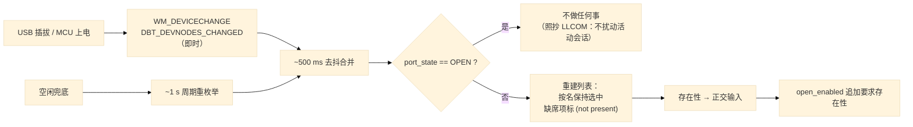

# 设计：设备存在性感知与选中保持

## 结论

**先调研后设计**（依据所有者要求）。调研了约 17 个串口工具后，四个决策：

1. **混合检测**：`WM_DEVICECHANGE`/`DBT_DEVNODES_CHANGED`（即时）+ **约 1 s 的周期重枚举兜底**，两条路都按 ~500 ms 去抖合并。
   **因为事件驱动其实是少数派**——这是本次调研最有价值的发现（见 §1）。
2. **选中按端口名保持，绝不回退到索引 0**；选中的端口缺席时显示明确的 **"(not present)"** 且名字仍选中；**Open 要求存在性**。
3. **会话 OPEN 期间对设备变更不做任何反应**（照抄 LLCOM 的刻意选择）——这是「不影响正常打开关闭」的具体保证。
4. **存在性作为状态机的正交输入**，不进端口状态集、不进 `ALLOWED_*` 表：`open_enabled` 追加要求存在性；存在性**永不**强制关闭、**永不**覆盖活动 OPEN。

**两处诚实标注**：
- **桥式 USB-UART 的 MCU 掉电没有任何先例可抄**——没有工具区分它和拔线，也没有工具对静默线路告警（§3）。故自定：用既有 break/framing 计数 + 空闲超时说「线路静默」，**绝不说「设备没了」**。
- **重编号（COM7→COM9）只有 tio 与 Serial Studio 能追**（靠稳定 ID / systemLocation）。我们用既有 `description` 作次级身份，能做到「同一设备换了名字就告知用户」，但对**两个无序列号的同型号适配器**存在歧义，如实写明。

---

## 一、先例对照（[S] 源码核实 / [D] 文档所述 / [I] 仅行为观察）

| 工具 | 检测方式 | 周期/去抖 | 选中键 | 选中端口消失时 | 自动重连 |
| --- | --- | --- | --- | --- | --- |
| Tera Term [S] | 事件 `WM_DEVICECHANGE` + `RegisterDeviceNotification` | 专设状态机合并 DEVTYPE/PORT 对；500 ms / 2000 ms / 重试 1000 ms×3 | COM **编号** | 关闭、显示等待、按同号重开；无回退 | 是（同端口） |
| **LLCOM** [S] | 事件 `WM_DEVICECHANGE`；**端口打开时忽略** | ~1 s 去抖 | COM **名** | **静默回退 `SelectedIndex=0`（错误设备风险）** | 是（同名） |
| minicom [S] | 被动：对已打开 fd 做 `tcgetattr` 试探 | ~1 s 循环 | 设备路径 | 永远重开同一路径；桥式掉电不可见 | 是（无退避） |
| picocom [S] | 无 | — | 设备路径 | `EIO` → `fatal()` 退出 | 否 |
| tio [S] | 轮询 `access()` + `tty_search()` | **1 s** | **by-id / by-path / 拓扑 ID** | 打印「等待 tty 设备…」并等待 | 是 |
| Serial Studio [S] | 轮询 `availablePorts()` | **1 Hz** | vid/pid/serial/desc，按 `systemLocation` 重解析 | **硬失败** `close(); return false` | 可选，1 s，不设上限 |
| Arduino IDE [S] | 事件（arduino-cli add/remove） | 100 ms 合并 | `protocol+address` | 保留选中并显示 " [not connected]" | 无 |
| PlatformIO [S] | 枚举一次 + 失败后重找 | 一次性/失败时 | `-p/--port` 或自动挑 | **静默回退**到最佳 VID:PID（`finder.py:155-177`） | 是（无上限） |
| VS Code SM [D] | 轮询 | 未知 | 端口名 | 继续监控；可能卡住（issue #239） | 是 |
| PuTTY [D] | 无（手输字符串） | — | 手输 COMx | 不适用（无列表） | 否 |
| RealTerm / Termite [D] | 懒/手动扫描 | 手动 | COM 名 | 未知 | 否 |
| CoolTerm [D/I] | 轮询 | **200 ms（来源待核）** | **端口名，非索引（来源待核）** | 回来后重连 | 是（有门控） |
| YAT [D] | 轮询（可选监控） | 500 ms / 重开 2000 ms | COM 名（含「下一个可用」） | 显示「已关闭并等待」 | 是 |
| XCOM / SSCOM / UartAssist [D] | 自动枚举 | 未知 | COM 编号 | **未知** | XCOM 是 |

出处：Tera Term `vtwin.cpp` + `doc/…/serial_reconnect.md`；LLCOM `View/MainWindow.xaml.cs`；tio `src/tty.c`；minicom `src/main.c`；picocom；[MSDN WM_DEVICECHANGE](https://learn.microsoft.com/en-us/windows/win32/devio/wm-devicechange)；[RegisterDeviceNotification](https://learn.microsoft.com/en-us/windows/win32/api/winuser/nf-winuser-registerdevicenotificationa)；[Qt QSerialPortInfo](https://doc.qt.io/qt-6/qserialportinfo.html)。

## 二、近乎通用的模式与分歧

**近乎通用：**
- **选中按端口名/编号，不按列表索引**（CoolTerm 被记为「明文写着」，但**二次核查未能在其 ReadMe 中定位到该出处**，标为来源待核）。重建列表不得移动选中。
- **去抖/合并在事件路径上是强制的**（一次插拔发多条；Tera Term 为此写了整个状态机）。
- **静默回退罕见且被记为缺陷**——只有 PlatformIO 与 LLCOM 这么做，两者都被记为「打开了错误的设备」。

**分歧（各选其代价）：**
1. **事件 vs 轮询**：轮询 = 持续唤醒 + 0.2–1 s 延迟；事件 = 驱动形态/去重复杂（Tera Term 之痛），而按 MSDN，COM 端口的到达/移除本来就广播给顶层窗口，**不需要** `RegisterDeviceNotification`。
2. **重编号身份**：只有 tio 与 Serial Studio 能追回重编号设备；其余按 COM 号，一律失效。
3. **消失策略（保持并标记 vs 静默回退）**：Serial Studio 硬失败、Arduino 显示 " [not connected]"；PlatformIO/LLCOM 静默改选别的端口。**代价是可能打开错误设备**——我们必须取前者。

## 三、本产品的设计

- **存在性正交**：`open_enabled` 追加「存在」，但存在性**永不**强制关闭、**永不**覆盖活动 OPEN。理由与 §4.1 把「健康」保持正交相同——塞进端口状态集会污染 `ALLOWED_OPEN/CLOSE` 表与超状态推导。
- **桥式掉电**（端口仍在、线路静默）：无设备事件、不报「设备没了」；用既有 break/framing 计数 + 空闲超时说「线路静默」。
- **直连 USB 的 MCU 掉电**（节点真的消失）：设备事件 + 读失败 → 既有故障路径 → FAULT → 按钮由 HSM 派生更新。
- **上电/返回**：设备事件 → 重建列表 → 端口重新出现；若在宽限窗内，由既有 `_drive_reconnect` 接手；**若端口号变了**，按 §结论第 5 条告知用户，不静默改选。
- **探测开销**：`list_ports({probe=...})` 默认便宜（`probe_port_busy` 默认 false），但用户开启探测时会逐口触碰——所以 **OPEN 期间既重建列表也不探测**（与决策 3 同一条）。

## 四、与状态机的关系（不要混为一谈）

存在性是**输入**，不是**状态**。它不新增 `XCOM_PORT_*` 状态、不改 `ALLOWED_OPEN/CLOSE`、不改超状态推导，
只作为 `open_enabled` 的一个附加条件与一处显示标记。端口状态机仍严格按
`docs/design-state-machines.md` §2 与 `docs/design-exception-matrix.md` §1 的迁移表运转。

## 五、未覆盖与无先例

- **无先例**：桥式 USB-UART 在 MCU 掉电时的「静默线路」判定，全部被调研工具都没有做。我们的做法是自定的，
  需要在真实设备上定标空闲超时（太快会误报线路静默，太慢则用户看不到）。
- **歧义**：两个同型号、无序列号的适配器同时存在时，`description` 作次级身份无法区分；此时**不猜**，
  保持按名选中并标记缺席。
- **未验证**：真实 `WM_DEVICECHANGE` 投递、真实重枚举耗时、真实 USB-CDC 掉电行为——列入任务 #11。
