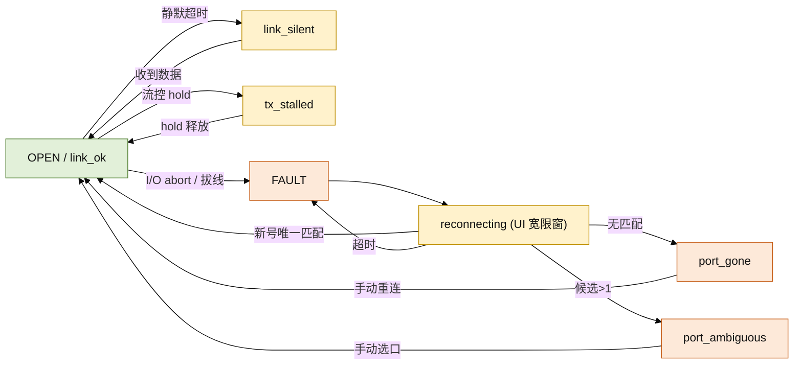

# 设备能力模型与链路恢复设计

## 结论

工具当前对所有 USB-UART 桥接器施加同一套行为：open 时把 DTR/RTS 钉到勾选
电平，之后仅靠连接面板两个复选框逐次下发。这无法产生复位所需的毫秒级边沿
时序，是 `reset_to_rom` 偶发失败的直接根因，也是“多种 MCU / USB-UART 不稳定”
需求的核心缺口。

本设计引入：一个**静态设备能力表**（键为桥接器稳定身份，表在
`xcom_lua/core/device_profiles.lua`，编译期常量、无工厂无池），一份
**非阻塞复位时序器**（`core/reset_sequencer.lua` + luv 定时器），以及叠加在
现有 6 态 UI HSM 之上的**恢复覆盖层**。核的 5 态 ABI 状态不变，仅追加两个可
观测字段。

## 现状与失败点

注：仓库当前不存在 `reset_to_rom` 入口；“已尝试的 ROM 进入”即下述人工复选框
路径。这是设计前提，不是对既有函数的审计。

| 现象 | 代码位置 | 原因 |
| --- | --- | --- |
| ROM 进入偶发失败 | `ui/connection_panel.lua` 仅 DTR/RTS 复选框；`window.lua:2414` 逐边沿下发 | 无组合时序，人无法稳定复现 50–120 ms 的 assert/hold/release |
| open 即把板子拉死 | `serial_backend_win.cpp::configure()` 第 380–383 行 | open 直接钉到 `dtr/rts_enabled` 终态，不产生“先拉低再释放”脉冲 |
| HW 流控下 RTS 不动 | `serial_backend_win.cpp::set_rts()` 第 324 行 | `rts_handshake_` 为真直接 return，依赖 RTS 的 ROM 边沿静默失效 |
| 脉冲与掉线竞争 | 复位触发 USB detach | 晚到的 `EscapeCommFunction` 落在失效句柄上 |
| 流控堵塞不可见 | `xcom_core.cpp:1302` `flow_hold_events` | 只进内部 metrics，未进 `XcomSnapshot` |
| 身份不足以选型 | `XcomPortInfo` 仅 `name` + `description` | 无 VID/PID，静态表只能按描述启发式匹配 |

## 设备能力模型

**键**：桥接器稳定身份，优先级为 (1) `hardware_id`
（`USB\VID_xxxx&PID_xxxx`，枚举时经 SetupAPI 读出）→ (2) 归一化注册表描述
（`HARDWARE\DEVICEMAP\SERIALCOMM` 值名）→ (3) 用户显式选择的 profile id。
COMx **不做键**：re-enumeration 会改号。

**表位置**：`xcom_lua/core/device_profiles.lua`，纯 Lua、模块级只读数组，线性
扫描。放 Lua 而非 C++，因 core 的职责边界是“不做策略决策”，且该表须能跑
Linux 单测。

```lua
M.PROFILES = {
  { id = "ch340",
    match   = { hwid_prefix = "USB\\VID_1A86&PID_7523", desc_find = "CH340" },
    reset   = { mode = "auto",           -- auto | manual | none
                edges = { {rts=1}, {dtr=1, delay=120}, {rts=0, delay=60},
                          {dtr=0, delay=50} },
                reenumerates = true, settle_ms = 3000 },
    flow_control = "warn",               -- ok | warn | unsupported
    silent_warn_ms = 5000 },
  { id = "cp2102",  match = { hwid_prefix = "USB\\VID_10C4&PID_EA60" } },
  { id = "ft232r",  match = { hwid_prefix = "USB\\VID_0403&PID_6001" } },
  { id = "cdc_acm", match = { hwid_prefix = "USB\\VID_", desc_find = "USB Serial" },
    reset = { mode = "manual", reenumerates = true } },
  { id = "default", match = {}, reset = { mode = "manual" }, flow_control = "ok",
    silent_warn_ms = 5000 },
}
function M.resolve(hwid, description, override_id) end  -- -> profile, source
function M.for_config(cfg_data, port_info) end          -- 读入 [profile] 覆盖
function M.set_override(cfg_data, key, patch) end
```

解析优先级：**per-key 覆盖 > hardware_id 前缀 > 描述子串 > `default`**，首个
匹配即返回。

**用户覆盖**（`config.ini`，沿用扁平 key=value）：

```ini
[profile]
key  = USB\VID_1A86&PID_7523   ; 当前解析到的稳定键
mode = custom                  ; auto | custom
[profile.custom]
reset.mode         = manual    ; 板子不在表内：退化为手动复位
reset.reenumerates = true
flow_control       = unsupported
silent_warn_ms     = 8000
```

一份 custom 条目即可覆盖“板子不在表里”；多块异形板需手改 `key`，列为已知
限制。不改 ABI。

## 复位与 ROM 进入序列

时序器 `core/reset_sequencer.lua`（纯 Lua，可注入时钟与 `set_lines` 记录器）：

- `M.new(profile, set_lines, now_fn)` -> `seq`；`seq:start()`；`seq:step(now)`；
  `seq:state()` ∈ `idle|running|settling|done|failed|manual`。
- **auto**：按 `profile.reset.edges` 的 `{dtr,rts,delay}` 逐边沿执行，只在
  `now >= edge_at` 时下发；由 `ui/window.lua` 的专用 luv 定时器
  `self._reset_timer`（≈5 ms 粒度）驱动 `seq:step()`，**不在 UI 线程 sleep**。
- **manual**：不驱动引脚，状态栏 + 连接面板显示 `profile.manual_instructions`
  与倒计时，即“按 BOOT、点 RST、松 BOOT”的屏上指令路径。
- **HW 流控冲突**：`flow_control != "ok"` 且当前为 RTS/CTS 时，序列前先用
  `open_async(flow_control=0)` 重开（DCB 只能在 open 时改），结束再恢复；这是
  `set_rts` 自锁的唯一可靠解法。`unsupported` 桥接器直接走 manual，绝不静默。
- **安全静息电平**：序列结束（含失败）一律 deassert DTR/RTS，避免把板子留在
  复位/BOOT。


改动与失败点一一对应：组合时序取代人工点框；序列显式产生边沿，不依赖 open
终态；流控冲突先降级再脉冲；最后一条边沿在重枚举前完成，宽限窗只负责重开。

## 链路恢复状态机

核 5 态与 UI 6 态（含 `reconnecting`）保持不变。`reconnecting` 继续由 UI 拥有，
理由（core 无应用可校验的定时器，HSM 是全部互锁唯一推导处）成立，本设计**不
反对也不下移**。其上叠加**派生恢复覆盖层**（不改 ABI，只增 `ui_state()` 字段）：

| 不稳定模式 | 覆盖层状态 | 进入条件 | 自动恢复 | 用户出口 |
| --- | --- | --- | --- | --- |
| 设备消失 | `port_gone` | OPEN -> FAULT | 宽限窗内重开 | Close / 重选口 |
| 新号重枚举 | `port_reenum` | 原号消失、描述唯一匹配新号 | 切换后重开 | 状态栏提示已切换 |
| 歧义重枚举 | `port_ambiguous` | 同名描述候选 ≠ 1 | 不自动猜 | 手动重选 |
| 在线但静默 | `link_silent` | OPEN 且静默 > `silent_warn_ms` | 只提示 | 可发探测帧 |
| 流控堵塞 | `tx_stalled` | `flow_hold_events` 上升或写超时 hold 置位 | 保留 OPEN | 检查对端 |



原则：每个状态都有用户可走出的边；“在线静默”与“流控堵塞”故意**不**自动转
FAULT——误杀一条合规空闲链路比保留它更糟。

## 错误可见性

当前静默、须显式化：profile 解析结果（`source` 与匹配键）、复位序列每步失败
与流控降级、`flow_hold_events`、歧义候选列表。机制沿用既有通道：core 侧
`XcomSnapshot` **追加** `flow_hold_events`（内部 metrics 已有，仅未导出）；
Lua 侧 profile/序列走 `set_status_deferred`（P3 延迟，避免 WndProc 内改状态机）
并与 open 结果并入 `_poll_errors`；歧义在 `_drive_reconnect` 用候选名单替换
现有一句话。

## 多设备歧义策略

**维持“不猜”**：`_resolve_reconnect_port` 在候选 ≠ 1 时返回未匹配。多块同
VID/PID/描述的板同时在线时，打开错误设备会注入命令、抢占引脚，代价远高于让
用户点一下。改进：把候选列表暴露到状态提示，并提供“本次会话记住该选择”的
临时映射；Windows 未提供每设备序列号时不持久化为跨设备身份。

## 变更清单（依赖序）

1. `core/device_profiles.lua`（新）静态表 + `resolve/for_config/set_override`。
   — 能力模型落地，无 ABI、无硬件依赖。
2. `core/config.lua` 增 `[profile]` 读取辅助（薄封装）。 — 用户覆盖可持久化。
3. `core/reset_sequencer.lua`（新）时序器 + 单测。 — 复位逻辑与 UI 解耦验证。
4. `ui/window.lua` 接入 `_reset_timer` 与 manual 提示，序列期间禁发。 — 非阻塞。
5. `ui/window.lua` 恢复覆盖层派生字段并入 `ui_state()`。 — 五种模式各有出口。
6. **C++ ABI（标志：改版本化 ABI，1.5 → 1.6）**：`XcomPortInfo` 追加
   `char hardware_id[96]`（SetupAPI `SPDRP_HARDWAREID` 填充）；`XcomSnapshot`
   追加 `uint32_t flow_hold_events`；同步 `core/xcom_ffi.lua` cdef 与尺寸钉扎
   （`port_info 324 → 420`、`snapshot` +4）。 — 稳定键与堵塞可观测性；尾部
   追加，旧偏移不变。
7. `xcom_core/tests/line_control_test.cpp` 扩展新字段与 hardware_id 解析。

第 1–5 步不依赖第 6 步：到位前键退化为描述启发式，功能可用、精度略低。

## 测试计划

**无需硬件**：新增 `tests/test_device_profiles.lua`（解析优先级、覆盖、未知键落
default）；扩展 `test_port_enum.lua`（FakeLib 注入 hardware_id、描述兜底）、
`test_reconnect_port.lua`（歧义、候选数、新号跟随）、`test_view_model.lua`
（静默/流控字段）、`test_config.lua`（`[profile]` 往返）。时序器用假时钟 +
记录式 `set_lines` 断言边沿顺序与间隔。C++ 侧 `tools/check_cpp_syntax.sh` 语法
门禁 + 尺寸钉扎 CI job。

**需要真实设备**：对 CH340、CP2102、FT232R、原生 CDC-ACM 各一块，接 Cortex-M、
RISC-V 玄铁、RT-Thread 目标。台架：(1) 枚举并核对解析 profile 与 `source`；
(2) 逻辑分析仪同抓 DTR/RTS 与目标 EN/BOOT，跑 auto 复位核对边沿顺序与间隔；
(3) 观察 COMx 是否变化、宽限窗内是否重开；(4) 会话中拔线，记录覆盖层状态；
(5) 插回（含改号、两块同型板）验证跟随与歧义提示；(6) 对端拉低 CTS / 发 XOFF，
确认 `tx_stalled` 与 `flow_hold_events`；(7) 1.5 Mbaud 压测，观察
`overrun_errors` 与 `rx_backpressure_events` 的关系。观察项：边沿时序、状态栏
文案、`ui_state()` 派生字段、快照计数器。

## 假设与不可覆盖场景

- **假设**：ROM 失败源于人工复选框路径。若团队已有未提交的 `reset_to_rom`
  实现，需以其为准重新核对“现状与失败点”。
- **不可覆盖**：原生 USB CDC-ACM 目标依赖 **1200 bps touch**（部分 STM32 /
  ESP32-S2）进入 ROM。ABI 的波特率只在 open 时设置，本设计未加“专用波特率
  touch”通道；此类目标只能手动或后续追加 ABI。桥接器不引出 BOOT 引脚时，任何
  自动序列都无效。
- **假设**：枚举可取得 `hardware_id`（第 6 步）。某些复合/虚拟串口可能缺失
  `SPDRP_HARDWAREID`，退回描述匹配；描述若被驱动改写，跟随会失败，属已知限制。
- **不承诺**：静默检测无法区分“板子空闲”与“链路卡死”，只提示不自动补救；
  写超时后对端仍可能有半帧残留，TX drain 只能有界缓解。
