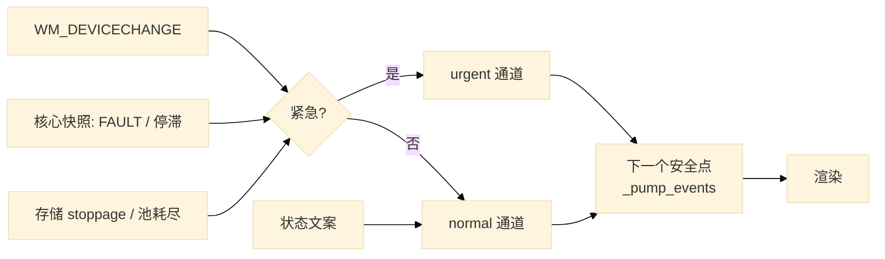

# 设计：事件投递与软中断

## 结论

**「有半个软中断」**：C++/coact 侧是真正的软中断（异步投递 + 优先级 + 在安全点抢占）；
Lua 侧不是，它是 **250 ms 轮询**。缺口不在「缺少软中断机制」，而在两点：

1. **软中断延迟被轮询周期钉死**：故障最坏 250 ms 可见，设备枚举兜底 ~1 s；模态/阻塞期间可能无限期不被服务。
2. **P2 层名义上有优先级队列，实际没有优先级**：`schedule_defer` 是纯 FIFO，且排在所有到期 luv 定时器之后，
   全树只有**一个**调用者。紧急与装饰性工作走同一条无差别队列。

对策是四条规则（§4），**不新增子系统**：把「异步得知」改为推送、把「紧急不被拒」写成可测不变量、
把「紧急任务必须有界返回」写成可操作约束。
**其中 R1（给 P2 加一级紧急通道）在实施前被对抗式复核推翻**——真实场景用了更直接的解法，
详见 §4 R1；这条记录保留下来，避免下次重新提出同一个方案。

**一条必须说清的界限**：软中断**不能**抢占阻塞在系统调用里的线程。我们诚实给出的保证只有
「**在下一个安全点有界延迟**」。因此规则是：**任何异常用例必须能指名它的安全点**（§3）；指不出来，
就说明它没有软中断可用，只能靠预留/闩锁/反压——不要假装有。

---

## 一、三层现状

| 层 | 机制 | 是不是软中断 | 证据 |
| --- | --- | --- | --- |
| coact / C++ | `PriorityClass`(High/Normal/Low) + `critical` + critical reserve | **是** | `coact/config.hpp:142-154`；`RxKick`、`Close` 均为 High+critical（`xcom_config.hpp:61-65`） |
| Win32 | `WM_DEVICECHANGE` / `WM_POWERBROADCAST` | **是中断源，无优先级** | `window.lua:821-838`；处理函数被禁止做设备 I/O，降级为「置标志 / 重臂轮询」 |
| Lua | `poll_status()` 250 ms 定时器 | **不是** | `window.lua:3638-3647`；核心→Lua **无任何推送通道** |

C++ 侧为什么算真软中断：它满足三条——**异步投递**（生产者不等待消费者）、**在安全点抢占**（Dispatcher
在处理完当前 action 后取下一个事件）、**有优先级次序**。`Close` 能重排到已排队的 `Open` 之前，
就是软中断语义的直接证据（`design-exception-matrix.md` §1.2）。

## 二、缺口（这才是「扛不住」的地方）

### 2.1 延迟 = 轮询周期

前端学到的一切都来自 250 ms 定时器。**没有任何核心→Lua 的推送**（已核实：ABI 无 notify/callback 注册，
`xcom_abi.cpp` 的 `callback_count` 是统计量，不是回调）。这意味着故障、停滞、掉线的最坏可见延迟是 250 ms，
设备枚举兜底是 ~1 s。

### 2.2 P2 有队列，没有优先级

`schedule_defer`（`window.lua:1952-1957`）是纯 FIFO，`_pump_events`（`window.lua:3801-3817`）先跑
`uv.run("nowait")` 再排空它。全树只有**一个**调用者（`window.lua:2627` 的 `_log_close_deferred`）——
「我们有一个 P2 优先队列」这句话目前是空的。

### 2.3 异步得知走「置标志等轮询」，不是推送

`_on_power_broadcast`（`window.lua:856-873`）已经做对了一半：重臂状态定时器到下一轮 + 请求帧。
设备变更应当照抄这个姿势，而**不是**只把端口列表标脏。规则：**异步得知就必须推送**。

## 三、安全点清单（关键：异常用例必须落到其中一行）

| 入口 | 跑 luv 定时器 | 排空紧急队列 | 位置 |
| --- | --- | --- | --- |
| 主消息循环 P0→P2 | 是 | 是（改造后） | `window.lua:3679-3703` |
| OFN 模态对话框钩子 | 是 | 是（复用同一 `_pump_events`） | `window.lua:_ensure_ofn_hook` |
| `script_engine` 内的嵌套 `uv.run("nowait")` | 是 | **否** | `script_engine.lua:166` |
| 核心内阻塞等待（`wait_for_free`、OVERLAPPED 读、`WriteFile`） | **否** | **否** | 不可抢占，见 §5 |

第三行是既有不一致：嵌套 pump 会触发定时器回调，若回调里 `schedule_defer`，任务要等外层循环的 P2 才跑。
影响小（UI 线程内自嵌套、同一迭代内收敛），但必须记录，不得当成已覆盖。

## 四、设计（三条规则，不新增子系统）

### R1 一通道两级 —— **经对抗式复核后未采纳**

原方案：把 `schedule_defer(job)` 扩为 `schedule_defer(job, urgent)`，urgent 先于 normal 排空。

**实施前复核推翻了这个方案，理由如下（记录下来，避免下次重新提出）：**

1. **没有调用点需要它。** 全树 `schedule_defer` 只有一个调用者（`window.lua` 的 `_log_close_deferred`），
   而它是装饰性的（写一行关闭日志）。为「紧急」加一层队列，等于为零个真实需求加基础设施。
2. **真正的紧急场景用了更好的解法。** 设备变更（本设计最主要的动机）最终实现为
   **专用的合并定时器**（`window.lua:_on_device_nodes_changed` + `_device_change_timer`），
   而不是把枚举工作放进 P2 队列。这个解法**严格更优**：
   - 合并是结构性的（固定窗口 `DEVICE_CHANGE_DEBOUNCE_MS = 500`，且**不重新计时**，因此不会被子节点消息洪流饿死）；
   - 枚举跑在定时器回调里，而定时器回调本来就在 `_pump_events` 的 P1 阶段被执行——**不需要新增通道就已经在安全点**；
   - 它天然满足 R4：枚举**不进入**那个会被其他任务排队的 FIFO 队列。
3. **R1 剩下的价值是「把 250 ms 轮询的 FAULT/停滞推早一帧」。** 这点收益不足以支撑一个新队列层级，
   且 `poll_status` 的 250 ms 本身已是可接受上界。

**结论**：R1 属于「先设计、后核实发现无必要」的典型。R2/R3/R4 保留（R2 已由设备变更实现满足，
R3 早已实现，R4 是可操作的约束）。若将来出现**真正需要抢占 FIFO 次序**的调用点，再回来评估 R1。

### R2 异步得知就必须推送

任何异步来源（WndProc、luv 回调、脚本宿主）得知状态变化时做两件事：

1. `schedule_defer(job, true)`；**并且**
2. 把权威状态轮询提前：`_status_timer:start(0, 250, cb)`（`_on_power_broadcast:867-869` 的既有惯例）。

**禁止**只置标志让 250 ms 轮询去发现。理由：置标志把延迟交还给轮询周期（§2.1），正是要消除的东西。

### R3 「紧急不被拒」写成不变量并测试

不扩容，只补断言与测试：

- 控制面：正常流量打满 High 分区时，critical 预留仍必须接纳紧急控制事件。
- 数据面：文件通道有 96 块预留下限，显示通道不得触碰（已落地，`rx_block_lane.hpp`）。
- 唤醒：`RxKick` 为 High+critical，正常 RX 洪峰不得使其被拒（已落地）。

这三条**已经实现**，缺的是把它们写成测试与不变量文档，而不是新增机制。

### R4 紧急任务必须在有界时间内返回（插拔/断电/点击/关闭的公共约束）

把「紧急」实现成「长任务」等于把紧急变成**卡住输入**。四个高频场景各自的落点与上界：

| 场景 | 事件来源 | 落点（安全点） | 延迟上界 | 硬约束 |
| --- | --- | --- | --- | --- |
| **插拔 USB** | `WM_DEVICECHANGE` | P0 → urgent job | 去抖 ~500 ms + 至多一帧 | 重枚举**不得**在 WndProc 内做；不得做设备 I/O |
| **MCU 断电（直连）** | 读失败 → FAULT | C++ 读线程 → 快照 | 250 ms；R2 推送后落在一帧内 | 无（C++ 侧已有软中断） |
| **MCU 断电（桥式）** | 无设备事件，线路静默 | 空闲超时（待定标） | 取决于阈值 | **绝不**说「设备没了」（`design-device-presence.md` §5） |
| **点击** | `WM_*BUTTON*` | P0，**当帧** | 0 | urgent 任务长阻塞会**吃掉 P0**——见下 |
| **关闭** | 用户点击 → `Close` 信号 | C++ High+critical | 与 critical 预留同阶 | **关闭路径不得依赖重枚举完成** |

两条由此推出的规则：

1. **重枚举不得逐口阻塞探测。** `list_ports({probe=...})` 的 `probe_port_busy` 默认关闭即为正解；
   若用户开启，它必须移到非泵线程或分片执行，**不得**在 urgent job 里逐口触碰。
2. **重枚举发现 open/close 正在飞行时必须直接放弃**，把列表留给下一轮，而不是排队等锁。
   否则用户点「关闭」会被一个正在枚举端口的任务挡在后面——这正是「影响了正常的打开关闭操作」。
   `_on_power_broadcast` 的既有姿势（不动端口、只让状态可见）是这条规则的样板。

**这条规则是 §五「必须能指名安全点」的可操作形式**：上表每一行都必须能答出「落在哪个安全点、上界是多少」。
答不出的场景没有软中断可用。

## 五、诚实界限：软中断不能抢占阻塞的系统调用

`wait_for_free(50U)`、OVERLAPPED `ReadFile`、`WriteFile` 都不是可抢占点。因此：

- 能给的最强保证是 **「在下一个安全点有界延迟」**，而**不是**「立即响应」。
- 安全点必须**可枚举**（§3 的表就是那份枚举）。
- 一个异常用例若指不出它落在哪个安全点，就必须改走预留/闩锁/反压，**不得**声称被软中断覆盖。

## 六、测试要求

- **R1**：urgent 任务先于 normal 任务执行；两级都在渲染前排空；队列为空时零开销。
- **R2**：`WM_DEVICECHANGE` 后**不经 250 ms 定时器**即可观察到状态更新（纯 Lua 断言，注入桩）。
- **R3**：正常流量打满时紧急控制事件仍被接纳（C++ 侧，用现有注入缝）。
- **安全点**：对 §3 表逐行断言「该入口确实排空了两级队列」；第三行断言「不排空」并注明是已知边界，
  防止后人误以为已覆盖。

## 七、未覆盖

- 嵌套 `uv.run("nowait")`（`script_engine.lua:166`）不排 P2——已知不一致，未修。
- 真实 `WM_DEVICECHANGE` 投递时机、真实模态期间的紧急事件延迟——列入任务 #11（Windows 实机验证）。
- 本设计**不**改 coact：其优先级模型已满足 R3，改动只会重复。
