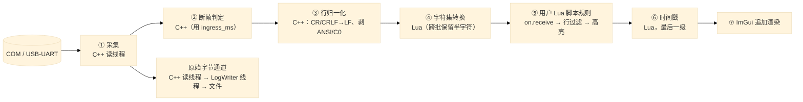

# 设计：接收区显示管线与落盘职责

## 结论

接收区显示的**每一级处理都有唯一归属与固定顺序**，落盘只由原始字节通道负责：



五条不可动摇的规则：

1. **落盘只有一条路**：原始字节（①）直送 LogWriter。**Lua 绝不对 RX 调 `log_append`**。
   该重复写入已修：RX 侧的 Lua `log_append` 已删除，`_final_drain` 只做显示 drain，
   文件不再出现每字节两份（原始 + 格式化文本）（`window.lua:1141-1147`、`:1575-1578`）。
2. **时间戳是显示管线的最后一级**，不是 C++ 格式化的一部分。理由见 §3——它一次解决四个问题。
3. **脚本规则在归一化与字符集转换之后、时间戳之前**：脚本必须看到合法 UTF-8、LF 分行的**纯数据**，
   看不到任何显示叠加层。
4. **脚本按「整行」调用**，不是按到达批次。依据是既有事实：`scripts/时间戳前缀.lua` 按 `\n` 切分、
   `绘制曲线-多条.lua` 按行解析 `"1.5,2.5\r\n"`、`数据截断.lua` 逐行截断——**整个插件库都是行导向的**；
   而本会话修掉的 `时间戳前缀.lua` 中途重复打戳缺陷，正是「脚本收到半行」这一根因的症状。
5. **每级只有一个所有者**，避免两处都做同一件事（当前的内置时间戳与 `时间戳前缀.lua` 插件
   功能重叠，同时开启即双重打戳，就是所有者不明的后果）。

---

## 一、逐级规格

| 级 | 归属 | 输入 → 输出 | 关键不变量 |
| --- | --- | --- | --- |
| ① 采集 | C++ 读线程 | 驱动字节 → 引用计数块 | 读线程不阻塞于显示；文件通道反压时不丢弃 |
| ② 断帧判定 | C++ | `ingress_ms` → 「本批是否新段」 | 只产出判定，**不注入任何文本** |
| ③ 行归一化 | C++ | 字节 → LF 分行文本 | CR 与 CRLF 都成 LF；剥离 ANSI/CSI/OSC 与其它 C0；跨块保持行首状态 |
| ④ 字符集 | Lua | 字节流 → UTF-8 | 跨批保留半个多字节字符，不得回退为原始字节 |
| ⑤ 脚本规则 | Lua | 整行 → 整行 | on.receive 变换 → 行过滤（可见性）→ 高亮；任一步失败不得吞掉整批 |
| ⑥ 时间戳 | Lua | 整行 + 间隔 → 带戳文本 | 仅当本段首行且间隔 ≥ 阈值时打一个戳 |
| ⑦ 渲染 | C++/ImGui | 文本 → 视口 | 不做任何内容变换 |

### 顺序理由（为什么是这个序）

- **③ 在 ④ 之前**：字符集转换要按字节做多字节切分，先归一化能保证它看到的是干净的 LF 流；
  若先转换，CR/ANSI 会混进多字节判定。
- **④ 在 ⑤ 之前**：脚本匹配的是中文/日文关键词。若脚本先跑，它看到的是 GB2312 原始字节，
  关键词匹配必然失败。**这是当前管线的既有顺序（`_process_rx_batch` 里 charset 先于
  `scripts.process_rx`），保留。**
- **⑤ 在 ⑥ 之前**：脚本必须看到纯数据。若时间戳先打，脚本既要在解析时跳过前缀，
  又要与用户自己打戳的脚本冲突。**这是需要改动的顺序（当前 C++ 在 ③ 阶段就打戳）。**
- **⑤ 内部顺序：变换 → 过滤 → 高亮**。过滤必须针对**最终文本**，否则用户按显示内容写的规则
  匹配不上；高亮必须针对**最终文本**，否则它标注的是即将被丢弃的行。

## 二、脚本按整行调用的状态机

```
待发缓冲（Lua 持有一段不完整行）
  ├─ 收到新批：按 LF 切分，除最后一段外全部是完整行 → 逐个送 ⑤
  ├─ 最后一段无终止符：留作待发缓冲（跨批）
  ├─ ② 判定为「新段」（间隔 ≥ 阈值）：强制冲flush待发缓冲，当作一个残缺帧送 ⑤
  ├─ 缓冲超过上限（建议 4 KiB）：强制 flush，避免设备不发终止符时无限增长
  └─ 会话关闭 / 脚本重载 / 清空：flush 或丢弃并计数（不得静默）
```

上限与强制 flush 是必须的：设备可能永远不发 `\n`（纯二进制流），此时「等整行」会永久扣住数据。
强制 flush 把这种情况变成「每次上限一个块」，而不是不显示。

## 三、把时间戳挪到最后一级：一次解决四个问题

当前 C++ 在 ③ 阶段把 `[HH:MM:SS.mmm] ` 写进显示缓冲。这一个位置造成四个问题，全部源于同一件事——
**时间戳混进了数据流**：

1. **污染落盘**：自动保存日志排空的正是这个缓冲，于是文件里带上了时间戳。
   而插件注释声称「只影响显示，原始日志记录未加前缀的字节」——两者矛盾。
2. **两个所有者**：内置打戳与 `时间戳前缀.lua` 插件做同一件事，同开即双重打戳。
3. **脚本被迫处理显示叠加层**：脚本若按行解析，必须先剥掉时间戳前缀。
4. **暂停/反压后时间不准**：C++ 在**格式化时刻**取 `GetLocalTime`；暂停显示时格式化被推迟，
   一整段突发会在恢复时被盖上恢复时刻的戳。这一点已由 `RxBlockRef.ingress_ms` 部分缓解，
   但没有解决「戳在数据里」的根因。

挪到最后一级后：落盘天然是纯字节；时间戳只有一个所有者；脚本看到纯数据；
打戳时刻由**真实入机时间**决定（`ingress_ms`），与格式化/排空时刻无关。

**接口代价（小且可增量）**：排空需要把本批的 `ingress_ms` 交给 Lua。
新增一个导出（**不改任何结构体布局，不动 `Snapshot=80` 钉扎**）：

```c
/* 与 xcom_drain_display 同语义，额外回填本批最早入机时间（毫秒，单调）。
   批量为空时 out_ingress_ms 不变。返回写入字节数，与旧接口一致。 */
XCOM_API uint32_t xcom_drain_display_ts(XcomHandle h, uint8_t* out,
                                        uint32_t capacity,
                                        uint32_t* out_ingress_ms);
```

Lua 侧按既有 `optional_export` 模式取用：新 DLL 走新接口，旧 DLL 退回旧接口并**关闭**
间隔判定（打戳功能降级为不可用，而不是打错时刻）。

## 四、变更清单（依赖顺序）

1. **修数据损坏（先做，独立）**：`window.lua:1436`（`poll_display`）与 `_final_drain` 删除对 RX 的
   `log_append`；仅保留 TX echo。同时删除 `xcom_core.hpp:386-392` 里把 `save_rejected_bytes`
   称为「RX 丢弃计数」的错误注释。
2. **C++：停止在 ③ 注入时间戳**，改为只产出「本批是否新段」与 `ingress_ms`；
   新增 `xcom_drain_display_ts`（⑤ 的接口在 §3）。
3. **Lua：把待发缓冲（§2）接在 ④ 与 ⑤ 之间**，让脚本收到整行。
4. **Lua：新增 ⑥ 打戳级**（间隔阈值取自设置，默认 200 ms，见任务 #27）；
   同时把 `时间戳前缀.lua` 降为示例并注明「与内置功能二选一」，避免两个所有者。
5. **Lua：⑤ 内部调整为 变换 → 过滤 → 高亮**，并确保任一步失败不吞整批（当前
   `_process_rx_batch` 的 pcall 失败会让该批从视口消失，只留 stderr）。

## 五、测试计划

- **纯 Lua**：管线顺序断言——构造一批 GB2312 中文 + CRLF，断言脚本收到的是 UTF-8 + LF + **无时间戳前缀**；
  断言半行跨批时脚本**不被调用**，补全后才调用一次；断言上限强制 flush 会触发一次调用。
- **落盘**：断言 RX 字节在文件中**只出现一次**（当前会两次）——这是本设计第一优先级的回归测试。
- **打戳**：断言间隔 < 阈值时不打戳、≥ 阈值时给首行打一个戳、暂停/反压恢复后按**入机时间**分档而非挤成零间隔。
- **失败路径**：脚本抛错时该批仍出现在视口（或明确计数），不得静默消失。

## 六、假设与未覆盖

- **A1**：TX echo 若要进同一个文件，必须走 LogWriter 的显式带标记写入，以保持单写者与文件内顺序；
  这需要 LogWriter 侧一个小接口，不在本设计第一步内。
- **A2**：整行缓冲会给「行很长」的设备引入延迟；上限 4 KiB 与强制 flush 是折中，
  若目标设备有超长行需重新定标。
- **A3**：⑤ 的高亮目前只在 ImGui 视口生效（不改文本），因此「高亮在过滤之后」在实现上是标注顺序，
  不改变输出文本——若将来高亮要改文本，顺序语义需重新确认。
- **未覆盖**：管线各级的处理都在 UI 线程，所以 UI 线程被卡住（脚本死循环、模态对话框）时
  整条管线停摆；这一层由「模态期间泵起来」与脚本执行预算（`script_engine.lua` 已有
  "exceeded its execution budget"）共同兜底，但**不能**替代「脚本必须快速返回」的约束。
