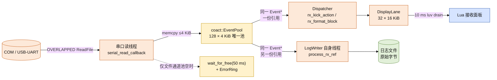
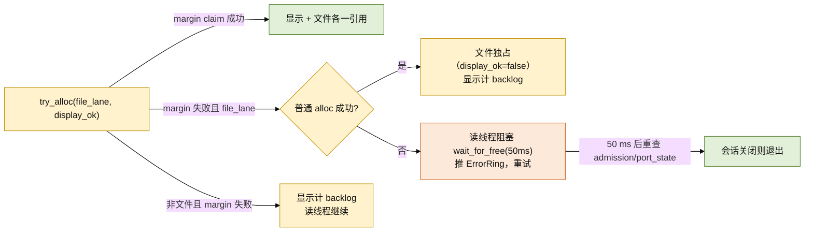

# 接收数据分发设计：单池引用计数、文件反压、显示背压

## 结论

接收字节在**串口读线程**这一处完成唯一一次拷贝，然后以引用计数扇出到两个消费者。
当前代码的实现要点：

- **单一事件池 + 引用计数共享块**。全链路只有一个 `coact::EventPool`（128 × 4 KiB），
  读线程从池里取一块写原始字节，显示路径与文件路径持有**同一个** `coact::Event*` 的
  两份引用（`event_ref_inc` / `event_gc`），最后一个释放者把块还给池。没有第二条
  512 KiB 缓冲，没有额外的逐字节拷贝。
- **文件通道硬预留**。文件通道用 `alloc_with_margin(sig, kRxRawReserveBlocks)` 保留
  96 块的下限，预留检查与空闲表弹出在同一临界区完成，显示通道无法吃掉文件保底。
- **文件通道以阻塞反压取代丢弃**。文件通道取不到块时读线程**阻塞**在
  `wait_for_free(50U)` 并重试，同时推一条 `ErrorRing`「storage stalled: RX file lane
  full」；RX 从不计入 `save_rejected_bytes`（该计数只服务 Lua 侧 `log_append` 的溢出）。
  **但这不等于已实现无损**：关闭边界竞态与「未打开日志」模式目前仍会丢且未计入任何
  丢失计数，见下文「已知缺口（实现未达标）」。
- **显示通道永不阻塞读线程**。显示拿不到块时计 `rx_pool_exhausted_bytes`。在**已打开
  日志**的模式下，其语义是**显示积压（DISPLAY BACKLOG）而非数据丢失**：文件通道持有
  权威的完整字节流。未打开日志时不成立（见「已知缺口 B」）。
- **残留下界如实声明**：除下文两个已知缺口外，驱动 FIFO 溢出（`CE_RXOVER` /
  `overrun_errors`）是本设计无法消除的丢失源。在缺口修复前，本设计**尚未**完全兑现
  「有界、可计数、可归因、文件通道无静默丢弃」；缺口一经修复即为此承诺。

> 旧方案（`RxDatalane` + 新增 `RxRawLane` 两条 512 KiB 通道、到达边界即丢弃计数、
> `RxCapacityWaiter`）均已废弃，不在代码中。本文与实现对齐。

---

## 资源与数据结构

资源常量集中在 `xcom_core/src/runtime/xcom_config.hpp`：

| 常量 | 值 | 位置 | 说明 |
| --- | --- | --- | --- |
| `kRxBlockCount` | 128 | `xcom_config.hpp:35` | 池块数，128 × 4 KiB = 512 KiB |
| `kRxBlockBytes` | 4096 | `xcom_config.hpp:36` | 单块载荷，等于串口读块大小 |
| `kRxRawReserveBlocks` | 96 | `xcom_config.hpp:50` | 文件通道硬预留；显示最多占 32 块 |
| `Signal::RxBlock` | 12 | `xcom_config.hpp:75` | 池块的逻辑事件标记；有效长度只存于 `RxBlockRef.len` |

块的类型与生命周期封装在 `xcom_core/src/foundation/rx_block_lane.hpp`：

- `RxBlockLane::Pool` = `coact::EventPool<kBlockSize, 128, HostSmpProfile, kBlockAlign>`
  （`rx_block_lane.hpp:107`）。`kBlockSize` 含 `coact::Event` 头，载荷紧随其后
  （`RxBlockLane::payload`，`:153`）。
- 块描述符 `RxBlockRef`（`:79`）：`event`（持有一份引用的池块）、`len`（有效字节）、
  `gen`（会话代）、`ingress_ms`（**入站时刻**的单调毫秒，非格式化时刻），16 字节，
  trivially copyable，可直接在 SPSC 环上搬运。

---

## 分发模型



两条交接环都在 `RxBlockLane` 内，各只有一个生产者（读线程）与一个消费者：
`display_ready_` → Dispatcher（`pop_display`，`rx_block_lane.hpp:203`），
`raw_ready_` → LogWriter 线程（`pop_raw`，`:212`）。由于两条环容量都等于池容量、
每个入环项都持一份引用，成功 claim 后 `try_push` 必成功（`publish` 内的断言，`:189`）。

---

## 引用计数与所有权

- 读线程 `try_alloc` 取块时 `ref_ctr == 1`（`rx_block_lane.hpp:132`）。
- `publish` 在显示与文件都要用时做**一次** `event_ref_inc`，把同一 `Event*` 分别投入
  两条环（`:175`）；文件独占（显示未取到）时保持单引用。
- 每个消费者在完成时恰好 `release` 一次：Dispatcher 在格式化后释放
  （`xcom_ao.cpp:345`），LogWriter 在写完（或 stop）后释放（`log_writer.cpp:411`）。
  最后一个释放者经 `event_gc` 把块归还池（`rx_block_lane.hpp:161`）。
- `release` 是多生产者安全的：任何消费者线程都可调用；只有存在等待者时才触碰
  互斥量并唤醒（`:163`），热路径保持无锁。
- **泄漏守卫**：多释放会在 `event_gc` 内触发断言中止；漏释放表现为 `pool.used()`
  永不回 0。teardown 时 `recv_ao` 的 deferred 引用、两条环的残留引用都被显式释放
  （`xcom_core.cpp:501`、`:522`、`:527`）。

---

## 硬预留与配额算术

`try_alloc`（`rx_block_lane.hpp:132`）对两条通道使用两个不同的入口：

```text
both lanes : pool.alloc_with_margin(sig, kRxRawReserveBlocks)  // 预留检查 + pop 同一临界区
file only  : pool.alloc(sig)                                   // 预留弹尽后文件下探
```

显示通道**只**走 `alloc_with_margin`。该入口要求 claim 之后池内空闲仍 ≥ 96，因此显示
最多同时持有 `128 − 96 = 32` 块；文件通道在 margin claim 失败后走普通 `alloc`，可下探
自己的预留，显示空闲时可使用全部 128 块。

峰值速率 921600 baud、8N1 + 起始位 = 10 bit/byte → 92160 B/s ≈ 90 KiB/s；一块 4096 B
覆盖约 44.4 ms（`xcom_config.hpp:44`）：

| 口径 | 块数 | 容量 | 时间 |
| --- | --- | --- | --- |
| 全池上界（文件独占，显示空闲） | 128 | 512 KiB | ≈ 5.8 s |
| 文件保底下限（显示已占满 32 块） | 96 | 384 KiB | ≈ 4.27 s |
| 显示可占份额 | 32 | 128 KiB | ≈ 1.42 s |

---

## 损失策略与账本



| 通道 | 行为 | 计数 | 是否数据丢失 |
| --- | --- | --- | --- |
| 文件（原始落盘） | 取不到块则阻塞反压（**设计目标不丢**；关闭边界仍有两个已确认缺口） | `rx_file_block_events` / `rx_file_blocked_ms` / `rx_backpressure_events`；`save_rejected_bytes` 对 RX 恒 0 | 否（缺口除外，见「已知缺口」） |
| 显示（渲染） | 取不到块立即继续读，计显示积压 | `rx_pool_exhausted_bytes` | **已打开日志时**否（文件持有完整流；面板滞后）；未打开日志时是（缺口 B） |
| 驱动 FIFO（OS/驱动所有） | 不可控，仅能检测 | `overrun_errors`（锁存位，每次读至多 1）+ `rx_loss_offset` | 是，不可恢复 |

几点必须如实说明：

1. **`rx_pool_exhausted_bytes` 只有在已有打开日志时才是「非丢失」**（`xcom_core.hpp:351`、
   `xcom.h:165`）。它表示显示通道因保留文件预留而跳过的字节数，此时文件日志是权威完整流。
   **未打开日志时该前提不成立**：这些字节没有任何持久副本，是真丢失，却仍只记入该字段
   （缺口 B）。
2. **面板不会自动回填。** 当前**不存在**任何「显示积压后从文件重建面板」的机制，
   面板只显示一个积压计数，不会重建缺失片段。故显示口径只承诺「不阻塞文件、可计数」，
   不承诺「显示无损」。
3. **`save_rejected_bytes` 对 RX 恒为 0。** 它只由 `sink_log_append`
   （`xcom_core.cpp:992`）在 Lua 侧 `xcom_log_append` 返回 `XCOM_ERR_FULL` 时累加，
   与 RX 文件通道无关。`xcom_core.hpp:392` 的旧注释称该字段服务 RX 丢弃，已与实现不符，
   属待清理的注释。
4. **50 ms 切片可避免挂死。** 阻塞式等待以 50 ms 为片（`xcom_core.cpp:1168`），
   每片结束重查 `callback_admission` 与 `port_state`（`:1162`），因此会话关闭能被及时
   观察到，读线程不会永久卡在池上空转。

### 已知缺口（实现未达标，修复中）

以下两处由对抗性复核确认，当前代码**尚未**兑现本节的无损承诺；修复落地前不得把文件
通道描述为无损。

- **缺口 A：关闭边界丢字节且无丢失计数。** 一次已在途的读回调可以在它读取
  `file_lane` 之后、`LogWriter` 完成最终 drain 并 `log_file.reset()` 之后，才把 raw 引用
  投入环（`log_writer.cpp:381-386`、`:404-407`）。writer 随后弹出该引用时文件已关闭，
  只推一条 `"raw RX logged with no open file"` / `"raw RX log tail unwritten at stop"`
  就释放并丢弃；而 `rx_bytes` 已在 `xcom_core.cpp:1197` 递增，故
  `accepted != persisted`，且没有任何计数记录这个差值。
- **缺口 B：未打开日志时 `rx_pool_exhausted_bytes` 掩盖真丢失。** 无日志打开时
  `file_lane=false`，显示通道拿不到块就把尾段计入 `rx_pool_exhausted_bytes`
  （`xcom_core.cpp:1172`、`:1213`）。这些字节没有被读进任何持久副本，是真丢失，
  但计数器的文档语义是「显示积压，非丢失」（`xcom_core.hpp:351`、
  `xcom.h:165-169`）。

修复方向：缺口 A 让关闭序列在最后一次 drain 之后拒绝迟到的发布，或在 writer 侧把未写
字节计入显式丢失计数；缺口 B 在没有权威文件副本时改计独立丢失计数，并把
`rx_pool_exhausted_bytes` 限定为「有日志打开」的语义。修复落地后本节应改写为对实现的
描述，而非缺口清单。

---

## 管线时序与 UI 解耦

接收链路有两条彼此独立的消费者：

- **显示链路**：读线程 → 池 → `display_ready_` → Dispatcher（收到静态 `Signal::RxKick`
  唤醒，`rx_kick_action` 每轮最多处理 4 块，`xcom_ao.cpp:328`）→ `DisplayLane`
  → Lua 的 10 ms luv drain（`window.lua:1419` 的 `poll_display`）。
- **文件链路**：读线程 → 池 → `raw_ready_` → LogWriter 自己的线程
  （`log_writer.cpp:722` 的循环消费 `pop_raw`）。

关键结构性质：**文件链路不经过 UI drain，也不经过 Dispatcher**。`LogWriter` 是专用
线程（Normal 优先级），对已接收的 Append 与 raw block 都做**写失败重试直至成功**
（`log_writer.cpp:388`、`:584`）；`Kind::Close` 先停止 raw 准入再 `flush_rx_before_close`
（`:624`），尽量让 Close 竞争期间已接收的字节仍落盘（在途发布的竞态见「已知缺口 A」）。
显示暂停、UI 卡顿、USB 重枚举都不会中断落盘。

本会话修复的历史缺陷：自动保存日志**曾**从 UI 线程 drain 写入，文件模块对话框一旦
阻塞消息循环超过缓冲窗口，文件侧就开始丢字节。现在的做法是双保险——文件通道与 UI
drain 解耦（结构性修复），同时给 Common Item Dialog 装上 `OFN_ENABLEHOOK`
（`window.lua` 的 `_ensure_ofn_hook` / `_save_file_dialog`），让模态对话框期间 drain
继续运行。注意：modal 修复只覆盖「对话框打开期间」的窗口，结构解耦才是根治。

> **实现偏差（待处理）**：`window.lua:1436`（`poll_display`）与 `_final_drain`
> 仍对 RX 调用 `xcom.log_append(self.core, text, #text)`，把**显示文本**写入与文件通道
> **同一个** `log_file`；文件通道 `process_rx_ref` 写的是**原始字节**。设计意图是 RX
> 只由文件通道落盘、Lua 的 `log_append` 仅保留 TX echo。当前 Lua 侧未同步，存在同文件
> 双写。这是代码侧遗留，须在 Lua 侧移除 RX 的 `log_append` 调用。

---

## 相对旧方案的变更

1. **删除双 lane**：`RxDatalane` + `RxRawLane`（各 128 × 4 KiB）不再存在；改为
   `RxBlockLane` 内单一 `EventPool` + 两条只传描述符的 SPSC 环
   （`xcom_core.hpp:515`）。
2. **删除 `RxCapacityWaiter`**：池空不再由独立 waiter 扣住读线程，改为文件通道在
   `RxBlockLane::wait_for_free` 上按 50 ms 片反压（`rx_block_lane.hpp:226`）。
3. **`RxBlockRef::seq` → `ingress_ms`**：字段语义由序号改为入站单调毫秒
   （`rx_block_lane.hpp:83`），供显示在积压数秒后格式化时仍能按到达时间做基于间隙的
   时间戳，槽位尺寸不变（16 字节）。
4. **`DisplayLane` 的空闲表由 `SpscRing<uint16_t>` 换成 `FixedPool`**
   （`xcom_core.hpp:329`）。原因：批次归还方有两个线程——Dispatcher 在零字节 / 发布
   失败路径归还（`xcom_ao.cpp:308`、`:315`），Lua drain 完成时也归还
   （`xcom_core.hpp:308`）。`SpscRing::try_push` 只做 `head_.store(h+1)`，双生产者会
   丢失更新，永久泄漏一个 16 KiB 批次 id，极端情况下重复发放同一 id。`FixedPool`
   的 tagged-CAS 头天然支持多生产者归还，消除了该 SPSC 契约违反。
5. **`save_rejected_bytes` 不再表示 RX 丢弃**：该字段只用于 Lua 侧 `log_append` 溢出，
   RX 文件通道的阻塞反压走 `rx_file_block_events` 等；关闭边界缺口未计入任何计数（见上）。

---

## 验证与未覆盖

- **host 单测**（`xcom_core/tests/rx_block_lane_test.cpp`，无 `windows.h`）：同一块两
  持有者按任意顺序释放后 `used()` 回 0；显示不排空时文件字节逐字节完整（raw loss 0）
  且显示积压计数上升；显示停摆只钉住 32 块非预留份额；文件停摆时读线程阻塞而非丢弃，
  消费方释放后立即解除。
- **未覆盖（本设计无法消除）**：驱动/器件在本工具读取之前丢弃的字节只能检测
  （`overrun_errors`）、无法恢复；连续磁盘不可写超过文件保底（96 块 ≈ 4.27 s）后读线程
  反压、驱动 FIFO 溢出。这两类丢失本设计不承诺消除。在「已知缺口」两处修复后，本设计
  保证的才是可检测、可计数、可归因、文件通道无静默丢弃。
