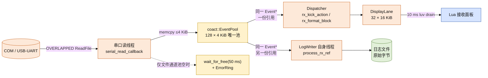
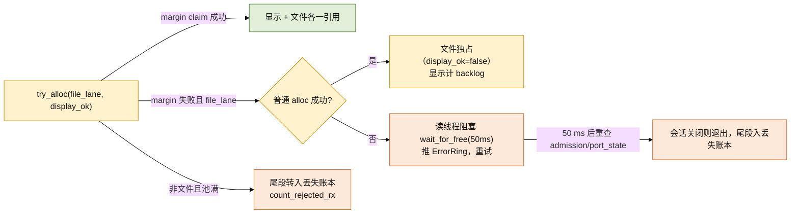

# 接收数据分发设计：单池引用计数、文件反压、显示背压

## 结论

接收字节在**串口读线程**这一处完成唯一一次拷贝，然后以引用计数扇出到两个消费者。
当前代码的实现要点：

- **单一事件池 + 引用计数共享块**。全链路只有一个 `coact::EventPool`（128 × 4 KiB），
  读线程从池里取一块写原始字节，显示路径与文件路径持有**同一个** `coact::Event*` 的
  两份引用（`event_ref_inc` / `event_gc`），最后一个释放者把块还给池。没有第二条
  512 KiB 缓冲，没有额外的逐字节拷贝。
- **文件通道按需预留**。只有当本段确实持有文件通道租约时，才用
  `alloc_with_margin(sig, kRxRawReserveBlocks)` 保留 96 块的下限，预留检查与空闲表
  弹出在同一临界区完成，显示通道无法吃掉文件保底；没有文件通道时预留为 0，显示通道
  使用整池（见「残余限制」）。
- **文件通道以阻塞反压取代丢弃**。文件通道取不到块时读线程**阻塞**在
  `wait_for_free(50U)` 并重试，同时推一条 `ErrorRing`「storage stalled: RX file lane
  full」。
- **RX 丢失统一入账**。任何已接收但未被任何消费者保留的字节，都经
  `CoreCtx::count_rejected_rx` 累加进 `metrics.save_rejected_bytes`，把
  `rx_loss_offset` 锚定到当时的 `rx_bytes`，并发出 `DiagEvent::kRxDrop`；UI 的
  「DATA LOSS」横幅读的正是这个账本。各条路径详见「损失策略与账本」。
- **显示通道永不阻塞读线程**。只有文件通道存在时，显示拿不到块才计
  `rx_pool_exhausted_bytes`，其语义才是**显示积压（DISPLAY BACKLOG）而非数据丢失**：
  文件通道持有权威的完整字节流。没有文件通道时读线程不进入该计数，拿不到块即计入
  上面的 RX 丢失账本。
- **残留下界如实声明**：驱动 FIFO 溢出（`CE_RXOVER` / `overrun_errors`）是本设计
  无法消除的丢失源，只能检测；另有收发与关闭路径上的残余限制，见「已知缺口与残余
  限制」。

> 旧方案（`RxDatalane` + 新增 `RxRawLane` 两条 512 KiB 通道、到达边界即丢弃计数、
> `RxCapacityWaiter`）均已废弃，不在代码中。本文与实现对齐。

---

## 资源与数据结构

资源常量集中在 `xcom_core/src/runtime/xcom_config.hpp`：

| 常量 | 值 | 位置 | 说明 |
| --- | --- | --- | --- |
| `kRxBlockCount` | 128 | `xcom_config.hpp` | 池块数，128 × 4 KiB = 512 KiB |
| `kRxBlockBytes` | 4096 | `xcom_config.hpp` | 单块载荷，等于串口读块大小 |
| `kRxRawReserveBlocks` | 96 | `xcom_config.hpp` | 文件通道持租约时的硬预留；无文件通道时为 0 |
| `Signal::RxBlock` | 12 | `xcom_config.hpp` | 池块的逻辑事件标记；有效长度只存于 `RxBlockRef.len` |

块的类型与生命周期封装在 `xcom_core/src/foundation/rx_block_lane.hpp`：

- `RxBlockLane::Pool` =
  `coact::EventPool<kBlockSize, 128, HostSmpProfile, kBlockAlign>`。
  `kBlockSize` 含 `coact::Event` 头，载荷紧随其后（`RxBlockLane::payload`）。
- 块描述符 `RxBlockRef`：`event`（持有一份引用的池块）、`len`（有效字节）、
  `gen`（会话代）、`ingress_ms`（**入站时刻**的单调毫秒，非格式化时刻），16 字节，
  trivially copyable，可直接在 SPSC 环上搬运。

---

## 分发模型



两条交接环都在 `RxBlockLane` 内，各只有一个生产者（读线程）与一个消费者：
`display_ready_` → Dispatcher（`pop_display`），`raw_ready_` → LogWriter 线程
（`pop_raw`）。由于两条环容量都等于池容量、每个入环项都持一份引用，成功 claim 后
`try_push` 必成功（`publish` 内的断言）。

---

## 引用计数与所有权

- 读线程 `try_alloc` 取块时 `ref_ctr == 1`。
- `publish` 在显示与文件都要用时做**一次** `event_ref_inc`，把同一 `Event*` 分别投入
  两条环；文件独占（显示未取到）时保持单引用。
- 每个消费者在完成时恰好 `release` 一次：Dispatcher 在格式化后释放
  （`xcom_ao.cpp` 的 `rx_kick_action`），LogWriter 在写完（或 stop）后释放
  （`log_writer.cpp` 的 `process_rx_ref`）。最后一个释放者经 `event_gc` 把块归还池。
- `release` 是多生产者安全的：任何消费者线程都可调用；只有存在等待者时才触碰
  互斥量并唤醒，热路径保持无锁。
- **泄漏守卫**：多释放会在 `event_gc` 内触发断言中止；漏释放表现为 `pool.used()`
  永不回 0。teardown 时 `recv_ao` 的 deferred 引用（`release_deferred_rx`）、raw 环
  的残留引用（`rx.drain_raw`，按丢失入账）与显示环的残留引用（`rx.drain_display`）
  都被显式释放。

---

## 硬预留与配额算术

`try_alloc` 对两条通道使用两个不同的入口；预留只有在文件通道持租约时才生效：

```text
file lane : pool.alloc_with_margin(sig, kRxRawReserveBlocks)  // 预留检查 + pop 同一临界区
            pool.alloc(sig)                                   // 预留弹尽后文件下探
display   : pool.alloc_with_margin(sig, 0)                    // 无文件通道时整池可用
```

文件通道持租约时，margin 入口要求 claim 之后池内空闲仍 ≥ 96，因此显示最多同时持有
`128 − 96 = 32` 块；文件通道在 margin claim 失败后走普通 `alloc`，可下探自己的预留。
没有文件通道时 margin 为 0，显示通道可使用全部 128 块。

峰值速率 921600 baud、8N1 + 起始位 = 10 bit/byte → 92160 B/s ≈ 90 KiB/s；一块 4096 B
覆盖约 44.4 ms（见 `xcom_config.hpp` 的配额注释）：

| 口径 | 块数 | 容量 | 时间 |
| --- | --- | --- | --- |
| 全池上界（文件独占，显示空闲） | 128 | 512 KiB | ≈ 5.8 s |
| 文件保底下限（文件通道活跃，显示已占满 32 块） | 96 | 384 KiB | ≈ 4.27 s |
| 显示可占份额（文件通道活跃时） | 32 | 128 KiB | ≈ 1.42 s |

上表是文件通道活跃时的口径；没有文件通道时显示独占整池（512 KiB ≈ 5.8 s），若此后
才打开日志，读线程会在预留无法立即满足时转为按块阻塞反压（见「残余限制」）。

---

## 损失策略与账本



| 通道 | 行为 | 计数 | 是否数据丢失 |
| --- | --- | --- | --- |
| 文件（原始落盘） | 取不到块则阻塞反压 | `rx_file_block_events` / `rx_file_blocked_ms` / `rx_backpressure_events` | 否；关闭边界的残余由写线程与停机入账路径计数 |
| 显示（渲染，文件通道活跃） | 取不到块立即继续读，计显示积压 | `rx_pool_exhausted_bytes` | 否（文件持有完整流；面板滞后） |
| 显示 / 无日志 | 取不到块即停止本轮，尾段入丢失账本 | `save_rejected_bytes`（经 `count_rejected_rx`） | 是 |
| 会话边界（提交、关闭、延迟块） | 未被消费的显示字节按来源 RX 长度入账，文件备份批次跳过 | `save_rejected_bytes`（经 `count_rejected_rx`） | 是 |
| 驱动 FIFO（OS/驱动所有） | 不可控，仅能检测 | `overrun_errors`（锁存位，每次读至多 1）+ `rx_loss_offset` | 是，不可恢复 |

几点必须如实说明：

1. **`rx_pool_exhausted_bytes` 只在文件通道活跃时增长。** `rx_ingress` 只在
   `publish` 返回「显示未取走」时累加它，而显示未取走只有在文件通道持租约、margin
   claim 失败（文件独占）时才会发生；没有文件通道时读线程在 `publish` 之前就转入
   丢失入账。其语义是显示积压，此时文件日志是权威完整流。字段注释见
   `xcom_core.hpp` 的 `Metrics::rx_pool_exhausted_bytes` 与 `xcom.h` 的
   `XcomSnapshot::rx_pool_exhausted_bytes`。
2. **面板不会自动回填。** 当前**不存在**任何「显示积压后从文件重建面板」的机制，
   面板只显示一个积压计数，不会重建缺失片段。故显示口径只承诺「不阻塞文件、可计数」，
   不承诺「显示无损」。
3. **`save_rejected_bytes` 是 RX 的统一丢失账本。** 已接收但未保留的 RX 字节经
   `CoreCtx::count_rejected_rx` 累加该字段，并把 `rx_loss_offset` 锚定到当前
   `rx_bytes`，随后发出 `DiagEvent::kRxDrop`。生产调用点五处：读回调的准入拒绝
   （`serial_read_callback`）、`rx_ingress` 的非 OPEN 守卫、无主尾段丢弃
   （`unowned_drop`）、会话提交时的显示重置（`reset_display_committed`，只计无文件
   通道的来源 RX 长度）、以及关闭/停机时释放的延迟块（`release_deferred_rx` →
   `count_deferred_display_loss`）。此外写线程在无打开文件或停机截断时也直接累加该
   字段（`process_rx_ref`），停机残留的 raw 块由 `drain_raw` 计数
   （`CoreState::shutdown`）。Lua 侧 `xcom_log_append` 队列满时也计入同一字段
   （`sink_log_append`，现用于 TX 回显等非 RX 写入）。
4. **50 ms 切片可避免挂死。** 阻塞式等待以 50 ms 为片
   （`rx_ingress` 的 `rx.wait_for_free(50U)`），每片结束重查 `callback_admission` 与
   `port_state`，因此会话关闭能被及时观察到，读线程不会永久卡在池上空转。

### 已知缺口与残余限制

以下为当前代码中仍未消除的缺陷，以及两处有意为之、非缺陷的残余限制。

**仍存在的缺陷（非本设计的 RX 分发路径，但影响端到端无损承诺）：**

- **发送路径在真实错误后仍可能留下截断帧。** 短写本身已不再丢尾部：后端
  （`serial_backend_win.cpp` 的 `write`）会从驱动停止处重发剩余字节，直到发满、遇到真实
  错误或连续零进展（双重有界：零进展即停，另有迭代上限）。但续传途中若遇到真实错误或
  超时，已经到达设备的字节无法收回，`sink_owner_write` 只能上报失败与确实已发送的字节数
  （错误信息标注 `truncated: N of M bytes sent`），因此设备仍可能收到截断帧。该路径依赖
  Win32 语义，本机不可验证（见「验证与未覆盖」）。
- **日志写线程的停机只能尽力取消。** `LogWriter::shutdown` 在 join 之前对该工作线程调用
  `CancelSynchronousIo`，使卡在同步 `WriteFile` 内的工作线程以 `ERROR_OPERATION_ABORTED`
  返回、回到循环头看到 `stopping` 后退出；被取消或部分落盘的批量记入
  `save_rejected_bytes`，不构成静默丢弃。但这是尽力而为：不支持取消的重定向器/驱动，以及
  `FlushFileBuffers`、`MoveFileExW`、`CreateFileW` 这些不可取消的调用，仍能让工作线程无界
  地拖住停机。彻底方案是让写线程的每个文件都走 overlapped I/O + `CancelIoEx`，与
  `serial_backend_win.cpp` 现有模式一致；该方案只能在可构建 Windows 的环境中落地并验证。
- **驱动 FIFO 溢出。** 驱动/器件在本工具读取之前丢弃的字节只能检测
  （`overrun_errors`），无法恢复；连续磁盘不可写超过文件保底后读线程反压，也会让驱动
  FIFO 溢出。这两类丢失本设计不承诺消除。

**残余限制（有意为之，非缺陷）：**

- **预留按文件通道租约生效。** `rx_block_lane` 只在文件通道持租约时施加 96 块预留；
  显示-only 会话因此使用整池（512 KiB），若此后才打开日志，读线程会在预留无法立即
  满足时回退到既有的按块阻塞反压——表现为 `rx_file_block_events` 上升，而非丢字节。
- **会话边界的显示丢失只计来源 RX 字节且跳过文件备份批次。** `reset_display_committed`
  用显示描述符里携带的来源 RX 长度入账，且只计无文件通道的批次；`count_deferred_display_loss`
  同理按来源 RX 长度计数。两条路径都以「避免重复计入已落盘字节」为准，因此记的是
  真实丢失而非全部被丢弃的显示字节。

---

## 管线时序与 UI 解耦

接收链路有两条彼此独立的消费者：

- **显示链路**：读线程 → 池 → `display_ready_` → Dispatcher（收到静态 `Signal::RxKick`
  唤醒，`rx_kick_action` 每轮最多处理 4 块）→ `DisplayLane`
  → Lua 的 10 ms luv drain（`window.lua` 的 `Window:poll_display`，显示定时器
  `start(10, 10, ...)`）。
- **文件链路**：读线程 → 池 → `raw_ready_` → LogWriter 自己的线程（循环消费
  `pop_raw`）。

关键结构性质：**文件链路不经过 UI drain，也不经过 Dispatcher**。`LogWriter` 是专用
线程（Normal 优先级），对已接收的 Append 与 raw block 都做**写失败重试直至成功**
（`log_writer.cpp` 的 `Kind::Append` 与 `process_rx_ref`）。`LogWriter::close` 先
`close_append_admission`（停止 raw 准入并等待在途租约归零），再提交 `Kind::Close`；
Close 处理内先 `flush_rx_before_close`，让 Close 竞争期间已接收的字节仍落盘。显示暂停、
UI 卡顿、USB 重枚举都不会中断落盘。

自动保存日志不经 UI 线程 drain 写入：文件通道与 UI drain 结构性解耦，因此文件模块
对话框一旦阻塞消息循环超过缓冲窗口，文件侧也不会丢字节。此外 Common Item Dialog 装上
`OFN_ENABLEHOOK`（`window.lua` 的 `_ensure_ofn_hook` / `_save_file_dialog`），让模态
对话框期间 drain 继续运行；modal 处理只覆盖「对话框打开期间」的窗口，结构解耦才是
根治。

RX 只由文件通道落盘：Lua 侧 `_final_drain` 与 `poll_display` 都只 drain 显示，不再对
RX 调用 `xcom.log_append`；`_echo_tx` 的 `log_append` 只写 TX 回显这一新内容，不构成
与文件通道的同文件双写。

---

## 相对旧方案的变更

1. **删除双 lane**：`RxDatalane` + `RxRawLane`（各 128 × 4 KiB）不再存在；改为
   `RxBlockLane` 内单一 `EventPool` + 两条只传描述符的 SPSC 环
   （`xcom_core.hpp` 的 `CoreCtx::rx`）。
2. **删除 `RxCapacityWaiter`**：池空不再由独立 waiter 扣住读线程，改为文件通道在
   `RxBlockLane::wait_for_free` 上按 50 ms 片反压。
3. **`RxBlockRef::seq` → `ingress_ms`**：字段语义由序号改为入站单调毫秒
   （`rx_block_lane.hpp` 的 `RxBlockRef::ingress_ms`），供显示在积压数秒后格式化时仍能
   按到达时间做基于间隙的时间戳，槽位尺寸不变（16 字节）。
4. **`DisplayLane` 的空闲表由 `SpscRing<uint16_t>` 换成 `FixedPool`**
   （`xcom_core.hpp` 的 `DisplayLane::buffers_`）。原因：批次归还方有两个线程——
   Dispatcher 在零字节 / 发布失败路径归还（`xcom_ao.cpp` 的 `rx_format_block`），
   Lua drain 完成时也归还（`xcom_core.hpp` 的 `DisplayLane::drain_into`）。
   `SpscRing::try_push` 只做 `head_.store(h+1)`，双生产者会丢失更新，永久泄漏一个
   16 KiB 批次 id，极端情况下重复发放同一 id。`FixedPool` 的 tagged-CAS 头天然支持
   多生产者归还，消除了该 SPSC 契约违反。
5. **`save_rejected_bytes` 现为 RX 的统一丢失账本**：已接收但未保留的 RX 字节经
   `count_rejected_rx` 累加该字段并发出 `DiagEvent::kRxDrop`；文件通道的阻塞反压另走
   `rx_file_block_events` 等，两者不混用。

---

## 验证与未覆盖

- **host 单测**（`xcom_core/tests/rx_block_lane_test.cpp`，无 `windows.h`）：同一块两
  持有者按任意顺序释放后 `used()` 回 0；文件通道活跃且显示不排空时文件字节逐字节完整
  （raw loss 0）且显示积压计数上升；显示停摆只钉住 32 块非预留份额；文件停摆时读线程
  阻塞而非丢弃，消费方释放后立即解除。
- **host 单测（丢失账本）**（`xcom_core/tests/rx_reject_count_test.cpp`）：
  `count_rejected_rx` 只对非零字节累加 `save_rejected_bytes` 并把 `rx_loss_offset`
  锚定到当前 `rx_bytes`；`reset_display_committed` 只计无文件通道的批次，
  `count_deferred_display_loss` 按显示描述符的来源 RX 长度计数。
- **本机不可验证（需 Windows 或真实硬件）**：`OVERLAPPED ReadFile` 的驱动投递、
  `CE_RXOVER` / `overrun_errors` 的实际触发、Common Item Dialog 的 `OFN_ENABLEHOOK`
  行为，以及真实串口上的短写与死盘表现，均无法在无 Windows / 硬件的 host 上验证；本文
  对这些路径的描述来自代码与注释，未在真机复现。
- **未覆盖（本设计无法消除）**：驱动/器件在本工具读取之前丢弃的字节只能检测
  （`overrun_errors`）、无法恢复；连续磁盘不可写超过文件保底（96 块 ≈ 4.27 s）后读线程
  反压、驱动 FIFO 溢出。
