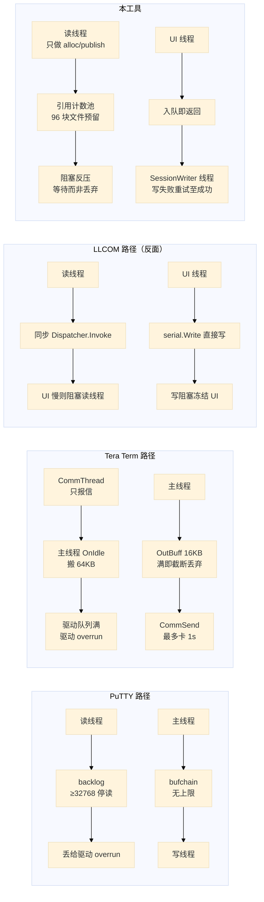

# 设计：与主流串口工具的设计对照

## 结论

本工具（`xcom_lua` + `xcom_core`）面向**单片机（MCU）开发者**。与主流串口工具逐维度对照后，
**在「异常的可观测性」与「数据不丢」两条主轴上明显领先**。

**「引导/复位能力落后」需修正**：对照总表显示，所查 GUI 终端（PuTTY / Tera Term / RealTerm /
CoolTerm / COMTool / LLCOM / XCOM）**同样没有**一键进 ROM/DFU 的复位时序，因此这项是
**绝对缺口（无人做到）**，不是「我们落后于同行」的竞争劣势——只有 Arduino IDE / esptool 这类
芯片专用工具才有。重枚举稳定身份亦仅在 tio / Serial Studio 有先例（见 `design-device-presence.md`），
本对照集内无人做到。两项是否实现应由本产品目标决定，不作为追赶对手的理由（结论见 §九）。

**领先项（有源码级对照证据）**

| # | 我们的做法 | 对照工具的做法 | 证据 |
| --- | --- | --- | --- |
| 1 | **线错误四类分开计数并呈现**（frame/parity/overrun/break） | **PuTTY 完全不读线错误状态**；**Tera Term 检测到但只清标志** | PuTTY 全仓 `ClearCommError`/`WaitCommEvent`/`SetCommMask`/`CE_*` **grep 0 命中**；Tera Term `CE_FRAME\|CE_RXPARITY\|...` **grep 0 命中** |
| 2 | **DCB 回读校验**：`SetCommState` 后再 `GetCommState` 比对，抓驱动静默取整 | 未见于所查工具 | 本仓库 `serial_backend_win.cpp:394`（读）、`:443`（校验） |
| 3 | **RX：引用计数池 + 96 块文件预留 + 阻塞反压**（读线程宁可等待磁盘也不丢字节）；**TX：有界 `TxBlockPool`，满则显式拒绝 `XCOM_ERR_FULL`/`BUSY`，绝不静默丢弃** | PuTTY TX 队列**无上限**（内存无界）；Tera Term 发送缓冲满即**截断丢弃** | 本仓库 `rx_block_lane.hpp`（`alloc_with_margin`）、`xcom_config.hpp:50`（`kRxRawReserveBlocks=96`）；TX 拒绝码见 `xcom.h`（`XCOM_ERR_FULL` 容量 / `XCOM_ERR_BUSY` 调度降级）与 `tx_submit_status.hpp`；PuTTY `handle-io.c:523`（`bufchain` 无界；`SERIAL_MAX_BACKLOG 4096` 是**死宏**）；Tera Term `ttcmn_buff.c:137-158` |
| 4 | **写操作在独立工作线程**，UI 不因阻塞写卡死 | Tera Term 在 UI 线程写，`WaitForSingleObject(..., 1000)` **最多卡 UI 1 秒**，超时后**假设已发送**（假成功） | 本仓库 `xcom_core.cpp:128-163`（`SessionWriter`，「offload the possibly blocking」）；Tera Term `commlib.c:1119-1136` |
| 5 | **模态对话框期间仍泵事件**（OFN 钩子复用同一套 `_pump_events`） | Tera Term 只在**协议传输对话框**里手工补了一次 `CommReceive` | `xcom_lua/ui/window.lua` 的 `_ensure_ofn_hook`；Tera Term `filesys_proto.cpp:808` |
| 6 | **掉线可观测 + 状态机重连** | PuTTY 串口无连接状态机（`serial_connected()` 恒真）；Tera Term **串口 I/O 错误完全不通知 UI**，重连只由热插拔触发 | PuTTY `serial.c:391-394`；Tera Term `commlib.c:662-668`（`_endthread()` 不发 `FD_CLOSE`），6 处 `FD_CLOSE` 全在 TCPIP/File/NamedPipe 分支 |
| 7 | **设备变更感知**：事件 + ~1 s 兜底轮询，按名保持选中，**OPEN 期间不扰动会话** | 见 `design-device-presence.md` | 同上 |
| 8 | **发送失败有归因**：错误码区分「容量耗尽」与「调度器降级」，且**绝不假成功** | Tera Term 超时假定成功；RealTerm 流控下 sendfile 卡住不退出 | 本仓库 `xcom_core/src/runtime/tx_submit_status.hpp`；Tera Term 同上；RealTerm feat #62 `[D]` |

**绝对缺口（非同行差距）**：无一键进 ROM/DFU 时序、无 1200 bps touch；重枚举找回靠注册表描述
而非 tio / Serial Studio 那样的稳定 ID——本对照集内亦无人做到，稳定 ID 先例仅见
`design-device-presence.md`。三项均需 Windows 实机标定或 ABI 扩展，**本轮均不采纳**（见 §九）。
设计草案见 `design-device-profiles.md`。

---

## 一、取证范围与证据等级

图例：**`[S]`** 真读了源码（给出 commit）｜**`[D]`** 官方文档/帮助/变更日志｜**`[I]`** 社区讨论或仅行为观察。

| 项目 | 仓库 / 来源 | Commit / 版本 |
| --- | --- | --- |
| PuTTY | `git.tartarus.org/simon/putty.git` | `37af6718`（`LATEST.VER` = 0.85 master） |
| Tera Term | `github.com/TeraTermProject/teraterm` | `4dc70349`（`TT_VERSION` 5.8.0 dev） |
| COMTool | `github.com/Neutree/COMTool` | 快照 `4b1e39e` |
| LLCOM | `github.com/chenxuuu/llcom` | 快照（无版本标记） |
| RealTerm | 官方帮助 + SourceForge tracker | 帮助覆盖 V2.0.0.x / V3.0.0.x–V3.21 |
| CoolTerm | ReadMe changelog + 官方论坛 | v1.0–v2.3.0（2024-11） |
| XCOM / SSCOM / UartAssist / YAT / tio / Serial Studio / Arduino / PlatformIO | 官方文档与手册 | — |

**闭源工具（RealTerm/CoolTerm/SSCOM/XCOM/UartAssist）无源码可得**。其条目标 `[D]`/`[I]`，
且**「未记载」不等于「不存在」**——搜索范围已在各项中披露。

---

## 二、对照总表

| 维度 | PuTTY | Tera Term | RealTerm | CoolTerm | COMTool | LLCOM | **本工具** |
| --- | --- | --- | --- | --- | --- | --- | --- |
| 线错误分类 | **无** `[S]` | 只清标志 `[S]` | 未记载 `[D-缺失]` | 区分 break/framing + RX LED 红闪 `[D]` | — | — | **四类分别计数并呈现** |
| 写阻塞隔离 | 每个 handle 输入/输出**两个子线程** `[S]` | UI 线程，最多卡 1 s 且假定成功 `[S]` | 未记载 | **独立 transmit 线程** `[D]` | 独立发送线程 `[S]` | **UI 线程直接 `Write`，会卡 UI** `[S]` | **独立 `SessionWriter` 线程** |
| TX 队列 | **无上限** `[S]` | 有界 16 KB，**满则截断丢弃** `[S]` | 未记载 | halted 态 + 可配阻断输入 `[D]` | 两个 list 当队列，**无上限** `[S]` | **无 TX 队列** `[S]` | **有界 + 显式拒绝（不静默丢）** |
| RX 背压 | backlog≥32768 **停读** `[S]` | 64 KB 满停读 `[S]` | 有界，满则**停处理** `[D]` | 循环缓冲 + 可配 size `[D]` | **无界增长** `[S]` | 同步 `Dispatcher.Invoke` **阻塞读线程** `[S]` | **引用计数池 + 预留 + 反压** |
| 掉线可见性 | 任何 I/O 错误 → 弹错关会话 `[S]` | **完全不通知 UI** `[S]` | 有 error light + hover 原因 `[D]` | 设备消失即关连接 `[D]` | LOSE 态但 `isConnected()` 仍返回 True `[S]` | 无拔出检测、无 LOSE `[S]` | **FAULT → 宽限窗 → 重连，全程可见** |
| 重连 | **无** `[S]` | 仅热插拔触发 `[S]` | 未记载 | 可配延迟 `[D]` | 10 ms 轮询端口重现 `[S]` | **无** `[S]` | 事件 + 1 s 兜底，按描述找回 |
| 模态期间收发 | 不适用 | 仅协议对话框手工补 `[S]` | 未记载 | 未记载 | 独立线程不受影响 `[S]` | 未记载 | **通用泵复用** |
| 发送可取消 | 无用户入口 `[S]` | **增量式，可暂停/中止** `[S]` | 有 sendfile timeout `[D]` | XOFF 时可取消文本传输 `[D]` | 无 `[S]` | 无 `[S]` | 协作式停止（**不打断在途写**） |
| 发送节流 | 无 | per-char/line/size `[D]` | per-char/line + repeats `[D]` | — | 固定 interval `[S]` | — | 固定 gap（**逐字符/逐行不采纳，见 §九**） |
| 故障注入/复位时序 | 无 | 无（宏可拼） | 无 | 无 | 无 | 无 | **无（对照集亦无人做到，见 §九）** |

---

## 三、数据路径：我们在哪条路上

**读法**：PuTTY 与 Tera Term 在缓冲满时都把丢数据的责任**推给驱动 overrun**；LLCOM 把背压
**推给 UI 线程**（读线程被 UI 阻塞，反而更容易溢出）；我们选择**阻塞反压**——宁可让读线程等待，
也不丢字节（见项目记忆「串口数据不丢失是最高优先级」）。

---

## 四、对照做法与本次复核

下表原标题为「可直接借鉴的做法」，**但逐条回代码核对后，7 条中 5 条本工具已实现**，不应再当作待办。

| 做法 | 来源 | 等级 | 对我们的价值 |
| --- | --- | --- | --- |
| 握手占用该引脚时**禁用对应按钮** | RealTerm 帮助明文 | `[D]` | 印证流控下 RTS 开关应禁用（#33 的判定） |
| 按状态 `EnableMenuItem(MF_GRAYED)` 灰化菜单 | Tera Term `vtwin.cpp:1214-1280` | `[S]` | 印证 ImGui 发送控件加 `BeginDisabled`（#37） |
| 区分 break 与 framing 并给**可见信号**（RX LED 红闪）+ 可配忽略 | CoolTerm changelog | `[D]` | 我们已分类计数，可补「可配忽略」 |
| 循环缓冲 + 可配 size | CoolTerm changelog | `[D]` | 我们已带 4 KiB 强刷上限与显示窗口 |
| 文件传输可取消 | CoolTerm（XOFF 时） | `[D]` | 印证「发送应可中途取消」而非阻塞 |
| `WM_DEVICECHANGE` 状态机 + 参数化重试 | Tera Term `vtwin.cpp:221-547` | `[S]` | 我们已实现同类（事件 + 兜底 + 去抖） |
| 发送排队 + 后台线程 + 完成回调 | COMTool `pluginItems.py:245-291` | `[S]` | 我们已有等价的 `SessionWriter` |

**复核结论（2026-09-13，逐条回代码）**：第 1、2、5、6、7 条**本工具已实现**，不是待办：

- 握手占用引脚时禁用对应按钮 → `xcom_imgui_bridge.cpp` 的 `rts_driver_owned`（`flow==1` 时
  `RenderToggles` 传 `enabled=false`）+ 核内 `xcom_set_lines` 在 RTS/CTS 下返回 `XCOM_ERR_UNSUPPORTED`；
- 按状态灰化 → `BeginDisabled(send_ok / connected)`（发送按钮、Multi 槽位、端口/格式组合框）；
- 循环缓冲 + 上限 → `[display] receive_window_bytes`（可配，16 KiB..1 MiB，默认 64 KiB；`receive_window_bytes`
  经 `imgui_bridge.clamp_receive_window`）+ `[display] auto_clear_bytes` + 4 KiB 行强刷上限；
  **即 CoolTerm 的「可配 size」本工具已具备**。（`XcomDisplayOptions.max_display_bytes` 由核忽略、
  未被 Lua 使用，不是此处的实际约束——见 §九 附注。）
- 文件传输可取消 → `scripts/send_file.lua` 的 Stop/Resume（协作式，不打断在途写）；
- `WM_DEVICECHANGE` 状态机 + 去抖 + ~1 s 兜底 → `ui/window.lua:859`（`DBT_DEVNODES_CHANGED`）
  与 `_poll_ports_backstop`；
- 发送排队后台线程 → `SessionWriter`（`xcom_core.cpp:128-163`）。

仅第 3 条「线错误**可配忽略**」为候选，经复核**不采纳**：它与「不得静默失败」冲突，且
break/frame 噪声正是 `window.lua` 静默线路告警所依赖的「对端断电」信号。第 4 条「缓冲**可配 size**」
实际**已具备**（见上）。详见 §九。

## 五、明确不要抄

| 反面做法 | 来源 | 等级 | 后果 |
| --- | --- | --- | --- |
| TX 队列无上限 | PuTTY `handle-io.c:523` | `[S]` | 设备停摆时内存无界增长 |
| 发送缓冲满即**截断丢弃**，且调用方忽略返回值 | Tera Term `ttcmn_buff.c:137-158` + `keyboard.c:1489` | `[S]` | 击键静默丢失 |
| 写超时后**假定已发送** | Tera Term `commlib.c:1119-1136` | `[S]` | 假成功——正是我们 #33 在消除的类别 |
| 串口 I/O 错误**不通知 UI**，重连只靠热插拔 | Tera Term `commlib.c:662-668` | `[S]` | 设备卡死但没拔 → 永不恢复 |
| UI 线程直接 `Write`，无 TX 队列 | LLCOM `Uart.cs:203` | `[S]` | 写阻塞冻结 UI |
| 接收回调同步 `Dispatcher.Invoke` | LLCOM `Logger.cs:24-34` | `[S]` | UI 慢则阻塞读线程 → 驱动溢出 |
| 接收显示无上限无界增长 | COMTool `dbg.py:876-882`；LLCOM | `[S]` | 长时间运行内存膨胀 |
| 定时发送掉线后**空转不停** | COMTool `dbg.py:640` | `[S]` | 状态栏刷屏 + 无意义调用 |
| 发文件失败不恢复按钮 | COMTool `dbg.py:465-472` | `[S]` | 卡在 "Sending file" |
| `sendfile` 遇流控阻塞不自恢复、不退出 | RealTerm feat #62（**未获答复的 tracker 请求，行为未证实**） | `[D-未证实]` | 用户无从得知卡在哪 |

---

## 六、三处更正：本次调研推翻了此前的结论

1. **「Tera Term 的 `sendfile` 阻塞且不可 abort」——不成立。**
   5.8 dev 的三条发送路径均为**消息循环驱动的增量式、可暂停/中止**：`SendMemContinuously`
   （`sendmem.cpp:336-509`）、`FileSend`（`filesys.cpp:359-480`）、宏命令经 `SendMemSendFile2`
   （`ttdde.c:804-820`）。旧的阻塞式实现位于 `#if 0`（`ttdde.c:806-813`）。
   「阻塞」只存在于**宏的视角**（宏解释器等待 DDE 完成消息）。
   **底层界限仍成立**（无人能抢占在途 `WriteFile`），但 **Tera Term 是「发送可取消」的正面证据，不是反面教材**。

2. **Tera Term 设置里的 `BuffSize` 不是串口缓冲**，而是终端**回滚缓冲**（`ScrollBuffSize`）。
   串口缓冲是编译期常量：`InBuffSize = 64 KB`、`OutBuffSize = 16 KB`（`tttypes.h:790-791`），**不可配**。

3. **CoolTerm 的「200 ms 轮询」与「按名选中」出处待核**：ReadMe 中 grep `poll` **0 命中**，
   实际来源为开发者论坛帖。`design-device-presence.md` 的相关单元格已降级为 `[D/I] 来源待核`。

---

## 七、无先例与各家矛盾

**无先例（自定决策，不是抄来的）**

- **掉线自动中止周期发送**：所查工具**均无**此行为；COMTool 被源码确证**明确不做**（`dbg.py:640` 循环只认勾选）。
- **发送中切页的规定**：无人明确规定（XCOM 有 4 页但未记载切页行为）。
- **「波特率不对」与「线路死了」的自动判别**：只有硬件分析仪（MSB-RS232、Eltima SPM、QE for UART）做协议扫描；
  **GUI 终端无先例**，阈值须实测标定。

**各家互相矛盾**

| 分歧 | 一方 | 另一方 |
| --- | --- | --- |
| 串口断开是否通知 UI | PuTTY：任何 I/O 错误 → 弹错关会话 | Tera Term：**完全不通知** |
| TX 队列有界性 | PuTTY：无界（赌内存） | Tera Term：有界但截断（赌丢数据） |
| 写阻塞隔离位置 | PuTTY：放进子线程（UI 零阻塞） | Tera Term：UI 线程 + 预检 + 1 s 超时 |
| 端口未开时的发送按钮 | COMTool：可点但静默 no-op | LLCOM：点击**自动开端口再发**；本工具：**禁用**（最保守） |
| 循环发送的实现位置 | SSCOM/XCOM/UartAssist：内建循环 | LLCOM：**做成 Lua 脚本**；tio/CoolTerm/minicom：全靠脚本 |

---

## 八、未验证

- **所有对照工具的已发布版本与所读 commit 的差异未逐版 diff**（PuTTY 读 master 0.85；Tera Term 读 5.8 dev）。
  老版本行号与行为可能不同。
- **闭源工具的内部实现**（RealTerm 线程模型、CoolTerm TX 队列结构、SSCOM/XCOM 的循环实现）**无法取得源码**，
  相关条目一律为 `[D]`/`[I]`。
- **本工具自身的 Windows 实机行为未验证**：本机无 MSVC、无真实串口；虽有 LuaJIT（16 个纯逻辑
  套件与 `lint_fields` 可在 Linux 跑绿），但无 `xcom_core.dll`，故核内 Windows 路径未被这些测试覆盖。
  见任务 #11（Windows 实机验证清单）。
- 本工具「一键进 ROM/DFU」「1200 bps touch」「重枚举稳定 ID」**尚未实现**，不在优势之列。

---

## 九、本次复核：采纳/不采纳结论

对 §二 / §四 / §五 逐条**回代码复核**后，结论如下（括号内为核验位置）。

| 缺口 | 对照做法 | 本仓库现状（已核） | 结论 | 理由 |
| --- | --- | --- | --- | --- |
| 一键进 ROM/DFU 时序 | 对照集**均无**（仅宏可拼） | 无；`design-device-profiles.md` 有草案 | **需用户决策** | 须实机标定毫秒边沿；需 ABI 暴露 VID/PID + `window.lua` 接线 |
| 1200 bps touch | 对照集**均无**（Arduino IDE / esptool 独有） | 1200 已在波特率表内，可手动 open/close | **需用户决策** | 效果依赖具体板子，须实机验证；且会主动扰动板子 |
| 重枚举稳定 ID | 仅 tio / Serial Studio（systemLocation） | 按 `description` 找回，歧义即放弃 | **需用户决策** | 需 SetupAPI 读 hardware_id → 扩 ABI；现描述匹配在本对照集内已属最好 |
| 发送节流（逐字符/逐行） | Tera Term / RealTerm | 多机发送与文件发送有固定 gap，单发无 | **不采纳** | 盲延时拖慢所有发送且掩盖真实流控问题；慢设备应靠流控/分块 gap |
| 线错误「可配忽略」 | CoolTerm | 四类分别计数并常驻 banner | **不采纳** | 会掩盖故障；break/frame 噪声正是「对端断电」信号（静默线路告警依赖它） |
| 循环缓冲「可配 size」 | CoolTerm | `[display] receive_window_bytes` 可配（16 KiB..1 MiB，默认 64 KiB）+ 4 KiB 行上限 | **无需采纳（已具备）** | 尺寸本就可配且两侧同源裁剪 |
| §四 第 1/2/4/5/6/7 条 | — | **均已实现** | **无需采纳** | 见 §四 复核段 |
| §五「不要抄」表 | — | 逐条复核成立 | **维持** | 仅 RealTerm #62 一行证据等级下调为 `[D-未证实]` |

**附注（本次复核新发现）**：`XcomDisplayOptions.max_display_bytes`（头文件注为默认 2 MiB）**在核内未被
读取、Lua 侧也未使用**，真实显示上限是 `[display] receive_window_bytes` 与 `auto_clear_bytes`。
该字段目前是 ABI 上的惰性字段；若日后要做「显示内存硬上限」，必须先在核内实现，不能依赖它已有约束力。

**一处代码级残余风险（本轮未改，须 `window.lua` 所有者处理）**：`Window:_resolve_reconnect_port`
只按「当前枚举里同描述端口恰好 1 个」判定，**未排除该端口在故障之前就已存在**的情形。
若机器上本就插着两个同型号适配器（注册表描述相同），拔掉原来那个后，剩下的那个会成为唯一描述
匹配并被静默打开——正是 `design-device-presence.md` 要避免的「打开错误设备」。修法：进入宽限窗时
快照当时的端口名集合，`_resolve_reconnect_port` 只接受**故障后新出现**的同描述端口；若匹配到的是
故障前已存在的端口，按「无法可靠匹配」返回 `matched=false` 并提示用户重选（不要打开它）。
