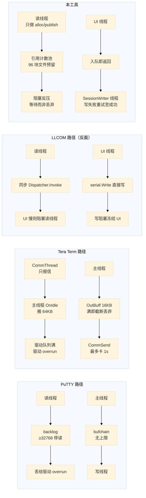

# 设计：与主流串口工具的设计对照

## 结论

本工具（`xcom_lua` + `xcom_core`）面向**单片机（MCU）开发者**。与主流串口工具逐维度对照后，
**在「异常的可观测性」与「数据不丢」两条主轴上明显领先**。

**「引导/复位能力落后」需修正**：对照总表显示，所查 GUI 终端（PuTTY / Tera Term / RealTerm /
CoolTerm / COMTool / LLCOM / XCOM）**同样没有**一键进 ROM/DFU 的复位时序，因此这项是
**绝对缺口（无人做到）**，不是「我们落后于同行」的竞争劣势——只有 Arduino IDE / esptool 这类
芯片专用工具才有。重枚举稳定身份亦仅在 tio / Serial Studio 有先例（见 `design-device-presence.md`），
本对照集内无人做到——**该项已落地**（v1.6 起按 `hardware_id` 优先匹配身份，§九 / §二表）；
一键进 ROM/DFU 与 1200 bps touch 两项仍未采纳，应由本产品目标决定，不作为追赶对手的理由（结论见 §九）。

**领先项（有源码级对照证据）**

| # | 我们的做法 | 对照工具的做法 | 证据 |
| --- | --- | --- | --- |
| 1 | **线错误四类分开计数并呈现**（frame/parity/overrun/break） | **PuTTY 完全不读线错误状态**；**Tera Term 检测到但只清标志** | PuTTY 全仓 `ClearCommError`/`WaitCommEvent`/`SetCommMask`/`CE_*` **grep 0 命中**；Tera Term `CE_FRAME\|CE_RXPARITY\|...` **grep 0 命中** |
| 2 | **DCB 回读校验**：`SetCommState` 后再 `GetCommState` 比对，抓驱动静默取整 | 未见于所查工具 | 本仓库 `serial_backend_win.cpp:394`（读）、`:443`（校验） |
| 3 | **RX：引用计数池 + 96 块文件预留 + 阻塞反压**（读线程宁可等待磁盘也不丢字节）；**TX：有界 `TxBlockPool`，满则显式拒绝 `XCOM_ERR_FULL`/`BUSY`，绝不静默丢弃** | PuTTY TX 队列**无上限**（内存无界）；Tera Term 发送缓冲满即**截断丢弃** | 本仓库 `rx_block_lane.hpp`（`alloc_with_margin`）、`xcom_config.hpp:50`（`kRxRawReserveBlocks=96`）；TX 拒绝码见 `xcom.h`（`XCOM_ERR_FULL` 容量 / `XCOM_ERR_BUSY` 调度降级）与 `tx_submit_status.hpp`；PuTTY `handle-io.c:523`（`bufchain` 无界；`SERIAL_MAX_BACKLOG 4096` 是**死宏**）；Tera Term `ttcmn_buff.c:137-158` |
| 4 | **写操作在独立工作线程**，UI 不因阻塞写卡死 | Tera Term 在 UI 线程写，`WaitForSingleObject(..., 1000)` **最多卡 UI 1 秒**，超时后**假设已发送**（假成功） | 本仓库 `xcom_core.cpp:128-163`（`SessionWriter`，「offload the possibly blocking」）；Tera Term `commlib.c:1119-1136` |
| 5 | **模态对话框期间仍泵事件**（OFN 钩子复用同一套 `_pump_events`） | Tera Term 只在**协议传输对话框**里手工补了一次 `CommReceive` | `xcom_lua/ui/window.lua` 的 `_ensure_ofn_hook`；Tera Term `filesys_proto.cpp:808` |
| 6 | **掉线可观测 + 状态机重连** | PuTTY 串口无连接状态机（`serial_connected()` 恒真）；Tera Term **串口 I/O 错误完全不通知 UI**，重连只由热插拔触发 | PuTTY `serial.c:391-394`；Tera Term `commlib.c:662-668`（`_endthread()` 不发 `FD_CLOSE`），6 处 `FD_CLOSE` 全在 TCPIP/File/NamedPipe 分支 |
| 7 | **设备变更感知**：事件 + ~1 s 兜底轮询，按名保持选中，**OPEN 期间不扰动会话** | 见 `design-device-presence.md` | 同上 |
| 8 | **发送失败有归因**：错误码区分「容量耗尽」与「调度器降级」，且**绝不假成功** | Tera Term 超时假定成功；RealTerm 流控下 sendfile 卡住不退出 | 本仓库 `xcom_core/src/runtime/tx_submit_status.hpp`；Tera Term 同上；RealTerm feat #62 `[D]` |

**绝对缺口（非同行差距）**：无一键进 ROM/DFU 时序、无 1200 bps touch；重枚举找回靠注册表描述
而非 tio / Serial Studio 那样的稳定 ID——本对照集内亦无人做到，稳定 ID 先例仅见
`design-device-presence.md`。三项均需 Windows 实机标定或 ABI 扩展，**本轮均不采纳**（见 §九）。
设计草案见 `design-device-profiles.md`。

---

## 一、取证范围与证据等级

图例：**`[S]`** 真读了源码（给出 commit）｜**`[D]`** 官方文档/帮助/变更日志｜**`[I]`** 社区讨论或仅行为观察。

| 项目 | 仓库 / 来源 | Commit / 版本 |
| --- | --- | --- |
| PuTTY | `git.tartarus.org/simon/putty.git` | `37af6718`（`LATEST.VER` = 0.85 master） |
| Tera Term | `github.com/TeraTermProject/teraterm` | `4dc70349`（`TT_VERSION` 5.8.0 dev） |
| COMTool | `github.com/Neutree/COMTool` | 快照 `4b1e39e` |
| LLCOM | `github.com/chenxuuu/llcom` | 快照（无版本标记） |
| RealTerm | 官方帮助 + SourceForge tracker | 帮助覆盖 V2.0.0.x / V3.0.0.x–V3.21 |
| CoolTerm | ReadMe changelog + 官方论坛 | v1.0–v2.3.0（2024-11） |
| XCOM / SSCOM / UartAssist / YAT / tio / Serial Studio / Arduino / PlatformIO | 官方文档与手册 | — |

**闭源工具（RealTerm/CoolTerm/SSCOM/XCOM/UartAssist）无源码可得**。其条目标 `[D]`/`[I]`，
且**「未记载」不等于「不存在」**——搜索范围已在各项中披露。

第二轮（2026-10-04，见 §十）把三个开源对照的版本钉死，并加入 pyserial 作为「能力基线」：
COMTool `4b1e39e`（2026-04-24，与第一轮同 commit，故第一轮的行号引用可直接复核）、
LLCOM `734d716`（2026-09-07，第一轮只记「快照」）、Serial Studio `70aeb50`（2026-10-02）、
pyserial `master` 的 `serial/serialwin32.py`（一次枚举，只作能力对照，不作 UI 对照）。

---

## 二、对照总表

| 维度 | PuTTY | Tera Term | RealTerm | CoolTerm | COMTool | LLCOM | **本工具** |
| --- | --- | --- | --- | --- | --- | --- | --- |
| 线错误分类 | **无** `[S]` | 只清标志 `[S]` | 未记载 `[D-缺失]` | 区分 break/framing + RX LED 红闪 `[D]` | — | — | **四类分别计数并呈现** |
| 写阻塞隔离 | 每个 handle 输入/输出**两个子线程** `[S]` | UI 线程，最多卡 1 s 且假定成功 `[S]` | 未记载 | **独立 transmit 线程** `[D]` | 独立发送线程 `[S]` | **UI 线程直接 `Write`，会卡 UI** `[S]` | **独立 `SessionWriter` 线程** |
| TX 队列 | **无上限** `[S]` | 有界 16 KB，**满则截断丢弃** `[S]` | 未记载 | halted 态 + 可配阻断输入 `[D]` | 两个 list 当队列，**无上限** `[S]` | **无 TX 队列** `[S]` | **有界 + 显式拒绝（不静默丢）** |
| RX 背压 | backlog≥32768 **停读** `[S]` | 64 KB 满停读 `[S]` | 有界，满则**停处理** `[D]` | 循环缓冲 + 可配 size `[D]` | **无界增长** `[S]` | 同步 `Dispatcher.Invoke` **阻塞读线程** `[S]` | **引用计数池 + 预留 + 反压** |
| 掉线可见性 | 任何 I/O 错误 → 弹错关会话 `[S]` | **完全不通知 UI** `[S]` | 有 error light + hover 原因 `[D]` | 设备消失即关连接 `[D]` | LOSE 态但 `isConnected()` 仍返回 True `[S]` | 无拔出检测、无 LOSE `[S]` | **FAULT → 宽限窗 → 重连，全程可见** |
| 重连 | **无** `[S]` | 仅热插拔触发 `[S]` | 未记载 | 可配延迟 `[D]` | 10 ms 轮询端口重现 `[S]` | **无** `[S]` | 事件 + 1 s 兜底，按描述找回 |
| 模态期间收发 | 不适用 | 仅协议对话框手工补 `[S]` | 未记载 | 未记载 | 独立线程不受影响 `[S]` | 未记载 | **通用泵复用** |
| 发送可取消 | 无用户入口 `[S]` | **增量式，可暂停/中止** `[S]` | 有 sendfile timeout `[D]` | XOFF 时可取消文本传输 `[D]` | 无 `[S]` | 无 `[S]` | 协作式停止（**不打断在途写**） |
| 发送节流 | 无 | per-char/line/size `[D]` | per-char/line + repeats `[D]` | — | 固定 interval `[S]` | — | 固定 gap（**逐字符/逐行不采纳，见 §九**） |
| 故障注入/复位时序 | 无 | 无（宏可拼） | 无 | 无 | 无 | 无 | **无（对照集亦无人做到，见 §九）** |

---

## 三、数据路径：我们在哪条路上

```mermaid
%%{init: {'theme':'base','themeVariables':{'fontFamily':'monospace'}}}%%
flowchart LR
  subgraph T1["PuTTY 路径"]
    A1["读线程"] --> A2["backlog<br/>≥32768 停读"] --> A3["丢给驱动 overrun"]
    B1["主线程"] --> B2["bufchain<br/>无上限"] --> B3["写线程"]
  end
  subgraph T2["Tera Term 路径"]
    C1["CommThread<br/>只报信"] --> C2["主线程 OnIdle<br/>搬 64KB"] --> C3["驱动队列满<br/>驱动 overrun"]
    D1["主线程"] --> D2["OutBuff 16KB<br/>满即截断丢弃"] --> D3["CommSend<br/>最多卡 1s"]
  end
  subgraph T3["LLCOM 路径（反面）"]
    E1["读线程"] --> E2["同步 Dispatcher.Invoke"] --> E3["UI 慢则阻塞读线程"]
    F1["UI 线程"] --> F2["serial.Write 直接写"] --> F3["写阻塞冻结 UI"]
  end
  subgraph T4["本工具"]
    G1["读线程<br/>只做 alloc/publish"] --> G2["引用计数池<br/>96 块文件预留"] --> G3["阻塞反压<br/>等待而非丢弃"]
    H1["UI 线程"] --> H2["入队即返回"] --> H3["SessionWriter 线程<br/>写失败重试至成功"]
  end
```

**读法**：PuTTY 与 Tera Term 在缓冲满时都把丢数据的责任**推给驱动 overrun**；LLCOM 把背压
**推给 UI 线程**（读线程被 UI 阻塞，反而更容易溢出）；我们选择**阻塞反压**——宁可让读线程等待，
也不丢字节（见项目记忆「串口数据不丢失是最高优先级」）。

---

## 四、对照做法与本次复核

下表原标题为「可直接借鉴的做法」，**但逐条回代码核对后，7 条中 5 条本工具已实现**，不应再当作待办。

| 做法 | 来源 | 等级 | 对我们的价值 |
| --- | --- | --- | --- |
| 握手占用该引脚时**禁用对应按钮** | RealTerm 帮助明文 | `[D]` | 印证流控下 RTS 开关应禁用（#33 的判定） |
| 按状态 `EnableMenuItem(MF_GRAYED)` 灰化菜单 | Tera Term `vtwin.cpp:1214-1280` | `[S]` | 印证 ImGui 发送控件加 `BeginDisabled`（#37） |
| 区分 break 与 framing 并给**可见信号**（RX LED 红闪）+ 可配忽略 | CoolTerm changelog | `[D]` | 我们已分类计数，可补「可配忽略」 |
| 循环缓冲 + 可配 size | CoolTerm changelog | `[D]` | 我们已带 4 KiB 强刷上限与显示窗口 |
| 文件传输可取消 | CoolTerm（XOFF 时） | `[D]` | 印证「发送应可中途取消」而非阻塞 |
| `WM_DEVICECHANGE` 状态机 + 参数化重试 | Tera Term `vtwin.cpp:221-547` | `[S]` | 我们已实现同类（事件 + 兜底 + 去抖） |
| 发送排队 + 后台线程 + 完成回调 | COMTool `pluginItems.py:245-291` | `[S]` | 我们已有等价的 `SessionWriter` |

**复核结论（2026-09-13，逐条回代码）**：第 1、2、5、6、7 条**本工具已实现**，不是待办：

- 握手占用引脚时禁用对应按钮 → `xcom_imgui_bridge.cpp` 的 `rts_driver_owned`（`flow==1` 时
  `RenderToggles` 传 `enabled=false`）+ 核内 `xcom_set_lines` 在 RTS/CTS 下返回 `XCOM_ERR_UNSUPPORTED`；
- 按状态灰化 → `BeginDisabled(send_ok / connected)`（发送按钮、Multi 槽位、端口/格式组合框）；
- 循环缓冲 + 上限 → `[display] receive_window_bytes`（可配，16 KiB..1 MiB，默认 64 KiB；`receive_window_bytes`
  经 `imgui_bridge.clamp_receive_window`）+ `[display] auto_clear_bytes` + 4 KiB 行强刷上限；
  **即 CoolTerm 的「可配 size」本工具已具备**。（`XcomDisplayOptions.max_display_bytes` 由核忽略、
  未被 Lua 使用，不是此处的实际约束——见 §九 附注。）
- 文件传输可取消 → `scripts/send_file.lua` 的 Stop/Resume（协作式，不打断在途写）；
- `WM_DEVICECHANGE` 状态机 + 去抖 + ~1 s 兜底 → `ui/window.lua:859`（`DBT_DEVNODES_CHANGED`）
  与 `_poll_ports_backstop`；
- 发送排队后台线程 → `SessionWriter`（`xcom_core.cpp:128-163`）。

仅第 3 条「线错误**可配忽略**」为候选，经复核**不采纳**：它与「不得静默失败」冲突，且
break/frame 噪声正是 `window.lua` 静默线路告警所依赖的「对端断电」信号。第 4 条「缓冲**可配 size**」
实际**已具备**（见上）。详见 §九。

## 五、明确不要抄

| 反面做法 | 来源 | 等级 | 后果 |
| --- | --- | --- | --- |
| TX 队列无上限 | PuTTY `handle-io.c:523` | `[S]` | 设备停摆时内存无界增长 |
| 发送缓冲满即**截断丢弃**，且调用方忽略返回值 | Tera Term `ttcmn_buff.c:137-158` + `keyboard.c:1489` | `[S]` | 击键静默丢失 |
| 写超时后**假定已发送** | Tera Term `commlib.c:1119-1136` | `[S]` | 假成功——正是我们 #33 在消除的类别 |
| 串口 I/O 错误**不通知 UI**，重连只靠热插拔 | Tera Term `commlib.c:662-668` | `[S]` | 设备卡死但没拔 → 永不恢复 |
| UI 线程直接 `Write`，无 TX 队列 | LLCOM `Uart.cs:203` | `[S]` | 写阻塞冻结 UI |
| 接收回调同步 `Dispatcher.Invoke` | LLCOM `Logger.cs:24-34` | `[S]` | UI 慢则阻塞读线程 → 驱动溢出 |
| 接收显示无上限无界增长 | COMTool `dbg.py:876-882`；LLCOM | `[S]` | 长时间运行内存膨胀 |
| 定时发送掉线后**空转不停** | COMTool `dbg.py:640` | `[S]` | 状态栏刷屏 + 无意义调用 |
| 发文件失败不恢复按钮 | COMTool `dbg.py:465-472` | `[S]` | 卡在 "Sending file" |
| `sendfile` 遇流控阻塞不自恢复、不退出 | RealTerm feat #62（**未获答复的 tracker 请求，行为未证实**） | `[D-未证实]` | 用户无从得知卡在哪 |

---

## 六、三处更正：本次调研推翻了此前的结论

1. **「Tera Term 的 `sendfile` 阻塞且不可 abort」——不成立。**
   5.8 dev 的三条发送路径均为**消息循环驱动的增量式、可暂停/中止**：`SendMemContinuously`
   （`sendmem.cpp:336-509`）、`FileSend`（`filesys.cpp:359-480`）、宏命令经 `SendMemSendFile2`
   （`ttdde.c:804-820`）。旧的阻塞式实现位于 `#if 0`（`ttdde.c:806-813`）。
   「阻塞」只存在于**宏的视角**（宏解释器等待 DDE 完成消息）。
   **底层界限仍成立**（无人能抢占在途 `WriteFile`），但 **Tera Term 是「发送可取消」的正面证据，不是反面教材**。

2. **Tera Term 设置里的 `BuffSize` 不是串口缓冲**，而是终端**回滚缓冲**（`ScrollBuffSize`）。
   串口缓冲是编译期常量：`InBuffSize = 64 KB`、`OutBuffSize = 16 KB`（`tttypes.h:790-791`），**不可配**。

3. **CoolTerm 的「200 ms 轮询」与「按名选中」出处待核**：ReadMe 中 grep `poll` **0 命中**，
   实际来源为开发者论坛帖。`design-device-presence.md` 的相关单元格已降级为 `[D/I] 来源待核`。

---

## 七、无先例与各家矛盾

**无先例（自定决策，不是抄来的）**

- **掉线自动中止周期发送**：所查工具**均无**此行为；COMTool 被源码确证**明确不做**（`dbg.py:640` 循环只认勾选）。
- **发送中切页的规定**：无人明确规定（XCOM 有 4 页但未记载切页行为）。
- **「波特率不对」与「线路死了」的自动判别**：只有硬件分析仪（MSB-RS232、Eltima SPM、QE for UART）做协议扫描；
  **GUI 终端无先例**，阈值须实测标定。

**各家互相矛盾**

| 分歧 | 一方 | 另一方 |
| --- | --- | --- |
| 串口断开是否通知 UI | PuTTY：任何 I/O 错误 → 弹错关会话 | Tera Term：**完全不通知** |
| TX 队列有界性 | PuTTY：无界（赌内存） | Tera Term：有界但截断（赌丢数据） |
| 写阻塞隔离位置 | PuTTY：放进子线程（UI 零阻塞） | Tera Term：UI 线程 + 预检 + 1 s 超时 |
| 端口未开时的发送按钮 | COMTool：可点但静默 no-op | LLCOM：点击**自动开端口再发**；本工具：**禁用**（最保守） |
| 循环发送的实现位置 | SSCOM/XCOM/UartAssist：内建循环 | LLCOM：**做成 Lua 脚本**；tio/CoolTerm/minicom：全靠脚本 |

---

## 八、未验证

- **所有对照工具的已发布版本与所读 commit 的差异未逐版 diff**（PuTTY 读 master 0.85；Tera Term 读 5.8 dev）。
  老版本行号与行为可能不同。
- **闭源工具的内部实现**（RealTerm 线程模型、CoolTerm TX 队列结构、SSCOM/XCOM 的循环实现）**无法取得源码**，
  相关条目一律为 `[D]`/`[I]`。
- **本工具自身的 Windows 实机行为未验证**：本机无 MSVC、无真实串口；虽有 LuaJIT（16 个纯逻辑
  套件与 `lint_fields` 可在 Linux 跑绿），但无 `xcom_core.dll`，故核内 Windows 路径未被这些测试覆盖。
  见任务 #11（Windows 实机验证清单）。
- 本工具「一键进 ROM/DFU」「1200 bps touch」「重枚举稳定 ID」**尚未实现**，不在优势之列。

---

## 九、本次复核：采纳/不采纳结论

对 §二 / §四 / §五 逐条**回代码复核**后，结论如下（括号内为核验位置）。

| 缺口 | 对照做法 | 本仓库现状（已核） | 结论 | 理由 |
| --- | --- | --- | --- | --- |
| 一键进 ROM/DFU 时序 | 对照集**均无**（仅宏可拼） | 无；`design-device-profiles.md` 有草案 | **需用户决策** | 须实机标定毫秒边沿；需 ABI 暴露 VID/PID + `window.lua` 接线 |
| 1200 bps touch | 对照集**均无**（Arduino IDE / esptool 独有） | 1200 已在波特率表内，可手动 open/close | **需用户决策** | 效果依赖具体板子，须实机验证；且会主动扰动板子 |
| 重枚举稳定 ID | 仅 tio / Serial Studio（systemLocation） | v1.6 起读 `hardware_id`（SPDRP_HARDWAREID 首串）优先匹配，仍要求是新出现的名字，歧义即放弃 | 已采纳（用户决策） | SetupAPI 只读注册表、不开端口；同型号共享 VID/PID 故歧义规则保留。见 `design-device-presence.md` §三 |
| 发送节流（逐字符/逐行） | Tera Term / RealTerm | 多机发送与文件发送有固定 gap，单发无 | **不采纳** | 盲延时拖慢所有发送且掩盖真实流控问题；慢设备应靠流控/分块 gap |
| 线错误「可配忽略」 | CoolTerm | 四类分别计数并常驻 banner | **不采纳** | 会掩盖故障；break/frame 噪声正是「对端断电」信号（静默线路告警依赖它） |
| 循环缓冲「可配 size」 | CoolTerm | `[display] receive_window_bytes` 可配（16 KiB..1 MiB，默认 64 KiB）+ 4 KiB 行上限 | **无需采纳（已具备）** | 尺寸本就可配且两侧同源裁剪 |
| §四 第 1/2/4/5/6/7 条 | — | **均已实现** | **无需采纳** | 见 §四 复核段 |
| §五「不要抄」表 | — | 逐条复核成立 | **维持** | 仅 RealTerm #62 一行证据等级下调为 `[D-未证实]` |

**附注（本次复核新发现，2026-10-03 收口）**：`XcomDisplayOptions.max_display_bytes`（头文件注为默认 2 MiB）
**在核内确实未被读取**，真实显示上限是 `[display] receive_window_bytes` 与 `auto_clear_bytes`。原先
Lua 侧也**没有**用它——`window.lua` 把 2 MiB 写死在 `self._max_display_bytes`，于是 `main.lua` 读的这个
配置键改了也无效；该处现已改为读配置转发（非正数回落到 2 MiB）。字段本身仍是 ABI 上的惰性字段：
若日后要做「显示内存硬上限」，必须先在核内实现，不能依赖它已有约束力。

**已关闭的代码级残余风险（2026-10-03 复核）**：本条原要求 `_resolve_reconnect_port` 排除「故障前就
已存在」的同描述端口。现已落地：宽限窗开启时快照 `_present_port_names()` 到 `_reconnect_known_ports`，
`_resolve_reconnect_port` 只接受**故障后新出现**的候选（`not (known and known[p.name])`），并按
`hardware_id` 优先、`description` 次级匹配；两个无序列号同型号适配器仍返回 `matched=false` 且不打开。
回归见 `xcom_lua/tests/test_reconnect_known_peers.lua` 与 `test_reconnect_port.lua`。

---

## 十、第二轮取证（2026-10-04）：重连、断帧、勾选项、线路电平、字号

本轮只回答第一轮没覆盖或没钉死的五件事。取证方式：浅克隆三个开源对照到本地、按
§一 的同一套 `[S]/[D]/[I]` 纪律逐条读源码（COMTool 与第一轮同 commit `4b1e39e`，
故第一轮的行号引用可**直接复核**，见 §十.7）；另取 pyserial 的 Windows 后端作**能力基线**
（它证明「这个信号在主流库里有现成 API」，而不是「某工具这么做」）。

**结论先行**

| 判定 | 项 | 依据 |
| --- | --- | --- |
| **领先** | 调制解调器输入（CTS/DSR/RLSD）可观测并提示对端掉电 | §十.4：集合内 4 个有源码的工具，能力一行可得，**无人使用** |
| **领先** | 占用归因（E5/E32 →「端口被其他程序占用」+ 列表标记）与不猜测 | COMTool 只弹 `str(e)`（`conn_serial.py:331-340`） |
| **领先** | 枚举节流：500 ms 去抖 + 1 s 兜底 | COMTool 断线期间 **10 ms 一次全量枚举**（`conn_serial.py:429-431`） |
| **领先** | 字号可配且对比度过 WCAG AA | LLCOM 固定 Consolas 10pt；COMTool 有 1..100 pt 但无对比度约束 |
| **落后（同轮已补）** | 勾选项仅在退出时落盘 → 进程被杀即丢失 | §十.3：三种极端写点；已补原子写 + 5 s 去抖 |
| **落后** | 字号只有 3 档 | COMTool `fontSize` 为 1..100 的自由值（`dbg.py:264-265,384`） |
| **建议采纳** | 身份改用**设备实例 ID**（含 USB 序列号） | §十.6：Serial Studio 把 serial 计入打分，Windows 的实例 ID 末段就是序列号 |
| **待定** | RX 延迟可调（读 tick 50 ms → 5 ms） | §十.6：Serial Studio 走「即时完成 + 大 FIFO」换低延迟 |

### 10.1 断线检测与自动重连

| 维度 | 本仓库 | COMTool `4b1e39e` | Serial Studio `70aeb50` |
| --- | --- | --- | --- |
| 触发条件 | 仅 `FAULT`（设备消失）→ 宽限窗 | 任何读异常 → `LOSE` | 仅 `ResourceError`，且用户开启 autoReconnect |
| 证据 | `design-device-presence.md` §四 | `conn_serial.py:447-461` | `UartPolicy.h:shouldAutoReconnect`（注释：drop 不报给用户的**唯一**情形） |
| 发现频率 | 500 ms 去抖 + ~1 s 兜底 | **10 ms** + 全量 `list_ports.comports()` | `m_reconnectTimer.setInterval(1000)`（`UART.cpp:135`） |
| 身份判据 | `hardware_id` → `description` → **歧义即放弃** | 仅 `p.device == com.port`（同名） | 五字段打分取最高（`SerialPortIdentity.cpp:190`），**无唯一性要求** |
| 掉线可见性 | 状态栏 + 宽限窗 + 恢复边界 | 一行 `Connection lose!` 后**自行静默重连** | 报给用户，除非自动重连接管 |

**核对结论**：我们与 Serial Studio 在「谁有权自动重连」上**独立同构**（只在设备消失 + 用户显式开启时静默恢复），
且我们的**歧义规则更严**——Serial Studio 取最高分即可打开，两台同型号适配器在场时它可能选错板子，
正是 `design-device-presence.md` §五 要避免的「打开错误设备」。
`UartPolicy::isFatalPortError` 额外为 by-id 节点/socat pty 豁免 `UnsupportedOperationError`：我们只从
端口列表取值、不接受任意路径，**N/A**。

### 10.2 「自动断帧」的三种实现

| 工具 | 机制 | 证据 | 是否持久化 |
| --- | --- | --- | --- |
| 本仓库 | `frame_gap_ms`（10..60000 ms，0=关） | `xcom_lua/assets/layout.toml` / 显示页 | 是（`[display] frame_gap_ms`） |
| COMTool | 空闲超时插换行：`receiveAutoLinefeed` + `receiveAutoLindefeedTime` | `dbg.py:896-911` | 是（`dbg.py:348`） |
| COMTool（批处理） | **波特率派生**：`oneByteTime = 1/(baud/(bytesize+2+stopbits))`，按 `2×oneByteTime` 收包 | `conn_serial.py:272,450` | 否（每次打开按参数算） |
| LLCOM | **无**自动断帧；靠「读到 `BytesToRead == 0`」+ 用户 `timeout`/`bitDelay` | `Uart.cs:254-286`；`DataShowPage.xaml` 勾选项只有 RTS/DTR/HEX/AddExtraEnter/ShowSymbol/DisableLog | 是（`timeout`/`bitDelay`） |

**可借鉴点**：COMTool 的批处理间隔由波特率算出，不需用户填 ms，且随参数变化自动适配。
我们的 `frame_gap_ms` 是人工值——一个「自动」档（同样公式）比再调一次默认值更有用（§十.6）。

### 10.3 「勾选项要记住」的三种极端

**同轮追加（2026-10-04 晚）**：用户要求「历史命令要能记住」+「翻页后之前的命令要能找到」。
对照 COMTool 的发送历史（`plugins/dbg.py`，同一 commit）：`sendHistory` 是**可见的 ComboBox**
（`dbg.py:123,136`，`activated` → 塞回发送框 `:451`），列表**持久化**在 `sendHistoryList`
（默认 `[]` `:101`，启动回填 `:370-372`，每次发送 `:693` `insert(0,...)`），去重是
`sendHistoryFindDelete`（`:685-690`）——**任意重复移到最前**，另有清空动作 `:454-455`。
我们采用同一形态（可见列表、最新在前、move-to-front 去重、写进 `[send] history.N`），
理由有二：① ImGui 明确断言 `CallbackHistory` 与 `Multiline` 互斥（`imgui_widgets.cpp:4739`
「它们都用上/下键」），而发送框是多行编辑器；② 可见列表比隐藏手势更符合「能找到」。
**差异（更优）**：COMTool 的历史随 `config.json` 一起在**版本不匹配时整份丢弃**（§10.3），
我们的 `history.N` 是普通 INI 键，升级不丢。

| 工具 | 存哪 | 何时写 | 代价 / 风险 |
| --- | --- | --- | --- |
| 本仓库（本轮前） | `config.ini`（`[display]`/`[multipage]`/`[font]`…） | **仅退出时** | 进程被杀/崩溃 → 本轮所有勾选丢失 |
| 本仓库（本轮后） | 同上 | 交互标脏 + **5 s 去抖** + 退出；写入为**临时文件 + 改名** | 崩溃最多丢 5 s；写盘不再是截断式 |
| COMTool | `%APPDATA%/COMTool/config.json`（`version: 3`） | 启动/退出 | **版本不匹配即整份丢弃**并另存 `.bak.<时间>.json`（`parameters.py:88-101`）→ 升级清空用户设置 |
| LLCOM | `settings.json` | **每个属性 setter 都整份重写**（含窗口几何，每次拖动一次） | 全量 `File.WriteAllText`（`Settings.cs:60-63`）；拖窗口即写盘 |
| Serial Studio | `QSettings` | 配置变更 | 持久化 baud/parity/dataBits/stopBits/flowControl/dtr/autoReconnect（`UART.cpp:106-116`） |

**结论**：写点是「退出 / 每属性 / 版本化整份」三种极端，我们取中间；COMTool 的**版本不匹配丢弃**
是我们明确不要的（`[multipage]` 等新键以默认值增量读取，旧配置不失效）。

### 10.4 线路电平：「端口还在、对端掉电」是否有人做

| 工具 | 能力是否可得 | 是否使用 | 证据 |
| --- | --- | --- | --- |
| pyserial（基线） | **可得**：`cts/dsr/ri/cd` = `GetCommModemStatus` + `MS_CTS_ON/MS_DSR_ON/MS_RING_ON/MS_RLSD_ON` | — | `serialwin32.py:389-414` |
| COMTool | 同上（pyserial） | **否**：按 `cts`/`dsr`/`cd`/`ri` 属性名全仓 grep 0 命中；`dsrdtr` 只作流控设置 | `conn_serial.py:235-238` |
| LLCOM | 可得（.NET `CDHolding/CtsHolding/DsrHolding`） | **否**：grep 0 命中（只有 `BytesToRead`） | `Uart.cs:257` |
| Serial Studio | 可得（`QSerialPort` pinout） | **否**：grep 0 命中；`UartPolicy` 只处理消失类错误 | `UartPolicy.h` |
| PuTTY / Tera Term | 参照 §二 第 1 行（Tera Term 只清 `CE_*` 标志） | 否 | 第一轮 `[S]` |

**结论**：第一轮的「无先例」从「我们没找到别人做」升级为**「集合内 4 个有源码的工具，该信号一行 API
即可得，无人读取」**。v1.7 的 `modem_lines` 仍是集合内唯一；同时必须继续如实标注覆盖边界
（3 线接法静默、DSR 单落且我方 DTR 未拉高时抑制，见 `design-device-presence.md` §三）。

### 10.5 本轮据此落地的修改（同轮完成）

1. **配置落盘改为「原子写 + 5 s 去抖」**（`core/config.lua` 的 `M.save`、`ui/window.lua` 的
   `_mark_config_dirty`/`_flush_config_save`）。动机直接来自 §十.3：原实现只在退出时写，
   进程被杀即丢；而写点若简单加密就必须先解决 `io.open(path,"wb")` **先截断**、
   半途崩就毁配置的问题。回归：`test_config` 12)（无 `.tmp` 残留、陈旧 `.tmp` 不遮蔽、失败不改既有文件）
   与 `test_multi_send` AK（真实交互才标脏、去抖只写一次、空闲帧不触发、退出前解除）。
2. 上一轮已落地、此处仅登记依据的：`[colors]` 全量生效（可读性）、占用识别三重门控（§十.1 对照）。

### 10.6 建议（按成本排序）

| # | 建议 | 依据 | 成本 | 状态 |
| --- | --- | --- | --- | --- |
| 1 | 断帧增加「自动」档 = `2 × (bytesize+2+stopbits) / baud` | COMTool `conn_serial.py:272,450` | 低（Lua 已知 baud/bits，不动 ABI） | 建议采纳 |
| 2 | 字号放开为自由值（现为 13/15/17 三档） | COMTool `fontSize` QSpinBox 1..100（`dbg.py:264-265`） | 中：自由字号要按需重建 atlas（本引擎支持懒烘焙，但需 `[font]` 键语义扩展） | 待定 |
| 3 | 重连身份改用**设备实例 ID**（`USB\VID_x&PID_y\<序列号>`） | Serial Studio 给 serial 单独权重 50（`SerialPortIdentity.cpp:34-36,200-205`）；Windows 实例 ID 末段即序列号，现只读 `SPDRP_HARDWAREID`（不含序列号） | **高**：`XcomPortInfo` **无 `struct_size` 字段**（`xcom.h` 的 LIST_BOUNDARY 警告），加字段＝断点 + 全部 Lua pin + 实机验证 | 需用户决策 |
| 4 | RX 延迟可调（`kReadTickTimeoutMs` 50 → 5） | Serial Studio 用 `MAXDWORD/0/0` 即时完成 + `SetupComm(baud*0.02)` 大 FIFO 换低延迟（`UART.cpp:60-79`），我们换 CPU | 低（一个常量） | 需用户决策 |

### 10.7 对第一轮结论的核对

1. **加强**：§七「无先例」按 §十.4 升级为源码级「集合内无人使用」。
2. **更正半句**：§五 的 COMTool「定时发送掉线后空转不停」——**空转成立**（`dbg.py:636-651` 的
   while 只看 `sendScheduled`，与连接状态解耦），但**「状态栏刷屏」不成立**：`sendData`
   （`dbg.py:651-656`）在 `isConnected()` 为假时整段跳过且无 else 分支，是**静默**空转。
3. **确认两条**：§五「发文件失败不恢复按钮」在 `dbg.py:466-477` 精确成立（只有 ok 分支
   `setText` + `setDisabled(false)`）；§五「接收显示无界增长」对 LLCOM 成立——其 `maxLength`
   （默认 10240）是**每包字节上限**（`Uart.cs:268` 的 `break`），不是显示保留上限，
   显示端 `MainTextBox.AppendText`（`DataShowPage.xaml.cs:108`）无任何裁剪。
