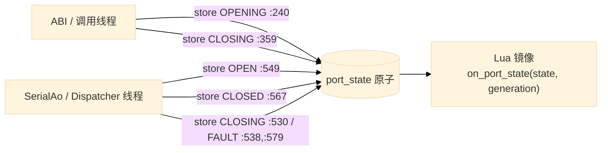
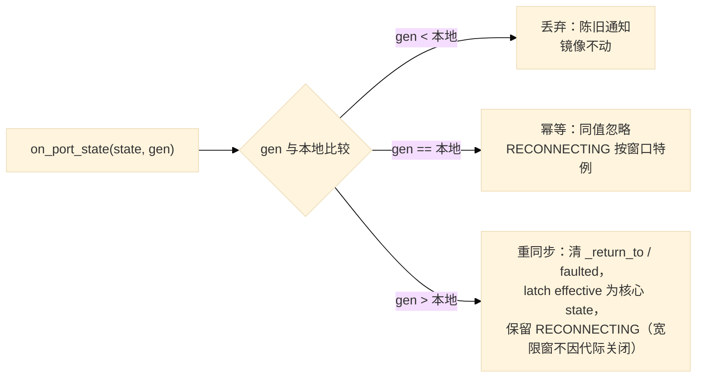

# 设计：C++ 与 Lua 状态机，以及正交的存活/健康轴

## 结论

三件事，按优先级：

1. **C++ 侧 `port_state` 曾是「两线程共写的 5 态原子」，而权威 HSM 只建模 3 态。**
   该问题已修复：SerialAo 现为 5 态表驱动 `serial_transition()`，`xcom_abi.cpp` 不再写
   `port_state`，原子降格为发布视图（`xcom_ao.hpp:152`、`xcom_ao.cpp:530`）。
   残留的直接 store 只剩故障兜底（`xcom_core.cpp:707/760/769/891`），单写者不变量尚未
   完全达成；本节保留为设计记录，实现状态见 §1 注。
2. **Lua 侧 `view_model.lua` 的镜像 HSM 方向正确**（显式迁移表 + 乐观意图 + 回滚 + generation 守卫）。
   generation 三档规则已补齐（`view_model.lua:287`）：**更大代做重同步而非丢弃，但保留宽限窗**，
   细节与理由见 §3.2。另外「谁权威」的契约散落在注释里，须写成明文契约。
3. **心跳/看门狗：MARGINALLY USEFUL，不移植 `osp::ThreadWatchdog`。**
   真缺陷是**归因错误**，不是缺少存活性。该文案已修正：`window.lua:2731` 现报
   `"storage stalled x%d: write thread not draining (disk slow or device gone)"`；
   读线程在文件通道阻塞时也已推一条 ErrorRing（`xcom_core.cpp:1159`）。剩余缺口在
   写线程自身：两条重试循环（`log_writer.cpp:388`、`:584`）每次重试不发任何信号，
   故磁盘慢与写线程卡死仍不可区分。约 40 行可修，不新增线程。
   铁律：**看门狗绝不自动杀线程或自动丢弃**——杀掉正在重试落盘的写线程等于构造性丢数据。

---

## 一、现状：三个状态机，两个真缺陷

> **实现状态（本次核对）**：本节的 C++ 部分已落地。`SerialAo` HSM 现为 5 态
> （`xcom_ao.hpp:152`），由表驱动 `serial_transition()` 唯一迁移（`xcom_ao.cpp:530`），
> `xcom_abi.cpp` 不再写 `port_state`。§1.1 的「SerialAo = 3 态」与 §1.2 的「ABI 写
> OPENING/CLOSING」是修复前状态。`xcom_core.cpp` 内 `sink_owner_open` 的两处直接
> `store(FAULT)` 已删除，失败开走 `OPENING --OpenDone--> FAULT` 单次发布；残留的
> 直接 store 只剩 §2.3 I1 列出的两处跨线程紧急兜底
> （`serial_fault_callback` 读线程 / `sink_owner_write` 写线程，且仅在 `Signal::Fault`
> 提交被拒时执行）。§2 的目标形态已落地，下文保留为设计记录。

### 1.1 三个状态机并存

| 位置 | 状态集 | 权威？ | 写者 |
| --- | --- | --- | --- |
| `SerialAo` HSM（`xcom_ao.hpp:152`） | 5：`S_CLOSED/S_OPENING/S_OPEN/S_CLOSING/S_FAULT` | 唯一迁移者 `serial_transition` | Dispatcher 线程 |
| 发布原子 `core->port_state`（`xcom.h:203-207`） | 5：含 `OPENING/CLOSING` | AO 的发布视图 | ABI 已不写；故障兜底仍在读/写线程 |
| Lua 镜像 `view_model.lua` | 6：5 态 + `RECONNECTING` | 自称镜像 | UI 线程 |

### 1.2 缺陷 A（修复前记录）：发布原子有两个写者，且权威不建模其中两态

`OPENING` 由 **ABI 线程**发布（`xcom_abi.cpp:240`），`CLOSING` 有两处（ABI `xcom_abi.cpp:359`、AO `xcom_ao.cpp:530`），
而 `OPEN`/`CLOSED`/`FAULT` 由 **Dispatcher 线程**的 `serial_do_*` 发布（`:549/:567/:538,:579`）。

后果有两类，都已被现实验证：

- **守卫读到「权威认为不可能」的值.** `serial_do_open` 开头读 `port_state` 会看到上一个态
  （`xcom_ao.cpp:511-517` 的注释记录了「从 Fault 重开被误判为失败」）。现在改用
  `last_open_result` 绕开——但同类读取仍在别处存在（`send_autosend_action:421`、
  `send_user_action:463`）。
- **跨线程写序竞争.** ABI 写 `OPENING` 之后 AO 才写 `OPEN`；若 ABI 的下一步骤
  （超时/取消路径）紧接着写 `CLOSING`，最终可见值取决于交错。`cancel_open`
  这个 exchange 标志就是为了打这个补丁（`xcom_ao.cpp:525`）。

### 1.3 缺陷 B（修复前记录）：镜像缺「更新代重同步」

`view_model.lua:218-283` 的 `on_port_state` 规则是：

- `generation < self.generation` → 丢弃（陈旧）；
- `generation == self.generation` → 幂等或按 RECONNECTING 特例处理；
- `generation > self.generation` → **按普通迁移处理**，只更新 `self.generation`。

第三档是漏洞。generation 在每次 open/close 各递增一次（`xcom_ao.cpp:544`、`:564`），
所以「代更大」等价于「核心已经走完了一轮我完全没观察到的 open/close」。
此时镜像可能仍持有 `_return_to`、`faulted`、RECONNECTING 等上一轮残留，
仅更新 generation 会把这些残留带进新会话。修正后的动作是**重同步**：丢弃本地上轮残留
（`_return_to`、`faulted`）、latch `effective` 为核心状态，但**保留 RECONNECTING**
（见 §3.2），而不是退出宽限窗。

---

## 二、目标设计：C++ 侧单权威 5 态机（已落地）

> `serial_transition()` 的表与动作已实现（`xcom_ao.cpp:530-582`）。失败开的两处直接
> store 已删除，故 `serial_publish()` 是常态下 `port_state` 的唯一写者；仅剩 §2.3 I1
> 列出的两处跨线程紧急兜底（`Signal::Fault` 提交被拒时才写）。

### 2.1 规则

1. **唯一权威**：`SerialCtx` 持有 AO 本地状态（5 态），`SerialAo` 是唯一迁移者。
2. **原子只写不读（作为守卫）**：`port_state` 是**发布视图**，只在一次迁移的**末尾写一次**。
   守卫一律读 `SerialCtx` 本地状态。这消除缺陷 A 的两类后果。
3. **ABI 不再是写者**：`xcom_open`/`xcom_close`/`xcom_set_lines` 只提交信号（`Signal::Open/Close`），
   不直接写 `port_state`。`OPENING` 由 AO 在迁移的**第一个动作**发布——这样「进入中间态」这件事
   也由权威发布，5 态全部有主。
4. **取消是事件，不是旁路写**：`cancel_open` 保留为「ABI 侧超时/关闭请求」的交接标志，
   但 AO 对它的反应写成迁移表里的一条边（`OPENING --cancel--> CLOSING`），而不是内联的
   `store` + 条件提交。

### 2.2 迁移表（建议形态）

单一函数 `serial_transition(ctx, event)`，表驱动，`switch` 带 `default`（符合 MISRA 约束），
无提前 return：

| 当前态 | 事件 | 动作 | 目标态 | 发布 |
| --- | --- | --- | --- | --- |
| CLOSED | Open | `owner_open` | 按 `last_open_result` 二选一 | OPENING（进入时）→ 见下 |
| CLOSED | Open 失败 | `diag_emit(kOpenFail)` | FAULT | FAULT |
| CLOSED | Open 且 `cancel_open` | `owner_close` 或提交 Close | CLOSING | CLOSING |
| FAULT | Open | 同 CLOSED/Open（**必须允许**，见 `:511-517`） | — | — |
| OPEN | Close | `owner_close`，generation++ | CLOSED | CLOSED |
| OPEN/CLOSED | Fault | `owner_close` 幂等释放句柄 | FAULT | FAULT |
| CLOSING | CloseDone | — | CLOSED | CLOSED |
| CLOSING | Fault | — | FAULT | FAULT |
| 任意 | 不支持的事件 | — | 不变 | 不发布 |

要点是 `FAULT --Open--> OPEN` 这条边必须显式存在（缺陷 A 的历史病灶正出在这里），
以及**进入中间态时立即发布**，而不是等迁移完成。

### 2.3 可测不变量

- **I1 单写者**：`port_state` 的 `store` 只允许出现在 AO 的单发布点
  `serial_publish()`（`xcom_ao.cpp:582`）；对 `xcom_abi.cpp` 加静态检查或 grep 门禁，
  禁止该文件出现 `port_state.store`。
- **I1 例外（仅两处，均为跨线程紧急兜底）**：`xcom_core.cpp` 的
  `serial_fault_callback`（后端读线程）与 `sink_owner_write`（SessionWriter 线程），
  仅在 `submit_control(Signal::Fault, critical=true)` 被拒（控制池耗尽）时直接
  `store(XCOM_PORT_FAULT)`。理由：两处运行在非 Dispatcher 线程，不能调用
  `serial_publish()`（它会写 Dispatcher 独占的 `SerialCtx::state`）；信号既已被拒，
  AO 动作不会运行，直接发布是让「句柄已死」可见的唯一手段。两处只写 `FAULT`，幂等。
  被 `stop_and_join` / `backend.close()` 的 join 时序约束（见 §2.4），旧会话线程在 AO
  发布更晚的 `CLOSED`/新 `OPENING` 之前已结束，故不会把陈旧 `FAULT` 覆盖到更新的状态上。
- **I2 发布单调**：任一时刻 `port_state` 的值都能在迁移表里找到一条来自已知前驱的边；
  评测用例注入「Open 成功但 AO 尚未发布」的窗口，断言不出现 FAULT 可见。
- **I3 无 stale 守卫**：AO 内所有守卫只读 `SerialCtx`，不读 `port_state`（可用 grep 门禁固化）。

### 2.4 I1 例外为何不会回写陈旧状态

两处例外只写常量 `FAULT`，且只在 `Signal::Fault` 提交被拒时执行，因此不可能发布
`OPENING`/`OPEN`/`CLOSING`/`CLOSED` 中的任意非 `FAULT` 值。真正的风险是：旧会话的后端线程
在 AO 已发布新会话的 `CLOSED`/`OPENING` 之后才写入 `FAULT`，把陈旧故障盖到新状态上。
该交错被 teardown 的 join 时序排除：

- 写线程：`sink_owner_close`（`xcom_core.cpp`）先 `abort_pending_write()` 再
  `writer.stop_and_join()`；`store` 是 `owner_write` 内的普通指令，必然完成于 join 返回之前，
  而 join 返回又早于 AO 发布 `CLOSED` 与下一次 `OPENING`。故 `store` happens-before 新状态。
- 读线程：`sink_owner_close` 先清 `callback_admission`（已进入的回调不再新起），再
  `serial_backend.close()` 回收读线程；正常的 close 契约会 join 读线程，`backend.close()`
  返回后 `store` 不可能仍在途。`:834` 已对「close 后回调仍活跃」的违约后端报错——只有在这种
  后端违约时该保证才失效，届时应视作后端缺陷而非状态机缺陷。

剩余的唯一交错是两处兜底 `store` 与 AO 自身的 `serial_do_fault` 发布 `FAULT` 并发：两者写
同一常量，且 `serial_do_fault` 有 `ctx.state != S_FAULT` 守卫，故观测值不变，无陈旧回写。

---

## 三、目标设计：Lua 侧镜像

### 3.1 权威契约（明文写下来，替代散落的注释）

- **端口事实**：核心权威。镜像不得自行发明端口状态。
- **恢复策略**：Lua 权威。宽限期时长、重试间隔、是否重连由 Lua 决定；Lua 只通过
  提交 `open`/`close` 请求影响核心，绝不直接改核心状态。
- **`RECONNECTING` 只存在于镜像**：核心在这一窗口内报的是 `FAULT`
  （`view_model.lua:70-73` 已明确映射）。镜像负责把 FAULT 降级显示为 RECONNECTING
  （`view_model.lua:235-236`）。

### 3.2 generation 三档规则（已实现）

第三档的具体动作（`view_model.lua:287`）：`_return_to = nil`、`faulted = false`，
把 `effective` latch 为核心 state，`generation = gen`，**但 `state` 仍是
`RECONNECTING`**。重同步的职责是防止**上一轮会话的残留**（回滚目标、fault 标志）
污染新会话，不是结束宽限窗。

必须保留宽限窗的原因：驱动自身的恢复是 `close()` 再 `open()` 序列，每一步都递增
generation，恢复候选必须持续 latch 到 `settle_recovering()` 提交为止。若「代更大就退出
RECONNECTING」，恢复候选会被提前销毁——实测会让既有的「settle 前仍为 RECONNECTING」
「候选期间发送保持禁用」等断言失败（view_model 用例 11/17/19/20/23/25）。

`_reconnect_deadline` 属于 `window.lua` 的重连策略，**不在 HSM 内**；HSM 不得为它
新增字段。`window.lua` 在状态离开 `RECONNECTING` 后自行清该截止时间。

### 3.3 保留现有优点

`intent_open`/`intent_close` 的**乐观意图 + `reject_open`/`reject_close` 回滚**
（`view_model.lua:122-168`）设计正确，保留：本地先显示 OPENING/CLOSING 以求即时反馈，
被核心拒绝时回滚到 `_return_to`。这是 UI 应有的行为，不是缺陷。

### 3.4 可测不变量

- 三档 generation 各一个用例：含「更大代 + RECONNECTING 残留」→ 清 `_return_to`/`faulted`
  但**仍为 RECONNECTING**，`settle_recovering()` 之前不提交、不退出宽限窗。
- 请求被拒 → 回滚到 `_return_to`，且 `_return_to` 被用后置空（防二次回滚到陈旧态）。

---

## 四、正交的存活/健康轴（心跳）

### 4.1 为什么不塞进端口状态机

「磁盘卡死」「写线程卡住」**不是端口状态**。把健康当端口态会让 `ALLOWED_OPEN/CLOSE`
表（`view_model.lua:85-87`）与超状态推导（`:100-111`）全部失真。健康是**正交维度**，
用独立的健康向量表达。

### 4.2 调研结论与最小方案

必须移植 `ThreadWatchdog` 的理由不成立，因为大部分价值已由计数器覆盖；缺口只有两处：

- **无数据流时无法区分「线路安静」与「线程卡死」**：`callback_count`/`rx_bytes`
  只在有字节时递增（`xcom_core.cpp:1147`、`:1213`）。
- **归因错误（真缺陷）**：磁盘慢与写线程卡死不可区分；横幅文案已改对（指名存储侧），
  但写线程重试循环仍不发信号，故用户看不到 Win32 错误码与路径。

最小方案（约 40 行，**不新增线程**，复用既有 250 ms UI 轮询 `window.lua:3277`）：

1. **写线程进入停滞时发一次信号**：在 `log_writer.cpp:388`（raw RX）与 `:584`
   （Append）的重试循环加 episode 标志，首次失败时推一条 ErrorRing（含 Win32 错误码与
   路径），恢复时推一条恢复说明。按 episode 计数而非每次重试，避免 50 ms 一次淹没环形缓冲。
   （读线程侧文件通道停滞的 ErrorRing 已在 `xcom_core.cpp:1159` 落地，此处补的是写线程自身。）
2. **修正文案**：`window.lua:2731` 已改为指名存储侧，即
   `"storage stalled x%d: write thread not draining (disk slow or device gone)"`。
   待第 1 项落地后，再让 `_poll_errors()` 弹出的写线程错误成为主因说明。
3. **（可选，最低价值）** 每线程 `last_beat_ms` 原子，随 250 ms 轮询喂一次，
   `port_state == OPEN` 且超过阈值无 beat 时提示；仅在核心侧判定，UI 只显示。

### 4.3 铁律

**绝不自动杀线程、绝不自动丢弃。** 杀掉正在重试落盘的写线程会丢弃它正在抢救的块——
即构造性丢数据，直接违反最高优先级。唯一安全动作是**报告**：
递增计数 + 推 ErrorRing，由用户决定。newosp 自己的回调也只 `ReportFault`/`ClearFault`，
无恢复动作。

---

### 4.4 已实现的限制（如实记录，勿当成已解决）

1. **卡在等待原语「内部」与健康 park 不可区分——现在「可见但仍不可判定」。** Dispatcher 空闲时是无限阻塞，
   实现用 `parked` 标志表示「存活」，因此一个**在等待内部丢唤醒而永久卡住**的 Dispatcher 仍被判为存活——
   那正是「无限空闲等待」安全论关心的失效模式。**已实现**的是把它变成可观测信号：
   `dispatcher_parked_since_ms` + `liveness_evaluate_park`，park 超过 60 s 时推一条 **XCOM_OK 信息级**、
   每集一次的 `"dispatcher parked N ms: idle (healthy) or lost wakeup - this signal cannot distinguish"`
   （`xcom_core.cpp:1558-1565`、`thread_health.hpp:56-63`）。**注意这不是修好**——信号本身**无法**区分
   「空闲健康」与「丢唤醒挂死」，它只把原本完全静默的 park 变成用户可见，交由数据侧（串口不再有数据）共同判断。
   要真正判定需在等待原语上引入超时哨兵，而那会重新引入已被删除的空闲唤醒，故**有意不做**。
2. **观察者是 UI 线程。** 健康检查跑在 250 ms 的 `xcom_get_snapshot` 轮询上；UI 线程自身卡住（脚本死循环、模态对话框）
   时不会有任何健康报告。这是可接受边界（此时用户已能察觉界面卡死），但**不是**「覆盖所有线程」。
3. **写线程「单次调用内长时间阻塞」是唯一的误报来源。** `write_all()` 现在**每次 `WriteFile` 前**都 beat
   （`log_writer.cpp:504`），所以「大文件拆成很多小写」的循环不再假报。**剩下唯一没有 beat 的区间就是一次同步
   `WriteFile` 调用本身**——平台没有 per-call 超时。因此一次 `WriteFile` 若在断连的网络重定向路径上阻塞超过
   2000 ms，仍会报一次停滞；此时线程**是活的**，真正的病因由存储停滞 episode 报告。
   两者并存是刻意的：**存活与进展是两个轴**。
   **注意**：不能说「2000 ms 对 50 ms 重试节奏有 40× 余量」——那 50 ms sleep **只在调用失败之后**执行，
   根本不约束单次调用的时长（该错误理由已从 `thread_health.hpp:44-53` 的注释中删除）。
4. **`DiagnosticAo` 的周期 tick 是死代码。** `Signal::Diag` 全树只有迁移表与路由引用，**没有任何提交者**
   （已核实），所以 `diag_tick_action` 永不执行——不要把周期诊断当成存在。健康检查因此挂在快照轮询上，
   而不是挂在那个永不执行的 tick 上。待决：删除该死路径，或补定时器（受空闲唤醒约束所限，倾向删除）。

## 五、变更清单（依赖顺序）

1. **[已完成]** `xcom_core/src/ao/xcom_ao.hpp` + `xcom_ao.cpp`：`SerialCtx` 本地 5 态；
   `serial_transition()` 表驱动迁移；5 态由 AO 发布。
2. **[已完成]** `xcom_core/src/abi/xcom_abi.cpp`：已无 `port_state.store`，改为提交信号。
   残留故障兜底 store 见 §1 实现状态注。
3. `xcom_lua/core/view_model.lua`：generation 第三档已实现为「重同步但保留 RECONNECTING」
   （§3.2）；把权威契约写成模块头注释仍待办。
4. `xcom_core/src/io/log_writer.cpp`：重试 episode 信号（ErrorRing，含错误码）仍待办。
5. `xcom_lua/ui/window.lua`：文案已修正（`:2731`）；横幅优先显示写线程错误待第 4 项落地。
6. `xcom_core/include/xcom/xcom.h` + `xcom_ffi.lua`：**不改**。健康/停滞信息走既有
   ErrorRing 与 `rx_backpressure_events`，避免 ABI 1.5→1.6 与 `Snapshot=80` 钉扎改动。

## 六、测试计划

- **C++（host，无 windows.h）**：迁移表逐边用例（重点 `FAULT --Open-->` 与 `OPENING --cancel-->`）；
  注入「Open 成功但未发布」窗口，断言不出现 FAULT 可见（I2）；grep 门禁断言
  `xcom_abi.cpp` 无 `port_state.store`（I1）。
- **Lua（纯 Lua 套件）**：generation 三档；「更大代 + RECONNECTING 残留」必须重同步；
  请求被拒回滚且 `_return_to` 置空。
- **写线程归因**：令 log 目标不可写，断言 ErrorRing 恰好推一条停滞 + 一条恢复（不是每条重试一条），
  且 `save_rejected_bytes` 保持 0（该字段不用于 RX 丢弃；关闭边界缺口的丢失计数器待补）。
- **文案**：纯 Lua 断言停滞横幅文本包含存储侧措辞、不含 "host not draining"。

## 七、假设与未覆盖

- **A1**：`port_state` 的既有消费者（Lua 镜像、`xcom_get_snapshot`）只关心 5 态取值，
  不关心写者是谁——已核对 `view_model.lua` 与 `xcom_abi.cpp:650` 附近，成立。
- **A2**：把 `OPENING` 的发布从 ABI 挪到 AO 会改变 `xcom_open` 超时窗口内可见的值时序；
  `xcom_abi.cpp:322/:347/:357` 有读 `OPENING` 的分支，迁移时须逐个核对语义（**需实机验证**）。
- **未覆盖**：驱动 FIFO 溢出仍不可恢复；写线程卡死超过文件通道容量（128×4 KiB ≈ 5.8 s，
  保底 96 块 ≈ 4.27 s）后读线程反压、驱动溢出——本设计保证的是**可归因、可见**，
  不是零丢失的物理保证。
