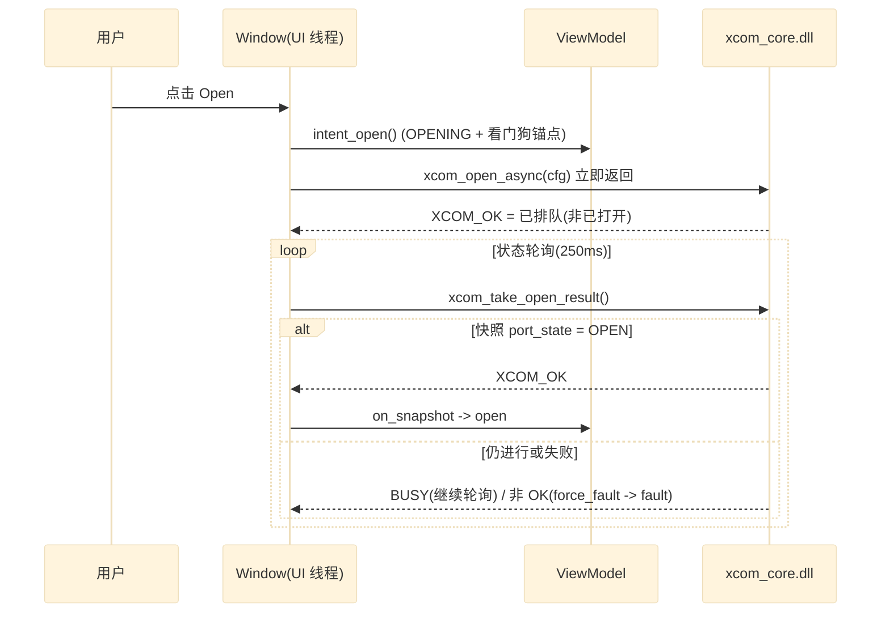
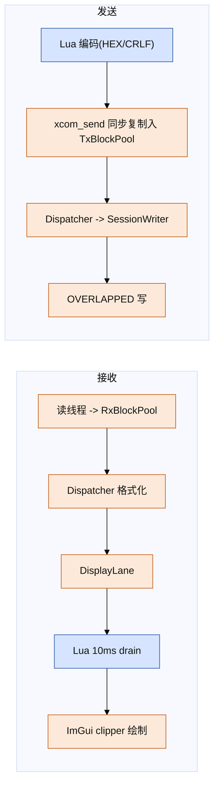
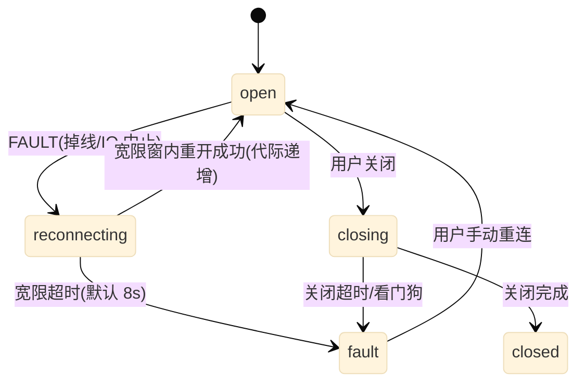
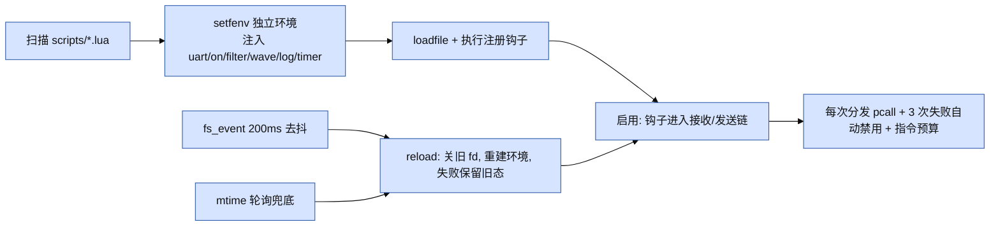

# XCOM 概要设计

| 项 | 值 |
| --- | --- |
| 对应架构 | `docs/architecture.md` |
| 平台 | Windows x64、LuaJIT 2.1、C++17、Dear ImGui + D3D11 |
| 读者 | 维护前端 Lua 模块、原生桥或扩展脚本的开发者 |

本文给出模块清单、关键数据结构与接口概要，以及四条主流程。细节以
`docs/architecture.md` 与源码为准。

## 模块清单

### Lua 应用层（`xcom_lua/`）

| 模块 | 一句话职责 |
| --- | --- |
| `main.lua` | 入口：解析 `package.path`（`.ljbc` 优先）、加载配置、构造窗口、进入消息循环 |
| `ui/window.lua` | 主窗口与状态驱动核心：消息分发、定时器、数据收发路径、配置落盘、故障恢复、脚本协调 |
| `ui/imgui_bridge.lua` | `xcom_imgui.dll` 的 FFI 绑定与控件缓冲所有权；符号探测以支持扩展导出 |
| `ui/win32.lua` | Win32 API/消息/常量 FFI 声明（窗口类、消息、GDI 辅助、UTF 转换） |
| `ui/controls.lua` | 原生 Win32 控件工厂与 ID 分配（供面板模块使用） |
| `ui/connection_panel.lua` | 原生连接参数面板（端口/波特率/校验/DTR/RTS/Open/Close） |
| `ui/receive_view.lua` | 原生接收视图（ANSI 分段着色、裁剪、滚底） |
| `ui/send_panel.lua` | 原生发送面板（单发 + 多发页签） |
| `ui/status_bar.lua` | 原生状态栏（端口状态、RX/TX、丢弃计数、时钟） |
| `core/view_model.lua` | 端口状态机镜像与互锁推导（纯 Lua，可单测） |
| `core/xcom_ffi.lua` | `xcom.h` 的 FFI cdef 镜像、DLL 加载、封套与结构体尺寸钉扎 |
| `core/config.lua` | `config.ini`（key=value）读写与类型解析（纯 Lua） |
| `core/charset.lua` | 接收字符集解码/转码（UTF-8/GB2312/BIG5/SHIFT-JIS/UTF-16） |
| `core/ansi.lua` | ANSI/SGR 流式解析与浅色 palette（纯 Lua） |
| `core/waveform.lua` | 波形/示波器数据环形缓冲与绘图数据准备 |
| `core/script_engine.lua` | 用户脚本加载、隔离、钩子、行过滤、高亮规则、热重载 |
| `core/serial_sim.lua` | 无硬件时的虚拟串口/回环模拟，驱动 UI 与脚本路径 |
| `core/bmp_writer.lua` | 截图/波形导出 BMP |
| `libs/` | vendored 纯 Lua 库（openresty、penlight、struct/json/crc 协议库） |
| `scripts/` | 用户可编辑插件脚本（LLCOM 兼容 API） |

说明：`ui/connection_panel.lua` 等原生面板模块由 `window.lua` require，主界面
渲染实际由 `ui/imgui_bridge.lua` 驱动的 ImGui 仪表盘承担。原生控件工厂是
遗留/兼容路径。

### Lua 测试（`xcom_lua/tests/`）

纯 Lua 套件覆盖 `view_model`、`ansi`、`charset`、`config`、`xcom_ffi` 布局钉扎、
脚本引擎、协议库、波形环、多发等；Windows 侧另有集成/压测（`integration_test`、
`serial_integration_test`、`stress_warp_ui`、`stress_fullband`）。

### 原生层

| 模块 | 一句话职责 |
| --- | --- |
| `xcom_lua/native/launcher/xcom_launcher.cpp` | Win32 启动器：隐藏控制台 spawn `luvjit.exe`，内嵌图标 |
| `xcom_lua/native/xcom_imgui/xcom_imgui_bridge.cpp` | ImGui/ImPlot 仪表盘、D3D11 后端、控件状态 `int*` 读写、脚本/Scope/Plugin 面板 |
| `xcom_core/src/abi/xcom_abi.cpp` | 版本化 C ABI 实现：校验、状态原子、错误环、参数封送 |
| `xcom_core/src/runtime/xcom_core.cpp` | CoreCtx、块池、SPSC 环、RxKickGate、SessionWriter、AO 实例化 |
| `xcom_core/src/ao/xcom_ao.cpp` | SerialAo/ReceiveAo/SendAo/AutoSendAo/DiagnosticAo 行为与状态转移 |
| `xcom_core/src/io/serial_backend_win.cpp` | Win32 OVERLAPPED 串口后端：读线程、写、行错误监控 |
| `xcom_core/src/io/log_writer.cpp` | 专用日志 writer 线程（有序 append、原子替换、完成轮询） |
| `xcom_core/framework/coact/` | 项目自有事件运行时（Dispatcher/AO/HSM/有界队列/SPSC/事件池） |

## 关键数据结构

### C ABI（`xcom.h` v1.5，跨语言权威）

| 结构 | 字段要点 | 尺寸 |
| --- | --- | --- |
| `XcomCreateOptions` | `struct_size`、`flags` | 8 |
| `XcomPortConfig` | `port`(borrowed `const char*`)、`baud_rate`、`data/stop/parity/flow`、`dtr/rts_enable` | 32 |
| `XcomDisplayOptions` | `hex_view`、`timestamp`、`pause_display`、`auto_clear_bytes`、`max_display_bytes` | 16 |
| `XcomSnapshot` | 收发/丢弃/背压/暂停等单调计数、`port_state`、`generation`、`display_pending`、v1.5 行错误四项与 `rx_sequence/rx_loss_offset/rx_backpressure_events` | 80 |
| `XcomError` | `code`、`source`、`message[256]` | 268 |
| `XcomPortInfo` | `name[64]`、`description[256]`、`busy` | 324 |

结果码 `XCOM_OK=0 … XCOM_ERR_UNSUPPORTED=-9`；`port_state` 取值
`CLOSED/OPENING/OPEN/CLOSING/FAULT`。

### Lua 侧

- `ViewModel` 记录：`{ hsm = { state, effective, faulted, generation }, snapshot = {...} }`。
  `ui_state()` 派生出 `params_enabled / open_enabled / close_enabled / send_enabled /
  autosend_enabled / connected / reconnecting / faulted / port_state_code`。
- `imgui_bridge` 实例：`port(char[128])`、`send(char[4096])`、`multi_text(8×512)`，
  以及每个控件的 `int[1]` 缓冲（波特率/位宽/校验/流控/DTR/RTS/HEX/时间戳/暂停/
  自动清屏/周期 …）。控件状态由 DLL 就地读写，Lua 直接读取。
- 配置表：`config.load(path)` 返回按 `[section]` 分组的 key/value，值解析为
  number/boolean/string；窗口几何、串口参数、显示选项、多发页、脚本启用列表
  与日志路径均持久化到 `config.ini`。
- 脚本记录：`{ path, env(setfenv 环境), recv_hook, send_hook, keeps, drops, rules,
  strikes, open_fds, ... }`；失败计数达阈值自动禁用。

## 接口概要

| 接口面 | 代表方法 | 说明 |
| --- | --- | --- |
| `xcom_ffi`（Lua→core） | `create/open/open_async/take_open_result/close/send/set_options/set_lines/set_auto_template/drain_display/get_snapshot/take_error/log_*/destroy` | 同步复制、非阻塞轮询；`list_ports(opts)` 可选用占用探测 |
| `imgui_bridge`（Lua→render） | `new/draw/render/frame/wndproc`、`append_receive/set_receive_text/get_receive_text`、`set_scripts/set_script_log`、`scope_push/scope_configure/scope_set_visible`、`set_highlight_rules`、`set_plugin_page/take_plugin_events`、`take_script_events/take_script_command/take_editor_save` | 均以固定签名导出，缺失符号降级 |
| `ViewWindow`（`window.lua`） | `core_open/core_close/core_send`、`poll_display/poll_status`、`render_imgui/request_frame`、`_process_rx_batch/_append_imgui_receive/_flush_imgui_receive`、`dispatch/on_close` | 状态驱动；改变可见状态即 `request_frame` |
| `ViewModel` | `intent_open/intent_close/reject_*/force_fault/enter_reconnecting/reconnect_timeout/settle_recovering/on_snapshot` | 纯逻辑，Linux 可单测 |
| `script_engine` | `new/load/enable/disable/reload/pump/on_receive/on_send`、`filter.keep/drop`、`rules.*` | `pcall` 隔离 + 指令预算 + 热重载 |

## 主要流程

### 打开串口（异步 + 看门狗）

配置在 OPEN 前可编辑，OPEN 后由状态机互锁禁用；DTR/RTS 变更在打开时经
`EscapeCommFunction` 钉住，打开后可用 `xcom_set_lines` 热切换。

### 收发数据

接收批次保持原始字节交给显示；时间戳在合并行时插入，避免行中途注入。发送
成败经快照/错误环异步回报，不回滚已入队数据。

### 故障恢复（断线/ROM 模式重枚举）

`reconnecting` 仅存在于 UI HSM，对 ABI 仍映射为 FAULT；窗口内 Core 报告的
FAULT 快照被降级保留，恢复候选需来自**新代际**才被接纳。宽限时长可配
（`[serial] reconnect_grace_ms`）。

### 脚本加载与热重载

脚本不是安全沙箱（同进程信任模型），提供的是故障隔离：单脚本失败不拖垮
宿主，重载不残留旧环境资源。启用/禁用状态与脚本列表在 DLL 侧渲染，事件
经 `take_script_events` / `script_take_command` / `take_editor_save` 回到 Lua。
