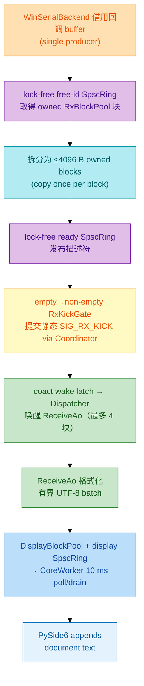
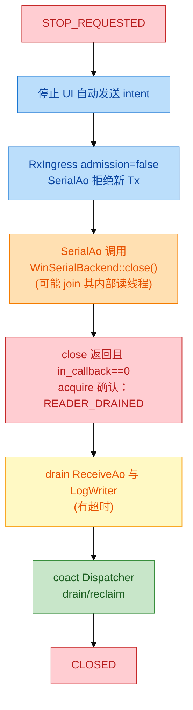

# XCOM 高性能与可靠性设计

| 项 | 值 |
| --- | --- |
| 版本 | v1.3（按 `coact` 源码和测试复核） |
| 核心 | C++17 + `coact` + 自研 `WinSerialBackend` |
| UI | PySide6，仅负责显示和 intent |
| 依据 | `ref/WIN_HCS_CLEAN` 的单 owner、有界 QoS、阻塞审计和生命周期设计 |

## 1. 基本原则

`SerialAo` 是 COM 生命周期/configuration owner；`SessionWriter` 是唯一调用可能阻塞 `WinSerialBackend::write` 的线程。GUI 不调用 C ABI；`CoreWorker` 是 Python 侧唯一 DLL owner。WinSerialBackend 回调只把数据复制一次到受限块池；只在工作从无到有时提交一个静态 coact event。控制、手动发送、自动发送、接收、显示、保存使用不同 QoS。所有队列、块池、日志、历史和控件文本都固定上限。所有优化必须通过 P50/P95/P99、队列水位、copy 字节和丢弃数验收。

设计区分**无锁热数据面**与**允许休眠的控制面**：前者不获取 mutex、不等待条件变量、不进行文件 I/O；后者只在 Dispatcher 空闲、端口关闭或保存完成等待时使用 OS 等待原语。无锁保障由 coact 承担 C++ 热数据面；Python 的少量锁仅保护小型命令元数据，绝不能进入接收回调、原始数据传输或 GUI 等待路径。

### 禁止的伪优化

- 在 WinSerialBackend 回调里调用 Qt、Python、文件 I/O 或同步日志。
- 从串口回调使用同步 `SendMessage`/阻塞 Qt signal 逐字节更新控件，或把每字节 append 到无界字符串。
- 用无限 `list`、`deque`、`queue` 保存收发数据。
- 为每个点击或包创建线程。
- GUI 直接调用 DLL/串口，或等待 CoreWorker 关闭。
- 同时添加 WinSerialBackend 与 libserial 第二通道，或绕过 WinSerialBackend 再实现第二套 Win32 COM 通道。
- 隐瞒接收/保存丢弃后仍声明"无丢包"。
- 为回调路径添加 `std::mutex`、`QMutex`、`condition_variable`、阻塞队列或无上限重试。
- 用无限 Python `list/deque/queue` 承载 Rx 数据，或把连续 C++ Rx 块以 queued signal 逐块/逐字节传给 GUI。
- 为了避免实现 C++ coact 背压而增加 Python worker 数量、让 GUI 等待 worker，或把 Python 状态机当作端口 owner。

## 2. coact 无锁映射

| XCOM 通路 | coact 原语 | 并发模型 | 内存序/门禁 |
| --- | --- | --- | --- |
| WinSerialBackend 回调 → ReceiveAo | 两条 `SpscRing<RxDescriptor/BlockId, 64>` + 静态 `RxKick` coact event | 单回调生产者、单 Dispatcher 消费者；反向 free-id ring 角色相反 | producer release store、consumer acquire load；空→非空 gate 只提交一个静态 event，`atomic<uint16_t>::is_always_lock_free`。 |
| UI/CoreWorker/回调 → Dispatcher | `BoundedMpscQueue` | 多生产者、单 Dispatcher 消费者 | cell-state CAS + release publish/acquire consume；要求 lock-free 64-bit atomic。 |
| 低频控制事件分配与回收 | `EventPool<..., HostSmpProfile>` + `SpinCriticalSection` | 多生产者、多线程 GC | 仅 Open/Close/Configure/手工 Tx 等控制 event 使用 tagged-CAS；每个共享池注入真实 spin critical section，编译期要求 lock-free 32-bit CAS。 |
| Dispatcher 唤醒 | `Staging::wake_pending_` + 静态 `RxKick` | 多生产者、单睡眠 Dispatcher | `RxKick` 经现有 Coordinator/staging 发布；lock-free atomic<bool> latch 只做 0→1 一次 Win32 event signal。 |
| AO 业务处理 | coact Dispatcher / AO lease | 单 Dispatcher 执行 | 无锁队列后串行处理；不在回调持锁。 |

`coact::SpscRing` 当前作为独立、TDD 验证的原语存在于仓库中；XCOM 将它纳入接收数据面，并增加 MSVC x64 编译/压力测试作为本项目的生产接入门禁。其容量必须为 2 的幂、payload 必须 nothrow move，失败的 `try_push` 不消耗描述符。无可用 Rx 块或 ready ring 满时回调立即计数后返回，绝不自旋等待。

**接收唤醒复用现有 coact Coordinator，不新增 `ExternalWorkSource`。**现有 v1 Dispatcher 只检查三个 staging 分区，不能自行发现独立 SPSC ring；因此 callback 在 ready ring 从空→非空时，以 `RxKickGate` 提交唯一的静态 `coact::Event{SIG_RX_KICK, pool_id=0}` 到 ReceiveAo 的 High/critical staging。静态 event 不触发 EventPool 分配或回收；gate 为 1 时后续 callback 只写 SPSC ring、不重复投递。Coordinator 的成功 staging publish 已正确执行 `wake_pending_` 与 PAL signal，故 Dispatcher 能从睡眠中醒来。

ReceiveAo 每次 `RxKick` 最多处理 4 个 4096 B 块（受 RTC budget 约束），随后执行"drain → gate=false → acquire recheck ready ring → CAS gate=true → 重投静态 `RxKick`"的关闭竞态协议；callback 用 `exchange(true)`，消费者重臂用 CAS。于是不会遗漏"消费者刚观察为空、生产者随后发布"的工作，也不会让同一个静态 event 同时在 staging 中出现两次。

`BoundedMpscQueue` 不能给某一个物理 cell 标记"保留"：producer 会先抢任意 Free cell，cell 可处于 `Writing`，consumer 只挑最早已经 `Ready` 的 publication ticket。XCOM 因而在 **coact Staging 内**实现一个无锁的 reservation ledger，而不是在 XCOM handler 自制 permit：`High=32` 时 non-critical claim 最多 16，critical 可使用剩余 16；Normal 不启用 reservation，完整 64 槽服务手工发送。每个 `StagingSlot` 只记录自己的 **claim class**，并不绑定某一个 queue cell。claim 在 `try_push` 前用 `atomic<uint32_t>` CAS 取得，入队失败立即回滚；`dequeue_one` 成功取走 slot 的瞬间释放 claim，因为物理 cell 此时已 Free。deferred slot 已不在 staging，不能二次释放；stop-drain 同样经 `dequeue_one`，因此自动归零。所有 XCOM AO 均 `direct_eligible=false`，避免 reservation 绕过 staging。

`RxKick` 以 High + `critical=true` 提交，High 的 16 个 critical reserve 不被普通 High 消耗。critical High 的 16 槽是容量保证而非无限容量：16 个真正未消费 critical 都在途时仍可 `RejectedFull`，该结果应可观测并由幂等 Close/Fault 合并处理，不能一律误报为 reservation bug。这是一条现有 coact 队列上的有界**控制通知**，不是 OS 队列，也不是每字节/每块事件；原始数据仍只在 coact SPSC ring 中传递。

`pool_id==0` 的 event 是 coact 明确不会 `event_gc()`/`ReclaimBatcher` 回收的静态 event；现有 coact 测试也允许同一静态地址多次提交。因此唯一性不是框架提供的：`RxKickGate` 是 XCOM 的排他协议。仅当旧 slot 已被 `dequeue_one` 取出、handler 正在执行且 gate 仍为 true 时，ReceiveAo 才能重投同一地址；handler 返回后的 `reclaim.release()` 对该 event 为 no-op。必须在 coact 中新增该真实重投场景的 Dispatcher 单测，锁定"任一时刻 staging 至多一份、无丢 wake、stop-drain 后无 claim"的契约。

Windows PAL 与 wake event 的实现放在 `xcom_core/framework/coact`，不是 XCOM 私有复制。可以从 `ref/WIN_HCS_CLEAN` 复制已经验证的 `CreateEventW`、`SetEvent`、`WaitForSingleObject`、HANDLE RAII、QPC 和 MSVC 条件编译片段，再按 coact 的 `PalT` 契约收敛为 `pal_windows.hpp/.cpp`。复制后必须移除与 newosp/HCS 业务耦合的类型、保留来源说明，并新增 coact 自己的 Windows 单测；不能把 `ref/WIN_HCS_CLEAN` 的整套运行时或第二事件框架引入 XCOM。

`HostSmpProfile` 的 EventPool 不是"仅 CAS 即安全"：Dispatcher 的 `ReclaimBatcher` 会写空闲块 `next`，可与 CoreWorker/回调的并发 alloc 冲突。每个跨线程共享 EventPool 必须以独立 `coact::SpinCriticalSection` 初始化，使用 `make_spin_critical_section()`；不得对 Windows Host 使用 `make_critical_section(pal)` 的 no-op 版本。该短自旋仅包围 pool 的 alloc/reclaim/splice，不在 SPSC 数据路径、Qt 或 COM 调用中出现。

`RxKickGate` 的正确性依赖 WinSerialBackend 对一个 session 只有一个 callback producer。后端契约的接入测试必须测出 callback 最大并发、最大回调长度、callback buffer 生命周期、`close()` 返回后的 callback barrier，以及 `write` 的 buffer 消费点。HCS 的相关串口文档是可选 COM 后端设计，不是这些行为的实测证明。

**最小引用锁原则：**`EventPool` 仅服务低频、有语义的控制 intent；RxKick 是 `pool_id=0` 的地址稳定静态 event，RxBlock/DisplayBlock 通过固定槽位唯一所有权转移，AutoTick 仅用单 producer atomic gate。故 1 Mbps 连续接收不产生 EventPool alloc、event ref-count 修改、SpinCriticalSection 或每块一次 MPSC slot 扫描；这些成本只由用户操作、状态转换和手工发送承担。

`BoundedMpscQueue` 的固定容量扫描是有界的而非无界锁等待；它适合控制/事件提交，不承载连续原始字节。EventPool 回收遵从 coact 的批量 splice，以减少共享 free-list CAS 竞争。

## 3. 性能门禁与指标

### 性能门禁

| 指标 | 门禁 | 位置 |
| --- | ---: | --- |
| WinSerialBackend 回调热路径 | P99 ≤ 2 ms | 回调进入到 `RxBytes` 提交。 |
| 接收排队 | P99 ≤ 20 ms | 回调提交到 ReceiveAo 开始。 |
| UI drain | ≤ 64 KiB 且 ≤ 5 ms/轮 | CoreWorker 到 UI append。 |
| GUI 事件循环间隙 | P99 < 50 ms | GUI 心跳 + 后台监测。 |
| 手工发送排队 | P99 ≤ 100 ms（端口空闲） | intent 到写结果。 |
| 关闭 | ≤ 2 s | StopRequested 到 Closed。 |
| 长稳 | 30 min | 115200、921600、1 Mbps loopback。 |

硬件串口传输时间与驱动差异需要分别记录；软件延迟、队列和 UI 卡顿不可被平均吞吐掩盖。

### 指标

| 类别 | 指标 |
| --- | --- |
| I/O | `rx_bytes`、`tx_bytes`、回调数、短写、打开/关闭次数、库/Win32 错误码。 |
| 背压 | `rx_pool_exhausted_bytes`、`rx_callback_oversize_bytes`、`tx_rejected`、`auto_tick_coalesced`、`ui_trimmed_bytes`、`save_rejected_bytes`。 |
| 延迟 | callback、coact queue、ReceiveAo、Python command wait、CoreWorker、UI append 的 P50/P95/P99。 |
| 资源 | 队列当前/峰值、块池占用、EventPool 失败、线程心跳、HANDLE 数。 |
| 正确性 | generation 拒绝、关闭中发送拒绝、接收 sequence gap、保存失败。 |

状态栏显示端口状态、收发量和关键丢弃数；诊断和日志保留完整快照。观测本身使用固定窗口或环，不能增加无界资源。

### 验证门禁

- 功能：无端口、占用端口、错误参数、拔线、重复关闭、文本/HEX/CRLF/DTR/RTS、自动保存。
- 交互：暂停显示后 `rx_bytes` 继续增长；显示尾窗淘汰不重置原始收发计数或保存流。
- 并发：覆盖"Dispatcher 已睡眠后仅 SPSC Rx 到达"的唤醒竞态；UI 人为慢 100 ms、慢盘、接收突发、自动发送同时关闭；无死锁、UAF、线程/HANDLE 泄漏。
- Python：填满 CRITICAL/HIGH/NORMAL/LOW 命令队列、注入慢 UI append、快速开关端口；验证 non-blocking enqueue、coalesce、aging、状态 generation 与 GUI heartbeat 门禁。
- 资源：连续开关 20 次后事件池、块池和句柄回到基线；所有溢出均有计数。
- 内存安全：`xcom_send` 返回后立刻释放/覆写 Python 源缓冲，串口端收到的内容仍完全正确；注入跨块 UTF-8、>4096 B callback、close 与正在执行 callback 的竞态。
- coact/Windows：静态 `RxKickGate` 的空→非空、drain→clear→recheck 与 Dispatcher 已睡眠竞态不丢唤醒，且永不同时重复入队；`pal_windows` 的 CreateEventW/SetEvent/WaitForSingleObject、QPC、TLS dispatcher identity、`enter_direct/leave_direct`、task/ISR signal 全部单测。SMP EventPool 压测必须以 `SpinCriticalSection` 初始化，TSAN（可用时）或高并发完整性测试证明无 free-list 损坏。
- reservation：non-critical High claim 达 16 时 CRITICAL 仍可使用余下容量。验证 claim 在 enqueue failure 回滚、在成功 dequeue 立即释放、deferred 不会二次释放，并在 stop-drain 后归零。只把 RxKick 的正常运行 `RejectedFull` 视为 fatal 不变量破坏；critical 耗尽为可观测过载。另以真实 Dispatcher 测试静态 event 在 handler 内重投且 staging 从不同时保存两份。
- WinSerialBackend 合同：loopback 覆写 TxBlock、回调 barrier、最大 callback 字节数和 20 次开关端口均通过后，才允许启用异步回调产品模式。
- 性能：115200、921600、1 Mbps 各持续 30 分钟，记录吞吐、P50/P95/P99、CPU、高水位和丢弃；编译期确认 `uint16_t/uint32_t/uint64_t` 所需 atomic 均为 lock-free，运行期验证 SPSC sequence wrap、满/空、单生产者/单消费者、关闭迟到描述符和 10 ms display-poll 延迟。
- 发布：Release 构建和 PyInstaller onedir smoke test；干净机器可加载 DLL、打开 loopback、收发并退出。

## 4. 有界资源预算

| 资源 | 默认 | 上限/策略 |
| --- | ---: | --- |
| coact High staging | 32 | `XcomCoactConfig::kHighCapacity=32`；其中最多 16 个非 critical，余下 16 个由 admission policy 预留给 critical。 |
| coact Normal staging | 64 | `XcomCoactConfig::kNormalCapacity=64`；手工发送满时立即拒绝，不等待。 |
| coact Low staging | 32 | `XcomCoactConfig::kLowCapacity=32`；低优先控制事件满时拒绝或由本地 gate 合并。 |
| `AutoTickGate` | 1 | AutoSendAo 层 atomic pending gate，非 coact merge；直到写线程消费自动包才释放，重复 tick last-value-wins 并计数。 |
| `RxBlockPool` | 1024 × 4096 B | 4 MiB；无块时保留 WinSerialBackend 未读数据并进入可观测背压。 |
| `TxBlockPool` | 32 × 4096 B | 128 KiB；手工发送拒绝、自动发送跳过。 |
| DisplayBatch | 256 × 64 KiB | 16 MiB 固定 owner-transfer ring；满时保留 RxBlock 并向上游背压。 |
| Qt/Python 显示交接 | 2 MiB byte-credit | GUI 实际渲染后归还；耗尽时停止 DLL→Python drain，不覆盖旧批次。 |
| 显示文档 | 4000 × 4096 字符尾窗 | FIFO 追加后才淘汰最旧块并计 `ui_trimmed_bytes`；该展示历史策略不影响接收链路。 |
| 自动保存 | 32 × 64 KiB | 慢盘报警/拒绝，不阻塞接收。 |
| 错误历史 | 128 | 环形覆盖，保留累计数。 |

调整容量必须同时更新内存预算、状态栏、诊断与测试。

## 5. QoS 和背压

| 通路 | coact 优先级 | 满载策略 | 可见结果 |
| --- | --- | --- | --- |
| Close / Fault | High + `critical=true` | admission policy 预留 16 个 High 槽；重复事件由 AO state 合并 | 立即显示关闭/错误；若违反预留不变量则显式 fatal。 |
| Open / Configure | High | 串行化，关闭中拒绝/延后 | 显示忙而不冻结。 |
| 手工发送 | Normal | 立即拒绝 | `tx_rejected`。 |
| 自动发送 | Low | `AutoTickGate` 合并为一个待处理 tick | `auto_tick_coalesced`。 |
| 接收 | High/critical 静态 `RxKick` + SPSC 数据面 | 块池满时保留 WinSerialBackend ring 数据；RTS/CTS 可用则降 RTS | 可观测背压与 `rx_pool_exhausted_bytes`。 |
| 显示 | Display SPSC + 10 ms poll + GUI credit | credit 满时停止 C++→Python 搬运；ReceiveAo 保留 owner | 不跳批、不覆盖旧批次；GUI 尾窗淘汰仅发生在已追加历史。 |
| 自动保存 | Low | 受限队列，告警/拒绝 | `save_rejected_bytes`。 |

控制事件可越过已排队的普通工作，但不抢占正在执行的物理串口写入。`critical` 不是第四个 coact `PriorityClass`：coact 的调度分区固定为 `High/Normal/Low`，而 `EventQos.critical` 是独立的"不得被通用过载策略静默丢弃"标记。XCOM 因而对外定义四级语义，映射到 coact 的三分区和 QoS 标记，而不改写 coact 的成熟调度器。

| XCOM 消息级别 | coact 映射 | 典型消息 | 顺序与满载契约 |
| --- | --- | --- | --- |
| CRITICAL | 目标 AO 的 `High` 分区 + `EventQos{critical=true}` | 关闭请求、拔线/驱动 Fault、停止完成 | coact reservation ledger 限制 non-critical claim 至 16，从 32 个槽留出 16 个；同类幂等事件由 AO 合并。16 个 critical 都在途后的 `RejectedFull` 是可观测过载，不伪装成功。 |
| HIGH | `High` 分区 | Open、恢复、配置提交、取消自动发送 | 先于未开始的 Normal/Low；满时返回 `rejected_overload`，不等待。 |
| NORMAL | `Normal` 分区 | 用户手工发送、快捷发送 | 同一 producer FIFO；并发 producer 按 Ready ticket 取出，满时拒绝。RX payload 仍走独立 SPSC 数据面，不与控制事件竞争。 |
| LOW | `Low` 分区 | AutoTick、状态/端口刷新、诊断、延迟保存 | `AutoTickGate`（单 producer pending bit）/具体 AO 自行 last-value-wins；coact v1 的 `mergeable` 仅是提示、尚未实现，不能依赖它。低优先级 aging 是唯一允许越过高优先级的例外，必须有上限和指标。 |

同一 producer 的同级提交保持 FIFO；并发 producer 时 coact 选择当前可见的最小 publication ticket，尚处于 `Writing` 的 producer 可以被后来的 Ready event 越过。因此 XCOM 不承诺跨线程的"全局提交序 FIFO"：CoreWorker 串行化用户控制命令，RxKick 只表示数据面已有工作，不参与手工 Tx 的字节顺序。不同级只影响尚未开始的工作。消息优先级不是"中断"机制，不能打断 `SerialAo` 当前的 COM 调用、破坏单 owner，或重排同一串口字节流。

coact v1 的 `EventQos.mergeable` 仍只是 Coordinator 尚未接线的 policy hint，不能承担预约容量或自动发送合并。High reservation 是很小的 coact 框架扩展，不是第四优先级、第四队列或新的 Dispatcher 工作源；其唯一作用是让既有三分区的容量预算在所有 Dispatcher 出队/停止分支中保持正确。

## 6. 所有权、复制账本与生命周期

### 数据流与所有权

- 回调 buffer 仅在回调内有效，禁止保存地址或跨线程借用。
- `RxDescriptor` 不复制大 payload，只携带块索引、长度、sequence 与 generation；消费完成后经反向 free-id SPSC ring 归还池。ready ring 的空→非空转变必须以 `RxKickGate` 提交唯一静态 `SIG_RX_KICK`；通知不分配 EventPool、不碰 OS 队列，只经现有 Coordinator 的 staging wake latch 决定是否 `SetEvent`。
- WinSerialBackend 产品配置把单次读缓冲限制为 ≤4096 B；仍按不受信任输入处理：回调长度大于 4096 B 时循环拆成块，直到 ring/pool 耗尽。未能接纳的尾部按精确字节数计入 `rx_callback_oversize_bytes` 或 `rx_pool_exhausted_bytes`，绝不静默截断或保留借用指针。
- 文本模式的 ReceiveAo 持有仅 Dispatcher 可写的 UTF-8 decoder state：跨块至多保存 3 个未完成字节；非法序列以 U+FFFD 输出并计数。HEX 模式直接逐块格式化，二者切换先显式处理/丢弃残字节并记录。
- HEX、文本编码、时间戳、日志和 PySide6 文本是明确复制，记录 `copy_bytes`。
- `CoreWorker` 用 `bytes.fromhex`/文本编码/CRLF 一次形成规范 binary payload；`xcom_send` 的 ABI 硬契约是 DLL 在函数返回前把 `data[0:size]` 完整复制到唯一受限 `TxBlockPool` 槽，或返回 rejected/error。每个 accepted send 的 typed coact control event 必须自带 `TxDescriptor{block_id,length,generation}`；不得将 descriptor 写入共享 `pending_write_word`/全局单槽再投递，否则 queue-and-return 的第二次发送会覆写第一次。不得将 Python 指针、`ctypes` 地址或调用者生命周期保存到异步 event，也不得在 SendAo 再建一份编码缓冲。TxBlock 只保留到 WinSerialBackend 后端契约已验证的消费点：`write` 同步消费则立即归还，否则到发送完成/关闭；必须以覆写 TxBlock 的 loopback 测试证明该点。函数返回后 Python 缓冲可立即释放。
- 正确表述是"复制次数明确、所有权清晰、内存有界"，而非零拷贝。

### 生命周期

- 拔线、用户关闭、Python 退出和库错误都走同一幂等路径。
- `RxIngress` 使用 `admission` 原子位和 `in_callback` 原子计数：回调先计数、再 acquire 检查 admission，退出时 release 减计数；关闭先 release 关闭 admission，再在 `WinSerialBackend::close()` 返回后 acquire 确认计数为零。该确认依赖并必须用测试验证 WinSerialBackend `close()` 返回后不再开始回调；未满足即报告后端契约故障并禁止释放 RxBlockPool。
- WinSerialBackend `close()` 可能同步 join 内部读线程，故它在 Dispatcher/SerialAo 中允许阻塞，最多占用关闭 SLO 的 2 s；Closing 期间暂停其余 AO 服务、新请求立即失败，GUI 不等待。
- GUI 不调用 `wait/join`；超时由 CoreWorker 后台继续清理并发送故障状态。
- 会话 generation 每次关闭后递增，迟到事件/回调被拒绝，不能污染下一次打开。
- `xcom_destroy` 只在 CLOSED 且无 in-flight 事件时释放，否则执行有限时的后台清理。

## 7. UI 刷新协议

1. ReceiveAo 将格式化文本写入固定 `DisplayBlockPool`，经 Dispatcher（producer）→CoreWorker（consumer）的 `SpscRing<DisplayDescriptor>` 发布；`display_dirty` 只表示 ring 非空，不能直接"通知 Python"。
2. CoreWorker 的 QThread event loop 使用 10 ms `Qt::PreciseTimer` 调 `xcom_drain_display`；每 tick 最多 drain 64 KiB 或工作 5 ms。该 poll 有固定上界、只影响 worker 自身，并提供 ≤10 ms 的 C++→Python 可见延迟预算。
3. drain 后仍有数据则留待下一 tick；GUI 通过 `Qt.QueuedConnection` 接收一个已限制文本批次，不能单次清空全部积压。
4. 状态栏每 250 ms 读取 `XcomSnapshot`；禁止逐字节更新控件。
5. HEX/时间戳选项只影响后续块，不能重格式化历史显示文本。

这与 `WIN_HCS_CLEAN` 的 dirty/latest-batch 原则一致，但串口仍必须独立显示真实收取量和丢弃量。

## 8. Python 控制面性能设计

### 8.1 单一 `CoreWorker` 与优先命令入口

Python 侧采用 `WIN_HCS_CLEAN/services/command_worker.py` 的核心机制，但保持本项目"仅 PySide6 + 标准库"的依赖约束：`CoreWorker` 是一个长驻 `QThread`，内部持有容量 32 的**有界优先 ingress**。该 ingress 由三个固定容量 `deque` 和一把只保护命令元数据的短临界区组成；它不是 `queue.PriorityQueue`，因为后者无法安全、确定地实现"HIGH 驱逐未执行 LOW"和按 key 原位合并。它是**Python C ABI 调用唯一入口**，不拥有 COM 资源，也不替代 C++ coact Dispatcher。

| Python 优先级 | 适用 intent | 队列满/重复策略 |
| --- | --- | --- |
| CRITICAL | Close、PortFault、进程退出清理 | `put_nowait`；可合并重复 Close/Fault；优先占用预留槽，耗尽时返回可见 fatal。 |
| HIGH | 打开、恢复、串口配置、取消自动发送 | `put_nowait`；可驱逐一个未执行 LOW，仍满则显式 rejected。 |
| NORMAL | 用户立即发送、快捷发送、保存、显示选项 | `put_nowait`；同一 coalesce key 已存在则 rejected。 |
| LOW | 自动发送 tick、状态刷新、端口刷新、诊断 | last-value-wins 合并；等待超过 500 ms 后 aging 一次，避免永远饥饿。 |

- 同优先级严格按单调 `request_id` FIFO；CRITICAL/HIGH 只影响尚未执行的任务，不抢占正在进行的 C ABI/coact 调用。
- 生产者只调用 `put_nowait` 语义的 `try_submit`：临界区只完成固定长度查找、合并或尾插，绝不等待队列空间、worker 或 C ABI；满载立即返回结果给 GUI。
- 取出规则为 CRITICAL → HIGH → NORMAL → LOW；LOW 等待超过 500 ms 时只提升该队首一次，随后恢复优先级顺序。Python 层的 aging 与 coact staging 的 LOW aging 都要各自统计，不能重复提升为"永久高优先级"。
- worker 空闲时可在其自身的 50 ms 唤醒周期内等待新 intent，用于心跳和 stop 检查；它不是 GUI 等待，也不改变 `try_submit` 的非阻塞契约。
- 队列维护固定长度的 request history、`enqueued/completed/rejected/coalesced/timed_out/cancelled` 指标和 P50/P95/P99 执行延迟。
- Python queue 只载荷固定小对象：操作码、C ABI 结构快照、短发送 `bytes` 或路径。接收字节绝不经 Python priority queue，始终留在 coact 的 SPSC/块池通路。

该入口与 coact 的优先级是两层防线：Python 层防止 Qt GUI 信号/慢 C ABI 调用阻塞；C++ coact 层保证进入内核后的正确 owner、无锁接收与最终 QoS。两层都必须统计拒绝和合并，不能假设一层的优先级可替代另一层。

### 8.2 Python 状态机镜像

不引入 `python-statemachine`。使用标准库 `Enum`、不可变 transition table 和 session generation 实现 `SerialUiStateMachine`。权威状态始终来自 `XcomSnapshot`/`PortState`，Python 只是镜像，不能调用 WinSerialBackend 或推断成功。

| 位置 | 是否复制 | 原因 | 禁止的额外复制 |
| --- | --- | --- | --- |
| WinSerialBackend callback → RxBlock | **一次，必需** | 回调 buffer 是借用内存，返回即失效；必须取得跨线程所有权。 | 回调内编码、HEX、日志、Python/Qt bytes。 |
| RxBlock → ReceiveAo | 否 | 只传 block id/length，Dispatcher 单独拥有该槽。 | `std::vector`、event payload、临时字符串。 |
| ReceiveAo → DisplayBlock | **一次，按需** | 文本解码/HEX/时间戳会改变字节表示，不能借用原始 Rx。暂停显示时为零。 | 同时保留格式化 `std::string` 和 DisplayBlock。 |
| DisplayBlock → ctypes buffer | **一次，ABI 必需** | Python 调用者提供连续、短生命周期 buffer。 | Python 侧中间 `bytes` 列表或完整历史副本。 |
| Python 文本 → Qt document | Qt 内部一次 | Qt 控件所有权与布局要求。 | 逐字节/逐行 append。 |

`RxBlock` 与 `DisplayBlock` 都是固定槽位状态机而非共享引用对象：生产者取得 free-id 后独占写入，release publish descriptor；消费者 acquire 读取并只经反向 free-id 归还。每一块同一时刻只有一个 owner，没有 `shared_ptr`、引用计数或数据面锁。Display 暂停时 ReceiveAo 直接归还 RxBlock，因而绕过格式化和其后的所有复制。

- 状态机仅在 GUI 线程更新，所有输入来自 `CoreWorker` queued signal；没有跨线程共享可变状态。
- `Opening/Closing` 禁用重复打开、参数变更和新手工发送；`Fault` 保留错误详情和"关闭/重试"意图。
- 每个 state/notification 带 C++ session generation；旧会话迟到信号直接丢弃并计数。

### 8.3 `ctypes`、信号与文本边界

- `CoreWorker` 是唯一持有 `ctypes.CDLL` 和 `XcomHandle` 的 Python 对象；绑定函数固定 `argtypes/restype`，启动时检查 ABI version、结构 `sizeof` 与字段 offset。
- `xcom_drain_display` 复用一个 64 KiB `ctypes.create_string_buffer`，由 10 ms `Qt::PreciseTimer` 驱动、每轮最多 drain 64 KiB/5 ms；禁止每 tick 新建大缓冲或在 Python 侧等待 Win32 HANDLE。C++ 的 `display_dirty` 只供 drain 快速判空，Python 可见性以此固定轮询契约保证。
- GUI → worker 只传递小型、不可变 intent；worker → GUI 只传递状态快照与已限制大小的文本批次。不能经 Qt signal 传递 RxBlock、完整接收历史、文件内容或无限 `bytes` 列表。
- 接收区用 `QPlainTextEdit`，关闭 undo、限制 `maximumBlockCount`；仅当视图本来位于尾端才自动滚动。一次 append 一批，不能逐字节/逐行调用控件。
- GUI 每 250 ms 读取最近 snapshot 缓存；不为每次 Rx/Tx emit Python signal。显示 dirty notification 在 Python 层同样至多挂起一条。

### 8.4 Python 非阻塞停止和保存

- GUI 的 `closeEvent` 只停止 timer、提交 HIGH close intent、禁用控件并返回；不调用 `CoreWorker.wait()` 或 C ABI close。
- CoreWorker 完成 C++ `CLOSED` 后发 `closed` signal；必要的有限时 join 只能在进程最终清理的非 GUI 路径执行。
- 自动保存的 Python worker（若保留）只消费 C++ 有界批次，采用 request-stop/finished signal；磁盘慢时返回 `save_rejected_bytes`，不向上游阻塞。
- TOML 读写采用 500 ms debounce；不在高频控件 change callback 直接写盘。

### 8.5 Python 测试门禁

- `pytest-qt`：高频接收时按钮、窗口拖动和关闭仍响应，GUI heartbeat P99 < 50 ms。
- fill Python command queue：CRITICAL/HIGH/NORMAL/LOW 顺序、Close/Fault 合并、LOW 合并、HIGH 驱逐 LOW、满载 rejected 和 aging 均可验证。
- slow UI append：Python dirty notification 仍至多一条，C++ 接收/计数不受影响。
- session restart：迟到 `PortState`/display 通知不会覆盖新会话；关闭路径没有 GUI `wait/join`。

### 8.6 接收暂停与自动清屏

"停止显示""自动清屏""打开前禁止自动发送"是应保留的产品行为；每字节 UI 消息、直接编辑控件和固定行数整窗清空不是可采用的架构。coact 方案据此明确将**接收**、**展示**和**保存**拆成三个独立消费者：

| 状态 | 串口读取/`rx_bytes` | DisplayBatch | 自动保存 |
| --- | --- | --- | --- |
| 正常 | 持续 | 格式化、批量显示 | 按用户设置写入。 |
| 暂停显示 | 持续 | 不格式化；释放 RxBlock | 继续或停止由保存选项决定。 |
| GUI 尾窗达到 4000 块 | 持续 | FIFO 追加后淘汰最旧显示块并计数 | 不受影响。 |
| 显示批次/块池满 | WinSerialBackend ring 保留未读字节；RTS/CTS 可用时降 RTS | ReceiveAo 保留 owner，GUI credit 满时不再 drain | 不覆盖、不静默删除；恢复容量后精确唤醒读线程。 |

`display_paused_bytes`、`ui_trimmed_bytes`、`rx_pool_exhausted_bytes` 必须分别统计，避免把有意的尾窗淘汰与接收链路丢失混淆。暂停显示不是暂停串口，也不是隐式缓存无限数据。
