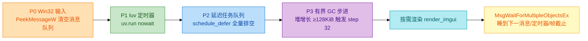

# XCOM 高性能与可靠性设计

| 项 | 值 |
| --- | --- |
| 核心 | `xcom_core.dll`：C++17 + coact + Win32 OVERLAPPED 串口 |
| 前端 | `xcom_lua`：LuaJIT 2.1 + Dear ImGui/ImPlot（D3D11），全部 UI 与业务逻辑用 Lua |
| 渲染 DLL | `xcom_imgui.dll`：ImGui + ImPlot + D3D11 |
| ABI | `xcom.h` v1.5，LuaJIT FFI 在 `xcom_lua/core/xcom_ffi.lua` 钉扎结构尺寸 |

`SerialAo` 是 COM 生命周期与 configuration 的唯一 owner；`SessionWriter` 是唯一可能阻塞写串口的线程。UI 线程是**单线程**（Win32 消息循环 + libuv/luv），经 LuaJIT FFI 调用 C ABI，不调用 `WaitForSingleObject` 等 HANDLE 等待原语。WinSerialBackend 回调只把数据复制一次到固定块池，仅在接收工作从无到有时提交一个静态 coact event。控制、手动发送、自动发送、接收、显示、保存使用不同 QoS；所有队列、块池、日志与显示历史都有固定上限。所有优化必须通过 P50/P95/P99、队列水位、copy 字节与丢弃数验收。

## 设计立场：无锁热数据面与可休眠控制面

设计区分**无锁热数据面**与**允许休眠的控制面**：前者不获取 mutex、不等待条件变量、不做文件 I/O；后者只在 Dispatcher 空闲、端口关闭或保存完成等待时使用 OS 等待原语。无锁保障由 coact 承担 C++ 热数据面；Lua 侧唯一的“状态”是单线程主循环里的纯 Lua 表，天然串行，不需要锁。

禁止的伪优化：

- 在 WinSerialBackend 回调里调用 FFI/Lua、ImGui、文件 I/O 或同步日志。
- 从串口回调同步逐字节更新控件，或把每字节 append 到无界字符串。
- 用无限 `list`/`deque`/`queue` 保存收发数据；为每个点击或包创建线程。
- UI 线程直接阻塞等待 DLL 关闭或 Win32 HANDLE；绕过 WinSerialBackend 再实现第二套 Win32 COM 通道。
- 隐瞒接收/保存丢弃后仍声明“无丢包”。
- 为回调路径添加 `std::mutex`、`condition_variable`、阻塞队列或无上限重试。
- 用无限 Lua 表承载 Rx 数据，或把连续 C++ Rx 块逐块/逐字节传给 UI。

**最小引用锁原则：**EventPool 仅服务低频、有语义的控制 intent；`RxKick` 是 `pool_id=0` 的地址稳定静态 event；RxBlock/DisplayBlock 通过固定槽位唯一所有权转移；AutoTick 仅用单 producer atomic gate。故 1 Mbps 连续接收不产生 EventPool alloc、event ref-count 修改、SpinCriticalSection 或每块一次 MPSC slot 扫描；这些成本只由用户操作、状态转换和手工发送承担。

## coact 无锁映射

| XCOM 通路 | coact 原语 | 并发模型 | 内存序/门禁 |
| --- | --- | --- | --- |
| WinSerialBackend 回调 → ReceiveAo | 两条 `SpscRing<RxDesc/uint16_t, 128>` + 静态 `RxKick` event | 单回调生产者、单 Dispatcher 消费者；free-id ring 反向 | producer release / consumer acquire；空→非空 gate 只提交一个静态 event |
| UI/回调 → Dispatcher | `BoundedMpscQueue` | 多生产者、单 Dispatcher 消费者 | cell-state CAS + release publish/acquire consume；要求 lock-free 64-bit atomic |
| 低频控制事件分配回收 | `EventPool<..., HostSmpProfile>` + `SpinCriticalSection` | 多生产者、多线程 GC | 仅 Open/Close/Configure/手工 Tx 使用 tagged-CAS；每个共享池注入真实 spin critical section |
| Dispatcher 唤醒 | `Staging::wake_pending_` + 静态 `RxKick` | 多生产者、单睡眠 Dispatcher | lock-free atomic latch 只做 0→1 一次 Win32 event signal |
| AO 业务处理 | coact Dispatcher / AO lease | 单 Dispatcher 串行 | 无锁队列后串行处理；不在回调持锁 |

`SpscRing` 容量必须为 2 的幂、payload 必须 nothrow move，失败的 `try_push` 不消耗描述符。无可用 Rx 块或 ready ring 满时回调立即计数后返回，绝不自旋等待。

**接收唤醒复用现有 coact Coordinator，不新增 `ExternalWorkSource`。** 现有 Dispatcher 只检查三个 staging 分区，不能自行发现独立 SPSC ring；因此 callback 在 ready ring 从空→非空时，以 `RxKickGate` 提交唯一的静态 `coact::Event{SIG_RX_KICK, pool_id=0}` 到 ReceiveAo 的 High/critical staging。静态 event 不触发 EventPool 分配或回收；gate 为 1 时后续 callback 只写 SPSC ring、不重复投递。`pool_id==0` 是 coact 明确不会回收的静态 event，唯一性由 `RxKickGate` 排他协议保证：ReceiveAo 每次 `RxKick` 最多处理 4 个 4096 B 块，随后执行“drain → gate=false → acquire recheck ready ring → CAS gate=true → 重投静态 `RxKick`”的关闭竞态协议；callback 用 `exchange(true)`，消费者重臂用 CAS，于是不会遗漏“消费者刚观察为空、生产者随后发布”的工作。

`BoundedMpscQueue` 不能给某个物理 cell 标记“保留”：producer 先抢任意 Free cell，consumer 只取最早 `Ready` 的 publication ticket。XCOM 因而在 **coact Staging 内**实现一个无锁 reservation ledger：`High=32` 时 non-critical claim 最多 16，critical 可使用剩余 16；Normal 不启用 reservation，完整 64 槽服务手工发送。claim 在 `try_push` 前用 CAS 取得，入队失败立即回滚；`dequeue_one` 成功取走 slot 的瞬间释放 claim。RxKick 以 High + `critical=true` 提交；16 个真正在途 critical 仍可 `RejectedFull`，该结果应可观测并由幂等 Close/Fault 合并处理。

`HostSmpProfile` 的 EventPool 不是“仅 CAS 即安全”：Dispatcher 的 `ReclaimBatcher` 会写空闲块 `next`，可与回调的并发 alloc 冲突。每个跨线程共享 EventPool 必须以独立 `coact::SpinCriticalSection` 初始化，使用 `make_spin_critical_section()`；不得对 Windows Host 使用 `make_critical_section(pal)` 的 no-op 版本。该短自旋仅包围 pool 的 alloc/reclaim/splice，不出现在 SPSC 数据路径或 COM 调用中。

`RxKickGate` 的正确性依赖 WinSerialBackend 对一个 session 只有一个 callback producer。接入测试必须测出 callback 最大并发、最大回调长度、callback buffer 生命周期、`close()` 返回后的 callback barrier，以及 `write` 的 buffer 消费点。

## Lua 主循环：P0–P3 分层

Lua 端是单线程事件驱动循环（`xcom_lua/ui/window.lua` 的 `run_message_loop`），每轮严格按层执行：

- **P1 定时器**：10 ms 显示 drain 是**按需**的，只在端口已连接时启动，`poll_display` 循环 drain 直到核心 lane 为空（每轮上限 8 次调用，单次容量 64 KiB），避免 UI 短暂停顿让 512 KiB 核心池填满；250 ms 状态快照轮询；多发表格循环；脚本轮询/监视（1 s / 250 ms）。空闲会话的最短 luv deadline 是 250 ms，循环真正阻塞而非每 10 ms 空转。
- **P2** `schedule_defer` 把同步但可能耗时的收尾（如日志 close 的 drain 重试）推后到本层，避免在 WndProc 内阻塞。
- **P3** 按堆增长触发有界 GC，密集输入不饿死收集器，稳定接收流也不会每 10 ms 过度步进。
- `run_message_loop` 整体 `jit.off`：它调用 `DispatchMessageW`，而后者会重入 FFI 闭包形式的 WndProc；LuaJIT 不能 trace 穿过回调 Lua 闭包的 C 调用。

FFI 缓冲所有权清晰：`xcom_drain_display` 复用一个 Lua 拥有的 64 KiB `ffi.new("char[?]")`，DLL 只在本次调用内写入；`xcom_send` 传入 Lua 字符串，DLL 在返回前复制，不保留调用者指针。Lua 不阻塞等待任何 Win32 HANDLE。

## UI 状态机镜像

`xcom_lua/core/view_model.lua` 是纯 Lua 的分层状态机（HSM），可脱离 Windows 用普通 luajit 单测。核心的 `port_state` 原子是权威状态，UI 只是镜像，不能推断成功。

- 6 个 UI 态：`closed`、`opening`、`open`、`closing`、`fault`，外加 UI-only 的 `reconnecting`。
- `reconnecting` 是宽限窗（默认 8000 ms，可由 `[serial] reconnect_grace_ms` 覆盖）：端口掉线后 UI 保持可恢复态并重开同一端口，窗内恢复继续正常流量，超时转 FAULT 交用户手动重连。核心没有 `reconnecting`，`UI_TO_CORE` 始终把它映射为 `CORE_FAULT`。
- 派生 interlock：`params_enabled` 仅 OFFLINE；`open_enabled` 仅 CLOSED/FAULT；`close_enabled` 含 OPEN/OPENING/FAULT/RECONNECTING；`send_enabled`/`autosend_enabled` 仅 OPEN。
- 每个 state/notification 带递增 session generation；`on_port_state`/`on_snapshot` 丢弃旧会话迟到通知并计数，避免污染下一次打开。

## 有界资源预算

| 资源 | 默认 | 上限/策略 |
| --- | ---: | --- |
| coact High staging | 32 | 其中最多 16 个非 critical，余下 16 个由 admission policy 预留给 critical |
| coact Normal staging | 64 | 手工发送满时立即拒绝，不等待 |
| coact Low staging | 32 | 低优先控制事件满时拒绝或由本地 gate 合并 |
| `AutoTickGate` | 1 | AutoSendAo 层 atomic pending gate；重复 tick last-value-wins 并计 `auto_tick_coalesced` |
| `RxBlockPool` | 128 × 4096 B | 512 KiB；无块时保留读缓冲并进入可观测背压，不静默截断 |
| `TxBlockPool` | 32 × 4096 B | 128 KiB；手工发送拒绝、自动发送跳过 |
| `DisplayLane` | 32 × 16 KiB | 512 KiB 固定 owner-transfer ring；满时 ReceiveAo 保留 RxBlock 并向上游背压 |
| 显示尾窗（UI） | 64 KiB | 可配 `[display] receive_window_bytes`，钳制 16 KiB–1 MiB；`ui_trimmed_bytes` 只统计可见历史淘汰 |
| 自动保存 | 独立 writer 线程 + 有界队列 | 慢盘返回 `save_rejected_bytes`，不阻塞接收 |
| 错误历史 | 128 条环形 | 保留累计数 |

调整容量必须同时更新内存预算、状态栏、诊断与测试。

## QoS 与背压

| 通路 | coact 优先级 | 满载策略 | 可见结果 |
| --- | --- | --- | --- |
| Close / Fault | High + `critical=true` | admission policy 预留 16 个 High 槽；重复事件由 AO state 合并 | 立即显示关闭/错误 |
| Open / Configure | High | 串行化，关闭中拒绝/延后 | 显示忙而不冻结 |
| 手工发送 | Normal | 立即拒绝 | `tx_rejected` |
| 自动发送 | Low | `AutoTickGate` 合并为一个待处理 tick | `auto_tick_coalesced` |
| 接收 | High/critical 静态 `RxKick` + SPSC 数据面 | 块池满时保留读缓冲；RTS/CTS 可用则降 RTS | `rx_pool_exhausted_bytes`、`rx_backpressure_events`、`rx_loss_offset` |
| 显示 | Display SPSC + 10 ms poll | DisplayLane 满时 ReceiveAo 保留 owner，暂停时向上游背压 | `display_paused_bytes`；不跳批、不覆盖旧批次 |
| 自动保存 | 独立 writer 线程 | 受限队列，告警/拒绝 | `save_rejected_bytes` |

控制事件可越过已排队的普通工作，但不抢占正在执行的物理串口写入。`critical` 不是第四个 coact `PriorityClass`：调度分区固定为 `High/Normal/Low`，`EventQos.critical` 是独立的“不得被通用过载策略静默丢弃”标记，XCOM 对外定义四级语义映射到三分区和该标记，不改写 coact 调度器。

同一 producer 的同级提交保持 FIFO；并发 producer 时 coact 选择当前可见的最小 publication ticket，尚处于 `Writing` 的 producer 可被后来的 Ready event 越过。因此不承诺跨线程的“全局提交序 FIFO”：Lua 主循环天然串行化用户控制命令，RxKick 只表示数据面已有工作，不参与手工 Tx 的字节顺序。消息优先级不是“中断”机制，不能打断 `SerialAo` 当前的 COM 调用或重排同一串口字节流。

## 所有权、复制账本与生命周期

| 步骤 | 是否复制 | 原因与禁止的额外复制 |
| --- | --- | --- |
| 回调 buffer → RxBlock | 一次，必需 | 回调 buffer 是借用内存，返回即失效；回调内禁止编码/HEX/日志 |
| RxBlock → ReceiveAo | 否 | 只传 `block/len/seq/gen`；禁止 event payload 临时字符串 |
| ReceiveAo → DisplayLane | 一次，按需 | 文本解码/HEX/时间戳改变字节表示；暂停显示时不格式化 |
| DisplayLane → Lua FFI 缓冲 | 一次，ABI 必需 | `xcom_drain_display` 拷入 Lua 拥有缓冲，仅当帧有效 |
| Lua → `xcom_imgui_receive_append` | 一次 | DLL 拷入自有尾窗并只对新增字节增量扩行索引 |
| Lua → `xcom_log_append` | 一次 | 排序写入独立 writer 线程；原始批在展示转换/裁剪前落盘 |
| send payload → TxBlockPool | 一次，ABI 必需 | `xcom_send` 返回前完整复制，不保留 Lua 指针 |

正确表述是“复制次数明确、所有权清晰、内存有界”，而非零拷贝。`RxBlock` 与 `DisplayBlock` 都是固定槽位状态机而非共享引用对象：生产者取得 free-id 后独占写入并 release publish descriptor，消费者 acquire 读取并只经反向 free-id 归还；每一块同一时刻只有一个 owner，没有 `shared_ptr`、引用计数或数据面锁。

每个 accepted send 的 typed coact control event 必须**自带** `TxDescriptor{block,len,generation}`；不得把 descriptor 写入共享单槽再投递，否则 queue-and-return 的第二次发送会覆写第一次。TxBlock 只保留到 WinSerialBackend 契约验证过的消费点：`write` 同步消费则立即归还，否则到发送完成/关闭。

```mermaid
%%{init: {'theme': 'base'}}%%
flowchart LR
    S["STOP_REQUESTED<br/>停止自动发送 intent"] --> A["RxIngress admission=false<br/>SerialAo 拒绝新 Tx"]
    A --> W["SerialAo 调用<br/>WinSerialBackend::close()"]
    W --> R["close 返回且 in_callback==0<br/>READER_DRAINED"]
    R --> D["drain ReceiveAo 与 LogWriter<br/>有超时"]
    D --> C["coact Dispatcher drain/reclaim"]
    C --> L["CLOSED"]

    style S fill:#ffcdd2,stroke:#c62828,color:#b71c1c
    style W fill:#ffe0b2,stroke:#f57c00,color:#e65100
    style R fill:#ffcdd2,stroke:#c62828,color:#b71c1c
    style D fill:#fff9c4,stroke:#f9a825,color:#e65100
    style C fill:#c8e6c9,stroke:#388e3c,color:#1b5e20
    style L fill:#ffcdd2,stroke:#c62828,color:#b71c1c
```

- 拔线、用户关闭、进程退出和库错误都走同一幂等路径。`RxIngress` 用 `admission` 原子位和 `in_callback` 原子计数：回调先计数再 acquire 检查 admission，退出时 release 减计数；关闭先 release 关闭 admission，再在 `close()` 返回后 acquire 确认计数为零（未满足即报告后端契约故障，禁止释放 RxBlockPool）。
- `WinSerialBackend::close()` 可能同步 join 内部读线程，故它允许阻塞，最多占用关闭 SLO 的 2 s（`xcom_ffi.close` 默认 timeout 2000 ms）；Closing 期间新请求立即失败，UI 线程不等待。
- 会话 generation 每次关闭后递增，迟到事件/回调被拒绝。`xcom_destroy` 只在 CLOSED 且无 in-flight 事件时释放，否则执行有限时的后台清理。

## 接收、展示与保存：三个独立消费者

**接收**、**展示**和**保存**是三个各自独立的消费者。暂停显示不等于暂停串口：`rx_format_block` 检测到 pause 时**保留 RxBlock 在 ReceiveAo 的 deferred slot**、计入 `display_paused_bytes`，容量耗尽再经串口 RTS/wait 背压向上游传播，因此暂停期间不丢字节；恢复显示时投递新的 RxKick 从同一块继续。核心的 `rx_bytes` 在暂停期间照常增长。

| 状态 | 串口读取/`rx_bytes` | 展示 | 自动保存 |
| --- | --- | --- | --- |
| 正常 | 持续 | 格式化、增量追加 | 按用户设置写入 |
| 暂停显示 | 持续 | 不格式化；块保留并背压 | 继续或停止由保存选项决定 |
| 显示尾窗达上限 | 持续 | 追加后淘汰最旧可见字节并计 `ui_trimmed_bytes` | 不受影响 |
| DisplayLane/块池满 | 保留未读字节，RTS/CTS 可用时降 RTS | ReceiveAo 保留 owner | 不覆盖、不静默删除 |

展示链路为**零重建增量追加**：`poll_display` 先写自动保存日志（原始批，字节保真），再把批交给 `_process_rx_batch`（字符集转换、用户脚本钩子、帧间隔断行等纯展示变换），最后经 `xcom_imgui_receive_append` 直接交给 C++。DLL 拥有滑动尾窗、逐行偏移索引和绝对基址，追加成本 O(delta)，Lua 不保留视图副本；渲染用 `ImGuiListClipper` 只绘制可视行，代价为“可视行 × 高亮规则”。尾窗淘汰只删除可见历史，`ui_trimmed_bytes` 与接收链路丢弃必须分别统计。

## 性能门禁与指标

性能门禁（软件延迟、队列和 UI 卡顿不可被平均吞吐掩盖）：

| 指标 | 门禁 |
| --- | ---: |
| WinSerialBackend 回调热路径 | P99 ≤ 2 ms |
| 接收排队（回调提交到 ReceiveAo 开始） | P99 ≤ 20 ms |
| UI drain | 单次 ≤ 64 KiB 且 ≤ 5 ms |
| GUI 事件循环间隙 | P99 < 50 ms |
| 手工发送排队（端口空闲） | P99 ≤ 100 ms |
| 关闭 | ≤ 2 s |
| 长稳 | 30 min @ 115200 / 921600 / 1 Mbps loopback |

指标：I/O（`rx_bytes`、`tx_bytes`、`callback_count`、打开/关闭次数、Win32 错误码）；背压/丢弃（`rx_pool_exhausted_bytes`、`rx_backpressure_events`、`rx_loss_offset`、`tx_rejected`、`auto_tick_coalesced`、`display_paused_bytes`、`ui_trimmed_bytes`、`save_rejected_bytes`）；线路错误（`framing_errors`、`parity_errors`、`overrun_errors`、`break_events`）；延迟（callback、coact queue、ReceiveAo、drain、渲染的 P50/P95/P99）；资源（队列当前/峰值、块池占用、EventPool 失败、HANDLE 数）；正确性（generation 拒绝、接收 sequence gap、保存失败）。`rx_callback_oversize_bytes`、`flow_hold_events` 是核心内部计数，未导出到 `XcomSnapshot`。状态栏显示端口状态、收发量和关键丢弃数；诊断和日志保留完整快照，且使用固定环，不增加无界资源。

验证门禁要点：

- 功能：无端口、占用端口、错误参数、拔线、重复关闭、文本/HEX/CRLF/DTR/RTS、自动保存。
- 交互：暂停显示后 `rx_bytes` 继续增长；显示尾窗淘汰不重置原始收发计数或保存流。
- 并发：覆盖“Dispatcher 已睡眠后仅 SPSC Rx 到达”的唤醒竞态；UI 人为慢 100 ms、慢盘、接收突发、自动发送同时关闭；无死锁、UAF、线程/HANDLE 泄漏。
- 资源：连续开关 20 次后事件池、块池和句柄回到基线；所有溢出均有计数。
- 内存安全：`xcom_send` 返回后立刻释放/覆写 Lua 源缓冲，串口端收到的内容仍完全正确；注入跨块 UTF-8、>4096 B callback、close 与正在执行 callback 的竞态。
- coact/Windows：静态 `RxKickGate` 的空→非空、drain→clear→recheck 与 Dispatcher 睡觉竞态不丢唤醒且不重复入队；SMP EventPool 以 `SpinCriticalSection` 初始化并做高并发完整性测试。
- 前端：`xcom_lua/tests/` 的纯 Lua 套件（CI 以 luajit 跑 `test_view_model`、`test_xcom_ffi`、`test_rx_*`、`test_script_*` 等）+ `xcom_core/tests/` 的 C++ `ctest`；`require("xcom_ffi")` 在加载时钉扎全部结构尺寸。

## 实测附录：接收格式化优化

以下为历史实测记录（日期 2026-08-31，2000 轮真实 DLL 注入缝 A/B；当时的基线脚本 `scripts/gate_perf.py` 当前仓库未随附）。数据保留，归因按现行架构修正。

**基线（200 轮，真实 DLL）**：回调热路径 P99 0.199 ms、接收排队 P99 0.051 ms、UI drain P99 0.162 ms，三线均远低于门禁，说明当时吞吐瓶颈不在 C++ 侧。

**改动清单（`xcom_core/src/xcom_ao.cpp`，行 244 起）**

1. HEX 路径边界检查外提：每输入字节固定产出 3 字符，预计算可容纳输入字节数，把逐迭代容量比较移出循环。
2. `static const char kHex[]` 提出循环（消除 MSVC 每迭代 guarded-init 检查）。
3. TEXT 路径改为单次 clamp `std::memcpy`（原逐字节拷贝 + 每迭代容量比较）。
4. 显示批产生路径不再 `SetEvent`（无 `xcom_wait_display`，读端轮询 `xcom_drain_display`）。

正确性论证：`cap_hex` 精确复刻原边界，末尾去尾空格后输出逐字节一致；TEXT 的 clamp memcpy 等价原 `min(len, cap)` 拷贝；2000 轮两种视图输出一致、snapshot 计数正确。

**优化后 vs 基线（2000 轮，P99 ms）**

| 指标 | 视图 | 基线 | 优化后 | Δ |
| --- | --- | ---: | ---: | ---: |
| callback_hotpath | TEXT | 0.029 | 0.027 | -7% |
| callback_hotpath | HEX | 0.077 | 0.037 | -52% |
| receive_queue | TEXT | 0.005 | 0.004 | -20% |
| receive_queue | HEX | 0.012 | 0.005 | -58% |
| ui_drain | TEXT | 0.025 | 0.023 | -8% |
| ui_drain | HEX | 0.060 | 0.033 | -45% |

最优收益在 HEX 视图（约 2 倍），因为该路径正是逐字节 + 循环内容量比较 + 循环内 static 表的开销所在；TEXT 视图 payload 小，受 FFI 调用开销主导。全部三线 P99 仍远低于门禁。

**残余热点与建议**

1. 接收热路径的真正余量在跨层与消费侧，不在 C++ 格式化。优化后 callback_hotpath P99 约 0.03–0.04 ms，其中主要是 LuaJIT FFI 往返与 `xcom_drain_display` 的批拷贝（当前单批 ≤16 KiB，Lua 单次调用容量 64 KiB、每 10 ms 轮次上限 8 次）。进一步降延时可让单轮 drain 拉出更多批或调整轮询节奏。
2. `xcom_drain_display` 现在按批“整批转移、不裁尾”：DisplayLane 的 `drain_into` 在容量小于单批时保留 descriptor、分次拷完，调用侧缓冲须不小于单批（16 KiB）；这与早期 64 KiB 整批硬契约不同，低内存场景更安全。
3. TEXT 视图连续长行跨批时，展示端需自行按行重组；属既有限制。
4. HEX 视图进一步按 8/16 B 批量写可再降 store 数，但收益已接近 FFI/驱动往返噪声，建议在真实高波特率下 profiling 复核后再做。

**结论**：在保留无锁热路径、固定块池、typed descriptor、RxKickGate、reservation 全部契约的前提下，`rx_format_block` 优化使 HEX 路径约 2 倍、TEXT 路径小幅提升，三线 P99 全部远低于门禁，ABI 导出未变。
