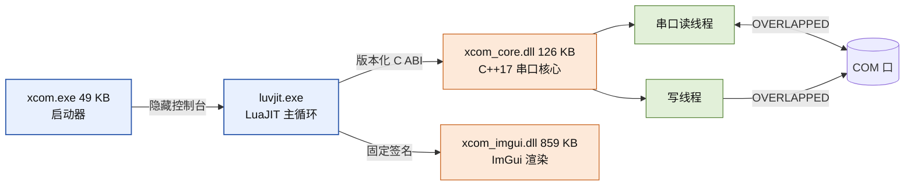
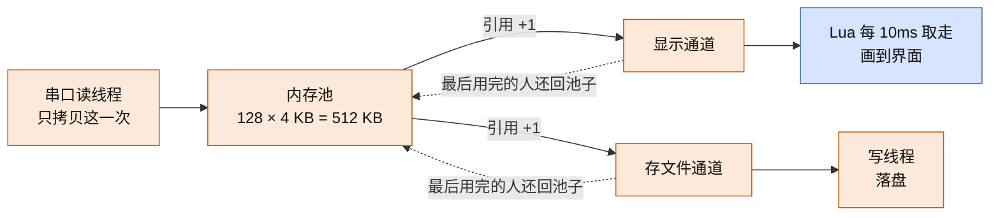
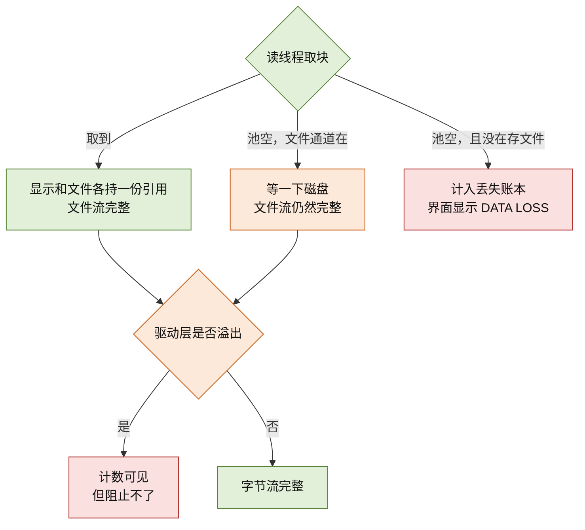

# XCOM 是怎么工作的

串口工具看起来很简单：把数据发出去，把数据收回来，显示在屏幕上。但真用起来，
决定体验的往往是三件不那么显眼的事——装起来麻不麻烦、跑起来吃不吃资源、以及
**长时间高速收数据时会不会丢**。

XCOM 是 Windows 上的一个串口调试工具，压缩包只有 3.93 MB，解压双击就能用，
不需要安装。它把这三件事都当成硬指标来做。这份文档想讲清楚它为什么能做到，
尤其是最后一条：为什么不丢数据，以及这样的代价是什么。

更偏实现细节的内容在 `docs/architecture.md`、`docs/design-summary.md`、
`docs/performance.md` 和 `docs/design-rx-fanout.md`。

## 它由哪几块组成

XCOM 启动后有三个部分在同一个进程里协作，各自只做一件事。



最外层是一个很小的启动器，它的唯一作用是隐藏那个黑框控制台，让程序看起来像个
正常的 Windows 程序。真正干活的是中间那块：**界面上的一切——按钮、菜单、配置、
脚本——都是 Lua 写的**。而跟硬件打交道的部分，包括串口的打开、读写、超时、
断线重连，全部交给一个 C++ 的核心库。

为什么这样分，下一节讲。

## 为什么界面用 Lua，底层用 C++

先说结论：为了**改起来快**，同时**不牺牲性能**。

串口工具真正的痛点是改动成本。你可能会遇到这些需求：时间戳想换个格式；某种
报文想自动解析出来；某一类数据想标成红色。在传统的纯 C++ 串口工具里，这些
都意味着改代码、重新编译、重新发给同事。XCOM 把这些压缩成"改一个文本文件，
保存，立刻生效"——因为界面和逻辑都是 Lua，改脚本不需要重新编译。

但"用脚本写"通常会带来一个担心：会不会变慢？这正是 XCOM 选择 **LuaJIT** 而
不是普通 Lua 的原因，也是它敢把整个界面放在脚本层的底气。有三点：

- Lua 调用 C++ 不是通过一层层的接口封装，而是**直接调用**，开销和 C 调用同级。
- 收数据时，整批字节一次性交给渲染层，**不会在 Lua 里一个字节一个字节地拼接**。
- 整个界面只有**一个线程**，所有状态天然是顺序的，不需要加锁——也就不存在
  锁带来的开销和卡顿。

代价也是清楚的：正因为界面和主循环是同一个线程，**如果 Lua 里写了很慢的代码，
界面就会卡**。所以真正重的活全部推给了 C++。下面这条接收链路就是最典型的例子。

## 为什么不丢数据

这是整个工具最花力气的地方。要先说明一个常见误解：**"不丢数据"不是靠开一个
很大的缓冲区硬扛**。缓冲区总有满的时候，而内存开得越大，占用就越高，和"轻量"
这个目标相矛盾。

XCOM 的做法是**一次拷贝，两个使用者共享**。

数据从串口读进来时，只在读线程这一处拷贝一次，放进一个固定大小的内存池。
池子一共 512 KB，分成 128 块，每块 4 KB。然后，负责显示的通道和负责存文件的
通道，各自持有**同一块内存**的一份引用——不是各复制一份。谁最后用完，谁负责
把这块还回池子。



这样做的好处是：**内存占用是固定的**，不会因为收的数据多就膨胀；而且因为
两个使用者共享同一块内存，也不存在"复制给显示时成功、复制给文件时失败"这种
丢数据的可能。

那池子满了怎么办？这里有一个关键的取舍。

**存文件的通道，宁可等，也不丢。** 如果池子一时没有空闲块，读线程会**停下来
等磁盘写完**，而不是把数据丢掉。毕竟文件是要拿来做分析的，缺一个字节都可能
让分析出错。等的同时界面会提示"存储跟不上"，用户看得见。

**显示通道则可以慢一点。** 如果它一时拿不到块，界面显示会滞后，但这**不是
数据丢失**——完整的字节流已经安全地写在文件里了。界面上滞后的是画面，不是数据。

为了不让显示拖累文件，池子里专门给文件通道留了 96 块（384 KB）的保底。显示
通道只有在池子剩余还多于 96 块时才能拿块，所以显示再怎么积压，也吃不掉文件的
保底份额。

按最高支持的速率算，一块 4 KB 大约能装 44 毫秒的数据，96 块保底相当于 **4 秒
多的余量**，显示侧另有 1 秒多。以 10 毫秒一轮的处理节奏，偶尔被系统调度走
一下，完全来得及。



**那到底有没有可能丢？有，而且我们如实标出来。** 有一种情况 XCOM 阻止不了：
操作系统串口驱动自己的缓冲区溢出。这是驱动层的限制，任何用户态程序都拦不住，
只能**检测并计数**。所以：

- 只要有文件日志在，**接收到的字节流就是完整的**。池子满最多让显示慢一拍，
  或者让读线程等一等磁盘，不会让字节凭空消失。
- 万一真发生了任何丢失（包括上面那种驱动溢出），**都会被记入一个账本**，界面
  会亮出 "DATA LOSS" 横幅，而不是悄悄瞒过去。账本里还记录了缺口在数据流中的
  位置，方便定位。

不隐瞒，是这套设计里和"不丢"同等重要的一半。

## 用脚本扩展它

界面和逻辑既然都是 Lua，把能力开放给脚本就是顺理成章的事。`scripts/` 目录下
每个 `.lua` 文件都是一个插件，写几行就能用：

```lua
on.receive(function(text)
    if text:match("^AT\r?\n?$") then
        sys.timer_start(10, function() uart.send("OK\r\n") end)
    end
    return text
end)
```

上面这段的意思是：收到以 `AT` 结尾的一行时，延迟 10 毫秒回复 `OK`。这是一个
典型的设备自动应答场景，用传统工具往往要写一个上位机程序，这里只要几行脚本。

插件能用的接口分成几类：`uart` 负责收发串口，`on` 用来注册"收到数据时"、
"发送数据时"这类钩子，`filter` 可以决定哪些数据要显示、哪些不要，`log` 往
日志面板写字，`wave` 把数据推给波形图，`sys` 提供定时器和文件操作。

配套的设计有三点值得说：

**改完即生效。** 保存脚本文件后不需要重启程序，它会自动重新加载。如果新版本
写错了，程序会保留原来能用的版本，不会因为一个语法错误就打不开。

**写错不会拖垮程序。** 每个插件都被单独隔离，连续出错 3 次会被自动停用，并
在日志面板里提示。一个插件出问题，不影响其他插件，也不影响主程序。

**插件不需要懂界面。** 插件拿到的接口都是面向串口的，不需要知道界面是怎么画的。
所以同一个插件，在绿色版和安装版里行为完全一致。

有一点要坦白：插件**不是安全沙箱**。它防的是"写错脚本把程序搞崩"，不是"恶意
脚本搞破坏"。如果你需要跑不可信的脚本，这套同进程的模型并不适合。

## 发布与适用场合

XCOM 有两种发布形式：绿色版压缩包，解压就能用；以及 MSI 安装包，会装到
Program Files 并建立开始菜单和桌面快捷方式。两者内容完全一样，来自同一份
打包产物。

打包脚本里内置了几道自动检查，都是为了防住曾经真实发生过的事故：可执行文件
的版本号必须和包名一致（曾经漂移过，导致下载的包和里面程序的版本对不上）；
程序依赖的系统运行库必须全部打包进去（否则在干净的电脑上会报"缺少 DLL"）。

最后，说说什么场合适合用它，什么场合不适合。

**适合**：日常的协议调试、抓取分析串口报文，以及需要现场改脚本、又不想重新
编译的场合。

**不适合**：需要同时跑很多串口实例的服务端场景（界面是单线程模型）；需要跑
不可信脚本的多用户场景（前面说过的同进程信任模型）；以及**无法接受"显示可能
滞后于文件"这一取舍**的场合——因为那正是换来"不丢数据"的代价。
