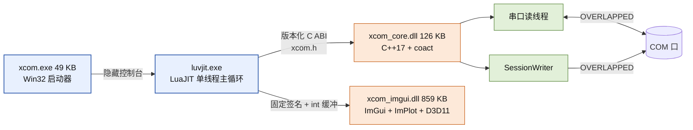
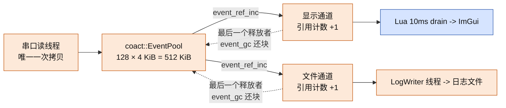
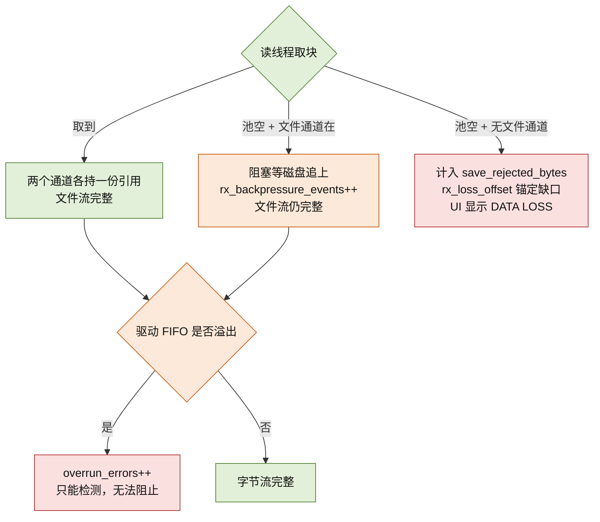

# XCOM 技术白皮书

> 面向评估与二次开发的读者。XCOM 是一个 Windows 串口调试工具：压缩包
> **3.93 MB**，解压即用；常驻内存与 CPU 占用低；**在接收链路不丢数据**。
>
> 配套阅读：`docs/architecture.md`、`docs/design-summary.md`、
> `docs/performance.md`、`docs/design-rx-fanout.md`。

## 1. 一句话与运行时形态

XCOM 由 **LuaJIT 前端 + C++17 核心**两个进程内 DLL 组成：全部 UI 与业务逻辑
是 Lua，串口 I/O 与事件时序是 C++，两者通过版本化 C ABI 与固定签名导出通信。



**体积**：发布包 3.93 MB（解压后 8.1 MB，171 个文件）。其中自研代码只占很小
一部分——`xcom.exe` 49 KB、`xcom_core.dll` 126 KB；其余是 LuaJIT/luv/iconv
运行库与 ImGui 渲染 DLL。没有 Electron、没有 .NET 运行时、没有安装依赖。

**资源占用低**的三个来源：单进程单 UI 线程（无多进程 IPC、无渲染子进程）；
Lua 侧状态是单线程纯 Lua 表（不需要锁，也就没有锁的开销与竞争）；C++ 侧
全部队列、块池、显示历史**都有固定上限**，内存不会随运行时长增长。

## 2. 为什么是 LuaJIT + C++

串口工具的痛点不在"能不能收发"，而在**改动成本**：换时间戳格式、加自定义
协议解析、给某类报文上色，在纯 C++ 工具里意味着改代码、重编译、重新分发。
XCOM 把这条路径压到"改一个 `.lua` 文件"。

| 关注点 | 放在哪 | 理由 |
| --- | --- | --- |
| 串口 I/O、超时、重连时序 | C++（`xcom_core.dll`） | 需要 OVERLAPPED、固定内存池、确定性时序，且不能被 GC 打断 |
| UI 布局、状态机、配置、脚本引擎 | LuaJIT（`xcom_lua/`） | 改动频繁、迭代快，LuaJIT 的速度足以胜任 |
| ImGui 绘制、D3D11 交换链 | C++（`xcom_imgui.dll`） | 每帧调用，且要直接管 GPU 资源 |

关键约束是**没有一层做两件事**：Lua 不碰 Win32 串口 API，也不持有任何 ImGui
对象；DLL 不做业务决策。每层因此都能单独测试和替换——`core/` 下的状态机、
编码转换、配置解析是纯 Lua，能在 Linux 上跑单测。

**LuaJIT 的作用不只是"用脚本写"**，而是让这套分层不付性能代价：

- **FFI 直调**。Lua 通过 FFI 直接调 C ABI，不经绑定层、不做参数封送，等价于
  C 调用。结构体布局由 `ffi.sizeof` 在加载时钉扎校验，两侧对不齐**当场报错**，
  而不是静默读错内存。
- **接收不逐字节进 Lua**。接收批次以整批交给 DLL 追加进显示缓冲，不在 Lua 里
  拼字符串、不重建显示文本。
- **单线程模型成立**。主线程是 Win32 消息循环 + libuv，所有 Lua 状态天然串行。

代价是明确的：**Lua 侧慢代码直接表现为 UI 卡顿**（与消息循环同线程）。这正是
重活全部推给 C++ 的原因。

## 3. 不丢数据：机制与边界

这是本工具最花力气的部分，也是"资源占用少"能成立的前提——**没有额外的
大缓冲，靠的是所有权设计而不是堆内存**。

### 3.1 一次拷贝，引用计数扇出

接收字节在**串口读线程**这一处完成唯一一次拷贝，然后以引用计数同时喂给两个
消费者：显示与文件。



全链路**只有一个事件池**（128 块 × 4 KiB = 512 KiB），没有第二条 512 KiB
缓冲、没有逐字节拷贝。两个消费者持有**同一个**块的两份引用，最后一个释放者
把块还给池。

### 3.2 三条保证，一条如实声明



| 通道 | 策略 |
| --- | --- |
| **文件通道** | **永不丢弃**。取不到块时读线程**阻塞**等待磁盘追上（`wait_for_free(50)`）并推一条 "storage stalled" 告警，同时计 `rx_backpressure_events`。文件流始终完整。 |
| **文件保底** | 文件通道硬预留 **96 块（384 KiB）**。显示通道只有在池里剩余仍**多于** 96 块时才允许持有引用，所以显示积压永远吃不掉文件保底。 |
| **显示通道** | **不阻塞读线程**。拿不到块时计 `rx_pool_exhausted_bytes`，语义是**显示积压（DISPLAY BACKLOG）而非数据丢失**——文件通道持有权威完整字节流。 |
| **驱动 FIFO 溢出** | **如实声明无法消除**。`CE_RXOVER`/`CE_OVERRUN` 是驱动层溢出，只能通过 `overrun_errors` 计数**检测**，本设计无法阻止。 |

### 3.3 为什么可以做到不丢

四个设计选择共同保证的：

1. **单一所有权转移，而非多份拷贝**。数据从池里分配后通过固定槽位转移所有权，
   没有"复制一份给显示、再复制一份给文件"的路径，也就不存在某条路径拷贝失败
   而丢数据。
2. **按峰值速率定容**。池按支持的峰值 921600 baud（≈90 KiB/s）定容：一块
   4 KiB 覆盖 ~44 ms，96 块保底 ≈ **4.27 秒**文件积压余量，显示侧还有 32 块
   （≈1.42 秒）。以 10 ms 的 drain 节奏，消费端短暂被调度走不会溢出。
3. **文件通道以背压换完整性**。这是关键取舍：显示可以滞后（用户看到的是旧
   数据，但数据还在），文件不能缺字节——所以宁可**阻塞读线程**也不丢。
4. **丢失统一入账，绝不隐瞒**。任何已接收但未被任何消费者保留的字节，都累加
   进 `metrics.save_rejected_bytes`，把 `rx_loss_offset` 锚定到当时的
   `rx_bytes`（可在流中定位缺口位置），并发出诊断事件。UI 的 "DATA LOSS"
   横幅读的正是这个账本。

换言之：**在有文件日志的前提下，接收字节流是完整的**；池满只会让显示滞后或
让读线程等磁盘，不会让字节消失。唯一无法消除的丢失源是驱动 FIFO 溢出，且它
被计数可见。

## 4. Lua 插件：工具能力的延长线

脚本系统不是"宏"，而是产品的**主要扩展面**。`scripts/` 下每个 `.lua` 在独立
环境（`setfenv`）中加载，注入六个命名空间：

| 命名空间 | 能力 |
| --- | --- |
| `uart` | `send` / `send_hex` / `is_open` |
| `on` | `receive` / `send` / `md` 钩子注册 |
| `filter` | `keep` / `drop` / `clear` —— 决定哪些数据进显示 |
| `log` | `info` / `warn` / `trace` —— 写入脚本日志面板 |
| `wave` | `push` —— 推数据到示波器 |
| `sys` | `timer_start` / `timer_loop_start` / `now` / `file_*` / `sim` |

一个能用的插件就是几行：

```lua
on.receive(function(text)
    if text:match("^AT\r?\n?$") then
        sys.timer_start(10, function() uart.send("OK\r\n") end)
    end
    return text
end)
```

**插件优先**体现在三处设计：

- **热重载**。文件事件 200 ms 去抖 + mtime 轮询兜底；改脚本无需重启，重载
  失败保留旧状态。
- **故障隔离**。每个钩子走 `pcall` 并带指令预算；单脚本连续失败 **3 次**自动
  禁用并在日志面板可见，不拖垮宿主。
- **API 面向串口而非面向 UI**。插件拿到的是 `uart`/`on`/`filter`，不需要知道
  ImGui 或窗口存在。同一份插件在绿色版与安装版行为一致。

需要说明：脚本**不是安全沙箱**，是**故障隔离**。同进程信任模型下，它保证的
是"写错脚本不会让工具崩"，而不是"恶意脚本无法作恶"。

## 5. 工程化约束与适用边界

**分发形态**：绿色版 zip（解压即用）与 MSI 安装包（Program Files + 快捷
方式），两者内容一致，由同一份 staged 目录产出。

**打包门禁**（`build_release.ps1` 内置，来自真实事故）：`xcom.exe` 版本号必须
等于包名、DLL 新鲜度校验、CRT 闭包（`dumpbin` 验证所有 vcruntime/msvcp 导入
都被收录）。版本号曾在二进制与包名之间漂移过。

**字节码分发**：发布包只含 `.ljbc`，`require` 优先字节码。但源码树里**不提交**
字节码——它会遮蔽当前源码。

**适用边界**：

- 适合：协议调试、报文分析、需要现场改脚本而不想重编译的场景。
- 不适合：多实例高并发串口的服务端场景（UI 是单线程模型）；需要脚本安全
  隔离的多租户场景（同进程信任模型）；以及无法接受"显示可能滞后于文件"这一
  取舍的场景。
