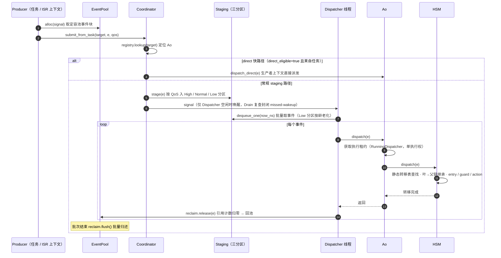
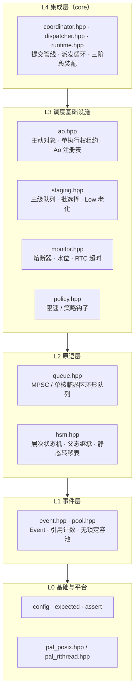

# coact：面向 RT-Thread 的 C++ 事件驱动框架——设计思想与使用指南

> 面向 RT-Thread MCU 的 C++17 事件驱动框架。本文讲两件事：它的设计思想与设计依据，
> 以及如何使用（从定义状态机到装配运行时再到提交事件的完整接入路径）。所有论断均有源码可回溯。

## 结论先行

coact 的设计可以浓缩成一句话：**把抽象压到编译期，把并发收敛到单线程，把所有权交给引用计数**。这三条分别回答嵌入式事件驱动框架的三个难题——运行期开销、线程安全、事件生命周期。使用上，接入一个功能只需五件声明（信号、上下文、状态表、转移表、Traits）加三阶段装配（`bind → initialize → start`），全部编译期定型、零动态分配。

## 一、设计思想

### 1. 编译期结构：状态机是数据，不是代码

coact 将状态机实现为纯数据。状态与转移是两张 `const` 静态数组，构造时只传指针，运行期零装配：

- **状态表** `StateDef[]`：每项 `{ parent, entry, exit, name }`，父子关系用父状态索引表达，`-1` 为根；
- **转移表** `TransitionDef[]`：每项 `{ from, signal, to, kind, guard, action }`，`kind` 区分 External / Internal；
- **HSM 派发** = 线性扫描表 + 函数指针调用，`叶子 → 父 → 根` 链查找继承（`include/coact/hsm.hpp`），编译后与手写 C 等价；
- **预算集中**：AO 数量（`kMaxAo`）、队列容量集中在一个 `Config`，跨注册表 / 监控 / 熔断器编译期一致。

反过度设计的含义在此落定：**不需要工厂、池模式或 handle**——因为一切结构在编译期已定型，运行期没有任何"动态注册"可供出错。

### 2. 提交与派发分离：单线程派发 = 天然免锁

事件驱动中共享 AO 状态是最容易引入锁的地方。coact 的选择是通过消除并发来避免加锁：

- 生产者在**任务或 ISR 上下文**只做一件事：入队 + 按需唤醒；
- 派发**只在 Dispatcher 单线程**发生：批取出队 → `Ao::dispatch` → HSM 转移 → 批量回收；
- 于是 AO 状态只被一个线程读写，**不存在竞争，也就不需要锁**；
- 可选 direct 快路径：AO 声明 `direct_eligible` 时，任务上下文提交可直接派发，跳过队列（延迟敏感且无 ISR 竞争的场景）。

一次事件从提交到回池的完整交互（常规 staging 路径；direct 快路径为可选项）：



### 3. 无锁热路径与零拷贝所有权

事件的生命周期是嵌入式事件驱动框架最易泄漏的部分。coact 通过两个机制保证：

- **定容无锁池**：事件来自 `EventPool`，free-list 是单个 32-bit tagged 索引（`[15:0]=索引 / [31:16]=ABA tag`），`compare_exchange_weak` 在 32 位 Cortex-M 上是原生指令，**无需 libatomic**；ISR 安全由注入的 `CriticalSection` 保证，RT-Thread 上映射 `rt_hw_interrupt_disable/enable`；
- **引用计数所有权**：`Event` 头只有 `signal / pool_id / ref_ctr`，`alloc` 时 0，每次投递 inc，消费者 `gc` dec，最后一次 `gc` 由 Dispatcher **批量归还**给池（`ReclaimBatcher`，一次 splice 多事件）；事件全程指针传递、零拷贝，同一事件可安全扇出给多个 AO；
- **唤醒确定性**：仅 Dispatcher 空闲时才 signal，drain 复查封闭 missed-wakeup 窗口。

配合熔断器（五态 `Normal → BrokenL1 → BrokenL2 → Safe → Recovering`，过载时降级而非静默丢弃）与低优先级分区老化出队，框架保证：池满不泄漏、过载降级、低优先级不饿死。

### 4. 分层与平台抽象：换平台只换一层

框架严格单向依赖，自下而上五层：

| 层 | 组成 | 职责 |
|---|---|---|
| L4 集成 | `coordinator / dispatcher / runtime` | 提交管线、派发循环、三阶段装配 |
| L3 调度基础设施 | `ao / staging / monitor / policy` | 主动对象、三级队列、熔断、限速 |
| L2 原语 | `queue / hsm` | 队列后端、层次状态机 |
| L1 事件 | `event / pool` | 事件、引用计数、无锁池 |
| L0 基础与平台 | `config / expected / assert / pal` | 骨架 + 平台抽象 |

分层依赖的可视化：



**换平台只换 L0**：`pal_posix` 与 `pal_rtthread` 提供相同的队列后端、同步原语与线程接口，其余层完全一致——同一套头文件在 Linux host 与 RT-Thread 都能编译。RT-Thread 上 Dispatcher 以普通内核线程运行，producer 调 `submit_from_task`，ISR 调 `try_submit_from_isr`。

## 二、如何使用

接入一个功能从声明到运行，固定七个步骤。

### 1. 声明事件信号

`Event.signal` 是 `uint16_t`，0 保留给初始化事件：

```cpp
enum Signal : uint16_t {
    kConnect = 1U, kSynAck = 2U, /* ... */
};
```

### 2. 声明上下文

上下文是 AO 的共享状态，HSM 各 handler 读写它。把该 AO 关心的字段集中在这里，方便调试时 watch 一个变量看全状态：

```cpp
struct ProtocolContext {
    int syn_count = 0;
    bool connected = false;
    /* ... */
};
```

### 3. 声明状态表与转移表

HSM 结构完全编译期化：

```cpp
const coact::StateDef<Ctx> kStates[] = {
    { -1, nullptr, nullptr, "Root" },          /* {parent, entry, exit, name} */
    { kRoot, entry_fn, exit_fn, "StateName" },
};

const coact::TransitionDef<Ctx> kTransitions[] = {
    { kFrom, kSignal, kTo, coact::TransitionKind::External, guard_fn, action_fn },
};
```

父子状态共享的行为（如断开连接）只写在父状态上，子状态继承。状态逻辑的复用依赖结构，而非复制粘贴。

### 4. 声明 Traits 与 Ao 类型

```cpp
struct MyTraits {
    static coact::LogicalPrio logical_prio() { return 20U; }
    static coact::PriorityClass priority_class() { return coact::PriorityClass::Normal; }
    static bool direct_eligible() { return false; }   /* direct 快路径开关 */
    static bool isr_direct_safe() { return false; }
    static constexpr uint64_t kRtcBudgetNs = 1000000ULL;
};
using MyAo = coact::Ao<Ctx, coact::Hsm<Ctx>, MyTraits>;
```

多 AO 时 `logical_prio` **必须唯一**——`AoRegistry::bind` 对重复优先级返回 false，这是硬约束而非文档建议。

### 5. 三阶段装配 Runtime

```cpp
coact::pal::Posix pal;
coact::EventPool<kBlk, kCap> pool;
pool.init(storage, sizeof(storage), coact::make_critical_section(pal));

MyAo ao(kStates, n_states, kTransitions, n_trans, kInitState, /*max_depth=*/3U);
coact::Event init_e{}; init_e.signal = 0U; ao.init(init_e);   /* 进入初始状态 */

coact::Runtime<coact::DefaultConfig, coact::pal::Posix> rt(pal);
rt.bind(&ao);        /* 注册 AO；TargetId = bind 位序，从 1 起 */
rt.initialize();     /* 提交注册表，校验唯一性 */
rt.start();          /* 启动 Dispatcher 线程 */
```

### 6. 提交事件

任务上下文用 `submit_from_task`，ISR 用 `try_submit_from_isr`（永不阻塞）：

```cpp
coact::Event* e = pool.alloc(kSignal);                    /* 从池取事件，零拷贝 */
if (nullptr != e) {
    coact::EventQos qos{false, false};
    rt.coordinator().submit_from_task(target_id, e, qos);  /* target_id 定位 AO */
}
```

事件提交后所有权归框架：引用计数负责多播，Dispatcher 负责最后归还，业务代码不需要也不应该手动释放。

### 7. 收尾与验证

等待排空后停止，`pool.used()` 归零即证明回收闭环：

```cpp
for (int w = 0; w < 200 && 0U != ao.pending().load(); ++w) usleep(5000);
rt.stop();
/* pool.used() == 0 即回收闭环 */
```

### 移植到 RT-Thread

接入代码零改动，只换 PAL：包含 `coact/pal_rtthread.hpp`，把 `src/core/pal_rtthread.cpp` 编进 BSP（仅用内核 API：信号量、线程、`rt_hw_interrupt_disable/enable`、`rt_tick_get`）。Dispatcher 以普通 RT-Thread 线程运行，ISR 用 `try_submit_from_isr` 入队。

## 三、设计思想如何让使用变简单

四句话对应四个好处：

- **编译期结构 → 使用即填表**：写新功能 = 填状态表 / 转移表 / Traits，没有运行期配置错误面；
- **单线程派发 → 业务代码不加锁**：handler 里没有锁、没有临界区，天然线程安全；
- **引用计数所有权 → 不手工管理事件**：alloc / 投递 / 回收全由框架闭环，杜绝泄漏与 UAF；
- **分层 PAL → 一份代码双平台**：host 调试、板端部署，只有 L0 不同。

## 结语

coact 的设计取舍可以归纳为三对选择：**编译期 vs 运行期**（选前者，开销归零）、**单线程 vs 多线程**（选前者，锁消失）、**静态表 vs 动态注册**（选前者，错误前置）。这些选择的共同方向，是把框架的复杂度从运行期迁移到编译期、从运行时迁移到类型系统。使用者面对的是一个"填表 + 装配"的骨架，而非需要理解全局运行机制的复杂系统。

---

*事实依据：`include/coact/{event,pool,queue,hsm,ao,staging,monitor,policy,coordinator,dispatcher,runtime,pal_*.hpp}`、`CMakeLists.txt`（`-fno-exceptions -fno-rtti`）。*
