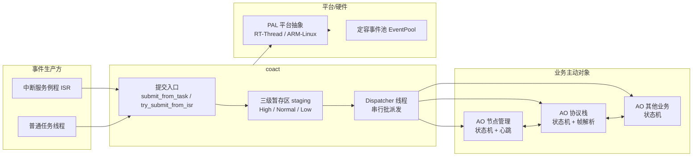
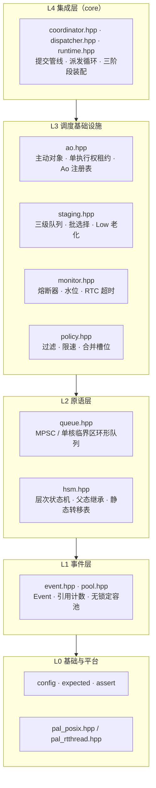

# 嵌入式事件驱动框架 coact：主动对象 + 状态机的一体化方案

> coact 是一个面向 RT-Thread 的 C++17 事件驱动框架，同时兼容 ARM-Linux（host）。它以主动对象（Active Object）
> + 层次状态机（HSM）为骨架，用单 Dispatcher 线程串行派发、无锁定容池与三级队列，在单核 MCU 上提供确定性的异步事件调度。
> 本文介绍它解决的问题、在系统中的位置、使用方式与收益，再展开设计思想与核心机制。

## 1. 框架是做什么的

裸机 RTOS 的项目里，模块间通信和事件分发往往要手写一遍邮箱加等待逻辑。coact 把这件事抽象成一条可复用的流水线：事件从定容池取出，经提交入口、三级队列、单线程派发，最终送进目标主动对象的状态机，再回收回池。

coact 面向 RT-Thread 的 MCU，同时保留 ARM-Linux 作为开发与验证环境。同一套头文件在两种平台都能编译，差异收敛到一层平台抽象（PAL），因此可以先在 host 上验证逻辑，再落到板端。

### 1.1 coact 在系统中的位置

coact 位于中断/任务等事件生产方与各业务主动对象之间，充当事件通信与调度背板。硬件中断或后台线程产生的信号，经 coact 的统一提交入口进入事件管线，由 Dispatcher 线程串行派发给目标主动对象；主动对象内部的状态机处理后，可再向其他主动对象投递事件。系统结构如下：



coact 不取代 RTOS，而是运行其上的一层事件调度背板：RT-Thread 负责线程、信号量与中断管理，coact 负责事件从产生到处理的确定性传递。Demo（`examples/`）演示了三条典型路径：单一协议状态机、多被动节点共用一个运行时、以及 coact 与外部组件桥接的串口 OTA 流程。

## 2. 如何使用

接入 coact 的核心是把业务拆成若干主动对象，每个主动对象用"五件声明 + 三阶段装配"接入。以 `examples/` 里的主动对象为例。

### 2.1 五件声明

一个主动对象由五处声明组成：事件信号、上下文、状态表、转移表、特性。

```cpp
/* 事件信号：uint16_t，0 保留给初始化事件 */
enum Signal : uint16_t { kConnect = 1U, kSynAck = 2U };

/* 上下文：AO 的私有状态，handler 只读写它 */
struct ProtocolContext { int syn_count = 0; bool connected = false; };

/* 状态表 StateDef[]：{ parent, entry, exit, name } */
const coact::StateDef<ProtocolContext> kStates[] = {
    { -1, nullptr, nullptr, "Operational" },
    { kOperational, disconnected_entry, nullptr, "Disconnected" },
};

/* 转移表 TransitionDef[]：{ from, signal, to, kind, guard, action } */
const coact::TransitionDef<ProtocolContext> kTransitions[] = {
    { kDisconnected, kConnect, kConnecting,
      coact::TransitionKind::External, nullptr, nullptr },
};

/* 特性：逻辑优先级、快速派发资格、RTC 预算 */
struct MyTraits {
    static coact::LogicalPrio logical_prio() { return 20U; }
    static bool direct_eligible() { return false; }
    static constexpr uint64_t kRtcBudgetNs = 1000000ULL;
};
```

状态机因此完全编译期化：转移是静态表，运行期零装配，HSM 用线性扫描表加函数指针派发。

### 2.2 三阶段装配与启动

```cpp
MyAo ao(kStates, n_states, kTransitions, n_trans, kInitState, 3U);
coact::Event init_e{}; init_e.signal = 0U; ao.init(init_e);

coact::pal::Posix pal;                       /* ARM-Linux：pal_posix.hpp */
coact::Runtime<coact::DefaultConfig, coact::pal::Posix> rt(pal);
rt.bind(&ao);        /* 注册 AO：TargetId = bind 位序，逻辑优先级唯一 */
rt.initialize();     /* 提交注册表，校验唯一性 */
rt.start();          /* 启动 Dispatcher 线程 */
```

把 `pal::Posix` 换成 `pal::RtThread`（`pal_rtthread.hpp`）即落到 RT-Thread 板端，其余装配代码不变。运行后，用 `submit_from_task(...)`（任务）或 `try_submit_from_isr(...)`（中断，永不阻塞）提交事件，事件所有权随即交给框架。

## 3. 使用收益

coact 投入使用的收益体现在六个方面：

- **确定性调度**：所有事件经同一 Dispatcher 串行派发，处理顺序由批次调度决定，运行结果可重复、可调试；
- **无锁并发**：主动对象状态只被一个线程读写，业务 handler 内无需临界区，从根上规避了数据竞争；
- **零拷贝通信**：事件全链路指针传递，跨模块通信不复制数据，减小内存带宽与延迟；
- **极低资源占用**：事件来自定容池、热路径无堆分配、不依赖 libatomic，适配资源受限的单核 MCU；
- **编译期正确性**：状态表、转移表、AO 预算均编译期定型，类型与结构错误在构建时即暴露，而非运行期崩溃；
- **跨平台复用**：同一份业务逻辑先经 ARM-Linux（host）验证，再落到 RT-Thread 板端，显著降低嵌入式调试与回归成本。

## 4. 设计思想：三条核心取舍

### 4.1 单 Dispatcher 线程串行派发，消灭并发

coact 用单一 Dispatcher 线程驱动所有主动对象。所有 AO 状态只被一个线程读写，从根上消除并发，因而无需加锁。与"每个 AO 一个线程"的方案相比，省下每 AO 的线程栈、锁与切换开销，获得确定的派发顺序。代价是派发集中一处，需要一个高效的派发循环与准入控制来保证其吞吐稳定。

### 4.2 编译期结构，运行期零装配

状态与转移是两张 `const` 静态数组，构造时只传指针。HSM 用线性扫描表 + 函数指针派发，编译后与手写 C 等价。AO 预算（数量、队列容量）集中在一个 `Config`，跨注册表、监控、熔断器编译期一致。运行期没有任何动态注册可供出错。

### 4.3 无锁热路径与引用计数所有权

事件来自定容 `EventPool`，free-list 是单个 32-bit tagged 索引（`[15:0]=索引 / [31:16]=ABA tag`），CAS 在 32 位 Cortex-M 上是原生指令，无需 libatomic。事件头只有 `signal / pool_id / ref_ctr`，所有权由引用计数表达：投递 inc，消费 dec，最后一次 `gc` 由 Dispatcher 批量归还池。事件全程指针传递、零拷贝，同一事件可安全扇出给多个 AO。

## 5. 分层结构

coact 严格单向依赖，自下而上五层：



| 层 | 组成 | 职责 |
|---|---|---|
| L4 集成 | `coordinator / dispatcher / runtime` | 提交管线、派发循环、三阶段装配 |
| L3 调度基础设施 | `ao / staging / monitor / policy` | 主动对象、三级队列、熔断、准入 |
| L2 原语 | `queue / hsm` | 队列后端、层次状态机 |
| L1 事件 | `event / pool` | 事件、引用计数、无锁池 |
| L0 基础与平台 | `config / expected / assert / pal` | 骨架 + 平台抽象 |

换平台只换 L0：`pal_posix` 与 `pal_rtthread` 提供相同的队列后端、同步原语与线程接口，其余层完全一致。

## 6. 高性能：零拷贝、无锁与准入控制

### 6.1 零拷贝投递

事件在管线中始终以指针传递，staging 存 `Event*`，进入与取出均为 O(1)。线程与中断各有独立投递入口，差异在唤醒与调度时机：

| 上下文 | 提交 API | 唤醒与调度 |
|---|---|---|
| **线程** | `submit_from_task` | 入队后按需唤醒，可走快速派发路径 |
| **中断** | `try_submit_from_isr` | 只入队、永不阻塞，由 RT-Thread 中断退出统一调度 |

在 ARM-Linux（host）上没有中断上下文，ISR 投递路径仅作板端移植模板，开发验证走 `submit_from_task`。

### 6.2 准入控制：过滤、限速与合并

提交入口用三类规则评估每个事件，遏制高频信号占用管线：

| 能力 | 作用 | 实现 |
|---|---|---|
| **过滤** | 按谓词或黑名单拒绝 | `PolicyOps::evaluate`，`kReasonFiltered` |
| **限速** | 令牌桶约束速率 | `TokenBucketRateLimiter`，`kReasonRateLimit` |
| **合并** | 同一信号后续事件只保留最新值 | `MergeCell`，`try_merge` 提示 |

其中合并槽位（`MergeCell`）以单个 `std::atomic` 状态加四态 CAS 状态机实现：`Empty → Published →（Merging → Published | Consuming → Empty）`。同一信号后到值直接覆盖槽内旧值，只留最新；CAS 失败不旋转，退回正常入队，保证正确性。它可削减高频冗余信号的队列占用，是准入控制无锁性的核心。

## 7. 收束

coact 把主动对象模式、静态表驱动 HSM 与无锁事件管线合成一体，面向 RT-Thread 单核 MCU，同时以 ARM-Linux 承担开发与验证。它位于中断与任务生产方、业务主动对象之间，提供确定、零拷贝、无锁的事件调度背板。对需要确定性与低资源开销的嵌入式项目，这套框架提供了一个可直接采用的事件驱动底座。

---

*实现依据：`include/coact/{event,pool,queue,hsm,ao,staging,monitor,policy,coordinator,dispatcher,runtime,pal_*.hpp}`、`CMakeLists.txt`；示例见 `examples/`。*
