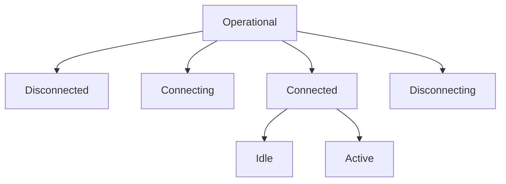
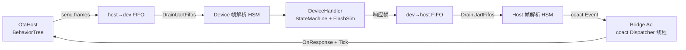
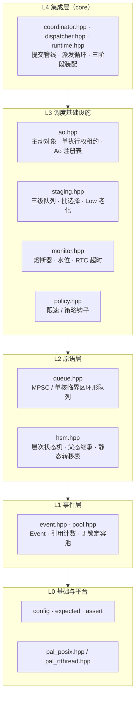
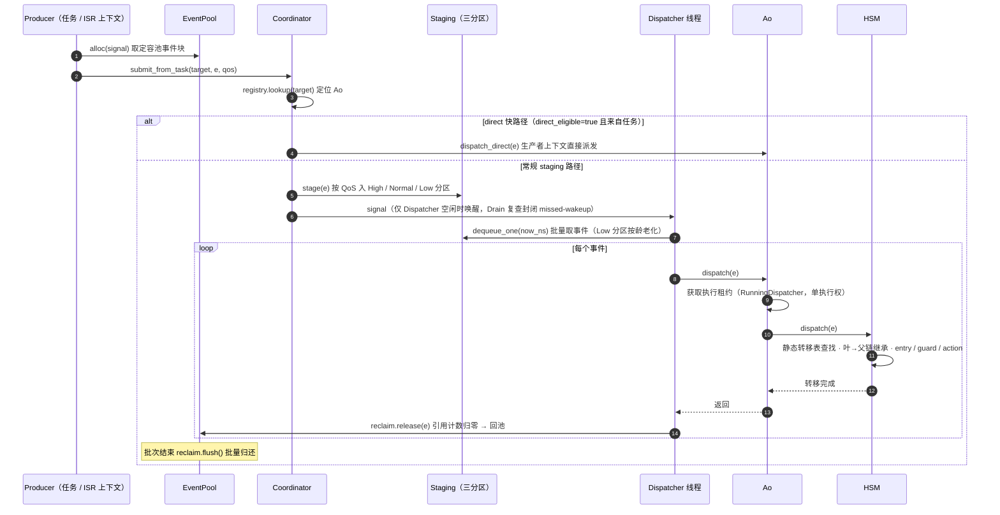

# examples — 示例说明

本目录包含 coact 的 3 个 host 端示例（POSIX PAL）。它们由浅入深，共同走通框架的完整事件管线：**EventPool 分配 → Coordinator 提交 → Staging 三级队列 → Dispatcher 单线程派发 → Ao 分发 → HSM 转移 → 回收入池**，是理解与上手本框架的最佳入口。

| 示例 | 定位 | 展示的核心能力 |
|---|---|---|
| `hsm_protocol_demo.cpp` | 入门：单 AO | 层次状态机父状态事件继承、全事件管线 |
| `node_manager_demo.cpp` | 进阶：多 AO | 一个 Runtime 下多主动对象、TargetId 路由、表序 guard |
| `serial_ota/` | 综合：工业级集成 | coact + newosp 混合架构、串口 OTA、桥接 Ao |

前两个示例单文件自包含、零外部依赖；`serial_ota/` 是多文件工程，依赖树外 newosp 头文件，为**可选构建**。

---

## 构建与运行

先构建（host）：

```sh
cmake -B build -S . -DCMAKE_BUILD_TYPE=RelWithDebInfo
cmake --build build -j
```

生成的可执行文件位于 `build/examples/`：

| 命令 | 说明 |
|---|---|
| `./build/examples/hsm_protocol_demo` | 运行协议状态机 demo，秒级退出 |
| `./build/examples/node_manager_demo` | 运行节点管理 demo，秒级退出 |
| `./build/examples/serial_ota_demo` | 运行串口 OTA demo（需先开启可选构建） |

`serial_ota_demo` 默认**不参与构建**，需显式开启并准备好 newosp 头文件：

```sh
cmake -B build -S . -DCOACT_BUILD_SERIAL_OTA=ON
cmake --build build -j
```

开启后，CMake 会在 `$HOME/newosp/include/osp/hsm.hpp`（或 `/home/dgliu/newosp`）查找 newosp；找不到时打印 WARNING 并跳过该示例。它依赖 newosp 的 `StateMachine / BehaviorTree / SpscRingbuffer / TimerScheduler / AsyncBus / WorkerPool / DebugShell` 等 12 个组件。

> 三个 demo 均已纳入 host 测试：`serial_ota_demo` 在可选构建下作为独立 ctest 用例，其余两个为普通可执行文件（无需断言即视为通过，返回 0 且日志正确即为验证成功）。

---

## hsm_protocol_demo — 层次协议状态机（入门）

**作用**：演示一个连接协议的层次状态机（HSM），跑通事件从入池到回池的完整管线，并展示 coact 的**父状态事件继承**机制。

**层次结构**：



**父状态事件继承**是本节目的核心：`DISCONNECT` 转移定义在父状态 `Connected` 上，`Idle` 与 `Active` 子状态**不定义自己的 DISCONNECT 转移**——派发时 HSM 沿 `叶子 → 父 → 根` 链查找，因此无论连接处于 Idle 还是 Active，收到 `DISCONNECT` 都会由 `Connected` 处理并进入 `Disconnecting`。

**关键结构**（`main()` 之前的声明部分）：

- `ProtocolContext`：协议上下文（计数、连接标志、最近动作），作为 HSM 的共享状态。
- `kStates[]`（`coact::StateDef`）：静态状态表，每项 `{ parent, entry, exit, name }`。
- `kTransitions[]`（`coact::TransitionDef`）：静态转移表，每项 `{ from, signal, to, kind, guard, action }`。
- `ProtocolTraits`：AO 特性——逻辑优先级、优先级类别、direct 资格、RTC 预算。
- `ProtocolAo = coact::Ao<ProtocolContext, ProtocolHsm, ProtocolTraits>`：主动对象类型。

**运行流程**：脚本一次性提交 14 个事件（`CONNECT → SYN_ACK → DATA_READY/DATA_SENT 往返 → DISCONNECT → FIN_ACK`），其中故意在 `Idle` 态提交 `DISCONNECT`，以验证父状态继承。结束后打印最终上下文与 `pool.used`。

**验证输出要点**（运行尾部）：

```text
[Idle] entry: waiting for data
[Active] entry: processing data
...
[Connected] exit: leaving connected state
[Disconnecting] entry: sending FIN...
[Disconnected] entry: connection closed
=== final context ===
hsm state:       Disconnected
drained:         yes
pool.used:       0          <- 事件全部回收入池
```

---

## node_manager_demo — 多主动对象节点管理（进阶）

**作用**：演示**一个 Runtime 下多个独立主动对象**——4 个节点 AO，各持一份独立上下文与三态 HSM（`Connected → Suspect → Disconnected`），由心跳事件经 `TargetId` 路由驱动。

**展示的框架能力**：

- **TargetId 路由**：`TargetId` 为 1-based，按 `rt.bind()` 的先后顺序编号（首个绑定 AO 为 1）。提交时 `coordinator().submit_from_task(target, e, qos)` 即可精确投递到对应 AO。
- **表序 guard**：同一信号可配多条带 guard 的转移，按表内顺序依次判定。例如 `HeartbeatMiss` 在 `Connected` 态：`already_suspect`（missed≥1）→ 转 `Suspect`；否则 `first_miss` → 内部计数。guard 在转移动作前执行（作用于 pre-action 上下文）。
- **逻辑优先级唯一性**：`AoRegistry` 拒绝重复优先级（`bind` 返回 false）。因此 4 个节点的 Traits 以 `NodeTraits<Prio>` 模板参数化，分别使用 30/25/20/15。
- **多 AO 等待排空**：通过类型擦除基类 `coact::AoBase*` 数组逐个检查 `pending()`。

**运行流程**：4 个节点各自走一条脚本化场景——节点 101 正常心跳保持 Connected；节点 102 连续丢心跳进入 Suspect 后恢复；节点 103 连丢 5 次断开后重连；节点 104 直接断开再重连。

**验证输出要点**：

```text
=== final node states ===
Node 101: connected=true missed=0 total=4 [Connected]
Node 102: connected=true missed=0 total=3 [Connected]
Node 103: connected=true missed=0 total=2 [Connected]
Node 104: connected=true missed=0 total=3 [Connected]
pool.used: 0
```

---

## serial_ota_demo — 串口 OTA（coact + newosp 集成，综合）

**作用**：把 coact 接到一个完整的工业级场景——主机通过串口向设备升级固件。架构为 **coact + newosp 混合**：newosp 提供设备侧状态机、主机侧 BehaviorTree 与模拟 UART；coact 负责**主机升级流程与帧解析之间的事件桥接**。

**端到端数据流**：



**目录结构**：

| 文件 | 职责 |
|---|---|
| `protocol.hpp` | UART 帧协议定义（`0xAA | LEN | CMD_CLASS | CMD | DATA | CRC | 0x55`）、命令类、CRC16 |
| `parser.hpp` | 基于 `osp::StateMachine` 的逐字节帧解析 HSM（Idle/LenHi/Cmd/Data/Crc/Tail），含统计 |
| `device.hpp` | 设备侧：`FlashSim` 闪存模拟、OTA 状态机、命令分发 |
| `host.hpp` | 主机侧：`BehaviorTree` 驱动升级流程（send_start → send_chunks → send_end → send_verify） |
| `ota_bridge.hpp` | **coact 桥接层**：`BridgeAo` 拥有 `OtaHost`，承载 `kSigHostTick` / `kSigHostFrame` 两个信号 |
| `main.cpp` | 装配：UART FIFO 回环、帧池、Runtime、shell、TimerScheduler、WorkerPool、主循环 |

**coact 桥接设计**（`ota_bridge.hpp`）——本示例最值得读的部分：

- `OtaHost::OnResponse()` 与 `host.Tick()` 都改写 `HostContext`，**必须同线程执行**，否则产生数据竞争。因此 `BridgeAo` **拥有** `OtaHost`，二者都被限定在 coact Dispatcher 线程上。
- 主线程上的 Host 帧解析回调只做一件事：从帧池 `alloc` 一个 `FrameEvent`（`coact::Event` 基类 + 帧负载），`submit_from_task(kOtaBridgeTargetId, ...)` 投递给桥接 Ao；帧数据**整体拷贝**进池块，跨线程零别名。
- 两个线程仅通过线程安全的 SPSC UART FIFO 通信，设备侧留在主线程。
- 帧池在 SMP 下需注入真实自旋锁 `SpinCriticalSection`（POSIX no-op CS 会让 `next` 字段写竞争）；单核 RT-Thread 池用 irq-mask 则无需。

**运行方式**：默认起 telnet 调试 shell（端口 5090），结束后停留 3 秒供查看；可用 `--console` 切换到 stdin/stdout shell。

```sh
./build/examples/serial_ota_demo          # telnet shell: localhost:5090
./build/examples/serial_ota_demo --console  # stdin/stdout shell
```

Shell 提供 9 条诊断命令：`cmd_ota_status`、`cmd_serial_stats`、`cmd_bus_stats`、`cmd_pool_stats`、`cmd_uart_fifo`、`cmd_retransmit`、`cmd_flash_dump`、`cmd_flash_crc`、`cmd_timer_info`。

**健壮性**：`kDropRate=5%` 使约 5% 的 OTA_DATA 帧在回环中被翻转 1 bit，触发 CRC 错误与重传，用于验证设备侧丢帧恢复。`kMaxOtaTimeMs=30000` 超时兜底。

**验证输出要点**（运行尾部）：

```text
OTA OK: 191 ms, 36 ticks, CRC=0xE0B6, retries=0 drops=0
FW CRC=0xE0B6  Flash CRC=0xE0B6  MATCH
OTA upgrade completed successfully!
```

（`drops=0` 因重传把损坏帧兜住了；若调大 `kDropRate` 可观察到 `retries/drops` 非零。）

---

## 框架分层与事件交互

### 分层结构

coact 是严格单向依赖的分层架构（上层只 include 自己模块与所列依赖，禁止反向依赖），自下而上：



层间箭头表示"依赖方向"：**L4 集成层依赖全部**，L3 各模块依赖下层的队列/HSM/事件，L0 基础与平台被所有层使用。模块级依赖关系（依据 `docs/interface_contract.md`）：

| 模块 | 所属层 | 依赖 |
|---|---|---|
| `core` | L4 | 全部 |
| `ao` | L3 | `hsm`、`event` |
| `staging` | L3 | `queue`、`event` |
| `monitor` | L3 | — |
| `policy` | L3 | `event` |
| `queue` | L2 | — |
| `hsm` | L2 | `event` 的 `Event` 类型 |
| `event` | L1 | — |
| `pal` / `config` / `expected` / `assert` | L0 | — |

**换平台只换 L0**：`pal_posix`（host）与 `pal_rtthread`（RT-Thread）提供相同的队列后端/同步原语/调度接口，其余层完全一致——这是三个 demo 在 host 上即可完整演示 RT-Thread 行为的原因。

### 事件交互时序

一次事件从提交到回池的完整交互（常规 staging 路径；direct 快路径为可选项）：



关键点：

- **提交与派发线程分离**：`submit_from_task`（任务）与 `try_submit_from_isr`（ISR）在生产者上下文只做入队 + 按需唤醒；`dispatch` 一律发生在 Dispatcher 单线程，因此 AO 状态天然免锁。
- **direct 快路径（S6）**：AO 声明 `direct_eligible` 时，任务上下文提交可直接调用 `dispatch_direct` 跳过队列——demo 均声明 `false` 以演示常规路径，实际工程中用于延迟敏感但无 ISR 竞争的场景。
- **所有权闭环**：事件全程指针传递、零拷贝；引用计数保证多播安全，最后一次 `gc` 由 Dispatcher 批量归还给池——`pool.used()` 归零即回收闭环。

---

## 如何使用本框架（从 demo 抽象出的模式）

以下按 `hsm_protocol_demo` 的代码路径，归纳在自有工程里接入 coact 的固定步骤。

**1. 定义事件信号**（`Event.signal` 为 `uint16_t`，0 保留给初始化事件）：

```cpp
enum Signal : uint16_t {
    kConnect = 1U, kSynAck = 2U, /* ... */
};
```

**2. 定义上下文**——作为 AO 的共享状态，HSM 各 handler 读写它：

```cpp
struct ProtocolContext {
    int syn_count = 0;
    bool connected = false;
    /* ... */
};
```

**3. 定义静态状态表与转移表**——HSM 的结构完全编译期化：

```cpp
const coact::StateDef<Ctx> kStates[] = {
    { -1, nullptr, nullptr, "Root" },
    { kRoot, entry_fn, exit_fn, "StateName" },   /* {parent, entry, exit, name} */
};
const coact::TransitionDef<Ctx> kTransitions[] = {
    { kFrom, kSignal, kTo, coact::TransitionKind::External, guard_fn, action_fn },
};
```

**4. 定义 Traits 与 Ao 类型**——逻辑优先级唯一（多 AO 时必不重复）：

```cpp
struct MyTraits {
    static coact::LogicalPrio logical_prio() { return 20U; }
    static coact::PriorityClass priority_class() { return coact::PriorityClass::Normal; }
    static bool direct_eligible() { return false; }
    static bool isr_direct_safe() { return false; }
    static constexpr uint64_t kRtcBudgetNs = 1000000ULL;
};
using MyAo = coact::Ao<Ctx, coact::Hsm<Ctx>, MyTraits>;
```

**5. 装配 Runtime（三阶段初始化）**：

```cpp
coact::pal::Posix pal;
coact::EventPool<kBlk, kCap> pool;                       /* 定容池，热路径无堆 */
pool.init(storage, sizeof(storage), coact::make_critical_section(pal));

MyAo ao(kStates, n_states, kTransitions, n_trans, kInitState, /*max_depth=*/3U);
coact::Event init_e{}; init_e.signal = 0U; ao.init(init_e);  /* 进入初始状态 */

coact::Runtime<coact::DefaultConfig, coact::pal::Posix> rt(pal);
rt.bind(&ao);          /* Phase 1: 注册 AO（TargetId = bind 顺序，从 1 起） */
rt.initialize();       /* Phase 2: 提交注册表，校验唯一性 */
rt.start();            /* Phase 3: 启动 Dispatcher 线程 */
```

**6. 提交事件**——任务上下文用 `submit_from_task`，ISR 用 `try_submit_from_isr`（永不阻塞）：

```cpp
coact::Event* e = pool.alloc(kSignal);                    /* 从池取事件（零拷贝） */
if (nullptr != e) {
    coact::EventQos qos{false, false};
    rt.coordinator().submit_from_task(target_id, e, qos);  /* target_id = Ao 的 TargetId */
}
```

**7. 收尾与验证**——等待排空（`ao.pending()`）后 `rt.stop()`；`pool.used()` 归零证明事件全部回收：

```cpp
for (int w = 0; w < 200 && 0U != ao.pending().load(); ++w) usleep(5000);
rt.stop();
/* pool.used() == 0 即回收闭环 */
```

**移植到 RT-Thread**：同一组头文件，仅两处不同——PAL 换为 `coact/pal_rtthread.hpp`，并把 `src/core/pal_rtthread.cpp` 编进 BSP。`pal::Posix` 替换为 RT-Thread PAL 后，其余装配代码不变；Dispatcher 以普通 RT-Thread 线程运行。
