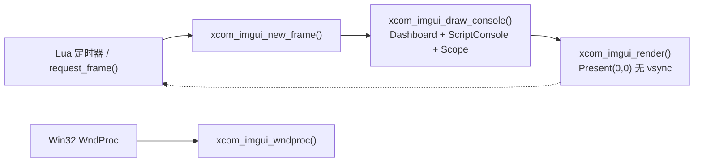

# Dear ImGui / ImPlot 官方资料参考

> 版本基线：Dear ImGui **1.93.0 WIP**（编译副本 `IMGUI_VERSION_NUM 19294`，docking 分支；
> 官方 master 快照 19295）、ImPlot **1.1 WIP**（`IMPLOT_VERSION_NUM 10100`）。
> 编译用源：`third_party/xcom_imgui/{imgui,implot}/`；官方完整仓库与 `implot_demos` 是外部 clone
> （`ref/imgui/`、`ref/implot_demos/`，不随本仓库分发）。
> 本文合并原 `imgui-patterns-reference`、`imgui-examples-reference`、`implot-demos-reference` 三份笔记。
> 原文行号来自 2026-09-04/05 快照，bridge 已显著增长（现约 4200 行），**引用一律以符号名定位**。

## 本项目 bridge 与官方示例的根本差异

官方 `examples/example_win32_directx11/main.cpp` 是**自主循环**（消息泵 → NewFrame → UI → Render →
Present 全在一个 `while`）；bridge 是**被动驱动**，拆成
`xcom_imgui_new_frame()` / `xcom_imgui_draw_console()` / `xcom_imgui_render()` / `xcom_imgui_wndproc()`
四个导出，由 Lua 侧 `Window:render_imgui()` 按需调用。帧间隔三档：交互 16 ms / 数据 100 ms / 空闲 500 ms。



对被动驱动的直接推论：

1. 新 UI 元素状态一律挂 `ImGuiRuntime` 成员，**不能**用函数级 `static` 缓存 Lua 传入的指针
   （ComboSpec 的 `int*` 地址每次 draw 可能不同，缓存即悬垂）。
2. 帧率低时优先用 `ImGui::Shortcut()` / `SetNextItemShortcut()`（路由系统跨帧可靠），
   `IsKeyPressed` 轮询跨帧丢键风险高。
3. 新导出走 Lua 侧 `optional_export` 探测，旧 DLL 优雅降级。

官方 `example_null` 证明"无消息泵、外部驱动逐帧"合法：`NewFrame → UI → Render` 之间没有对消息循环的
隐式依赖。bridge 的拆分即此骨架加真实后端。

## Win32 + DX11 主循环要点

- **WM_SIZE 三步（CleanupRenderTarget → ResizeBuffers → CreateRenderTarget）**：官方延迟到主循环
  （WM_SIZE 在 `DefWindowProc` 模态 resize 内同步到达，swap chain 仍被引用）。bridge 在 WndProc 内
  直接做（无自主主循环，等不到下一帧），resize 期间 `Present(0,0)` 立即呈现——对被动驱动是合理偏离。
- **WndProc 转发顺序**：官方先喂 `ImGui_ImplWin32_WndProcHandler` 再走自己的 switch；
  bridge 先处理 WM_SIZE/WM_EXITSIZEMOVE 再透传（WM_SIZE 不被 ImGui 处理器消费，安全）。
  可补 `SC_KEYMENU` 过滤（防 ALT 弹系统菜单）。
- **最小化/遮挡节流**：官方 `DXGI_PRESENT_TEST` 探测遮挡则 `Sleep(10)` 跳帧，DX12 版加
  `::IsIconic(hwnd)`；bridge 仅 Lua 侧 `_minimized` 跳帧，"被其他窗口完全遮挡"仍烧 WARP CPU。
- **DPI（bridge 最大空白）**：官方 `EnableDpiAwareness + ScaleAllSizes + FontScaleDpi` 三件套 bridge 都没有，
  字体硬编码 16/17/18px，宿主无 `<dpiAware>` manifest，高缩放屏会被系统位图拉伸发糊。
  尺寸常量应尽量表达为 `GetFrameHeight()/GetFontSize()` 的倍数。
- **清理顺序**：后端 Shutdown → DestroyContext → 释放 D3D 对象；bridge 多加 `if (frame_active_) EndFrame()`。
- **Present(0,0) 无 vsync** 是被动驱动的正确选择（vsync 会阻塞占住 Lua 线程）。
- **交换链 BufferCount=1 + DISCARD**（bridge）vs 官方 2 缓冲；WARP 下 2 缓冲通常减少 Present 阻塞，
  且官方注释更推荐 `FLIP_DISCARD`。

## 颜色 / 样式 / 字体

- **换肤限度**：`StyleColorsLight()` 头文件注释明言"best used with borders and a custom, thicker font"。
  bridge 已 `FrameBorderSize=1 / ChildBorderSize=1` + Siemens Slab，方向正确。
- **帧内局部改样式只能 `PushStyleColor/PushStyleVar`**；表驱动 `kStyleColors` + `apply_style()` 是一次性改的正道。
  `ImGui::ShowStyleEditor()` 可嵌进隐藏 Popup 做主题原型，调完抄回常量表。
- **边框厚度只测过 0/1**，不要追求 2px。`AntiAliasedLines/Fill` 可关换性能（WARP 帧紧时的降压阀门）。
- **1.92+ 动态字体**：后端支持 `ImGuiBackendFlags_RendererHasTextures` 时 glyph ranges 非必需，
  图集按需增量加载（初始 512×128）；但 WARP 软渲染下为**限制内存**仍可显式传 ranges（本项目口径）。
  `GetGlyphRanges*` 整组已标 obsolete 但仍可用。
- **`ImFontGlyphRangesBuilder` 生命周期陷阱**：`AddFont*` 只存指针不拷贝；`BuildRanges` 输出的
  `ImVector<ImWchar>` 必须活到 atlas Build——**挂 Runtime 成员，builder 做栈变量**，勿 `static` builder。
- **多字体合并** `MergeMode=true` + `GlyphOffset`；重叠范围用 `GlyphExcludeRanges` 排除。

## 滚动日志 / 控制台（接收区、脚本日志区的官方模板）

`ExampleAppLog`（大缓冲 + 行偏移索引 + clipper）与 `ExampleAppConsole`（逐行前缀着色 + REPL）是直接模板：

- 追加式缓冲 + `LineOffsets`；行尾取法 `line_end = (i+1<Size) ? buf + LineOffsets[i+1] - 1 : buf_end`
  （`-1` 吃掉 `\n`）。
- 过滤激活时禁用 clipper（无随机访问），全量 `Filter.PassFilter`；未过滤时 `ImGuiListClipper` 只画可见行。
- 贴底跟随：帧首先取 `was_at_bottom = GetScrollY() >= GetScrollMaxY()`，渲染后
  `if (follow && was_at_bottom) SetScrollHereY(1.0f)`（bridge 的 `receive_follow_tail_` 即此语义）。
- 底部输入框前预留 footer：`SeparatorSize + ItemSpacing.y + GetFrameHeightWithSpacing()`；
  滚动区高度用负值 `ImVec2(0, -reserve)`。
- REPL：`EnterReturnsTrue | EscapeClearsAll`，回车后 `SetKeyboardFocusHere(-1)` 夺回焦点；
  Tab 补全/历史经 `CallbackCompletion/CallbackHistory` 改缓冲。
- 官方自注：几千行以上需自行 clipper（前提"行等距 + 随机访问廉价"）——bridge 已有 `line_offsets` 索引。
- 按钮快捷键角标：`SetNextItemShortcut(chord, ImGuiInputFlags_Tooltip)` 免费显示"Ctrl+O"。

bridge 落地核对：`ScriptConsoleContent()` 已是日志 clipper + `[ERROR]/[WARN]/[INFO]` 前缀着色 +
follow-tail + REPL；`ScriptEditorResize` 回调 + `InputTextMultiline` + Ctrl+S 均到位。

## 编辑器：InputTextMultiline + Ctrl+S

```cpp
static int ResizeCb(ImGuiInputTextCallbackData* d) {
    auto* s = (std::string*)d->UserData;
    if (d->EventFlag == ImGuiInputTextFlags_CallbackResize) { s->resize(d->BufSize); d->Buf = s->data(); }
    return 0;
}
ImGui::InputTextMultiline("##script", s.data(), s.size(),
    ImVec2(-FLT_MIN, -GetTextLineHeightWithSpacing()),
    ImGuiInputTextFlags_AllowTabInput | ImGuiInputTextFlags_CallbackResize, ResizeCb, &s);
```

- 官方 std::string 口径（`misc/cpp/imgui_stdlib.cpp`）：回调里 `resize(BufTextLen)`，调用时传
  `capacity() + 1`；ImVector 版用 `resize(BufSize)`。
- `buf_size` 是 `size_t`，`size` 是 `const ImVec2&`（旧教程裸 `float w,h` 已不存在）。
- 只读切换：同一 buf 帧间增删 `_ReadOnly` flag。
- **Ctrl+S 用 `ImGui::Shortcut(ImGuiMod_Ctrl | ImGuiKey_S)`**（默认 RouteFocused，浮窗聚焦才触发），
  不要用 `IsKeyDown` 轮询。

## Combo / InputInt（Custom 波特入口）

- Combo 全自定义用 `BeginCombo/EndCombo + Selectable(items[n], is_selected)` + 打开时
  `SetItemDefaultFocus()`；弹层可内嵌过滤 `InputText`（`IsWindowAppearing()` 时自动聚焦）。
- 隐藏步进按钮：`InputInt(label, &v, 0, 0)`；返回 true 置 Action 位上报 Lua。
- Custom 波特：`BeginCombo` 列表末加 `InputInt` 行，或主界面独立 `InputInt`；
  `int*` 走 `xcom_imgui_set_baud_extra(int*)` 导出，指针归 Lua 所有（不缓存所有权纪律）。

## 浮窗 / 多窗口 / splitter / 自定义绘制

- 任意多个 `Begin/End` 同帧并列，Z 序按 Begin 顺序；传 `bool*` 得标题栏 X；
  **Begin 返回 false（折叠）时仍必须 End**。
- 首次尺寸 `SetNextWindowSize(ImVec2(w,h), ImGuiCond_FirstUseEver)`；dashboard 用 `Cond_Always` 铺满，
  浮窗**不要**用 Always（否则无法拖动/缩放）。
- 无公开 Splitter：用 `BeginChild(..., ImGuiChildFlags_ResizeX)`（自带右缘拖拽，零代码），
  或 `InvisibleButton` 手写；bridge 的 Script Console 左右分栏是固定宽 `BeginChild` + `SameLine`。
- 自定义 draw-list：坐标是**屏幕坐标**（`GetCursorScreenPos`）；自己 `PushClipRect` 否则不被窗口裁掉；
  `GetBackground/ForegroundDrawList()` 画全屏层；`AddText` 有简版（当前字体，`font=nullptr,size=0`）；
  `cpu_fine_clip_rect` 只影响单条 AddText（省 draw call）。
- bridge 先例：接收区时间戳橙色 overdraw、关键词高亮 `AddRectFilled` + 行内 AddText 段，均在 child 内，
  裁剪由 child 自带。

## ImPlot 1.1 示波器

**v1.0 起删除的 API（照抄旧教程/`implot_demos` 必炸）**：`SetNextLineStyle` / `SetNextFillStyle` /
`SetNextMarkerStyle` / `SetNextErrorBarStyle` 全删，改用 `ImPlotSpec`（或 `(ImPlotProp,value)` 对）；
`PlotLine(n, xs, ys, k, 0, 0, sizeof(ImVec2))` 的 offset/stride 裸参并入 `spec.Offset/Stride`；
旧多参 `BeginPlot(title,xlab,ylab,size,flags,...)` 改为三参 + `SetupAxis/SetupAxes`；
`ImPlotFlags_NoChild` 删除。

`ImPlotSpec` 关键字段：`LineColor/LineWeight/FillColor/FillAlpha/Marker/MarkerSize/Offset/Stride/Flags`。
`Offset` 是环形缓冲起始索引（内部 `(offset+idx)%count` 取模，`offset==0 && stride==sizeof(T)` 有免取模快路径）
——**零重排**。

实时示波器三要素（`Demo_RealtimePlots`）：

```cpp
// ScrollingBuffer: 满了覆写 Offset = (Offset+1)%MaxSize
if (ImPlot::BeginPlot("##Scrolling", ImVec2(-1, GetTextLineHeight()*10))) {
    ImPlot::SetupAxisLimits(ImAxis_X1, t - history, t, ImGuiCond_Always);  // 追尾
    ImPlot::SetupAxisLimits(ImAxis_Y1, 0, 1);
    ImPlotSpec spec; spec.Offset = s.Offset; spec.Stride = 2*sizeof(float);
    ImPlot::PlotLine("Mouse Y", &s.Data[0].x, &s.Data[0].y, s.Data.size(), spec);
    ImPlot::EndPlot();
}
```

注意：`SetupAxisLimits(...,ImGuiCond_Always)` 会永久锁轴，用户双击 fit 无效——若想允许用户双击恢复
自动，追尾应改用条件性 `ImGuiCond_None` 或软件层检测。

`implot_demos`（8 个微型完整应用，作者即 ImPlot 作者）的可复用模式：

- **voice.cpp**：双缓冲 + `pause = 不交换` = RUN/STOP 语义，实现方式是数据交换与绘制解耦。
  PlotLine 单数组重载（x 自动 0..N-1）可配 `xscale=采样间隔` 省一半内存。
- **spectrogram.cpp**：追尾 = `SetupAxisLimits(...,Always)` 每帧重设；回看 = `DragLineX` 把 `m_time`
  拉回过去，**状态只有一个 m_time，不需要单独 follow 标志**。`ImPlotAxisFlags_Lock` 锁 Y 防手滑，
  `ImPlotDragToolFlags_Delayed` 游标拖动下一帧生效。
- **filter.cpp**：双通道 + 图例 + Y 固定挡位；`SetupAxisScale(Log10)`；`PlotInfLines` 画 -3dB 基准线
  （v1.1 用 `spec.Flags = ImPlotInfLinesFlags_Horizontal`）；`DragLineX` 拖截止频率改参（id 用随机大数避冲突）。
- **stocks.cpp**：`TagY` 轴边挂数值；`DragLineY(...,NoInputs)` 只读参考线；`BeginSubplots(...) +
  ImPlotSubplotFlags_LinkCols` 联动共享时间轴；自定义图元走 `BeginItem/FitThisFrame/FitPoint/PlotToPixels`
  （需 `#include <implot_internal.h>`）；悬停列高亮 + 最近样本 tooltip 走
  `IsPlotHovered + GetPlotMousePos + PlotToPixels + PushPlotClipRect`（tooltip 在 PopClipRect 之后画）。
- **graph.cpp**：`NoInitialFit` + getter 只在可见 X 范围取点，是海量数据按需重采样的廉价方案。
- **benchmark.cpp**：WARP 帧紧时第一个该试 `Style.AntiAliasedLines = AntiAliasedLinesUseTextures = false`；
  实测 500k 点/帧仍可跑，示波器典型规模（2-8 通道 × 2000-10000 点）远在舒适区，**不需要自定义渲染**。

`App.cpp` 样式技巧：`ImPlot::StyleColorsAuto()` 跟 ImGui 浅色主题，再逐项覆盖透明
`PlotBg/PlotBorder`、`AddColormap` 自定义通道色板、`SampleColormap(t)` 按通道取色、`DigitalBitHeight`。

## 图标方案（官方背书）

官方唯一背书是 **icon font 合并进主字体**：`MergeMode=true` + `GlyphMinAdvanceX` 等宽对齐 +
`ICON_FA_*` 宏与文字拼接。备选是 ImDrawList 矢量手绘。bridge 现有约 9 个图标全手绘且吃主题色，
**维持现状**；触发切换条件：图标总数 > 15、需图文混排、或单个图标手绘超 ~40 行。

## bridge 落地状态（截至本次核对）

| 功能 | 状态 |
|---|---|
| 接收区关键词高亮（HitSpan + AddRectFilled/AddText） | 已落地 |
| Script Console 浮窗（列表/编辑器/日志/REPL） | 已落地 |
| 编辑器 Tab/resize/Ctrl+S | 已落地 |
| Custom 波特 InputInt | 已落地 |
| 中文/CJK 字体 merge | 已落地（SimplifiedCommon + Japanese + 假名段，msyh/simsun 回退） |
| ImPlot 集成 | **已落地**：CMake 已加 `implot.cpp/implot_items.cpp`；init 调 `ImPlot::CreateContext()`、shutdown 调 `DestroyContext()`；`ScopeContent()` + `xcom_imgui_scope_configure/push/clear/set_visible` 已导出，Lua 侧 `imgui_bridge.lua` 已封套 |
| DPI 感知与缩放 | **未做**（最高优先补齐项） |
| 遮挡降帧 / SC_KEYMENU 过滤 / 2 缓冲+FLIP | 未做（次要） |
| 波特下拉搜索/自定义项 | 可选增强，未做 |
