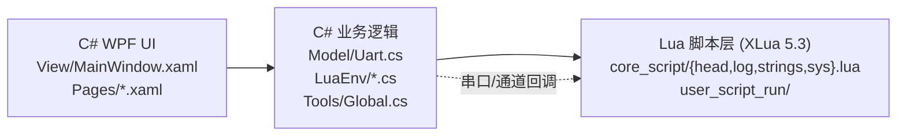

# LLCOM 参考调研（UI / Lua API / 脚本系统）

> 参考项目：chenxuuu/LLCOM，Apache 2.0，C# WPF + XLua（Lua 5.3）。
> 原参考路径 `ref/llcom/`（外部 clone，不随本仓库分发），调研日期 2026-09-05。
> 本文合并原 `llcom-overview / llcom-ui-layout / llcom-lua-api / llcom-script-system` 四份笔记，
> 面向 xcom_lua（LuaJIT FFI + C++17 C ABI，无 C#）。所有 LLCOM 行号来自当时的 tarball 快照，
> 仅作定位线索；引用以符号名与文件名为准。

## 项目身份与栈差异

| 字段 | LLCOM | xcom_lua |
|---|---|---|
| UI | WPF（.NET Framework 4.6.2+） | Dear ImGui（DX11 + WARP）+ LuaJIT 驱动 |
| 脚本桥 | XLua（C# ↔ Lua 5.3） | LuaJIT FFI 直调 C ABI |
| 串口 | `System.IO.Ports.SerialPort`（C#） | xcom_core C ABI（Win32 串口） |
| 通道 | uart / tcp / udp / mqtt / winusb 多通道 | 仅 uart |
| 许可 | Apache 2.0 | 自有 |

LLCOM 是三层（C# UI / C# 逻辑 / Lua），xcom_lua 是双层（C++ / Lua）。**WPF、XLua、.NET 全部不应照搬**；
可借鉴的是数据模型（通道 + 回调 + 多订阅 + sys 框架）与信息架构。

## 架构与文件地图

LLCOM 的 `LuaEnv/` 是核心：`LuaEnv.cs`（长跑沙箱 + 内嵌 sysCode）、`LuaRunEnv.cs`（全局上下文 + 任务队列）、
`LuaApis.cs`（C# 静态方法注册）、`LuaLoader.cs`（初始化 + send-convert）。核心脚本拆四个文件：
`head.lua`（路径注入 + 中文路径 hack + print 重写）、`log.lua`（6 级日志）、`strings.lua`（string 扩展）、
`sys.lua`（合宙 Luat 调度框架）。接收区 `Pages/DataShowPage.xaml` 每条日志一个 `RichTextBox`；
绘图 `Pages/PlotPage.xaml.cs` 用 ScottPlot 画 10 线 × 1000 点。

xcom_lua 对应物：UI 在 `xcom_imgui_bridge.cpp` + `ui/*.lua`；业务在 `core/script_engine.lua` 单文件
（沙箱 + dispatch + 行过滤 + 高亮 + REPL + 热重载）；波形在 `core/waveform.lua` + `xcom_imgui_scope_*`。

## UI 布局可借鉴点

LLCOM 主窗口 = 左数据区（`11*`）+ GridSplitter（宽 5）+ 右 TabControl（`7*`），底部 21 列状态栏
（刷新 / COM / 端口 / 波特率 / 状态 / 已发送 / 已接收）。接收区每条日志一个 `RichTextBox`，
用 `VirtualizingStackPanel` + `CacheLength="2,2"` + `Recycling` 回收；快捷发送条目 5 列
（序号 / 文本 / 发送按钮 / hex 复选 / 关联脚本图标）。

值得对照的具体设计（均已核对 LLCOM XAML）：

- **三态 HEX 显示**（`DataShowPage.xaml` `IsThreeState="True"` + `Settings.cs` `_showHexFormat` 0/1/2）：
  混合 / 只字符串 / 只 HEX。xcom_lua 当前 `receive_hex` 是 bool，可扩为 0/1/2。
- **底部选项条横排**：RTS / DTR / HEX 显示 / HEX 发送 / 附加 `\r\n` / 控制字符 / 禁用日志 一行排开；
  xcom_lua 的显示开关散在侧栏与接收区，密度可参考。
- **可拖拽分栏**：LLCOM `GridSplitter Width="5"`；ImGui 无原生 splitter，需 `InvisibleButton` 手柄
  或 `BeginChild(..., ImGuiChildFlags_ResizeX)`。
- **底栏补端口/波特率**：LLCOM 状态栏含端口列表 + 波特率下拉；xcom_lua `Footer` 只有连接状态 + Rx/Tx。
- **卡片式脚本列表**：`OnlineScriptsPage.xaml` 的「Author | 粗体 Name | 横线 | Version + 灰 Description」
  75px 卡片，可套到 xcom_lua 的脚本启用列表（当前是裸 Checkbox + 文件名）。
- **log 虚拟化**：LLCOM `VirtualizingStackPanel` ≈ ImGui `ImGuiListClipper`（xcom_lua 已在用）。

## LLCOM 暴露给 Lua 的 API 全表

通道类（核心，`LuaApi.md` + `LuaLoader.cs` 注册）：

| 函数 | 签名 | 用途 |
|---|---|---|
| `apiSend(channel, data[, table])` | `(string, string\|nil, table?) → bool` | 向通道发数据（table 供 mqtt 等复合参数） |
| `apiSetCb(channel, callback)` | `(string, function) → nil` | 订阅通道，**可叠加多个 callback** |
| `apiUnsetCb(channel, callback)` | `(string, function) → bool` | 取消订阅 |
| `apiSendUartData(str)` | `(string) → bool` | 旧接口，等价 `apiSend("uart", str)` |
| `uartReceive(data)` | 全局回调 | 旧接口，声明即注册到 uart 通道 |

工具类：`apiGetPath()`（应用数据目录）、`apiUtf8ToHex(str)`（UTF-8→GBK hex）、`apiAscii2Utf8(bytes)`、
`apiQuickSendList(id)`（返回值首字母 `S`=string / `H`=hex）、`apiInputBox(prompt, default, title?)`、
`apiPrintLog(log)`、`apiAddPoint(num, line)`（推 ScottPlot 多线点，line=0..9）、
`apiStartTimer/apiStopTimer`（仅 send-convert 沙箱）。

`sys` 框架（合宙 Luat 移植，本体在 `LuaEnv.cs` 内嵌字符串）：`sys.wait`、`sys.waitUntil`、
`sys.waitUntilExt`、`sys.taskInit`、`sys.timerStart/timerLoopStart/timerStop/timerStopAll/timerIsActive`、
`sys.subscribe/unsubscribe/publish`、`sys.tigger`。

`log` 6 级与 xcom_lua 完全一致：`trace/debug/info/warn/error/fatal`，输出 `[I]-[tag] content`。

`string` 扩展 7 个：`toHex` / `fromHex` / `toValue`（"123"→`\1\2\3`）/ `utf8Len` /
`formatNumberThousands` / `split` / `urlEncode`。xcom_lua 已实现前 4 个中的 4 个（缺 `toValue`、
`formatNumberThousands`、`urlEncode`）。

xcom_lua C ABI 对照：`apiSend("uart",data)` ↔ `xcom_send`；`apiSetCb` ↔ `script_engine` 的 `recv_hook`；
xcom_lua 有 `xcom_list_ports` 与 12 项 `XcomSnapshot`；`apiAddPoint` 在 xcom_lua 由
`xcom_imgui_scope_push` / 脚本驱动 Scope 面板对应（LLCOM 用 ScottPlot）。

## 脚本系统：三种运行时与通用通道

LLCOM 区分三种脚本上下文，这是与 xcom_lua 最大的架构差异：

| 运行时 | 作用域 | 能力 |
|---|---|---|
| 长跑沙箱（`LuaEnv` / `user_script_run`） | 单例，跨 app 生命周期 | 完整 sys（协程/定时器/发布订阅） |
| send-convert（`LuaLoader.Run` / `user_script_send_convert`） | 单例 + chunk 缓存 | `runType=="send"` 时跳过 log/sys 注册，禁用定时器与日志 |
| recv-convert | 与 send 同模式 | 代码内查无专门入口，疑似废弃/并入通用通道 |

**通用通道**是最值得借鉴的抽象：C# 端 `SendChannelsRegister(channel, cb)` 注册处理器
（uart 注册进 `Uart.SendData`），`Send(channel,...)` 分发，`SendChannelsReceived` 回流；
Lua 端 `apiSend("uart", data)` 不感知底层通道。`head.lua` 的 `apiSetCb` 把每个 channel 存成
callback 列表，触发时**依次调用全部订阅者**（并行多订阅，cb 无返回值协议）。

xcom_lua 现状：`script_engine.lua` 单 engine，send hook 与 run hook 共用 env；
`dispatch_receive` 顺序遍历 enabled 脚本做**链式转换**（返回值 `nil`/`false` 丢弃该批、`string` 替换），
`dispatch_send` 短路；已有 3-strikes 自动禁用、6 级 log、`sys.timer_*`（luv）、REPL、mtime 热重载。
缺位：跨脚本 `publish/subscribe` 事件总线、通道抽象（`uart.send` 写死）、send/run 沙箱隔离、
中文路径保护、chunk 缓存。

## 可复用的实现细节

**中文目录加载保护**（高优先级）。`head.lua` 用 `apiUtf8ToHex`/`fromHex` 包了
`require` / `loadfile` / `io.open`，绕开 XLua 在中文路径下的 UTF-8/ANSI 转换 bug。
xcom_lua 的 `package.path` 直接传给 luv，中文路径会触发 `ERROR_INVALID_NAME`；可在 `main.lua`
启动 script_engine 前 monkey-patch，仅在 Windows + 中文路径下启用。

**chunk 缓存**。LLCOM 把 `load()` 结果存进 `script[file]` 表，`_G["!once!"]` 首次 loadfile、
后续直接调用；`ClearRun()` 置 `luaRunner = nil` 实现全清重载。xcom_lua 的 `load_script` 每次都
`loadfile + setfenv + pcall`，会导致 enable 时重跑顶层代码（如重复 `sys.timer_*`）。

**send/recv 沙箱单例**。LLCOM 复用同一 `XLua.LuaEnv`，避免每次 send 重建 VM。
xcom_lua 已复用 env，但应与长跑 env 分离，使一次性脚本拿不到 `sys`。

**ConcurrentBag + lock(lua) 任务队列**（参考，不照搬）。`LuaRunEnv` 无锁入队、`lock` 串行化
XLua 调用、`CancellationTokenSource` 一键停 timer、try/catch 隔离单回调错误。
xcom_lua 用 luv + coroutine.resume 等价实现，`shutdown()` 手动停 timer 即可，无需改架构。

## 借鉴价值排序

**直接照搬能解决问题（Tier 1）**
1. `sys.publish/subscribe/waitUntil` 事件总线（多脚本通信，xcom_lua 缺）。
2. 中文路径 hack（`require/loadfile/io.open` 包装）。
3. `string.formatNumberThousands` + `string.urlEncode`（5 行）。
4. `apiAddPoint(num, line)` 式多线波形 API（xcom_lua 已以 scope API 实现）。
5. string 扩展补齐。

**架构参照（Tier 2）**
6. 通用通道抽象（`apiSend(channel,…)` + 通道注册表）。
7. send-convert 与长跑沙箱分离。
8. Lua 脚本执行超时熔断（`debug.sethook(trace,"l")` + `os.time()` 比较；xcom_lua 的 3-strikes 不限制单次时长）。
9. env 四文件分层（head/log/strings/sys 拆分；xcom_lua 目前全在 `script_engine.lua`）。

**小功能（Tier 3）**：`apiQuickSendList` 的 S/H 前缀标记、`apiGetPath()`、`apiInputBox` 模态。

**不要借鉴**：整套 WPF XAML / AdonisUI / VirtualizingStackPanel / ScottPlot / AvalonEdit 高亮；
XLua C#↔Lua 桥；.NET 依赖；在线脚本市场（GitHub Discussions 拉取，需运营）；Rust 串口监听辅助进程；
Costura.Fody 单 exe 打包。

## Lua 5.3 vs LuaJIT（移植注意）

- `bit` vs `bit32`：LLCOM `sys.lua` 用 `bit.band` 等 5.3 风格；LuaJIT 内置 `bit`，无 `bit32`。
  移植需 `bit32 = require('bit')` 或改写法。
- `goto`：5.3 支持，LuaJIT 不支持（LLCOM 代码未用到）。
- 整数子类型：5.3 区分整数/浮点，LuaJIT 全 double。
- `string.pack/unpack`：5.3 新增，LuaJIT 无（用 `libs/protocol/struct.lua` 或 FFI）。
