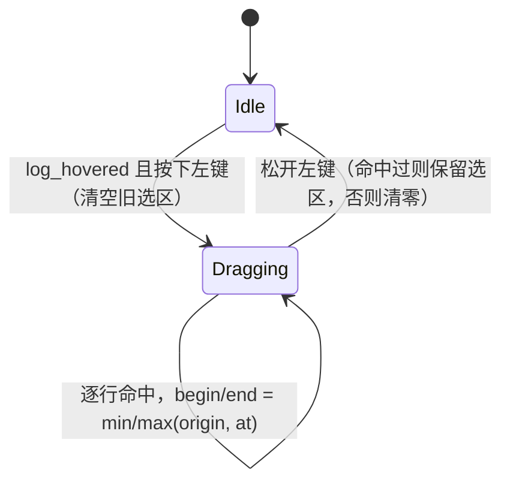

# 接收区文本选择与高亮：操作流程、实现与绝对坐标契约

> 主题：接收区（Receive 面板）鼠标选中文字如何高亮，以及"选区随文本上滚"的绝对坐标重构。
> 合并原 `receive-selection-highlight`（操作流程 + 原理）与 `receive-selection-absolute-coords`
> （绝对坐标修复）两份笔记。实现位于 `native/xcom_imgui/xcom_imgui_bridge.cpp` 的
> `ReceiveContent()`，辅以 `xcom_core/src/ao/xcom_ao.cpp` 的文本归一化。
> bridge 处于活跃开发，行号一律省略，按符号名定位。

## 用户操作流程

1. 打开串口，数据到达。Lua 主循环（`ui/window.lua` 的 `_flush_imgui_receive` /
   `ui/imgui_bridge.lua:set_receive_text`）把 core 侧格式化文本经 FFI 推入
   `xcom_imgui_set_receive_text()`，文本存入 `receive_text_` 并一次性重扫出各行起始偏移
   `receive_line_offsets_`。
2. 鼠标在接收区按下左键：锚点置 `kSelDragging`，选区 `[begin,end)` 清零，`receive_sel_drag_hit_`
   置 false——"按下即清空旧选区、进入拖拽态"。
3. 按住拖动：每帧在行渲染循环做命中测试，把鼠标 x 换算成字节偏移 `at`；首帧记
   `receive_sel_drag_origin_`，之后 `begin=min(origin,at)`、`end=max(origin,at)`，跨行时中间整行纳入。
4. 高亮实时出现：与该行相交时，在文字**底下**（先画色块再提交 `TextUnformatted`）画
   `ImGuiCol_TextSelectedBg` 色矩形；选到行尾色块铺满整行宽度。
5. 松开左键：锚点回 `kNoSelAnchor`；命中过则选区持久保留，纯点击空白则清零。
6. 右键菜单：`Copy selection`（`substr` + `SetClipboardText`）、`Copy all`、`Clear log`
   （返回 `ActionClear`，Lua 调 `set_receive_text("")`）。
7. 清除选区没有独立操作：下次按下即隐式清空；滚动/跟随新数据**不会**清除已有高亮。

## 数据结构：以字节偏移为唯一坐标

- `receive_text_`（std::string）：接收区尾部文本（滚动窗口，`receive_limit_`）。
- `receive_line_offsets_`（`std::vector<size_t>`）：每行起始字节偏移升序表。
  在 `xcom_imgui_set_receive_text` 每次变更时重建：`push_back(0)` 后 `std::memchr` 扫 `\n`，
  记录每个 `\n` 之后的位置。只找 `\n` 是因为 core 侧 `format_payload` 已把 CRLF/孤立 CR 归一成 LF。
  重建先 `reserve(len/32+2)` 消掉几何扩容。
- 选区状态：`receive_sel_anchor_`（`kNoSelAnchor` 空闲 / `kSelDragging` 拖拽中）、
  `receive_sel_begin_`、`receive_sel_end_`、`receive_sel_drag_origin_`、`receive_sel_drag_hit_`。

## 状态机与命中测试



- 按下条件 `log_hovered && IsMouseClicked(Left)`；`log_hovered` 用
  `ImGuiHoveredFlags_AllowWhenBlockedByActiveItem`，避免滚动条等活动控件吞掉按下。
- 命中测试 `hit_offset_in_row`：行矩形取 `ImGui::GetItemRectMin/Max()`（权威值，含 ScrollY/
  ItemSpacing/DPI，不手算滚动）；列 = `(p.x-rmin.x)/glyph_w + 0.5`，钳到行长。
  **只用等宽 `mono_font_` + 帧首测一次 `glyph_w`**（`CalcTextSize(64×'M').x/64` 均摊误差），
  像素→列 O(1)；比例字体需逐字形测量会退化成 O(line²)。
- 拖拽时只有鼠标所在行通过 y 区间判断，逐行测试近似 O(1)/帧。

## 高亮绘制

同时满足 `line_off < sel_e && line_off+line_len > sel_b`（区间相交）的行进入绘制。首行画
`[from,行尾]`、尾行画 `[0,to]`、中间行整行覆盖。几何由字节差乘 `glyph_w` 得到，高 `line_h`，
起点 `GetCursorScreenPos()`（ItemSpacing 已压 0）。行尾铺满时宽度改用 `text_width`。
色块在 `TextUnformatted` 之前提交，故永远在字形之下。

## 绝对坐标契约（滑窗不丢选区）

**症状**：持续来数据时拖选，高亮钉死在屏幕同一批行，被选文字从下面流走。
**根因**：旧实现选区存"`receive_text_` 内第 N 字节"（窗口相对）。Lua 每次 flush 整块换血窗口，
"第 N 字节"指向完全不同的内容，旧偏移"移情"到窗口头部新行。

**修法**：选区改用**绝对（lifetime）字节坐标**：

- C++ 新增成员 `receive_base_`：`receive_text_[0]` 在整条接收流中的绝对偏移；
  `receive_sel_begin_/end_/drag_origin_` 一律存绝对字节。
- 渲染时取局部 `base = receive_base_`；高亮求交前把绝对区间映射回窗口
  （`sel_b = max(sel_begin-base,0)`，被裁掉的部分即"已滚出窗口"，不再画）；
  拖拽命中得到的窗口偏移 `+base` 还原为绝对值入状态。
- 右键"复制选中"：绝对区间先 clamp 到 `[base, base+len)` 再 `substr`——只复制仍在窗口内的部分；
  已滚出字节不在显示缓冲，无法恢复（数据无损由 auto-save 日志保证，是既定契约）。
- 归零路径：空缓冲早退、`set_receive_text(NULL/0)`、`on_btn_clear` 同步重置 `receive_base_` 与选区三元组；
  `set_receive_window` 缩窗 erase 分支 `base += erase_n`。
- 新导出 `xcom_imgui_set_receive_base(size_t)`，Lua 在每次 `xcom_imgui_set_receive_text` 之前调用。
  Lua 侧 `window.lua` 维护 `_imgui_receive_total`（lifetime 显示字节计数），
  `imgui_bridge.lua:set_receive_text(text, base)` 里 `base = total - #tail`，经
  `optional_export` 探测后先推；**旧 DLL 缺该符号时自动退化**为 base=0（等价历史行为，不崩）。

**贴底跟随（每帧）**：

```cpp
// 帧首判定（同一帧内 Scroll.y 已被上一次 Begin 应用；脱开/重挂靠它）
const bool was_at_bottom = ImGui::GetScrollY() >= ImGui::GetScrollMaxY();
// ... 行提交 ...
// 帧尾：写"尽可能靠下"的目标（不是具体位置），并按住左键时冻结
if (was_at_bottom && !ImGui::IsMouseDown(ImGuiMouseButton_Left))
    ImGui::SetScrollY(kFollowTailTargetY);
```

两条都踩过坑，改动时不要回退：

- **必须写"目标"而不是"位置"**：`SetScrollY` 写的是 target，下一次 `Begin` 才应用并 clamp。
  若按 `SetScrollHereY(1.0f)` 写具体位置，写入时的内容与生效时的内容差一帧；而尾窗是
  **帧外**追加的（Lua 轮询在 render 之外推数据），于是贴底位置永远差"一个批次"——最新行
  根本进不了可视区，滚动条下键也够不到底。写大值让下一次 Begin 用**当轮内容** clamp 才对。
- **内容高度每帧强制**：ImGui 的 `ScrollMax` 来自**上一帧**的 content size
  （`CalcWindowContentSizes` 在 `Begin()` 重置光标之前跑），帧外追加的行不在其中，
  于是可达下界比真实尾部少一个批次。`ReceiveContent` 在创建日志子窗前用
  `SetNextWindowContentSize` 按**行数 × 行高 + 行首偏移**（上一帧量得）强制内容高度，
  让滚动条与跟随 pin 都对齐"这一帧屏幕上的尾部"。
- **按住左键必须冻结**：子窗口的滚动条在 `Begin()` 内（body 之前）写自己的滚动目标，
  下一次 `Begin` 才生效；帧尾的 pin 会把箭头点击/滑块拖动**原地覆盖**，于是贴底时
  滚动条表现为"点不动"。`IsMouseDown` 每帧权威，松开后帧首判定自然重挂跟随，
  不存在 capture 丢失导致永久冻结。
- **工具栏（清空/保存/路径）必须在滚动子窗之外**：放在日志内容里会被滚走；改用
  `SetCursorScreenPos` 钉在屏幕空间则更糟——屏幕坐标不随滚动平移，行的**内容空间**偏移
  就变成 `f(Scroll.y)`：内容高度随滚动增长，滚动上限自我放大（探针实测 190 行日志可达
  7 万 px），行也不再与滚动位置对应，尾部彻底够不到。现结构：工具栏是**监控列**的一行
  （该窗口 `NoScrollbar|NoScrollWithMouse`，永不滚动），日志子窗只装行，几何自洽。

**为什么不用内容前缀匹配**：曾想对比新旧缓冲求丢弃头部字节数，但换行边界处内容可能逐字节相同、
匹配窗口可达 64KiB，热路径不可控，且本质是让 DLL 反向猜 Lua 窗口代数。改为 Lua 显式推 base，
O(1) 零猜测。

## 关键设计决策

1. **不用 InputTextMultiline**：其 stb_textedit 只把 `\n` 当换行，游离 `\r` 渲染成控制字形破坏行高
   （core 侧 CRLF→LF 归一化的由来）；且自带光标/滚动状态与"贴底跟随"打架。改为
   `ImGuiListClipper + 每行 TextUnformatted` 的官方日志窗模式，渲染代价从 O(全文) 降到 O(可视行)。
2. **命中测试用 GetItemRectMin/Max**，不手算滚动——规避样式/DPI/滚动条细节导致的选区错位。
3. **等宽字体 + O(1) 列换算**是拖拽不掉帧的关键。
4. **偏移表在文本变更时重建一次**（满带宽约 100 次/s），`memchr` SIMD 跳跃扫描 + 一次 reserve。
5. **绘制顺序即层级**：色块先于文字提交，无需透明混合。

## 验证与遗留

- 无头注入探针：VIRTUAL 口 `open_async rc=0` → `test_inject_rx` → `drain_display` 原样吐回，
  `rx_bytes`、`pool_exhausted=0` 正常。
- 在线 E2E：`XCOM_SMOKE_OPEN=1 XCOM_SMOKE_SIM_PROFILE=text` 启动，日志区渲染模拟数据，无报错。
- **拖选交互本身需人工验证一次**（合成鼠标点击无法到达 ImGui Win32 后端）：
  滚动流中拖选 → 松开 → 高亮应随文本上滚直至不可见；按住拖动期间视图应停住。
- 遗留：被截断出窗口的选中内容无法复制（需 Lua 保留退役 chunk 副本，当前按 64KiB 窗口契约不做）；
  边缘自动滚动、双击选词未实现。
- 快捷键与复制策略：Ctrl+A 全选、Ctrl+C 复制选中已实现（`ReceiveContent` 内经 `ImGui::Shortcut`，
  路由按焦点域判定，输入框持有焦点时不抢占）。复制不再由 C++ 直接写剪贴板，而是把请求入队
  （`QueueReceiveCopy`），由 Lua 侧 `service_receive_copy` 用 `core/receive_copy.lua` 的纯函数
  `strip_timestamps` 按「复制时去除时间戳」开关处理后写剪贴板；该开关默认关闭、经
  `[display] strip_timestamp_on_copy` 持久化。
