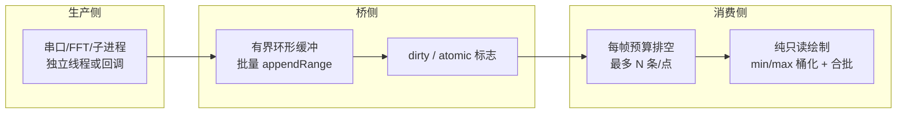

# UI 参考工具调研合集

> 合并原 `edgedepth-terminal-ui`、`sdrplusplus-ui-reference`、`tracy-ui-reference`、
> `uscope-reference`、`wave-gui-reference`、`amodemGUI-reference`、`fontstudio-uscope-reference`、
> `ref-ui-synthesis`、`ref-multipanel-synthesis` 九份笔记。参考项目均为外部 clone（`ref/…`），
> 不随本仓库分发，调研日期 2026-09-05。原行号仅作定位线索，引用以文件名/符号名为准。
> 场景同构：实时高吞吐数据 → 多面板仪表盘 / 波形回看。xcom_lua 侧落点主要在
> `native/xcom_imgui/xcom_imgui_bridge.cpp`、`core/waveform.lua`、Lua 帧调度层。

## 综合结论（先读）

四个 UI 项目里，**edgedepth-terminal 是唯一提供完整可读 ImGui UI 代码 + 性能模式文档的**，
应作为接收区 + 波形可视化的主要参考；wave-gui 提供工程组织范式（update/render 分离）；
tracy 提供"高密度不掉帧"的渲染算法；uscope 提供数据结构纪律与测试；SDRPlusPlus 提供面板注册表与
可拖多列；amodemGUI 有源码价值为零。

最大的一条共识是**分层**：把昂贵的格式化/查询从 render 路径剥离，改为"输入变化时构建、每帧只读缓存"
（cache-on-input, paint-on-frame）。xcom_lua 的接收热路径已做了字形测量/ascii_only 等微观优化，
下一步最大价值是把 model 构建与绘制分开——`highlight_rules` 搜索（bridge 的 ReceiveContent 内）
是第一个可落地目标：命中缓存为 `std::vector<HitSpan>`，dirty flag 失效，clipper 阶段只读。

优先级最高的五条借鉴（合并去重）：

| 排序 | 建议 | 来源 | 落点 | 成本 |
|---|---|---|---|---|
| 1 | `TableSetupScrollFreeze(0,1)` + `BeginTable` 替换裸 TextUnformatted 滚动 | edgedepth | ReceiveContent clipper | 中 |
| 2 | highlight 命中缓存（vector<HitSpan> + dirty flag），render 与 build 分层 | edgedepth DOM | ReceiveContent 高亮 | 低 |
| 3 | 环形缓冲 + 批量 appendRange 替代 `std::string` 单字节 push_back | uscope | receive_text_ | 中 |
| 4 | PlotHistogram/PlotLine 多次叠加同坐标画"信号+包络+触发线" | wave-gui | waveform/ImPlot 面板 | 中 |
| 5 | 空状态分级（串口未开/已开无数据/协议间隙/真为空）+ 解释文案 | edgedepth tape | EmptyState | 低 |

不建议本轮做：edgedepth 的 proto/WS/pthread 整套架构（单机单窗口不需要）；uscope 的 HexViewer
（实际代码不存在）；amodemGUI 任何 UI 代码（无源码 + DearPyGui 栈不匹配）；tracy 的多线程
Preprocess（单窗口场景收益小）。

## edgedepth-terminal（订单流终端，与接收区几乎同构）

C++20 + Dear ImGui + ImPlot + SDL3 + WebGL2，编译到 WASM 跑 60 FPS 多面板。核心文件 `src/ui/`。

**tape 模式（trades_widget）**——接收区最直接的参考：`BeginTable` + 3 列固定/拉伸宽度 +
`TableSetupScrollFreeze(0,1)` 冻结表头；**新数据永远在最上**（倒序输出 `idx=(count-1-i)%MAX`），
天然 follow-tail，不依赖 ScrollHereY；等宽字体 + 按行高反推 padding（`pad_y = max(0,(row_h-fontSize)/2)`）
得到 18px 密集行；格式化在 insert 时一次性 snprintf，渲染期零分配。
空状态区分"feed 未就绪"与"真的空"，给解释性文案（不是 "Loading..."）。

**cache-on-input, paint-on-frame（dom_widget）**：8 个 `cache_*` 字段对比输入是否变化，
变了才 `build_row_models` 做格式化/查询；render 每帧只读缓存。`double_buffer.h` 用
`std::atomic<bool> dirty`，clean 时**不加锁**直接返回，idle 源零成本；`publish()` 每帧开头
做一次 copy（1000 级 orderbook ~50us）换取整帧一致快照。

**时间预算回调排空（dispatch_drain.h）**：每帧 3ms 软上限，`kBudgetCheckStride=16`（每 16 个
回调查一次钟，省 syscall），carry/cursor 持久状态保证顺序与续跑；时钟参数化注入测试。

**其他**：`ImPlot` 包裹；`seg_group` 自定义组合按钮；`depth_cell_text` 阴影字；
`FrameScope` 性能宏；渲染状态 `GetTime()` 双阈值超预算当帧提前 return。

## tracy（实时 profiler，高密度不掉帧）

C++17 + ImGui + 自绘 ImDrawList + 多线程 TaskDispatch。

**两遍渲染**：`TimelineController::End` 先全部 panel 跑 `Preprocess`（多线程 + TaskDispatch），
再全部 panel 跑 `Draw`（单线程喂 ImDrawList）；`Sync()` 是同步点。可见性快速剔除：
屏幕外的 panel 不 preprocess，只累加 offset。

**桶化降量保留 min/max**（Plot 虚拟化）：屏幕宽 ~1920px → 只画 ~1920 列。`std::lower_bound`
二分定位视窗数据范围；一列像素含 ≥4 点时 stride 采样到 256 sample，`pdqsort_branchless` 排序取
min/max 两端；>32 点的桶只画一条 min→max 竖线——**画的是真实上下包络，不是平均**；
>100 万点的窗口直接用全局 min/max 跳过扫描。`m_draw` 是紧凑 `vector<uint32_t>` 编码
（单点 `(0,idx)` / 桶 `(rsz,offset,imin,imax)`），Draw 端对称解码。

**ImDrawList 合批**：`DrawLine` 用 `AddPolyline` 不是 `AddLine`；栈上 `const ImVec2 data[2]`
零拷贝；高频小函数用 `tracy_force_inline`；`DrawTextContrast` 两步 `AddText`（阴影+前景）代替 DrawText。
`DecayValue` 自衰减高亮状态（赋值激活，每帧 Decay 到 inactive），避免每帧 clear bool。
帧时间轴 `fwidth/group` 双档缩放；实时模式懒平移视图到最后一帧。

## SDRPlusPlus（SDR 客户端，瀑布图 + 插件模型）

C++17 + ImGui + OpenGL + 模块化 .so/.dll。

**实时瀑布图**是核心：`uint32_t` 帧缓冲 + ring buffer `memmove` 平移一行（源/目标重叠故用
memmove）+ 调色板 LUT 预生成（0..1 量化 1M 步，改调色板重建 LUT）+ **脏标志**只在变化时
`glTexImage2D` 上传；整个瀑布只产生 1 个 draw call（`DrawList->AddImage`），不是逐像素 AddLine。
FFT 曲线逐像素 AddLine 但 dataWidth=600 可接受。

**面板注册表 + 顺序持久化**：`Menu::registerEntry(name, draw_fn, ctx, inst)`，`order` 是
`vector<{name,open}>` 按用户拖拽顺序存 JSON `menuElements`；菜单本身无控件，只是注册表。
模块以固定符号契约 `_INFO_/_INIT_/_CREATE_INSTANCE_/_DELETE_INSTANCE_/_END_` 加载
（`LoadLibraryA`/`dlsym`，`RTLD_LAZY|RTLD_LOCAL`），实例持久化 `moduleInstances[name].{module,enabled}`。

**可拖多列**：`ImGui::Columns(3)` + `SetColumnWidth` + `BeginChild`，拖拽改 `menuWidth` 实时存 JSON，
`std::clamp(newWidth, 250, winSize.x-250)` 保最小列宽。`Event<T>` 事件总线让组件解耦
（瀑布不处理 VFO 拖拽，emit `onInputProcess` 由外部决定）。

对 xcom_lua 的启示：迷你趋势 sparkline 用预生成纹理 + memmove 一行（不是逐像素 AddLine）；
调色板 LUT 在 C++ 侧预生成 `uint32_t palette[256]`；面板注册表可镜像为
`xcom_panel_register(name, draw_fn, ctx)`，顺序/折叠状态持久化。

## wave-gui（声波数据传输，极简可视化范式）

C++ + SDL2 + GLFW + FFTW + Dear ImGui，全工程约 2157 行，结构最干净。

**PlotHistogram 多次叠加 + `SetCursorScreenPos(posSave)`**：同一坐标画三次——数据频率范围绿色高亮、
校验范围红色高亮、实际频谱；lambda 数据源条件返回 0 来"画标记"而不维护额外标记数组，省内存与 GC。
**`App::update` 与 `App::render` 严格分离**（update 拉数据+UI 输入，render 只读状态画图），
主循环抽象是 `std::function<bool()> g_update`（返回 false 终止），native 与 emscripten 双路共用。
有锁 ring buffer：满时 `push` 返回 false **不覆盖**（丢新保旧），`cv_.wait` 阻塞 pop，
push 后先 `unlock` 再 `notify_one`。

对 xcom_lua：`core/waveform.lua` 的 ImPlot 化可直接照搬 PlotHistogram lambda + SetCursorScreenPos
画"信号+包络+触发线"三层；update/render 分离对应把 highlight 命中缓存为 phase 1、绘制为 phase 2。

## uscope（Zig 原生调试器，数据管线纪律）

**注意：不是示波器**，UI 正在整体重写，树内没有波形/图表代码，HexViewer/寄存器视图只存在于
README roadmap——**不要凭 README 想象其能力**。可取的是工程模式：

- **byte 环形缓冲**：写指针追上读指针时前移读指针丢最旧，len 封顶不溢出；4 个测试覆盖
  fill/overflow/索引换算全部边界——**写数据结构第一件事是写测试**。作者用 `@PERFORMANCE` 注释
  指出"逐字节 append 慢，应 appendRange 批量写"——正是 xcom_lua receive hot path 的同类问题。
- **两层 allocator**：`perm_alloc`（长寿命对象）+ `scratch_arena`（每帧 `reset(.free_all)` 一次性回收
  所有临时分配，无需逐回调 free）；脏标记 `state_updated` 驱动。
- **每帧排水预算**：`handleDebuggerResponses` 每 tick 最多处理 512 条消息，余量下帧（防单帧被
  数据洪峰卡死）；脏标记推信号 / 主动拉数据分离。
- 作者自评的坑（debugger.zig）：用通用响应队列传高频输出是错的（泄漏+高流量），验证了
  "波形数据不走通用消息队列、直接进专用环形缓冲"的选择。

## ImGuiFontStudio / WaveEdit（字体与自绘控件）

**ImGuiFontStudio**（字体子集/合并/预览工作台）：每字体独立 atlas；运行时参数变动整字体重开
（无增量重建）；**TTF 表级合并用 Google sfntly**（离线工具，重）；范围生成输出选定 codepoint 的
min/max；Base85 内嵌；多字体混排预览逐字符 `RenderChar` + Ascent 修正。
对 bridge 的结论：现有 `MergeMode + 常用字表` 是正解；运行时切 GB2312/BIG5/SJIS 显示需
**多表 AddRanges 合并**（SimplifiedCommon + Japanese + 假名 `0x3040-0x30FF` + 可选繁体），
不要用 2 万 glyph 的 ChineseFull；ImGui 1.93 无公开增量 atlas API，维持启动时一次 build；
可选 `ImFontAtlasFlags_NoMouseCursors|NoBakedLines` 省 WARP 下 atlas 面积。

**WaveEdit**（波表编辑器，SDL+OpenGL+旧版 ImGui）：自适应网格——步长取 2 的幂直到格距 ≥22px，
层级线宽 64 格 3px / 8 格 2px / 其余 1px；自定义控件范式 `IsHovered→SetHoveredID→SetActiveID→
FocusWindow`、释放 `ClearActiveID`、`MouseDelta` 增量编辑；**固定尺寸预览缓冲**（载入任意长音频
一次性重采样到固定 16384 点，之后只画这个定长数组）；缩放吸附 2 的幂 `2^round(log2(zoom))` + Zoom Fit；
瀑布分层"背景色预层 + 彩色活动层 + 近邻加粗"；最小化不渲染。
对 waveform.lua 的结论：可视窗二分裁剪（已实现）比全局定长降采样粒度更细；决策：自适应网格 +
wheel 缩放 2 的幂吸附值得加；minimap 需要时才用定长摘要。

## amodemGUI（声学调制解调器，价值最低）

仅分发 Linux 二进制 + 截图，源码未分发；仓库本体是 Python + DearPyGui，与 Dear ImGui C++ 栈不匹配，
**UI 代码不能抄**。唯一硬价值是 README 那条已完成的 TODO「pipe the realtime output terminal to
window dearPyGui」——证明 `subprocess 实时输出 → GUI 文本组件`是可行的极简管道。
本文件不再保留更多细节；需要时直接看截图参考"终端式接收区 + 紧凑参数面板"的视觉密度。

## 数据管线范式（横向对比）

共同契约：生产侧只写缓冲置 dirty；消费帧自主决定拉多少（帧率无关）；高频数据不进通用消息队列；
渲染路径零分配、零格式化、零重算。

## 明确不采纳清单

| 来源 | 不采纳 | 理由 |
|---|---|---|
| edgedepth | proto/WS/pthread 整套架构 | 单机单窗口 |
| edgedepth | frame-independent widget skip | 需 widget 级 cache 命中，收益低于成本 |
| tracy | 专用渲染线程池 / TaskDispatch | 单线程 UI，`owner_thread_` 约束足够；拆 Preprocess 需求出现再说 |
| tracy | 数据规模 100 万点短路 | xcom 缓冲 ≤1MB |
| uscope | Zig 三线程架构 / 8KB 环形缓冲容量 | 单线程 + 专用 ring 更合适，容量哲学不同 |
| uscope | mmap 源文件 | 脚本/日志都小 |
| SDRPlusPlus | OpenGL 纹理 / Event 总线全套 | xcom 是 DX11 单窗口；Lua 天然事件驱动 |
| SDRPlusPlus | DockBuilderDockWindow / LayoutManager | 无 dockspace 需求 |
| amodemGUI | 其 UI / DearPyGui | 无源码 + 栈不匹配 |
| ImGuiFontStudio | sfntly 表级合并 / 动态 glyph 按需加载 | 离线工具；ImGui 1.93 无增量 atlas API |
| WaveEdit | pffft / libsamplerate / 时间合并撤销 | 示波器无频谱/高质量重采样/编辑历史需求 |
